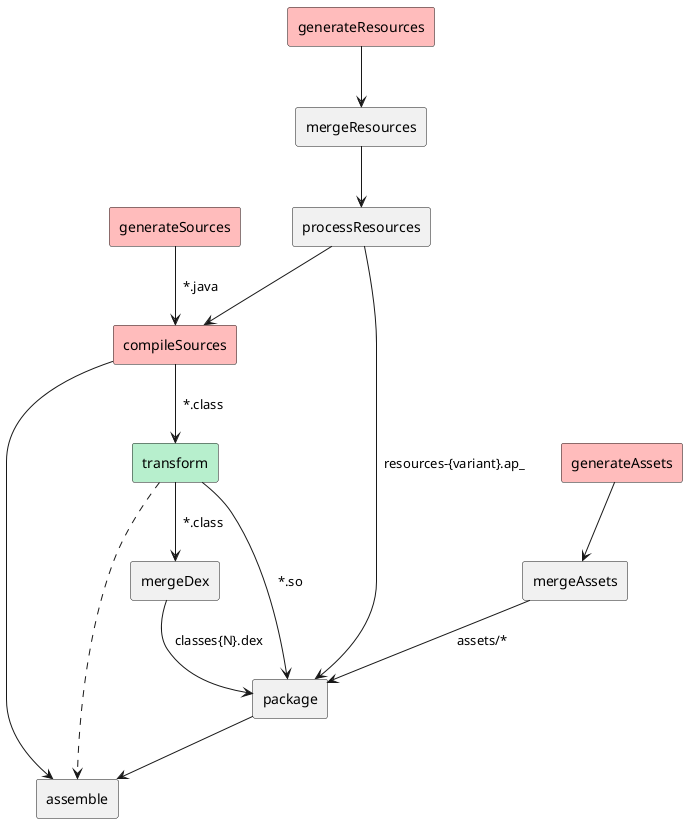
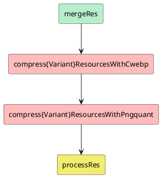
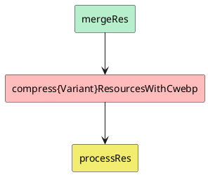
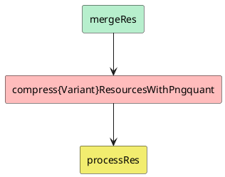

```plantuml
abstract class CompressImages extends DefaultTask {
    + tool: CompressionTool;
    + variant: BaseVariant;
    + options: CompressionOptions;
    + results: CompressionResults;
    + supplier: Supplier<Collection<File>>;

}

abstract class AbstractCwebpCompressImages extends CompressImages {
    # {abstract} compress(filter: (File) -> Boolean): void
    + run(): void
}

class CwebpCompressImages extends AbstractCwebpCompressImages {
    # compress(filter: (File) -> Boolean): void
}

class CwebpCompressOpaqueImages extends CwebpCompressImages {
    # compress(filter: (File) -> Boolean): void
}

class CwebpCompressFlatImages extends AbstractCwebpCompressImages {
    # compress(filter: (File) -> Boolean): void
}

class CwebpCompressOpaqueFlatImages extends CwebpCompressFlatImages {
    # compress(filter: (File) -> Boolean): void
}
```




```plantuml
abstract class CompressImages extends DefaultTask {
    + tool: CompressionTool;
    + variant: BaseVariant;
    + options: CompressionOptions;
    + results: CompressionResults;
    + supplier: Supplier<Collection<File>>;

}

abstract class AbstractPngquantCompressImages extends CompressImages {
    # {abstract} compress(): void
    + run(): void
}

class PngquantCompressImages extends AbstractPngquantCompressImages {
    # compress(): void
}

class PngquantCompressFlatImages extends AbstractPngquantCompressImages {
    # compress(): void
}
```

```plantuml
hide footbox
activate LayoutInflator
LayoutInflator -> WebView **
LayoutInflator -> WebView ++ : <init>(...)
WebView -> WebViewChromium **
WebView -> WebViewChromium ++ : init(...)
WebViewChromium -> WebViewChromiumFactoryProvider **
WebViewChromium -> WebViewChromiumFactoryProvider ++ : startYourEngines(boolean)
WebViewChromiumFactoryProvider -> WebViewChromiumAwInit **
WebViewChromiumFactoryProvider -> WebViewChromiumAwInit ++ : startYourEngines(boolean)
WebViewChromiumAwInit -> WebViewChromiumAwInit : ensureChromiumStartedLocked
return
return
return
return
```


```plantuml
hide footbox
== onCreate ==
AMS -> ActivityThread ++ : onCreate()
ActivityThread -> MainActivity++ : onCreate()
MainActivity -> Context ++ : getSharedPreferences()
return SharedPreferences
|||

MainActivity -> SharedPreferences ++ : edit()
return SharedPreferences.Editor

......


MainActivity -> SharedPreferences.Editor ++ : apply()
SharedPreferences.Editor -> SharedPreferencesImpl.EditorImpl ++ : apply()
SharedPreferencesImpl.EditorImpl -> QueuedWork : add(Runnable)
return
return
return
return
......

== onPause ==

AMS -> ActivityThread ++ : onPause()
ActivityThread -> MainActivity : onPause()
ActivityThread -> QueuedWork : waitToFinish()
return

```

