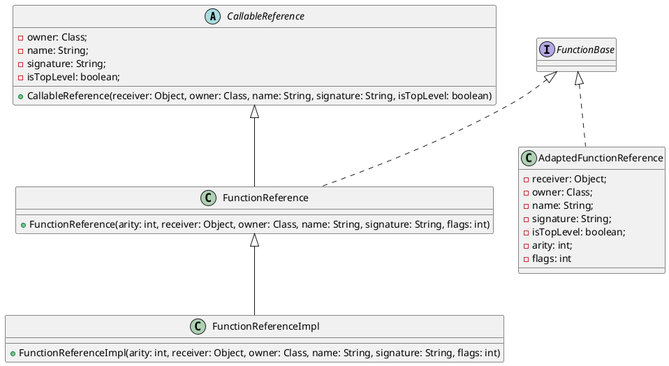

在 Booster 4.15.0 之前，一直使用的是 Kotlin 1.3，之所一直用比较低的 Kotlin 版本，主要的原因还是考虑到 Kotlin 版本的兼容性问题，但要支持 AGP 7.3 就不得不升级 Kotlin 版本，因为 AGP 7.3 就依赖了 Kotlin 1.5，所以，Booster 4.15.0 花了很长的时间来解决兼容性的问题。

## Kotlin 的头等公民 —— Function

头等函数 (`Function`) 在函数式编程语言不可或缺的特性，Kotlin 也不例外，由于 `Function` 在 Kotlin 中被广泛使用，也是兼容性问题的高发区，大家有没有好奇 Kotlin 的 `Function` 在字节码层面是如何实现的呢？以下面的代码为例：

```kotlin
(Int) -> Int
```

如果要在 Java 中实现上面的例子，需要定义一个 [Functional Interface](https://docs.oracle.com/javase/8/docs/api/java/lang/FunctionalInterface.html):

```java
@FunctionalInterface
interface Int2Int {
    int invoke(int value);
}
```

或者使用 JDK 自带的 [Function<T, R>](https://docs.oracle.com/javase/8/docs/api/java/util/function/Function.html):

```java
Function<Int, Int> i2i = /* ... */;
```

Java 8 标准 API 针对 `Function` 只提供了 [Function<T, R>](https://docs.oracle.com/javase/8/docs/api/java/util/function/Function.html) 和 [BiFunction<T, U, R>](https://docs.oracle.com/javase/8/docs/api/java/util/function/BiFunction.html)，如果想加支持更多参数的 `Function`，要么自定义 [Functional Interface](https://docs.oracle.com/javase/8/docs/api/java/lang/FunctionalInterface.html)，要么用 Lamda 表达式。

Kotlin 天生就能很好的支持 Lambda 表达式，并在标准库中定义了 [Function0<R>](https://github.com/JetBrains/kotlin/blob/master/libraries/stdlib/jvm/runtime/kotlin/jvm/functions/Functions.kt#L11), [Function1<P1, R>](https://github.com/JetBrains/kotlin/blob/master/libraries/stdlib/jvm/runtime/kotlin/jvm/functions/Functions.kt#L16), ... [Function22<P1, ..., P22, R>](https://github.com/JetBrains/kotlin/blob/master/libraries/stdlib/jvm/runtime/kotlin/jvm/functions/Functions.kt#L121) 一共 23 个 `Function` 接口，看到这里，是不是突然感觉 Kotlin 标准库的设计怎么这么傻X，如果有超过 22 个参数的 `Function` 怎么办？（先卖个关子🤪）

## Lambda vs Function Reference

*Function Reference* 是 Kotlin 中的概念，在 Java 中与之同等的概念为 *Method Reference*，说的都是同一个东西，就是方法的引用，例如：

```java
Arrays.asList(args).forEach(System.out::println);
```

其中，`System.out::println` 就是对 `System.out` 实例的 `println` 方法的引用，那跟 Lambda 到底有什么区别呢？这得从 Lambda 在字节码层面的表示方式说起，Lambda 的实现方式一般有以下几种：

1. 内部类
1. 方法句柄 [MethodHandle](https://docs.oracle.com/javase/8/docs/api/java/lang/invoke/MethodHandle.html)
1. 动态代理
1. 其他方式

每种方式都有其优缺点，编译器在选择实现方式时，主要考量的两个因素是：

1. 在不依赖特定的实现方式的情况下最大限度的提高未来优化的灵活性
1. 字节码层面表示的稳定性

由于 Lambda 的实现会产生匿名方法，为了避免不必要的匿名方法，所以 Java 或者 Kotlin 都支持在 Lambda 和方法引用之间进行转换，也就是说，通过方法引用来替代 Lambda，例如：

* Lambda 表示

    ```kotlin
    listOf("a", "b").forEach {
        println(it)
    }
    ```

* 方法引用表示

    ```kotlin
    listOf("a", "b").forEach(::println)
    ```

## Function Reference in Kotlin

在 Kotlin 中，[FunctionReference](https://github.com/JetBrains/kotlin/blob/master/libraries/stdlib/jvm/runtime/kotlin/jvm/internal/FunctionReference.java) 在字节码层面主要是通过 [FunctionReferenceImpl](https://github.com/JetBrains/kotlin/blob/master/libraries/stdlib/jvm/runtime/kotlin/jvm/internal/FunctionReferenceImpl.java) 来实现，在 Kotlin 1.7+ 以后，新增了 [FunInterfaceConstructorReference](https://github.com/JetBrains/kotlin/blob/master/libraries/stdlib/jvm/runtime/kotlin/jvm/internal/FunInterfaceConstructorReference.java)，例如：

```kotlin
fun interface IFoo {
    fun foo()
}

val iFooCtor = ::IFoo
```

所以，只要 Koltin 代码中用了方法引用，编译出来的 class 文件中就会出现 `FunctionReferenceImpl`，说了半天，这跟兼容性到底有啥关系？

## Kotlin 1.3 Function Reference 的缺点

在 Kotlin 中，我们经常会写出如下的代码：

```kotlin
fun func() {
    // ...
}

fun call(func: () -> Unit) {
    func()
}

call(::func)
```

> 这样写有什么什么问题吗？

表面上看起来完全没毛病，但是，从字节码层面来看，这里就有很多问题了，以上的代码反编译成 Java 大致长这样：

```java
final class refs/LambdaKt$main$1 extends kotlin/jvm/internal/FunctionReference  implements kotlin/jvm/functions/Function0  {
    public synthetic bridge invoke()Ljava/lang/Object;
    public final invoke()V
    public final getOwner()Lkotlin/reflect/KDeclarationContainer; // overrides CallableReference#getOwner
    public final getName()Ljava/lang/String; // overrides CallableReference#getName
    public final getSignature()Ljava/lang/String; // overrides CallableReference#getSignature
    <init>()V
    public final static Lrefs/LambdaKt$main$1; INSTANCE
    static <clinit>()V
}
```

大家看出问题了吗？

## Kotlin 1.4 Callable Reference 优化

通过上述的反编译代码，我们不难发现，Kotlin 编译器生成了很多额外的方法，而这些方法其实大部分都很少用到，对于一些几乎不怎么用到的方法，为什么要生成呢？能不能不生成呢？

答案是肯定的，这也就是 Kotlin 1.4 针对 `FunctionReference` 的优化，增加了 [AdaptedFunctionReference](https://github.com/JetBrains/kotlin/blob/master/libraries/stdlib/jvm/runtime/kotlin/jvm/internal/AdaptedFunctionReference.java)，同时，也修改了 [FunctionReferenceImpl](https://github.com/JetBrains/kotlin/blob/master/libraries/stdlib/jvm/runtime/kotlin/jvm/internal/FunctionReferenceImpl.java) 新增加了 2 个构造方法：

```java
public FunctionReferenceImpl(
    int arity,
    KDeclarationContainer owner,
    String name,
    String signature
) {
    super(/* ... */);
}

@SinceKotlin(version = "1.4")
public FunctionReferenceImpl(
    int arity,
    Class owner,
    String name,
    String signature,
    int flags
) {
    super(/* ... */);
}

@SinceKotlin(version = "1.4")
public FunctionReferenceImpl(
    int arity,
    Object receiver,
    Class owner,
    String name,
    String signature,
    int flags
) {
    super(/* ... */);
}
```

然后，通过在 [FunctionReferenceImpl](https://github.com/JetBrains/kotlin/blob/master/libraries/stdlib/jvm/runtime/kotlin/jvm/internal/FunctionReferenceImpl.java) 的父类 [FunctionReference](https://github.com/JetBrains/kotlin/blob/master/libraries/stdlib/jvm/runtime/kotlin/jvm/internal/FunctionReference.java) 中增加了 1 个构造方法把参数通过构造方法传给父类 [CallableReference](https://github.com/JetBrains/kotlin/blob/master/libraries/stdlib/jvm/runtime/kotlin/jvm/internal/CallableReference.java)：

```java
@SinceKotlin(version = "1.4")
public FunctionReference(
    int arity,
    Object receiver,
    Class owner,
    String name,
    String signature,
    int flags
) {
    super(receiver, owner, name, signature, (flags & 1) == 1);
    this.arity = arity;
    this.flags = flags >> 1;
}
```

然后，在父类 [CallableReference](https://github.com/JetBrains/kotlin/blob/master/libraries/stdlib/jvm/runtime/kotlin/jvm/internal/CallableReference.java) 中增加相关的字段、构造方法以及 *getter* 方法：

```java
@SinceKotlin(version = "1.4")
private final Class owner;

@SinceKotlin(version = "1.4")
private final String name;

@SinceKotlin(version = "1.4")
private final String signature;

@SinceKotlin(version = "1.4")
private final boolean isTopLevel;

@SinceKotlin(version = "1.4")
protected CallableReference(Object receiver, Class owner, String name, String signature, boolean isTopLevel) {
    this.receiver = receiver;
    this.owner = owner;
    this.name = name;
    this.signature = signature;
    this.isTopLevel = isTopLevel;
}
```

如下图所示：



所以，原来在匿名内部类中生成的大部分返回值为常量的方法通过构造传递给基类来实现了，从而减小了整个应用的字节码大小。

但是，这个优化是默认启用的，这就导致同样的一份 Kotlin 代码，编译出来的字节码不兼容，Kotlin 1.4 以上编译出来的字节码中引入了 Kotlin 1.4 以上才有的 `FunctionReferenceImpl` 构造方法，这也是升级 Kotlin 时经常遇到的错误：

```
NoSuchMethodError: 'void kotlin.jvm.internal.FunctionReferenceImpl.<init>(int, java.lang.Class, java.lang.String, java.lang.String, int)'
```

这对于用 Kotlin 开发的类库来说是很麻烦的事情，就像 Booster，很多工程还在用着低版本的 AGP，而 Booster 又要兼容最新版本的 AGP，而最新版本的 AGP 又要求最低 Kotlin 版本为 1.5，导致了用 Kotlin 1.5 编译出来的 Booster 无法在用着低版本的 AGP 工程中运行。

## Callable Reference 的解决方案

上面的问题相信工程师都遇到过，通过扒 Kotlin 源码，发现了对于以上优化可以通过编译选项来禁用：

```groovy
compileKotlin {
    kotlinOptions{
        freeCompilerArgs = ["-Xno-optimized-callable-references"]
    }
}
```

或者

```kotlin
tasks.withType<KotlinCompile> {
    kotlinOptions {
        freeCompilerArgs = listOf("-Xno-optimized-callable-references")
    }
}
```

那 Kotlin 有没有系统性的解决方案呢？欲知后事如何，且听下回分解 🤪

## 参考资料

- https://kotlinlang.org/docs/whatsnew15.html
- https://kotlinlang.org/docs/whatsnew14.html
- https://youtrack.jetbrains.com/issue/KT-27362
- https://blog.jetbrains.com/kotlin/2015/04/upcoming-change-function-types-reform/
- https://docs.oracle.com/javase/tutorial/java/javaOO/methodreferences.html
- https://github.com/JetBrains/kotlin/blob/master/spec-docs/function-types.md
- https://cr.openjdk.java.net/~briangoetz/lambda/lambda-translation.html

