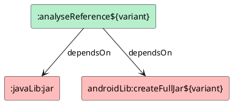

在 App 架构演进的过程中，基础模块下沉是每个 App 都要经历或者将要经历的一个阶段，在下沉的过程中可能需要对现有的模块进行功能上的拆分，像这样大规模的重构，难免会涉及到各个模块的依赖关系的梳理和分析，尤其是各个模块中的类的引用关系的分析，面对大量的有着悠久历史的代码，如何高效的分析错综复杂的依赖关系呢？

## 模块依赖关系

一般的构建工具或者包管理工具都提供了模块级的依赖分析工具和 API，以 Gradle 为例，通过以下的命令便可以输出工程的依赖关系树：

```bash
./gradlew dependencies
```

Gradle 不仅提供了命令行工具，还提供了 Configuration API，通过自定义 Gradle Plugin，就可以很容易的得到每个工程的依赖关系树：

```kotlin
project.configurations
    .getByName(JavaPlugin.RUNTIME_CLASSPATH_CONFIGURATION_NAME)
    .resolvedConfiguration
    .resolvedArtifacts
```

而对于 Android 应用来说，每个应用可能存在多个构建变体，获取工程的依赖关系树相较于 Java 应用来说会麻烦一些：

```kotlin
when (val android = project.getAndroid<BaseExtension>()) {
    is LibraryExtension -> android.libraryVariants
    is AppExtension -> android.applicationVariants
    else -> emptyList<BaseVariant>()
}.asSequence().forEach { variant ->
    val dependencies = listOf(AndroidArtifacts.ArtifactType.AAR, AndroidArtifacts.ArtifactType.JAR)
        .asSequence()
        .map { artifactType ->
            variant.getArtifactCollection(
                AndroidArtifacts.ConsumedConfigType.RUNTIME_CLASSPATH,
                AndroidArtifacts.ArtifactScope.ALL,
                artifactType
            )
        }
        .map { it.artifacts }
        .flatten()
        .distinctBy { it.id.componentIdentifier }
        .toList()
}
```

Gradle 对于依赖关系分析的 API 也仅限于提供模块级别，如果想要细化到 Class 或者 Member 的级别，就需要自己单独实现了。

## 模块间类依赖关系

如果想要分析模块间的类依赖关系，一般有两种实现途径：

1. 分析源代码
1. 分析字节码

显然，基于源代码的分析现实情况下是否可行是个大写的问号，结合实际情况，一般基于字节码分析会更容易实施。

既然要从字节码层面去分析，首先要解决的问题便是 —— 如何得到依赖的模块的字节码。

### 编译产物

前面有分别介绍针对 Java 和 Android 工程如何通过 Gradle 提供的 API 获得其依赖，实际情况中，依赖的表现形式可能会有以下几种：

1. Maven 依赖
1. Project 依赖
1. ...

对于 Maven 依赖，已经是编译好的依赖包，可能是 JAR 也可能是 AAR，不管是什么格式，总归 class 文件都在压缩包里了，没什么悬念，而对于 Project 依赖，这个有很有意思了，可能是 Java/Kotlin 工程，也有可能是 Android 工程，如何得到这些工程的 class 呢？

我们知道，Java 工程和 Kotlin 工程的编译 Task 是不一样的，但好在只要是 Library 工程，它们会有一个共同的 Task —— jar，也就是将 classes 打包成 jar 的 Task，那 Android 工程呢？

在前面我们有提到如何获取 Android 工程依赖列表，如果大家有研究过，不难发现，虽然获取到了 Android 工程的依赖列表，但是依赖列表返回的是 `ResolvedArtifactResult` 类型，通过 `ResolvedArtifactResult.getFile()` 可以得到所有依赖的文件路径，但如果大家有试过便会发现其中有些依赖的文件名为 *full.jar* 压根儿就不存在，那搞个🧶？

别慌，先看看 Android Gradle Plugin 的源代码，看看这个 `full.jar` 究意是个什么东东，扒了扒源码，就会发现 `LibraryTaskManager` 中有这个一段代码：

```java
// Create a jar with both classes and java resources.  This artifact is not
// used by the Android application plugin and the task usually don't need to
// be executed.  The artifact is useful for other Gradle users who needs the
// 'jar' artifact as API dependency.
File mainFullJar = new File(jarOutputFolder, FN_INTERMEDIATE_FULL_JAR);
AndroidTask<ZipMergingTask> zipMerger =
        androidTasks.create(
                tasks,
                new ZipMergingTask.ConfigAction(variantScope, mainFullJar));
```

嗯，光看注释，我们大概就知道是怎么回事儿了，虽然有这个 *full.jar*，但是这个 Task 默认是不会执行的，既然如些，咱们给它执行一下不就好了？

```bash
./gradlew :mylibrary:createFullJarDebug
```

果然，在执行完上面的命令后，前面提到的 *full.jar* 就能找到了，那这不简单了，在做类分析之前把这些要执行的 Task 先执行一遍不就好了？



至此，所有的 classes 便是囊中之物，接下来便是如何找出引用关系了。

### 类引用

做静态分析通常会用到 DAG (Directed Acyclic Graph)，当然，Booster 也提供了 [booster-graph](https://github.com/johnsonlee/booster/tree/master/booster-graph) 来方便构建 DAG 以及对 DAG 进行可视化。

除此之外，静态分析一般还会用到 CHA (Class Hierarchy Analysis)，当然，Booster 也提供了 [booster-cha](https://github.com/johnsonlee/booster/tree/master/booster-cha) 来分析类继承关系，但类引用分析并不需要分析类的继承关系，只需要知道分析的目标工程引用了各个依赖包中的哪些个类就行了，这不就是分析每个类的 `import` 列表嘛。

从字节码层面，其实并没有 `import` 这么个东东，而源代码中的 `import` 对应到字节码层面，其实就是对常量池中的一个索引，既然如此，那我们直接分析常量池不就好了？

没错，直接分析常量池是一种实现方式，但在这里，我想要介绍的是如何基于 ASM 来实现，很不幸地是，ASM 并没有提供直接访问常量池的 API，那怎么办呢？

尽管 ASM 没有提供常量池相关的 API，但我们可以通过分析 `ClassNode` 的以下部分来「曲线救国」：

* 类注解
* 父类
* 父接口
* 类签名
* 字段注解
* 字段类型
* 方法注解
* 方法参数
* 方法返回值类型
* 方法签名
* 方法体中的指令
  * `INVOKE***`
  * `{GET/PUT}FIELD`
  * `{GET/PUT}STATIC`,
  * `NEW`
  * `ANEWARRAY`
  * `CHECKCAST`
  * `INSTANCEOF`
  * `MULTIANEWARRAY`
  * `LDC`
  * `ATHROW`
  * ...
* 方法体中的 `try-catch` 块
* 方法中的本地变量表
* ...

在 Booster 中，ASM Tree API 被广泛地使用于字节码操作，但对于类引用分析方面，ASM Vistor API 会更适合，只需要实现相应的 `visit` 方法即可：

```kotlin
fun analyse(): Graph<ReferenceNode> {
    val executor = Executors.newFixedThreadPool(NCPU)
    val graphs = ConcurrentHashMap<Reference, Graph.Builder<ReferenceNode>>()

    try {
        project.classSets.map { (variant, classSet) ->
            classSet.map {
                it to variant
            }
        }.flatten().map { (klass, variant) ->
            val edge = { to: ReferenceNode ->
                graphs.getOrPut(Reference(klass.name, variant)) {
                    Graph.Builder()
                }.addEdge(ReferenceNode(this.project.name, variant, klass.name), to)
            }
            val av = AnnotationAnalyser(edge)
            val sv = SignatureAnalyser(edge)
            val fv = FieldAnalyser(av, edge)
            val mv = MethodAnalyser(av, sv, edge)
            executor.submit {
                klass.accept(ClassAnalyser(klass, av, fv, mv, sv, edge))
            }
        }.forEach {
            it.get()
        }
    } finally {
        executor.shutdown()
        executor.awaitTermination(1, TimeUnit.MINUTES)
    }

    return graphs.entries.filter {
        it.key.variant == variant
    }.fold(Graph.Builder<ReferenceNode>()) { acc, (_, builder) ->
        builder.build().forEach { edge ->
            acc.addEdge(edge)
        }
        acc
    }.build()
}
```

至此，我们便可以得到类引用的 DAG，至于如何可视化，可以采用 [booster-graph](https://github.com/johnsonlee/booster/tree/master/booster-graph) 提供的 `DotGraph` 来进行可视化，或者生成其它的格式，如：HTML 等。
