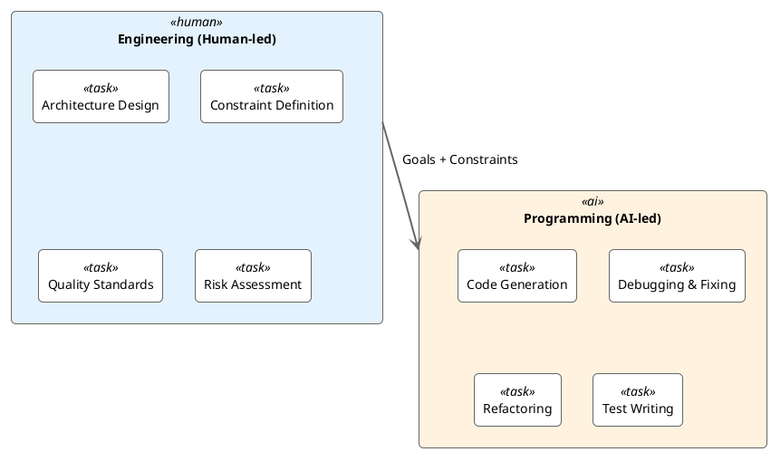
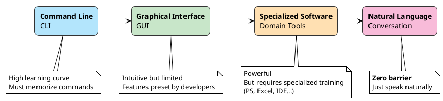
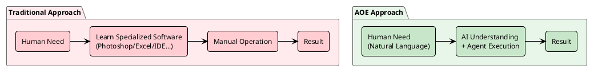
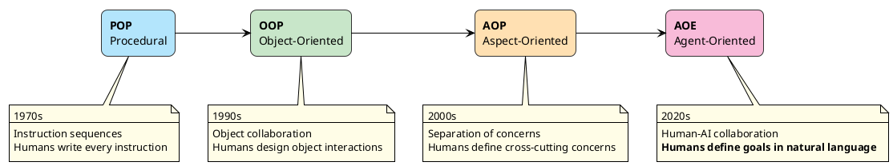
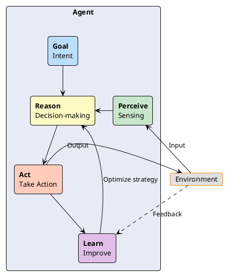
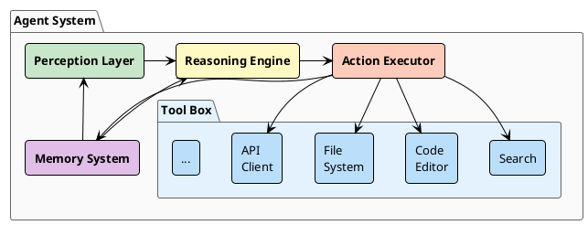
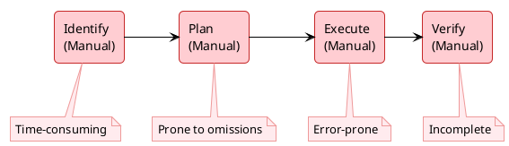
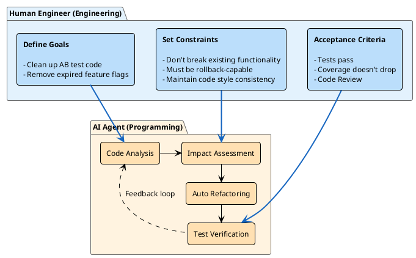
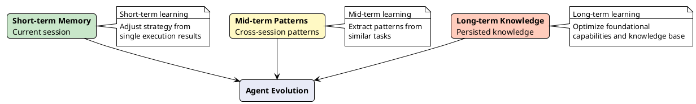
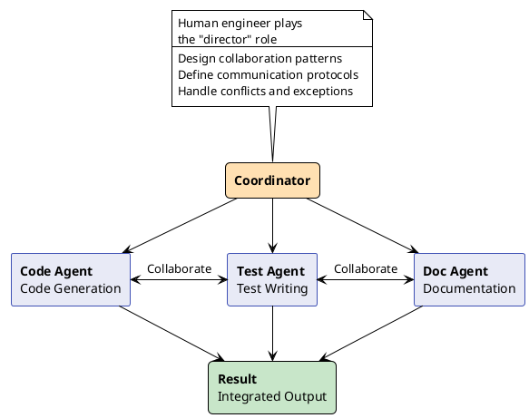

Over the past year, AI-assisted programming tools have emerged en masse -- from GitHub Copilot to Cursor to Claude Code, each claiming to double programmer productivity. As a veteran who's been writing code for over 20 years, I can't help but ask: when AI can understand our intent and autonomously complete tasks, shouldn't our role change accordingly?

The answer is yes.

As Programming is gradually taken over by AI, the value of human engineers will increasingly reside at the **Engineering** level -- system design, architecture decisions, constraint definition, quality control. I call this new engineering paradigm **Agent-Oriented Engineering (AOE)**.

## Programming vs Engineering

Before going further, I want to clarify the distinction between **Programming** and **Engineering**.

**Programming** is about "how" -- writing code, debugging, optimizing algorithms. This is the domain AI is rapidly mastering. Claude Code can already understand requirements, generate code, fix bugs, and even refactor.

**Engineering** is about "what" and "why" -- system architecture, technology selection, constraints, quality standards, risk assessment. This is the domain that requires human judgment and experience.

This doesn't mean humans no longer need to understand code -- quite the opposite. We need a deeper understanding of code and systems to effectively guide AI Agents. But our primary focus shifts from "writing code" to "designing systems" and "defining constraints."

## Why Now?

Over the past several decades, human-computer interaction has undergone a fascinating evolution:

In the past, getting a computer to do something required learning its "language" -- whether command-line, GUI, or the proprietary logic of specialized software. Want a poster? Learn Photoshop. Want data analysis? Learn Excel. Want to build an app? Learn a programming language.

Every piece of specialized software is a hurdle. Every programming language is a wall.

But now, all of this is changing.

When AI can understand natural language, humans can finally express needs in **the most natural way** -- talking. No specialized software to learn, no programming language to master. Just describe clearly what you want.

This is the fundamental reason Agent-Oriented Engineering is emerging: **natural language has become the new programming interface**.

When you can simply say "clean up the AB test code, keep the treatment branch," and the Agent can understand the meaning, analyze the codebase, execute the refactoring, and verify the results -- Programming itself gets redefined.

## From OOP to AOE: The Evolution

Looking back at software engineering's history, we've gone through several major paradigm shifts:

Each paradigm shift came with an upgrade in human-computer interaction:

| Paradigm | Human Responsibility | Interaction Mode |
|----------|---------------------|-----------------|
| POP | Write every instruction | Code |
| OOP | Design objects and interactions | Code |
| AOP | Define cross-cutting concerns | Code + Config |
| **AOE** | **Define goals and constraints** | **Natural Language** |

> So what do human engineers actually do?

Simply put: **define problems, not solve them**.

Our work shifts from "writing code to solve problems" to "clearly describing problems for Agents to solve." This sounds simple, but it actually raises the bar for engineers -- you need deeper understanding of the problem's essence, more precise articulation of constraints, more comprehensive consideration of edge cases.

Code can be ambiguous -- the compiler will flag errors. But ambiguity in natural language sends the Agent in a completely wrong direction. **The ability to express clearly becomes the new-era engineer's core competitive advantage.**

## What Is an Agent?

Before discussing Agent-Oriented Engineering, we need to clarify what an Agent is. Simply put, an Agent is an autonomous entity that can **perceive its environment, make decisions, and take action**.

Unlike traditional functions or services, Agents have these characteristics:

| Characteristic | Traditional Functions/Services | Agent |
|---------------|-------------------------------|-------|
| Autonomy | Passively called, strictly follows instructions | Active decision-making, autonomous path planning |
| Goal-oriented | Executes fixed logic | Flexibly adjusts strategy to achieve goals |
| Environmental awareness | Only processes input parameters | Perceives context and adapts accordingly |
| Continuous learning | Logic is fixed | Improves from experience |

## Core Components of an Agent

A complete Agent system typically contains these core components:

**Perception Layer** -- the Agent's "eyes and ears," gathering information from the environment: user intent, system state, external events.

**Reasoning Engine** -- the Agent's "brain," making decisions based on perceived information. This is the biggest difference between AOE and traditional programming -- decision logic is no longer hardcoded if-else but dynamic reasoning based on goals and context.

**Action Executor** -- the Agent's "hands," translating decisions into actual operations: invoking tools, modifying files, sending requests.

**Memory System** -- the Agent's "experience library," enabling the Agent to learn from past experience rather than starting from scratch every time.

## Practice: Refactoring Tech Debt Cleanup with AOE Thinking

Enough theory -- let's look at a real example. In daily work, tech debt cleanup is a perennial headache.

### Traditional Approach: Humans Drive Everything

### AOE Approach: Human-AI Collaboration

In this model, the human engineer focuses on **Engineering**:

- **Define goals**: Which category of tech debt? AB experiments? Internationalization? Deprecated APIs?
- **Set constraints**: Must not break existing functionality, must maintain test coverage, changes must be rollback-capable
- **Design acceptance criteria**: How do you determine cleanup succeeded?

While the Agent handles **Programming**:

- **Code analysis**: Scan the codebase, identify target code
- **Impact assessment**: Analyze dependencies, evaluate modification impact
- **Auto refactoring**: Generate and execute the refactoring plan
- **Test verification**: Run tests, ensure functional correctness

## Feedback Loop: The Core of Agent Evolution

In Agent-Oriented Engineering, the Feedback Loop is one of the most critical concepts. Unlike traditional static programs, Agents need to continuously learn from execution results and improve.

This loop isn't a simple while loop -- it's a continuous evolutionary process. Each execution accumulates experience for the next.

## Collaboration Between Agents

Real-world problems often require multiple Agents working together. This involves communication and coordination between Agents.

In multi-Agent systems, the human engineer's role is more like a "director" -- designing collaboration patterns between Agents, defining communication protocols, handling conflicts and exceptions.

## Closing Thoughts

Agent-Oriented Engineering isn't just a new technical paradigm -- it's a redefinition of the engineer's role.

In this transition, what we lose is "the satisfaction of writing code" -- that feeling of typing out lines of code and watching tests turn green. But what we gain is a higher level of creativity -- designing systems, defining constraints, ensuring quality.

The shift from Programming to Engineering follows the same arc. When AI takes over Programming, human engineers can finally focus on what we're truly best at: **understanding the essence of problems, making tradeoff decisions, and bearing engineering responsibility**.

I recall mentioning the concept of "stepping stones" in an earlier post -- discoveries that seem unrelated to the final goal may be the key step toward success. The Agent-Oriented Engineering we're exploring today may well be the stepping stone for the next decade of software engineering.

As Steve Jobs said:

> You can't connect the dots looking forward; you can only connect them looking backwards.

Our understanding and practice of Agents today will ultimately become the foundation of tomorrow's software engineering.
