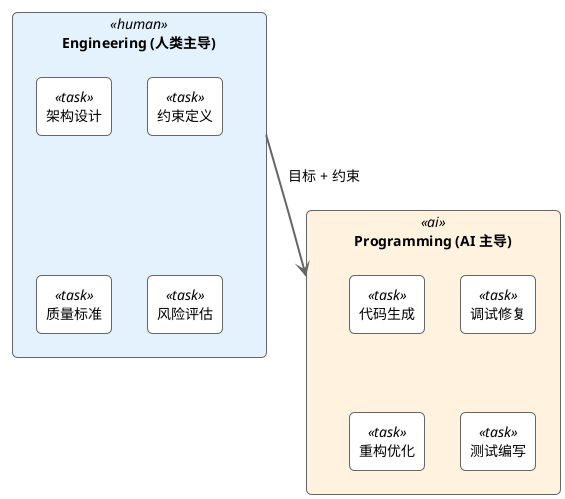
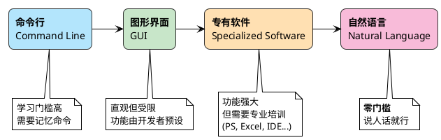
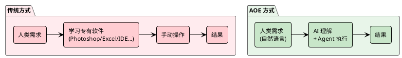
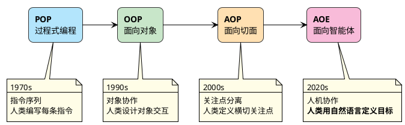
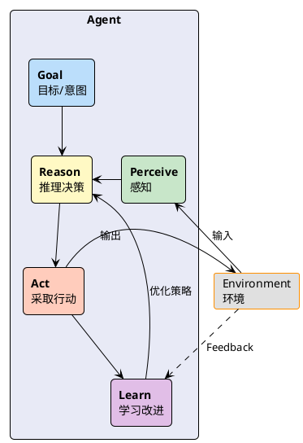
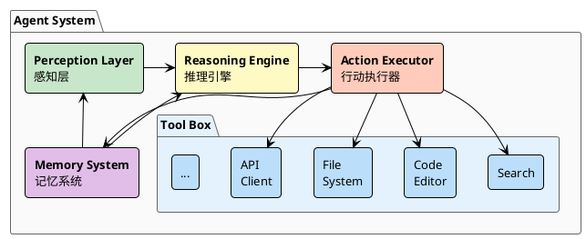
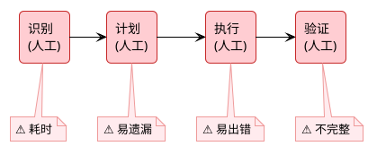
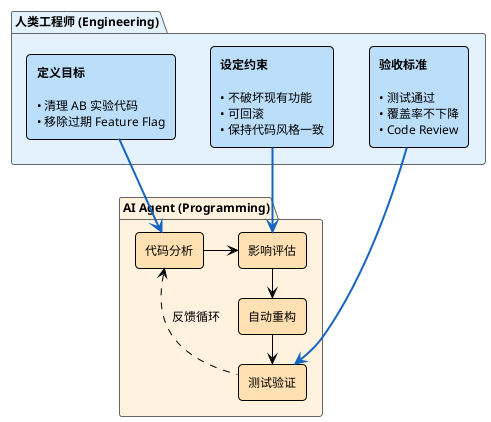
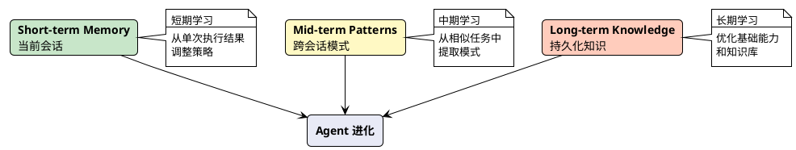
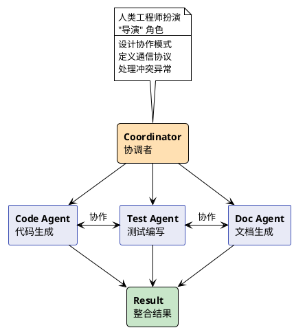

最近这一年，AI 辅助编程工具如雨后春笋般涌现，从 GitHub Copilot 到 Cursor，再到 Claude Code，每一个都号称能让程序员的效率翻倍。作为一个在代码世界里摸爬滚打了 20 多年的老兵，我不禁开始思考：当 AI 能够理解我们的意图并自主完成任务时，我们的角色是否也应该随之改变？

答案是肯定的。

当 Programming 逐渐被 AI 接管，人类工程师的价值将越来越多地体现在 **Engineering** 层面 —— 系统设计、架构决策、约束定义、质量把控。我称这种新的工程范式为 **Agent-Oriented Engineering（面向智能体工程）**。

## Programming vs Engineering

在继续之前，我想先厘清一个概念：**Programming** 和 **Engineering** 的区别。

**Programming** 关注的是"怎么做"—— 写代码、调试、优化算法。这是 AI 正在快速掌握的领域。Claude Code 已经能够理解需求、生成代码、修复 bug，甚至进行重构。

**Engineering** 关注的是"做什么"和"为什么"—— 系统架构、技术选型、约束条件、质量标准、风险评估。这是需要人类判断力和经验的领域。

这不是说人类不再需要理解代码 —— 恰恰相反，我们需要更深刻地理解代码和系统，才能有效地指导 AI Agent。但我们的主要精力将从"写代码"转向"设计系统"和"定义约束"。

## 为什么是现在？

在过去的几十年里，人类与计算机的交互方式经历了一个有趣的演变：

过去，想要让计算机完成一项任务，你必须学习它的"语言"—— 无论是命令行、图形界面还是专有软件的操作逻辑。想做个海报？学 Photoshop。想分析数据？学 Excel。想开发应用？学编程语言。

每一种专有软件都是一道门槛，每一门编程语言都是一堵墙。

但现在，这一切正在改变。

当 AI 能够理解自然语言，人类终于可以用**最自然的方式**——说话——来表达需求。不需要学习任何专有软件，不需要掌握任何编程语言，只需要清晰地描述你想要什么。

这就是 Agent-Oriented Engineering 兴起的根本原因：**自然语言成为了新的编程接口**。

当你可以直接说"帮我把这个 AB 实验的代码清理掉，保留 treatment 分支"，而 Agent 能够理解这句话的含义、分析代码库、执行重构、验证结果 —— Programming 这件事本身就被重新定义了。

## 从 OOP 到 AOE 的演进

回顾软件工程的发展历程，我们经历了几次重大的范式转变：

每一次范式的转变，都伴随着人机交互方式的升级：

| 范式 | 人类职责 | 交互方式 |
|-----|---------|---------|
| POP | 编写每一条指令 | 代码 |
| OOP | 设计对象和交互 | 代码 |
| AOP | 定义横切关注点 | 代码 + 配置 |
| **AOE** | **定义目标和约束** | **自然语言** |

> 那人类工程师到底做什么？

简单来说：**定义问题，而非解决问题**。

我们的工作从"写代码解决问题"转变为"清晰地描述问题让 Agent 去解决"。这听起来简单，实际上对工程师的要求更高了 —— 你需要更深刻地理解问题本质，更精准地描述约束条件，更全面地考虑边界情况。

代码可以模糊，编译器会报错。但自然语言的模糊，会导致 Agent 走向完全错误的方向。**清晰表达的能力，成为了新时代工程师的核心竞争力。**

## 什么是 Agent？

在讨论 Agent-Oriented Engineering 之前，我们需要先明确什么是 Agent。简单来说，Agent 是一个能够**感知环境、做出决策并采取行动**的自主实体。

与传统的函数或服务不同，Agent 具有以下特征：

| 特征 | 传统函数/服务 | Agent |
|-----|-------------|-------|
| 自主性 | 被动调用，严格按指令执行 | 主动决策，自主规划路径 |
| 目标导向 | 执行固定逻辑 | 为达成目标灵活调整策略 |
| 环境感知 | 只处理输入参数 | 感知上下文并据此调整 |
| 持续学习 | 逻辑固定不变 | 从经验中改进 |

## Agent 的核心组件

一个完整的 Agent 系统通常包含以下核心组件：

**Perception Layer（感知层）** —— Agent 的"眼睛和耳朵"，从环境中获取信息：用户意图、系统状态、外部事件。

**Reasoning Engine（推理引擎）** —— Agent 的"大脑"，根据感知到的信息做出决策。这是 AOE 与传统编程最大的区别 —— 决策逻辑不再是硬编码的 if-else，而是基于目标和上下文的动态推理。

**Action Executor（行动执行器）** —— Agent 的"手"，将决策转化为实际操作：调用工具、修改文件、发送请求。

**Memory System（记忆系统）** —— Agent 的"经验库"，让 Agent 能够从过去的经验中学习，而非每次从零开始。

## 实践：用 AOE 思维重构技术债清理

说了这么多理论，让我们来看一个实际的例子。在日常工作中，技术债清理是一个令人头疼的问题。

### 传统方式：人类主导一切

### AOE 方式：人机协作

在这个模式下，人类工程师专注于 **Engineering**：

- **定义目标**：清理哪类技术债？AB 实验？国际化？过时的 API？
- **设定约束**：不能破坏现有功能、必须保持测试覆盖率、变更需要可回滚
- **设计验收标准**：如何判断清理成功？

而 Agent 负责 **Programming**：

- **代码分析**：扫描代码库，识别目标代码
- **影响评估**：分析依赖关系，评估修改影响
- **自动重构**：生成并执行重构方案
- **测试验证**：运行测试，确保功能正确

## Feedback Loop：Agent 进化的核心

在 Agent-Oriented Engineering 中，Feedback Loop 是最关键的概念之一。与传统的静态程序不同，Agent 需要不断地从执行结果中学习并改进。

这个循环不是简单的 while 循环，而是一个持续进化的过程。每一次执行都在为下一次执行积累经验。

## Agent 之间的协作

真实世界的问题往往需要多个 Agent 协作完成。这就涉及到 Agent 之间的通信和协调问题。

在多 Agent 系统中，人类工程师的角色更像是一个"导演"—— 设计 Agent 之间的协作模式，定义通信协议，处理冲突和异常。

## 写在最后

Agent-Oriented Engineering 不仅仅是一种新的技术范式，更是对工程师角色的重新定义。

在这个转变中，我们失去的是"写代码的成就感"—— 那种亲手敲出一行行代码、看着测试变绿的满足感。但我们获得的是更高层次的创造力 —— 设计系统、定义约束、把控质量。

从 Programming 到 Engineering 的转变也是如此。当 AI 接管了 Programming 的工作，人类工程师终于可以专注于我们真正擅长的事情：**理解问题本质、做出权衡决策、承担工程责任**。

记得在《心之所向，道之所在》一文中，我提到过"垫脚石"的概念 —— 那些看似与最终目标无关的发现，可能是通往成功的关键一步。今天我们探索的 Agent-Oriented Engineering，或许就是软件工程下一个十年的垫脚石。

正如 Steve Jobs 所言：

> You can't connect the dots looking forward; you can only connect them looking backwards.

我们今天对 Agent 的理解和实践，终将成为未来软件工程的基石。
