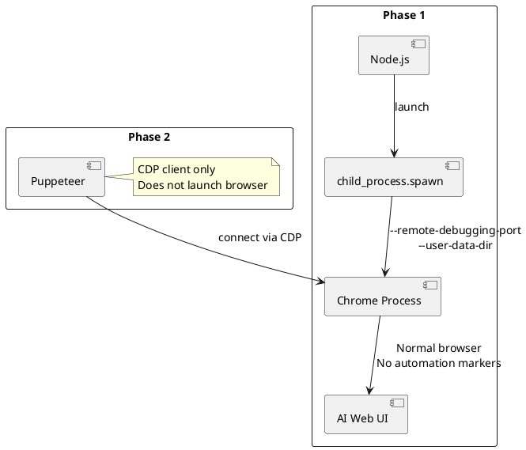
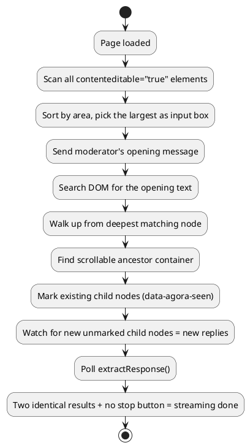

To get a deeper understanding of how AI thinks and reasons, a bold idea popped into my head -- make two AIs debate each other like humans. That's how [Agora](https://github.com/johnsonlee/agora) was born.

The initial plan seemed simple: spin up two browser windows with WebDriver, inject JS as a bridge, feed A's output to B, then feed B's reply back to A.

Why browser automation instead of APIs? I already have paid subscriptions to all three platforms. Chatting in the browser is free, but APIs charge separately and each requires its own SDK -- no reason to spend extra money on an experiment.

The idea was straightforward. The implementation took three complete rewrites.

## Round 1: Playwright -- Dead on Arrival

The first version used Playwright, the mainstream choice for browser automation. It hit a wall immediately.

### Anti-Detection Is a Dead End

Playwright injects a series of automation markers -- `navigator.webdriver = true`, modified `Runtime.enable` domain, and so on. Cloudflare's bot detection spots these instantly. Both Claude.ai and ChatGPT blocked the automated sessions on first contact.

### Sessions Won't Persist

Playwright's browser context and Chrome's real user-data directory are two different things. Login state can't survive across runs -- every launch means logging in again and passing verification. For a debate tool that needs to run repeatedly, this is unacceptable.

**Playwright solves the problem of "testing your own website," not "controlling someone else's."** Wrong use case, and no amount of tool quality can fix that.

## Round 2: Puppeteer Launch -- Better, but Not Enough

Switching to `puppeteer.launch()` with `puppeteer-extra-plugin-stealth` improved things. The stealth plugin patches most browser fingerprints, but Cloudflare still intermittently triggered challenge pages.

The root cause: `puppeteer.launch()` still passes `--enable-automation` and similar flags at startup. Stealth can erase most traces at runtime, but the browser process itself has already revealed its intent through how it was launched.

This round had another major problem: **I wrote a custom set of CSS selectors for each AI service.**

Claude's replies live in `.agent-turn .markdown`, ChatGPT's in `[data-message-author-role="assistant"]`, Gemini uses yet another structure. Streaming detection was also service-specific -- ChatGPT uses `.result-streaming`, Claude looks for different classes.

**The moment any service updates its frontend, the entire codebase breaks.** This isn't a bug -- it's an architectural flaw.

## Round 3: Spawn Chrome + CDP Connect + Universal DOM Discovery

The final approach splits browser control into two phases.

### Phase 1: Launch a "Clean" Chrome

Use `child_process.spawn()` to start the Chrome process directly with `--remote-debugging-port` and `--user-data-dir`, bypassing any automation framework entirely.

This Chrome is just a normal browser. No automation flags, no injected JS. Cloudflare sees a regular user. Log in manually once on the first run, the session persists in `./profiles/`, and you never have to deal with it again.

### Phase 2: Puppeteer as a CDP Bridge Only

After login, connect to the running Chrome via `puppeteer.connect({ browserURL })`. At this point Puppeteer is purely a CDP client -- it never launched this browser, so there are zero automation traces.

**Taking launch authority away from the automation framework is the key to bypassing anti-detection.**

### Universal DOM Discovery: Eliminating All CSS Selectors

This is the design I'm most proud of in the entire project. Instead of maintaining selectors for each service, let the program "understand" page structure on its own.

A few core ideas:

### Finding the Input Box: Sort by Area

Whether it's Claude's ProseMirror, ChatGPT's `#prompt-textarea`, or Gemini's input component, they all share one trait: **they're the largest `contenteditable="true"` element on the page.** Sorting by area and picking the biggest one works across all services.

### Finding the Reply Container: Probe Messages

Send a message with known content -- like the moderator's opening statement -- then search the DOM for that text. Once found, walk up from the deepest matching node until you hit a scrollable ancestor. That's the reply container.

### Detecting New Replies: Tagging

Tag all existing child nodes in the container with `data-agora-seen`. Any untagged new child node is a new reply. No dependency on any class names.

### Detecting End of Streaming: Double-Poll + Stop Button

Two consecutive `extractResponse()` calls return identical results, and no visible stop/cancel button on the page -- streaming is done. No need to know what class each service uses to mark streaming state.

**End result: adding a new AI service requires about 10 lines of code.** Zero service-specific selectors.

## War Stories from Production

The universal approach solved the architecture problem, but the devil in browser automation is always in the details.

### Gemini's Angular DOM Replacement

Gemini first renders a `<pending-request>` placeholder, then Angular replaces it with the actual reply node. If you cache the placeholder's `ElementHandle`, it goes stale -- pointing to a ghost node that no longer exists in the DOM tree.

The fix: stop caching single node references. Instead, extract content from the live DOM tree's multi-level structure on every call.

### ElementHandle Memory Leaks

Handles returned by `page.evaluateHandle()` must be manually `dispose()`d. `findInput()` runs every 300ms to update input box state -- without caching and cleanup, handles snowball. In testing, Node.js would OOM crash after about 15 minutes, memory spiking to 4GB.

The fix: cache handles and clean up old references via `_setHandle()` on replacement.

### Frame Detachment

Long-running sessions (7+ rounds) occasionally trigger page re-renders that detach the main frame. All Puppeteer calls crash instantly.

Handled via `resetDOM()` for cleanup and a `framenavigated` listener for proactive recovery.

### macOS Screen Sleep

This one was the most absurd. macOS screen sleep suspends the Chrome process, severing the CDP WebSocket connection. Halfway through a debate, the system sleeps and everything is lost.

The fix: `caffeinate -dims` to prevent system sleep during debates. One command to solve a maddening problem.

## Lessons from Three Iterations

Looking back across these three rounds, one thread runs through all of them: **don't fight the platform -- behave like a regular user.**

The problem with Playwright and Puppeteer's launch mode is fundamentally the same -- they start the browser in the identity of "automation tool," exposing intent from the very first millisecond. The final approach works because the Chrome process itself is a normal browser, and Puppeteer is merely an observer attached after the fact.

Universal DOM discovery follows the same logic: don't depend on platform implementation details (CSS classes) -- depend on invariant semantics (the largest editable element is the input box; new child nodes are new replies).

**Good automation isn't about smarter disguises. It's about eliminating the need for disguise in the first place.**
