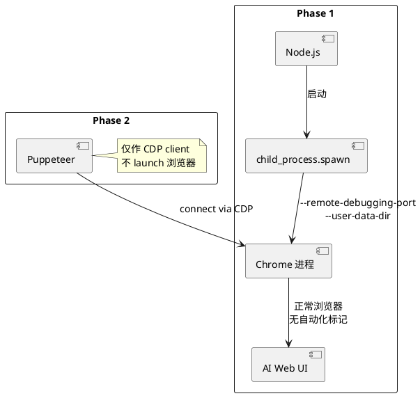
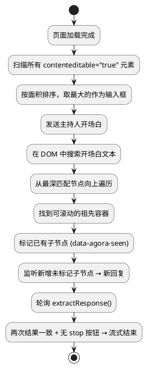

为了更深入地了解 AI 的思维和推理模式，脑子里冒出一个大胆的想法——让两个 AI 像人一样互相辩论。于是就有了 [Agora](https://github.com/johnsonlee/agora) 这个项目。

一开始想得很简单：用 WebDriver 启两个浏览器窗口，通过注入的 JS 作为桥梁，把 A 的输出喂给 B，B 的回复再喂回 A。

为什么走浏览器自动化而不是 API？三个平台的会员我都有，浏览器里聊天不要钱，但 API 各收各的钱、各配各的 SDK——没必要为一个实验再花一份。

思路很直接，实现却经历了三轮推倒重来。

## Round 1：Playwright，出师未捷

第一版用的 Playwright，毕竟是当下浏览器自动化的主流选择。结果刚跑起来就撞墙了。

### 反检测是个死结

Playwright 会注入一系列自动化标记——`navigator.webdriver = true`、修改过的 `Runtime.enable` domain，诸如此类。Cloudflare 的 bot detection 一眼就能认出来。Claude.ai 和 ChatGPT 都在第一时间拦截了自动化会话。

### Session 留不住

Playwright 的 browser context 和真实 Chrome 的 user-data 目录不是一回事。登录状态无法跨次运行保持，每次启动都要重新登录、过验证。对于一个需要反复运行的辩论工具来说，这个体验不可接受。

**Playwright 解决的是“测试自己的网站”这个问题，不是“操控别人的网站”。** 用途不对，工具再好也白搭。

## Round 2：Puppeteer launch，好了一点但不够

换成 `puppeteer.launch()` 配合 `puppeteer-extra-plugin-stealth`，情况有所改善。Stealth 插件修补了大量浏览器指纹，但 Cloudflare 还是会间歇性地触发 challenge page。

根本原因在于 `puppeteer.launch()` 仍然会带上 `--enable-automation` 等启动参数。Stealth 能在运行时抹掉大部分痕迹，但浏览器进程本身的启动方式已经暴露了意图。

这一轮还有另一个大问题：**我给每个 AI 服务都写了一套 CSS selector。**

Claude 的回复在 `.agent-turn .markdown` 里，ChatGPT 的在 `[data-message-author-role="assistant"]` 里，Gemini 又是另一套。流式输出的检测也是各写各的——ChatGPT 用 `.result-streaming`，Claude 看别的 class。

**任何一个服务改一次前端，整套代码就废了。** 这不是 bug，是架构缺陷。

## Round 3：spawn Chrome + CDP connect + 通用 DOM 发现

最终方案把浏览器控制拆成了两个阶段。

### 阶段一：启动一个“干净”的 Chrome

用 `child_process.spawn()` 直接拉起 Chrome 进程，带上 `--remote-debugging-port` 和 `--user-data-dir`，不经过任何自动化框架。

这个 Chrome 就是一个普通的浏览器。没有 automation flag，没有注入的 JS，Cloudflare 看到的是一个正常用户。首次运行时手动登录一次，session 保存在 `./profiles/` 里，之后就不用再管了。

### 阶段二：Puppeteer 只做 CDP 桥接

登录完成后，用 `puppeteer.connect({ browserURL })` 接入已经在运行的 Chrome。此时 Puppeteer 的角色只是一个 CDP client——它没有 launch 过这个浏览器，所以不存在任何自动化痕迹。

**把 launch 权从自动化框架手里拿走，是绕过反检测的关键。**

### 通用 DOM 发现：干掉所有 CSS selector

这是整个项目里我最满意的设计。与其维护每个服务的 selector，不如让程序自己“看懂”页面结构。

几个核心思路：

### 找输入框：按面积排序

不管是 Claude 的 ProseMirror、ChatGPT 的 `#prompt-textarea` 还是 Gemini 的输入组件，它们有一个共同点：**都是页面上最大的 `contenteditable="true"` 元素**。按面积排序取最大的，在所有服务上都 work。

### 找回复容器：探针消息

发一条已知内容的消息——比如主持人的开场白——然后在 DOM 里搜索这段文本。找到后从最深匹配节点向上遍历，直到命中一个可滚动的祖先——那就是回复容器。

### 检测新回复：标记法

给容器里已有的子节点都打上 `data-agora-seen` 标记，任何未标记的新子节点就是新回复。不依赖任何 class name。

### 检测流式结束：双轮询 + stop 按钮

连续两次 `extractResponse()` 的结果一致，且页面上没有可见的 stop/cancel 按钮——流式输出结束。不需要知道每个服务用什么 class 来标记 streaming 状态。

**最终结果：添加一个新的 AI 服务只需要约 10 行代码。** 零 service-specific selector。

## 实战中的幺蛾子

通用方案解决了架构问题，但浏览器自动化的魔鬼永远藏在细节里。

### Gemini 的 Angular DOM 替换

Gemini 会先渲染一个 `<pending-request>` 占位符，Angular 随后把它替换成真正的回复节点。如果你缓存了占位符的 `ElementHandle`，它会 stale——指向一个已经不在 DOM 树里的幽灵节点。

解决办法是放弃缓存单一节点引用，改为每次都从 live DOM tree 的多级结构中提取内容。

### ElementHandle 内存泄漏

`page.evaluateHandle()` 返回的 handle 必须手动 `dispose()`。`findInput()` 每 300ms 调一次来更新输入框状态——如果不做缓存和清理，handle 会像滚雪球一样堆积。实测大约 15 分钟后 Node.js 就会 OOM crash，内存飙到 4GB。

修复方式是缓存 handle，替换时通过 `_setHandle()` 清理旧引用。

### Frame detachment

长时间运行（7 轮以上）偶尔会触发页面重新渲染，主 frame 被 detach，所有 Puppeteer 调用瞬间崩溃。

靠 `resetDOM()` 做清理，加 `framenavigated` listener 做主动恢复。

### macOS 的屏幕休眠

这个最离谱。macOS 屏幕休眠会挂起 Chrome 进程，CDP WebSocket 连接直接断掉。辩论进行到一半，系统睡了，一切白费。

最终用 `caffeinate -dims` 在辩论期间阻止系统休眠。一行命令，解决一个让人抓狂的问题。

## 三轮迭代的启示

回头看这三轮演进，有一条线索贯穿始终：**不要跟平台对着干，要像普通用户一样行事。**

Playwright 和 Puppeteer launch 模式的问题本质上是一样的——它们以“自动化工具”的身份启动浏览器，从第一毫秒就暴露了意图。而最终方案之所以 work，是因为 Chrome 进程本身就是一个正常浏览器，Puppeteer 只是事后接入的观察者。

通用 DOM 发现的思路也是同一逻辑：不要依赖平台的实现细节（CSS class），而是依赖不变的语义（最大的 editable 元素就是输入框，新增的子节点就是新回复）。

**好的自动化方案不是更聪明地伪装，而是从根本上消除需要伪装的理由。**
