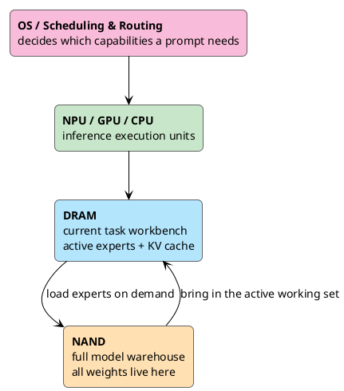

An AI bill that climbs the more you use it, a "the new era of PC" chant several giants let out at once, and a Siri quietly rewritten at WWDC — these three things look unrelated, yet they're all saying the same sentence.

<!-- more -->

**The future isn't in the cloud. It's on the device in your hand.**

They come from three completely different directions: the bill is the cost direction, "new PC" is the industry direction, Siri is the engineering direction. The three lines never talked to each other, yet they all point to the same place — on-device models. Let's take them apart one by one.

## Pulling Inference Back to the Device

These three are talking about the same thing. They just stand in different places.

Microsoft wants Windows to become the productivity entry point of the AI era again, so it set a hard floor for Copilot+ PC — 40 TOPS of NPU. That floor is a message to the entire OEM camp: the baseline for the next generation of PC has moved from CPU benchmarks to local inference. NVIDIA thinks that's too lightweight. It wants to pull the heavy work — developers, creators, model debugging, code generation — onto the local device, and turn it into an AI workstation.

Apple doesn't need to invent the words "AI PC," because its devices were never isolated to begin with.

The iPhone is the entry point you carry, the Mac is the productivity entry point, the iPad is for creation, the Watch sits against your body, Vision Pro owns space, AirPods own voice. What Apple Intelligence really wants to do is string these entry points into one line. So Apple's "AI PC" isn't a PC at all:

> It's a network of Apple Silicon devices running around your personal context.

The three describe it differently, but underneath it's the same move — **pull part of the inference load back from the cloud to the device.**

Why move it, I already covered in the [last piece](/en/2026/05/31/a-new-era-of-pc/): cloud tokens are too expensive, enterprise AI bills get heavier the more you use them, and firing every high-frequency, low-to-mid-complexity task at the most expensive cloud model is just paying a tax to the model vendors every day. I won't repeat that judgment here. This piece is about the other half — what Apple gave at WWDC is the most complete OS-level answer this road has so far.

## The Model Now Answers to the OS

Watching WWDC, it's easy to fixate on "did Siri actually get smarter." That question is too small.

The real shift: model capability now lives in the Foundation Models framework, and apps reach it through a system API. No app has to ship its own LLM anymore. That step turns the LLM from "a feature of some app" into "a capability of the operating system."

The app sends a request; the system judges permissions, picks the context, calls the on-device model, routes to Private Cloud Compute when necessary, and hands the result back to the app. The app holds neither the model nor your context. It's just the caller.

This is the real dividing line of the AI PC era:

> Running a model on the device is only the starting line; turning it into a default capability of the OS is the finish.

Windows is doing this. macOS and iOS are doing it too. The only difference is the entry point — Microsoft enters from enterprise Copilot, Apple from personal context. And personal context leans local by nature.

## What Even Lets an iPhone Run a Big Model?

When people talk about on-device LLMs, they stop at one sentence: the model is quantized, so it can run.

That's not enough. Everyone fixates on how big the model file is, while the thing that actually chokes you is **how much DRAM the runtime occupies.**

A running LLM mainly eats four chunks of memory: model weights, the KV cache, activations and runtime buffers, plus the embeddings / tokenizer / adapter system framework. Weights are the big one. A traditional dense 20B model is 40GB of FP16 weights, and still 10GB at INT4 — meaningless for a phone.

Cramming a 20B dense model in is a dead end. The key to Apple's on-device path is a different memory model:

```text
20B is sparse total capacity, not what you load at once
each inference only activates 1B-4B parameters
the full weights sit in NAND
only the experts the current task needs are loaded into DRAM
active weights then get squeezed once more with low-bit quantization
```

The memory math changes completely. 4B parameters at INT4 is about 2GB, at INT2 just 1GB; activate only 1B and INT4 is 512MB. A tens-of-gigabytes problem suddenly drops to hundreds of MB to a few GB.

So what Apple really had to solve was **DRAM footprint**; "too many parameters" was only the surface. And that's the same question the whole AI PC era can't get around — iPhone, MacBook, Windows AI PC or RTX workstation, they all end up stuck on where to put the weights, how to control the KV cache, how to pick the context, whether bandwidth is enough, whether power can be held down.

## NAND Is Just Storage

Here's an easy misunderstanding: Apple isn't running the model straight off NAND.

NAND's bandwidth and latency can't sustain token-by-token inference. The hot path has to be in DRAM, executed cooperatively by the Neural Engine, GPU and CPU. NAND's role is the full model warehouse, DRAM is the current task's workbench, the NPU/GPU/CPU are the execution units, and the OS is the scheduling and routing layer.



Because swapping experts has a cost, the server's token-level MoE doesn't work on a phone. Apple does prompt-level routing: first judge what capabilities this prompt needs, pick a set of experts and load them into DRAM, reuse them as much as possible across the whole generation, and adjust periodically only when necessary.

A server can brute-force frequent token-level swapping with HBM and large VRAM; a phone or thin-and-light laptop can't. So there's only one engineering path for on-device AI — shrink the active working set, raise cache reuse, hold down memory thrashing and power. Everyone has to walk this path sooner or later; Apple just walked it first.

## On-Device Only Handles the First Layer

Don't read AI PC as "we won't need cloud models anymore." The opposite — cloud models will keep existing and keep getting stronger.

What changes is the division of labor. The local device catches the tasks that "don't need the cloud" — short summaries, rewrites, translation, structuring after OCR, speech-to-text, local search, notification ranking, screen content understanding, lightweight completion. The cloud keeps complex reasoning, long context, large code generation, multi-step agents, deep research.

So the future is layered: the local model does the first layer, the cloud model the second, and the OS and agents route tasks in between. That's the meaning of Private Cloud Compute — on-device is only the first filter: small tasks solved locally, heavy tasks to the cloud, private data kept on the device as much as possible, the user asked to confirm when necessary.

## They're All Fighting for the Same Entry Point

Pull the view up, and Microsoft, NVIDIA and Apple are all talking about different products on the surface while fighting over the same thing underneath.

Microsoft rushes Copilot+ PC because it doesn't want the AI entry point taken entirely by the browser and ChatGPT. NVIDIA enters the personal market because it doesn't want to only sell data-center GPUs. Apple stuffs Foundation Models, Siri, App Intents and PCC into the system because it doesn't want the personal AI entry point intercepted by a third-party chatbot.

Whoever controls the default entry point decides whether a task runs locally or in the cloud, which model to use, which app to call, which context to pull, and which result the user ends up seeing. That's the real shared throughline of AI PC and WWDC: who owns the entry point. How many TOPS the NPU has is secondary.

And Apple's position here is unusual. Its single model may not be the strongest, but it holds Apple Silicon, unified memory, on-device models, system permissions, personal context, App Intents, a cross-device ecosystem and PCC all at once. This whole set is a natural fit for on-device AI, especially the Mac — if the iPhone is the carried entry point of personal AI, the Mac is the productivity entry point of local AI.

By then memory has to hold model weights, the KV cache, local context, multimodal buffers and the agent's workspace. The "a few Chrome tabs" standard is long gone. 8GB could still fool an ordinary user in the past; in the AI PC era it gets more and more awkward. Unified memory will be repriced.

## It's Not the Old PC Coming Back

The most deceptive thing about the term AI PC is that it makes people think the PC industry is returning to its golden growth years.

It isn't. The old PC's core was the browser, Office, local files, keyboard and mouse, CPU performance; the new PC's core is local models, personal context, low-latency inference, multimodal input, agent workflows and cloud collaboration. What truly came back to life is personal computing devices reclaiming an irreplaceable local value; the box we call a PC is merely the vessel.

Over the past decade, documents, photos, software and models all got taken by the cloud. AI created a reverse force — data too private, latency can't be too high, tokens too expensive, personal context too scattered — and pulled compute back to the device side.

That's the real takeaway from WWDC. Apple didn't package itself as an AI PC company, yet it turned the model into a default capability of the device and the operating system — the most core thing of the AI PC era, done in a form it never had to shout about.

Back to those three things from the start. The bill forces you to save, the industry chants new PC, Siri rewrote itself — from money, from industry, from engineering, all three directions say the same sentence:

> The model is moving from the cloud back onto the device, and this time there's no turning back.

Whoever makes that the default first takes the entry point of the next decade. Apple trailed in AI for years — this time, it bet on the right side.
