After WWDC, I did not come away with fresh expectations for Siri. It owes too much from too many years, and one keynote cannot repay that debt.

Apple has looked bad in AI for the past two years. ChatGPT took the chat entry point. Claude broke open the coding workflow. Google pushed Gemini across search, mail, and Android. Apple owned the devices closest to the user, yet still looked like a slow observer: talk about privacy at the keynote, add a few small features, and leave Siri feeling like a support bot from another era.

The interesting move was buried in the system layer. Apple still did not say "AI PC." It did not pretend to have the strongest model either. It pushed models, personal context, permissions, App Intents, and Private Cloud Compute back into the OS. For Apple, that matters more than chasing another chat box.

<!-- more -->

Apple has not won AI. Siri still carries old debt. But Apple has finally understood the next question: personal AI will not stay inside browsers and chat apps forever. It will move back into devices, operating systems, and default workflows.

## The Bill Put the PC Back on the Table

AI PC is hot again. Microsoft is pushing Copilot+ PC. NVIDIA is pushing RTX AI PC. Intel, AMD, and Qualcomm are all talking about NPUs. Everyone is saying some version of "the new era of PC."

The phrase itself is not interesting. Tech companies love declaring new eras. The interesting part is that everyone suddenly remembered the PC.

The PC has not been exciting for more than a decade, but it never left the desk. Code is written there. Documents are edited there. Meetings run there. Enterprise systems live there. The problem was that the valuable computation moved to the cloud, and the local machine slowly became a browser container.

AI flips that around. Every prompt, every context expansion, every tool call, every wrong turn an agent takes in the background consumes tokens. Cloud AI is useful, but the bill is very real.

I wrote about this in the [previous piece](/en/2026/05/31/a-new-era-of-pc/): Agentic Coding exposed the tension first. It can read a repo, change code, run tests, explain errors, handle migrations, and clean up technical debt, so people use it every day. That is exactly the problem. Anything genuinely useful becomes daily infrastructure, and daily infrastructure stops being a demo budget.

Human engineers explore and take wrong turns too. The difference is that human exploration cost is bundled into salary. Agent exploration cost shows up line by line on the token bill.

So the starting point of AI PC is very boring: cloud bills look ugly.

## Apple Stops Chasing Chatbots

Apple finally stopped trying to follow ChatGPT directly. It cannot win that way right now. On general model capability, Apple has no right to pretend it is in the first tier.

But Apple has another card: the default device entry point.

The iPhone is the entry point you carry. The Mac is the productivity entry point. The iPad handles lightweight creation. The Watch sits on the body. AirPods own voice. Vision Pro owns space. These devices used to be connected through hardware, account, and continuity. Apple now wants them to become a network of AI nodes around personal context.

That is what made WWDC worth watching. Foundation Models framework gives developers system-level model capability. App Intents exposes app actions. Personal Context pulls mail, calendar, files, and screen content into system understanding. Private Cloud Compute catches tasks the device cannot handle locally.

Apps do not need to carry their own LLM. An app makes a request, the system checks permission, selects context, decides local or cloud, and returns the result. The model, context, permissions, and fallback all move into the OS.

Apple AI used to feel like feature patches. This time it finally looks like platform capability.

## TOPS Only Wins the First Glance

AI PC marketing loves TOPS. A 40+ TOPS NPU, 16GB of memory, and 256GB of storage sounds like a clear floor.

The floor matters, but it only wins the first glance. Once AI enters a real workflow, the questions get specific fast: how large a model can run locally, how much context can fit, how the KV cache is handled, whether memory bandwidth is enough, whether power and thermals stay under control, whether developer APIs are usable, whether the OS can schedule across units, and how cloud fallback works.

Without a system-level software stack, even a strong NPU is just a selling point. AI PC competition eventually becomes full-stack competition: chips, memory, storage, models, runtime, OS, developer frameworks, app ecosystem, privacy permissions, and cloud fallback.

That is why Apple suddenly looks interesting again. Apple Silicon, unified memory, Neural Engine, GPU, CPU, Foundation Models, App Intents, and PCC do not look world-changing one by one. Together they form a very Apple answer.

Specs sell in the short term. Default paths compound in the long term. Hardware gets you a seat at the table. Routing power decides who gets paid.

## iPhone Math Starts With DRAM

The easiest shortcut around on-device LLMs is one sentence: the model is quantized, so it can run.

That only tells half the story. Model file size is the static bill. Runtime DRAM is where the real cost shows up. A running LLM mainly consumes model weights, the KV cache, activations, runtime buffers, plus smaller pieces such as embeddings, tokenizer, and adapters.

A traditional dense 20B model has 40GB of FP16 weights. Even at INT4, it still takes 10GB. That math does not work on a phone.

Apple's path looks more like changing the ledger. Do not shove a 20B dense model into the device. Use sparse total capacity and activate only the experts needed for the current inference:

```text
20B is sparse total capacity
each inference activates only 1B to 4B parameters
the full weights live in NAND
the experts needed by the current task are loaded into DRAM
active weights are compressed again with low-bit quantization
```

The memory bill changes fast:

```text
4B FP16 ≈ 8GB
4B INT8 ≈ 4GB
4B INT4 ≈ 2GB
4B INT2 ≈ 1GB

1B INT4 ≈ 0.5GB
1B INT2 ≈ 0.25GB
```

A tens-of-gigabytes problem drops to hundreds of megabytes or a few gigabytes. Apple is not just hiding parameter count. It is attacking **DRAM footprint**.

This does not only apply to the iPhone. MacBooks, Windows AI PCs, and RTX workstations all end up asking the same questions: where weights live, how the KV cache is controlled, how context is selected, whether bandwidth is enough, and whether power can be contained.

AI PC may come down less to who shouts the loudest and more to who does this memory accounting better.

## NAND Stores Weights DRAM Runs the Live Path

There is another common misunderstanding here: if weights live in NAND, does the model read from NAND while generating tokens?

No.

NAND bandwidth and latency cannot sustain token-by-token inference. The hot path for token generation has to sit in DRAM, executed by the Neural Engine, GPU, and CPU. More precisely, NAND holds the full model warehouse, DRAM holds the current task workbench, NPU/GPU/CPU execute, and the OS schedules and routes.

```plantuml
@startuml
!theme plain
left to right direction
skinparam backgroundColor white
skinparam defaultFontName Arial
skinparam defaultFontSize 13
skinparam ArrowColor #333333
skinparam rectangle {
    RoundCorner 10
    BorderColor #666666
    Padding 18
}

rectangle "OS" as os #F8BBD9
rectangle "NPU / GPU / CPU" as exec #C8E6C9
rectangle "DRAM" as dram #B3E5FC
rectangle "NAND" as nand #FFE0B2

os --> exec
exec --> dram
dram --> nand
nand --> dram
@enduml
```



Swapping experts is not free either. Phones and thin laptops are better suited to prompt-level routing: first decide what capabilities a prompt needs, load the matching experts into DRAM, and reuse them through the generation as much as possible. Servers can brute-force token-level MoE with HBM and large VRAM. Personal devices cannot.

On-device AI does not have much magic here. Shrink the active working set, raise cache reuse, and control memory thrashing and power. Apple is just making the bill visible early. Everyone else will have to do the math too.

## Local Handles the Cheap Calls

Local models will not replace cloud models. Claude, GPT, and Gemini will keep getting stronger. Complex reasoning, long context, large code generation, multi-step agents, deep research, and large multimodal generation will still lean on the cloud in the near term.

The change happens elsewhere: a lot of high-frequency, low-to-mid-complexity tasks should not hit the cloud every time. Short summaries, rewrites, translation, structuring after OCR, speech-to-text, local search, notification ranking, screen understanding, and lightweight completion do not need the most expensive model on every call. That is like using first class to deliver takeout.

The future looks more like a two-layer system. Local models catch the first pass, cheap tasks are handled on the device, private context stays local as much as possible, and tasks that exceed local ability get routed to the cloud.

Private Cloud Compute sits in the middle. Small tasks stay local, heavy tasks go cloud, private data remains on the device where possible, and the user confirms when needed. It does not kick the cloud out. It puts a gate in front of it.

The deeper AI moves into personal scenarios, the more the device matters. Personal AI needs to know who I am, what I just did, what I am looking at, and it also needs low latency, always-on availability, and privacy. Those capabilities lean local.

The cloud will not leave. It just will not monopolize AI anymore.

## Default Entry Points Dispatch the Work

Pull the camera back, and Microsoft, NVIDIA, and Apple are talking about different products while reaching for the same place.

Microsoft is pushing Copilot+ PC because it does not want the AI workflow entry point taken by the browser and ChatGPT. NVIDIA is entering the personal market because it does not want to only sell data center GPUs. Apple is putting Foundation Models, Siri, App Intents, and PCC into the system because it does not want the personal AI entry point intercepted by a third-party chatbot.

Whoever owns the default entry point owns dispatch: whether a task runs locally or in the cloud, which model to use, which app to call, which context to pull, and which result the user finally sees.

That is worth more than a model leaderboard.

Apple's position is unusual. Its single model is weaker than the frontier labs. The advantage comes from holding Apple Silicon, unified memory, on-device models, system permissions, personal context, App Intents, a cross-device ecosystem, and PCC at the same time. That stack fits on-device AI naturally, especially on the Mac.

If the iPhone is the carried entry point of personal AI, the Mac is the productivity entry point of local AI. At that point, memory is no longer about how many Chrome tabs can stay open. It becomes space for model weights, the KV cache, local context, multimodal buffers, and the agent workspace.

8GB used to fool ordinary users. In the AI PC era, it will look increasingly awkward. Unified memory will be repriced.

## Bottlenecks Beat Slogans

For investing, do not get excited just because something says "AI PC." Terminal brands matter, but the real bottlenecks sit further upstream: memory capacity, memory bandwidth, NPU/GPU inference capability, unified memory architecture, advanced packaging, power management, thermals, local model runtime, OS-level AI APIs, and developer ecosystem.

This chain touches Apple, Microsoft, NVIDIA, Qualcomm, AMD, Intel, ARM, storage and memory supply chains, PC OEMs, and software development tools. A crowded chain does not mean every AI PC concept wins.

Several questions are still hanging: whether consumers will pay for local AI, whether local AI features are necessary enough, whether enterprises will refresh devices, whether the NPU truly becomes mandatory, whether local GPU inference bypasses the NPU, and whether developers adapt at scale.

Microsoft started by emphasizing the NPU floor for Copilot+ PC. Later, Windows local model capability also began expanding toward GPU devices. The market has not written the answer yet. AI PC may be about the NPU, the GPU, unified memory, or the OS scheduling layer.

My judgment is simple: hardware specs will drive upgrades in the short term, while long-term profit will flow to the OS, runtime, and developer ecosystem. The companies worth watching are the ones that can turn local, private, and cloud models into a governable cost-routing system, not the ones only selling the concept.

## Apple Returns to the Table

The term AI PC can easily pull people in the wrong direction, as if the PC industry is heading back to its old golden age. That age is gone.

The old PC got its value from the browser, Office, local files, keyboard and mouse, and CPU performance. The new PC gets it from local models, personal context, low-latency inference, multimodal input, agent workflows, cloud collaboration, and privacy boundaries. The value returns to the irreplaceable local capability of personal computing devices.

Over the past decade, documents, photos, software, and models all moved to the cloud. AI creates a force in the other direction: data is too private, latency cannot be too high, tokens are too expensive, cloud cost is too heavy, and personal context is too scattered. Compute gets pulled back to the device side.

That is what makes WWDC worth watching. Apple did not package itself as an AI PC company, yet it turned AI from a cloud application into a default capability of the device and the operating system.

Apple has been behind in AI for years. That part is true. It has not caught OpenAI, Anthropic, or Google on model capability, and it did not pay off Siri's old debt in one keynote. But it has finally returned to the place where it is strongest: devices, operating systems, default entry points, and personal context.

That path is not sexy. It is very Apple.

The endpoint of AI PC looks much more mundane: **paying less token tax.**

Whoever first turns local inference, personal context, and model routing into the default takes the entry point of the next decade.
