Siri is an awkward name now. In 2011, Siri entering the iPhone felt like the future arriving early. More than a decade later, it feels like a voice shortcut that sometimes works. Ask anything slightly complicated and it mishears, answers around the question, or throws you into web search. Users have stopped even getting angry.

So when WWDC26 put Siri back at the center of Apple Intelligence, the first reaction is easy to imagine: that's it? Didn't Siri already exist?

The new part is this: Siri looks like more than a voice front end with a better chat backend. It starts touching screen content, personal context, and app actions. When an old entry point suddenly looks like it has gained reasoning ability, the next question is: where does that ability come from?

<!-- more -->

The WWDC26 signal was much larger than a Siri upgrade. Apple is tying Siri, Apple Intelligence, Foundation Models, App Intents, Private Cloud Compute, and Core AI into one execution path. Siri is still the entry point, but the machinery behind it now looks like system-level inference and dispatch.

Old Siri was closer to a voice-command router. Hear a sentence, match a domain, call a capability. The new path has to understand context on device, map the request to app actions, finish locally when the local model is enough, and hand off to PCC or another provider when it is not.

The hard part is engineering: **how does a memory-constrained, power-constrained iPhone run an LLM at all.**

## WWDC Sent A Signal

The pieces Apple announced at WWDC fit together cleanly.

[Foundation Models framework](https://developer.apple.com/wwdc26/guides/apple-intelligence/) gives apps a Swift API for the on-device model behind Apple Intelligence. It can also connect to Private Cloud Compute, Claude, Gemini, or any provider that conforms to the Language Model protocol. [App Intents](https://developer.apple.com/videos/play/wwdc2026/240/) expose app content and actions to Apple Intelligence, so Siri can find content through natural language, perform cross-app actions, and use screen context. [Core AI](https://developer.apple.com/videos/play/wwdc2026/324/) sits lower, handling model conversion, optimization, deployment, profiling, ahead-of-time compilation, model specialization, and cache.

At the model layer, Apple’s latest public [AFM 3](https://machinelearning.apple.com/research/introducing-third-generation-of-apple-foundation-models) material shows two on-device paths: AFM 3 Core, a 3B dense model, and AFM 3 Core Advanced, a 20B sparse model. The latter activates only 1B to 4B parameters per request. The full weights live in flash memory, meaning NAND.

Put those pieces together and Siri changes shape. It starts moving from an answer box into the system entry point that turns natural language into action.

For one user request, the system has to do five things:

```text
understand intent
read current context
find the relevant app capability
choose local or cloud execution
write the result back into the user experience
```

That is the line between Apple Intelligence and old Siri. Old Siri mostly tested speech recognition, intent enumeration, and backend services. New Siri also tests on-device models, system context, app schemas, runtime, and privacy boundaries.

## Siri Hooks Into System Reasoning

Siri has been around for years. The entry point was always there.

What was missing was a strong enough reasoning layer behind the entry point and a detailed enough map of app actions. When a user says, "send this boarding pass to my wife," the system has to know which image on screen is the boarding pass, who "my wife" is in Contacts, which messaging app to use, what attachment to include, and whether confirmation is required. Fixed intents leave too many cracks.

WWDC26’s App Intents and App Schemas are filling that map. Apps expose their entities, actions, schemas, semantic index, and onscreen context to the system. The LLM understands language and context. App Intents turn that understanding into executable actions.

That is where Siri differs from a chatbot. A chatbot mostly generates text. Siri has to call system capabilities. A polished sentence is cheap; getting the task done is the point.

As the action chain gets longer, the local model becomes more important. Sending every bit of personal context, screen content, and app data to the cloud blows up privacy, latency, and cost. The iPhone has to handle a large chunk of understanding and filtering on device.

So the question returns to hardware and model design: how does a phone run an LLM?

## iPhone Starts With Memory

The first wall for on-device LLMs is DRAM footprint.

Compute matters. NPU TOPS, GPU throughput, and CPU cores all affect token speed. LLM inference still has to fit. Weights, KV cache, activations, runtime buffers, vision features, audio features, the app itself, foreground UI, and background services all compete for the same memory pool.

Start with the weight bill:

```text
20B FP16 ≈ 40GB
20B INT8 ≈ 20GB
20B INT4 ≈ 10GB
20B INT2 ≈ 5GB
```

That excludes KV cache. Even at 2-bit, keeping 5GB of weights resident in phone DRAM is expensive. The system cannot push out the camera, keyboard, notifications, foreground app, and background work just to serve one model.

So "the iPhone runs 20B" is easy to misread. A more precise mental model is this: the iPhone has a 20B-class parameter pool, and one request puts only a 1B to 4B active set on the hot path.

The bill becomes realistic:

```text
4B FP16 ≈ 8GB
4B INT8 ≈ 4GB
4B INT4 ≈ 2GB
4B INT2 ≈ 1GB

1B INT4 ≈ 0.5GB
1B INT2 ≈ 0.25GB
```

Real inference still needs KV cache and buffers, but the pressure moves from the whole 20B model to the current 1B to 4B slice. That is where local inference starts to fit inside a phone.

## 20B Becomes An Active Set

Server-side MoE models can route each token to different experts because the experts usually already sit in HBM or large VRAM. iPhone does not have that luxury.

NAND has capacity, so it can hold the full model. DRAM has bandwidth, so it has to hold the hot path for token generation. NAND-to-DRAM bandwidth and latency cannot support swapping experts on every token. If the device tried that, users would leave before the first token arrived.

AFM 3 Core Advanced moves routing earlier. The system looks at the prompt, selects the experts needed for this stretch of work, reuses that active set during generation, and can periodically reselect experts when the task changes.

```text
a lightweight dense block processes the prompt
a router selects a fixed number of experts
shared experts stay on the active path
routed experts move from NAND into DRAM
decoding reuses the active set
longer tasks periodically reselect experts
```

It is closer to assembling a small dense model for the task. The 20B pool provides capability. The 1B to 4B active set serves the current request.

Apple’s 2025 [Instruction-Following Pruning](https://machinelearning.apple.com/research/pruning-large-language) work looks like the technical precursor. IFP trains a sparse mask predictor that selects task-relevant parameters from the user instruction. In the paper, the mask applies to rows and columns in FFN matrices. The LLM and mask predictor are trained together so the selected parameters preserve instruction-following behavior.

The result is useful: dynamically pruning a 9B-class model to 3B active parameters beats a 3B dense model by 5 to 8 absolute points in domains such as math and coding, gets close to the 9B dense model, and keeps TTFT near the dense 3B model.

That shape is exactly what the phone needs. The large parameter pool stays cold. The current task gets a task-sized model assembled from it.

## NAND DRAM And Routing

The AFM 3 Core Advanced path is easier to see when NAND, DRAM, and the router sit in one diagram.

```plantuml
@startuml
!theme plain
top to bottom direction
skinparam backgroundColor white
skinparam defaultFontName Arial
skinparam defaultFontSize 13
skinparam nodesep 35
skinparam ranksep 32
skinparam ArrowColor #333333
skinparam rectangle {
    RoundCorner 8
    BorderColor #666666
    Padding 14
}
skinparam database {
    BorderColor #666666
}

rectangle "Prompt" as prompt #F8BBD9
rectangle "Dense\nrouter" as router #E1BEE7
database "NAND\n20B pool" as nand #FFE0B2
rectangle "DRAM\n1B to 4B" as dram #B3E5FC
rectangle "CPU GPU ANE" as compute #C8E6C9
rectangle "KV cache" as kv #FFF9C4

prompt --> router
router --> nand : choose
nand --> dram : load
dram --> compute : infer
compute --> kv : write
kv --> compute : reuse
@enduml
```



NAND is the capacity layer. DRAM is the hot path. The router prevents the large model in NAND from entering DRAM as one block.

Shared experts are designed around the same constraint. If everything is routed, the device moves too much data. If everything is shared, the model drifts back toward a small dense model. A large shared component plus a routed expert slice is the compromise among latency, memory, and capability.

This maps directly to AI PCs. SSD can hold the model warehouse, DRAM can hold the active set, and NPU/GPU/CPU handle the hot-path computation. PCs simply have more memory, thermal headroom, and power budget, so they can tolerate longer context, larger active sets, and heavier multimodal inputs.

## QAT And KV Cache

Sparsity keeps the full weights out of DRAM. Quantization makes the active set thinner.

The full AFM 3 technical report is not public yet. Apple’s 2026 overview only says the latest models use Quantization Aware Training for compression. The most detailed current public description is the 2025 [Apple Intelligence Foundation Language Models Tech Report](https://machinelearning.apple.com/research/apple-foundation-models-tech-report-2025): the previous on-device model used QAT to reach 2 bits per weight, embeddings used 4-bit weights, KV cache used 8-bit values, and LoRA adapters recovered quality lost to compression.

2-bit LLM inference cannot be a casual export-time compression step. Apple’s report lists several training details:

```text
simulate quantization during training
use a straight-through estimator for rounding
learn the scaling factor per tensor
initialize clipping to reduce outlier damage
smooth weights with EMA
recover compression loss with LoRA adapters
```

Low-bit behavior is shaped during training. Exporting the model is the last step. For AFM 3 Core Advanced, sparsity first turns 20B into the current 1B to 4B active set, then QAT squeezes that set into the phone’s DRAM budget.

Once weights shrink, KV cache appears.

During Transformer generation, each token leaves behind keys and values for later tokens to attend to. Longer context means larger KV cache. The cache roughly scales with:

```text
number of layers
number of KV heads
head dimension
number of tokens
bytes per element
```

Apple already optimized this in the 2025 technical report. The on-device model was split into two blocks. The later 37.5 percent of transformer layers removed key and value projections and reused the KV cache from the first block. That reduced KV cache memory by 37.5 percent and reduced TTFT by about 37.5 percent because prefill skipped that computation.

Users do not see KV cache. They see late first tokens, heat, and battery drain. A usable local LLM depends on accounting for those small bills.

## App Intents PCC And System Routing

Running a model on iPhone only solves Siri’s understanding layer. Siri still has to connect to apps and cloud models to finish work.

App Intents answer what can be done. Apps expose entities, actions, schemas, semantic indexes, and onscreen context to the system, so Apple Intelligence knows which content exists inside an app and which actions natural language can trigger. WWDC26’s Siri sessions spend a lot of time on App Schemas, onscreen awareness, content transfer, and cross-app actions because this structured interface is the missing layer.

Foundation Models framework answers where computation goes. Under one abstraction, Apple Foundation Models on device, Private Cloud Compute, and third-party providers can all plug in. Developers can even implement their own Language Model provider.

Core AI answers how the local path stays stable. It handles model conversion, AOT compilation, specialization, cache, and profiling, placing work across CPU, GPU, and Neural Engine. On-device inference cannot assume exclusive control of the machine. It has to coexist with the camera, keyboard, notifications, foreground app, background tasks, battery management, and thermal policy.

The Siri path looks roughly like this:

```text
Siri receives natural language
the on-device model understands context
App Intents find executable actions
Core AI runs local inference
harder tasks go to PCC or another provider
results return to app and system UI
```

This is where Apple is strongest. The model is one layer. The system manages the model, apps, runtime, privacy, and cloud routing together.

## From iPhone Back To Mac

If iPhone can run this path, Mac has much more room.

Mac has more forgiving DRAM, thermal, and power budgets, and it sits on the same Apple Silicon path. WWDC26’s Core AI is not only an iPhone story. In Apple’s macOS and AI and Machine Learning guides, Core AI is described as built directly into the OS and purpose-built for Apple Silicon. Developers can download, run, and benchmark models such as Qwen, Mistral, and SAM3 on Mac, then integrate them into apps through Core AI.

That cross-checks the AI PC thesis. A useful AI PC cannot be reduced to an NPU or a TOPS number. It needs at least four layers to line up:

```text
local model
memory tiering
app action schema
local and cloud routing
```

iPhone proves the hardest memory constraint can be decomposed: 20B in NAND, 1B to 4B in DRAM, QAT for low bit width, and separate KV cache optimization. Mac shows how the same mechanism can scale inside a larger local-compute environment.

From iOS to macOS, the logic is continuous. The phone breaks the engineering floor for on-device LLMs. The PC raises the application ceiling.

## Apple Starts Counting Systems

Apple has been slow in AI narrative for the last few years. After ChatGPT, it did not immediately ship an assistant that ended the debate. Siri’s debt was heavy enough that every new demo got judged against more than a decade of disappointment.

WWDC26 at least makes the direction clear. Apple is putting the natural-language entry point, on-device models, app capability graph, PCC, Core AI runtime, and Apple Silicon into one system account.

This path will not be quick. App Intents need developer work. PCC has to prove experience and availability. The full AFM 3 Core Advanced technical report is still not public. Siri still has to move from "can hear" to "can finish," and that gap is large.

Once the iPhone can run this chain, the AI PC question becomes clearer. Local AI competition starts with who can keep more tokens useful under limited DRAM, power, and thermals, then who can turn those tokens into system actions.

This starts with Siri. It will not stop at Siri.

## References

- [Introducing the Third Generation of Apple’s Foundation Models](https://machinelearning.apple.com/research/introducing-third-generation-of-apple-foundation-models)
- [WWDC26 Apple Intelligence guide](https://developer.apple.com/wwdc26/guides/apple-intelligence/)
- [Build intelligent Siri experiences with App Schemas](https://developer.apple.com/videos/play/wwdc2026/240/)
- [Meet Core AI](https://developer.apple.com/videos/play/wwdc2026/324/)
- [Integrate on-device AI models into your app using Core AI](https://developer.apple.com/videos/play/wwdc2026/326/)
- [Build with the new Apple Foundation Model on Private Cloud Compute](https://developer.apple.com/videos/play/wwdc2026/319/)
- [Apple Intelligence Foundation Language Models Tech Report 2025](https://machinelearning.apple.com/research/apple-foundation-models-tech-report-2025)
- [Instruction-Following Pruning for Large Language Models](https://machinelearning.apple.com/research/pruning-large-language)
