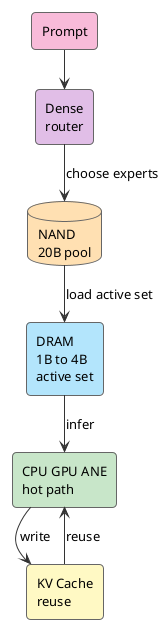

Siri is an awkward name now.

When it came to iPhone in 2011, it felt like the future arriving early. More than a decade later, it feels like a voice shortcut. Simple commands still work. Anything slightly complex and it mishears, answers around the question, or sends you to search.

So when WWDC26 put Siri back at the center of Apple Intelligence, my first reaction was: that's it? Didn't Siri already exist?

But a few minutes later, it felt off.

Siri is no longer just listening to a sentence. It has to see the screen, read personal context, know what each app can do, and handle permission before execution. The voice entry point is the same. The chain behind it changed.

The question gets hard fast: why can iPhone understand these things locally first?

<!-- more -->

Send every sentence to the cloud and privacy, latency, and cost explode. Keep everything local and phone DRAM, power, and thermals break. A smooth demo means nothing if the bill does not add up.

I was watching one thing:

**how does an iPhone run a useful enough LLM.**

## Siri Starts Acting

Old Siri was closer to a voice-command dispatcher.

A user says a sentence, the system matches a domain, then calls a capability. Alarms, weather, phone calls. Fixed intents can carry that. Anything slightly twisted and it falls through the cracks.

New Siri has to handle a different class of work.

Take one sentence:

```text
send this boarding pass to my wife
```

A chat box can answer with polished nonsense. The OS cannot. It has to know which image on screen is the boarding pass, who "my wife" is in Contacts, which messaging app to use, how to attach the file, and whether to ask for confirmation.

Chatting is too shallow.

This is OS-level task execution.

WWDC26 put several pieces behind Siri: [Foundation Models framework](https://developer.apple.com/wwdc26/guides/apple-intelligence/), [App Intents and App Schemas](https://developer.apple.com/videos/play/wwdc2026/240/), Private Cloud Compute, and [Core AI](https://developer.apple.com/videos/play/wwdc2026/324/).

Foundation Models decides where the model comes from. Local Apple Foundation Models, PCC, Claude, Gemini, and third-party providers can all sit behind the same abstraction.

App Intents decides how the action lands in an app. Apps hand entities, actions, schemas, semantic indexes, and onscreen context to the system, so Siri can land natural language on something concrete.

Core AI decides how the model runs on hardware. Model conversion, AOT compilation, specialization, cache, profiling, all the way down to CPU, GPU, and Neural Engine.

Once those pieces connect, Siri starts looking like a system router: which context stays local, which app takes over, when PCC enters, and when a third-party model fills the gap.

That is the WWDC26 signal: Apple wants task routing back at the system layer.

## Memory Blocks The Way

The first wall for on-device LLMs is DRAM. Compute comes after that.

NPU TOPS and GPU throughput matter. Once the model runs, weights, KV cache, activations, runtime buffers, vision features, audio features, foreground apps, and background services all fight for the same memory pool.

A phone does not have server headroom. It cannot evict camera, keyboard, notifications, and the foreground app for one model.

Start with 20B weights:

```text
20B FP16 ≈ 40GB
20B INT8 ≈ 20GB
20B INT4 ≈ 10GB
20B INT2 ≈ 5GB
```

KV cache and buffers are not even included. Even at 2-bit, 5GB of resident weights is expensive on an iPhone.

So "iPhone runs 20B" cannot be read with server logic. 20B is closer to a parameter pool. One request puts only a 1B to 4B active set on the hot path. Switch to the active set and the bill changes:

```text
4B FP16 ≈ 8GB
4B INT8 ≈ 4GB
4B INT4 ≈ 2GB
4B INT2 ≈ 1GB

1B INT4 ≈ 0.5GB
1B INT2 ≈ 0.25GB
```

That starts to look like something a phone can carry. In Apple’s latest public [AFM 3](https://machinelearning.apple.com/research/introducing-third-generation-of-apple-foundation-models) material, the on-device family has two paths: AFM 3 Core, a 3B dense model, and AFM 3 Core Advanced, a 20B sparse model. The key line is this: 20B parameters, only 1B to 4B active per request, full weights in flash memory, meaning NAND.

That line matters.

A traditional dense LLM wants weights in active memory. Active memory is exactly what edge devices lack. AFM 3 Core Advanced splits full model capability from the current request hot path.

NAND holds capability, DRAM holds the current task. That is where local LLMs on phones become possible.

## 20B Stays In NAND

Server-side MoE can route each token to different experts because those experts usually already sit in HBM or large VRAM. iPhone does not have that condition.

NAND has capacity but high latency. DRAM has low latency but expensive capacity. NAND-to-DRAM bandwidth and latency cannot support swapping experts on every token. Do that and the user locks the phone before the first token appears.

AFM 3 Core Advanced moves routing earlier.

After the prompt arrives, a lightweight dense block reads the task. The router picks routed experts and pulls them from NAND into DRAM. Generation reuses that active set as much as possible, with periodic reselection for longer tasks.

```text
prompt arrives
dense block reads the task
router picks experts
NAND loads routed experts
DRAM forms the active set
CPU GPU ANE run inference
KV Cache reuses context
```

20B does not enter iPhone as one block.

The system assembles a task-sized model from 20B. The 20B pool is the menu. The active set is what gets served.

Apple’s 2025 [Instruction-Following Pruning](https://machinelearning.apple.com/research/pruning-large-language) work already gave the technical prelude. IFP trains a sparse mask predictor that selects task-relevant parameters from the instruction. In the paper, the mask applies to FFN matrix rows and columns, and the LLM and mask predictor train together so selected parameters keep instruction-following ability.

The numbers are blunt: dynamically prune a 9B-class model to 3B active parameters, and it beats a 3B dense model by 5 to 8 points in math and coding, gets close to the 9B dense model, and keeps TTFT near the 3B dense model.

Edge devices need that shape.

The large model stays cold. The current task gets a strong enough small model. Capability comes from the large pool. Latency comes from the small path.

## NAND DRAM And Router

The picture in my head is simple.

NAND is the warehouse. DRAM is the workbench. The router is the dispatcher.



The warehouse cannot drive onto the workbench.

That is the router's job. Keep the full capability in NAND usable without letting the whole model crush DRAM.

Shared experts are the same bill. All routed experts means too much data movement. All shared experts drifts back toward a small dense model. A high shared ratio plus a routed slice is the compromise among latency, memory, and capability.

I used to think local LLMs were mostly a compression problem. AFM 3 Core Advanced makes it look more like memory tiering.

On-device LLM does not mean "make the model smaller." It means putting weights, active sets, KV cache, and runtime buffers in the right places.

## QAT Keeps Shrinking The Hot Path

Sparsity first cuts 20B into the current task. QAT then makes that task thinner.

The full AFM 3 technical report is not public yet. Apple’s 2026 overview only says the latest models use Quantization Aware Training for compression. The latest detailed public material is the 2025 [Apple Intelligence Foundation Language Models Tech Report](https://machinelearning.apple.com/research/apple-foundation-models-tech-report-2025).

The previous on-device model already used QAT to reach 2 bits per weight, 4-bit embedding tables, 8-bit KV cache, and LoRA adapters to recover quality lost to compression.

2-bit has to be shaped during training. A casual export-time squeeze will not do it. Training simulates quantization error, uses a straight-through estimator for the backward pass, learns a scaling factor per tensor, controls outliers with clipping, smooths weights with EMA, and pulls quality back with LoRA.

For AFM 3 Core Advanced, the chain is clear:

```text
20B sparse pool
→ 1B to 4B active set
→ QAT low bit
→ DRAM hot path
```

Once weights shrink, KV cache shows up.

During Transformer generation, every token leaves key/value behind. Longer context means larger KV cache. Users do not see KV cache. They see slow first tokens, heat, and battery drain.

Apple already touched this in the 2025 technical report. It split the on-device model into two blocks, removed key/value projections from the later 37.5 percent of transformer layers, and reused the KV cache from the first block. KV cache memory dropped 37.5 percent. Prefill TTFT also dropped about 37.5 percent.

That is what running an LLM on a phone really looks like.

The problem lives at the level of every memory block, every transfer, every token cache.

## App Intents Catch The Action

Running the model on iPhone only solves understanding. Siri still has to connect to apps.

I do not believe Apple will let every app attach its own model. That would scatter permissions, context, cost, and experience. The Apple-shaped move is to make apps hand schemas to the system, let the system own understanding, App Intents own execution, Foundation Models own model sources, Core AI own local runtime, and PCC own complex work and privacy boundaries.

Once this path works, Siri moves from a Q&A entry point to a task entry point.

A user says one sentence. The system reads context locally first. If the local model is enough, it calls App Intents and executes. If stronger reasoning is needed, it goes to PCC. If a third-party model is needed, Foundation Models provider routes it out.

The model enters the OS scheduling path.

What runs locally, what goes to PCC, which app can execute, which context can be read, and which result returns to system UI all move back to the system layer. Apple Intelligence cannot become a system capability without that.

Apple has been slow in AI narrative, and Siri’s debt is real. But this is the kind of work Apple is good at: turning model, apps, runtime, privacy, and cloud routing into one system ledger.

## From iPhone Back To AI PC

If iPhone can run this bill, Mac and PC have no excuse to stare only at TOPS. Mac has larger DRAM, more forgiving thermal and power budgets, and the same Apple Silicon path. Core AI also lands on Mac. Apple’s macOS and AI and Machine Learning guides describe Core AI as built directly into the OS and purpose-built for Apple Silicon. Developers can download, run, benchmark Qwen, Mistral, SAM3, and wire them into apps.

AI PC cannot be judged by one NPU.

At least four layers matter:

```text
local model
memory tiering
app action schema
local and cloud routing
```

iPhone proves the hardest memory constraint can be split: 20B in NAND, 1B to 4B in DRAM, QAT for low bit, KV cache optimized separately. Mac and PC scale that mechanism up.

That is how I read AI PC now.

Whoever keeps more useful tokens alive under limited DRAM, power, and thermals, and turns those tokens into system actions, gets a real seat at the table.

WWDC26 at least laid Apple’s route out: natural-language entry point, on-device models, app capability graph, PCC, Core AI runtime, and Apple Silicon all in one ledger.

This path will not be quick. App Intents need developer work. PCC has to prove availability. The full AFM 3 Core Advanced technical report is still not public. Siri still has a long way from "can hear" to "can finish."

But the direction is finally right.

This starts with Siri. It will not stop at Siri.

## References

- [Introducing the Third Generation of Apple’s Foundation Models](https://machinelearning.apple.com/research/introducing-third-generation-of-apple-foundation-models)
- [WWDC26 Apple Intelligence guide](https://developer.apple.com/wwdc26/guides/apple-intelligence/)
- [Build intelligent Siri experiences with App Schemas](https://developer.apple.com/videos/play/wwdc2026/240/)
- [Meet Core AI](https://developer.apple.com/videos/play/wwdc2026/324/)
- [Integrate on-device AI models into your app using Core AI](https://developer.apple.com/videos/play/wwdc2026/326/)
- [Build with the new Apple Foundation Model on Private Cloud Compute](https://developer.apple.com/videos/play/wwdc2026/319/)
- [Apple Intelligence Foundation Language Models Tech Report 2025](https://machinelearning.apple.com/research/apple-foundation-models-tech-report-2025)
- [Instruction-Following Pruning for Large Language Models](https://machinelearning.apple.com/research/pruning-large-language)
