```plantuml
@startuml
!theme plain
left to right direction
skinparam backgroundColor white
skinparam defaultFontName Arial
skinparam defaultFontSize 13
skinparam ArrowColor #333333
skinparam rectangle {
    RoundCorner 10
    BorderColor #666666
    Padding 18
}

rectangle "OS" as os #F8BBD9
rectangle "NPU / GPU / CPU" as exec #C8E6C9
rectangle "DRAM" as dram #B3E5FC
rectangle "NAND" as nand #FFE0B2

os --> exec
exec --> dram
dram --> nand
nand --> dram
@enduml
```

An AI bill that gets more expensive the more you use it, a line several giants almost shouted at the same time, "the new era of PC," and a WWDC that never put AI PC on the label. Put those three things next to each other and they look unrelated. They end up pointing to the same place: AI inference is moving back from the cloud toward the device.

For the past two years, AI has lived in the cloud by default. You open ChatGPT, Claude, or Gemini, send a prompt to a data center, wait for the model to run, and get the answer back. That habit put users, companies, and developers on a blunt ledger: more use, more tokens, a bigger bill, and tighter cloud GPUs.

<!-- more -->

Do not let the term AI PC fool you. The PC did not suddenly become great again. The math changed: **part of the inference workload has to come back local.**

Apple did not shout "AI PC" at WWDC, but it pushed that logic into the system. Models go into the device, personal context stays local, the OS handles scheduling, and on-device inference becomes the path users barely notice.

## The Cloud Pushed the PC Back

This round of AI PC storytelling smells a lot like the old multi-core CPU or GPU acceleration cycles. Hardware vendors need a new selling point. The PC market needs a new upgrade reason. Microsoft needs Windows back at the AI entry point. Chip vendors need a new price for NPUs, GPUs, unified memory, and memory bandwidth.

When Copilot+ PC arrived with its floor, the signal was not subtle: a 40+ TOPS NPU, 16GB of memory, and 256GB of storage. It looks like a spec sheet. It is also Microsoft drawing a line for OEMs and chip vendors: the baseline for the next generation of PCs is no longer just CPU benchmarks. Local AI inference has to be on the table.

NVIDIA thinks that is still too light. Copilot+ PC leans toward Recall, image processing, subtitles, speech, and simple generation. NVIDIA wants the heavier work back on the desk: developers, creators, model debugging, code generation, and video generation. RTX AI PC, RTX Spark, and Project Solara all grow out of that.

Apple is being Apple. It does not need to invent the term "AI PC," because its devices were never islands. The iPhone is the entry point you carry, the Mac is the productivity entry point, the iPad handles lighter creation, the Watch sits on the body, Vision Pro owns space, and AirPods own voice. Apple Intelligence is not trying to make one computer smarter. It is trying to wire a set of Apple Silicon devices around personal context.

Microsoft says PC, NVIDIA says workstation, Apple says ecosystem. Different words, same direction underneath: **the PC is turning from an office terminal into a local AI inference node.**

## SaaS Math Does Not Work for AI

The reason inference is being pulled local is not mysterious. Cloud AI bills look ugly.

Traditional SaaS is comfortable because once the software is sold, the marginal cost of another user is low. A company buys a seat, pays monthly, sees a stable bill, and can at least estimate ROI. Generative AI does not behave like that.

Every summary, every code generation, every agent loop, every multi-turn reasoning chain consumes tokens, compute, and GPU time. Once a company really starts using it, the bill climbs from subscription fees into tokens, vector databases, retrieval, storage, model calls, evaluation, monitoring, and human fallback.

I wrote about this tension in the [previous piece](/en/2026/05/31/a-new-era-of-pc/): the more useful AI becomes, the more frequently people use it; the more frequently people use it, the less acceptable it is to stay expensive. Agentic Coding has already made that tension obvious. It can read a repo, change code, run tests, explain errors, handle migrations, and clean up technical debt, so people use it every day. But the expensive part is often not the final few lines of code. It is all the exploration, reading, reasoning, trial and error, and retries before the diff appears.

Human engineers explore and take wrong turns too. The difference is that human exploration cost is bundled into salary. Agent exploration cost shows up line by line on the token bill.

The heat around AI PC keeps circling back to one plain question: can we pay less token tax?

## TOPS Is the Ticket, Routing Is the Profit Pool

TOPS is easy to explain. It also looks good on a slide. The moment an AI PC enters a real workflow, the questions get more specific.

How large a model can run locally? How much context can fit? How is the KV cache handled? Is memory bandwidth enough? Can power and thermals stay under control? Do developers get usable APIs? Can the OS schedule across units? Can apps connect to tool calling? How does cloud fallback work?

Without a system-level software stack, even a powerful NPU is still just a hardware selling point. AI PC competition eventually becomes full-stack competition: chips, memory, storage, models, runtime, OS, developer frameworks, app ecosystem, privacy permissions, and cloud fallback.

Put WWDC inside the AI PC story and this is what shows up. Apple Silicon, unified memory, Neural Engine / GPU / CPU cooperation, Foundation Models, App Intents, Siri, Personal Context, and Private Cloud Compute each look like a feature on their own. Together, they form a platform.

Specs sell in the short term. Ecosystems compound in the long term. Hardware is the ticket. Routing power is the profit pool.

## WWDC Was Not Really About Siri Getting Smarter

It is easy to watch WWDC and stare at Siri. Did it finally get smarter? That frame is too narrow.

The bigger move is that Apple did not ask every app to stuff its own LLM inside. Model capability now sits in the Foundation Models framework, and developers call it through system APIs. An app sends a request, the system checks permissions, selects context, calls the on-device model, routes to Private Cloud Compute when needed, and returns the result.

The app does not own the model. It does not own your full context either. It is just the caller. The model, context, permissions, routing, and fallback all move back into the operating system layer.

This is the dividing line of the AI PC era: **running a model is table stakes; the operating system has to make the model a default capability.**

Windows is doing this. macOS and iOS are doing it too. Microsoft enters through enterprise Copilot. Apple enters through personal context. Personal context naturally leans local, because it knows who you are, what you are looking at, what lives inside your apps, and what should not leave the device.

## Running an LLM on an iPhone Starts With DRAM

The most common shortcut around on-device LLMs is: the model is quantized, so it can run. That only tells half the story.

File size is only the static bill. Runtime DRAM is where the real cost shows up. A running LLM mainly consumes four chunks of memory: model weights, the KV cache, activations and runtime buffers, plus system pieces such as embeddings, tokenizer, and adapters.

A traditional dense 20B model has 40GB of FP16 weights. Even at INT4, it still takes 10GB. On a phone, that math is ugly.

Apple's path is not to shove a 20B dense model into the device. It changes the memory model:

```text
20B is sparse total capacity, not what must be loaded into DRAM at once
each inference only activates 1B-4B parameters
the full weights live in NAND
the experts needed by the current task are loaded into DRAM
active weights are compressed again with low-bit quantization
```

The memory bill changes fast:

```text
4B FP16 ≈ 8GB
4B INT8 ≈ 4GB
4B INT4 ≈ 2GB
4B INT2 ≈ 1GB

1B INT4 ≈ 0.5GB
1B INT2 ≈ 0.25GB
```

A tens-of-gigabytes problem drops to hundreds of megabytes or a few gigabytes. Apple is not just hiding parameter count. It is attacking **DRAM footprint**.

That same problem will hit more than the iPhone. MacBooks, Windows AI PCs, and RTX workstations all end up asking the same questions: where weights live, how the KV cache is controlled, how context is selected, whether bandwidth is enough, and whether power can be contained.

## NAND Is the Warehouse, DRAM Is the Workbench

Do not think of NAND as a drive the model reads from while generating. Apple is not running the model directly from NAND.

NAND bandwidth and latency cannot sustain token-by-token inference. The hot path for token generation has to sit in DRAM, executed cooperatively by the Neural Engine, GPU, and CPU. More precisely, NAND is the full model warehouse, DRAM is the current task workbench, the NPU/GPU/CPU are the execution units, and the OS is the scheduling and routing layer.



Swapping experts is not free. Apple is better suited to prompt-level routing: first decide what capabilities a prompt needs, load a set of experts into DRAM, reuse them through the generation as much as possible, and adjust periodically only when needed. Servers can brute-force token-level MoE with HBM and large VRAM. Phones and thin laptops cannot.

On-device AI does not have many magic tricks here: shrink the active working set, raise cache reuse, and control memory thrashing and power. Apple is just making the bill visible early. Everyone else will have to do the math too.

## Local Is the First Filter

Local is not a replacement for the cloud. Cloud models will stay, and they will keep getting stronger.

What changes is dispatch. Short summaries, rewrites, translation, structuring after OCR, speech-to-text, local search, notification ranking, screen understanding, and lightweight completion do not need to hit the cloud every time. Complex reasoning, long context, large code generation, multi-step agents, deep research, and large multimodal generation can stay in the cloud.

The future looks more like a two-layer system: local models catch the first pass, cloud models take the heavy work, and the OS, apps, and agents route tasks in between.

Private Cloud Compute sits in the middle: small tasks local, heavy tasks in the cloud, private data kept on the device as much as possible, user confirmation when needed. On-device is not the endpoint. It is the first filter.

Here is the counterintuitive part: the deeper AI moves into personal scenarios, the less automatic cloud dominance becomes. Training large models, frontier general models, and centralized enterprise inference naturally favor the cloud. Personal AI needs to know who I am, what I just did, what I am looking at, and it should respond with low latency, stay ready on the device, and protect privacy. Those capabilities lean local.

The cloud will not leave. It just will not monopolize AI anymore.

## Owning the Default Entry Point Means Owning Dispatch

Pull the camera back, and Microsoft, NVIDIA, and Apple are talking about different products while reaching for the same place.

Microsoft is pushing Copilot+ PC because it does not want the AI entry point taken entirely by the browser and ChatGPT. NVIDIA is entering the personal market because it does not want to only sell data center GPUs. Apple is putting Foundation Models, Siri, App Intents, and PCC into the system because it does not want the personal AI entry point intercepted by a third-party chatbot.

Whoever owns the default entry point owns dispatch: whether a task runs locally or in the cloud, which model to use, which app to call, which context to pull, and which result the user finally sees.

The shared thread between AI PC and WWDC is not how many TOPS an NPU has. It is who owns the entry point.

Apple's position is unusual. It does not have the strongest single model, but it holds Apple Silicon, unified memory, on-device models, system permissions, personal context, App Intents, a cross-device ecosystem, and PCC at the same time. That stack fits on-device AI naturally, especially on the Mac.

If the iPhone is the carried entry point of personal AI, the Mac is the productivity entry point of local AI. At that point, memory is no longer about "how many Chrome tabs can I open." It becomes space for model weights, the KV cache, local context, multimodal buffers, and the agent workspace.

8GB was still enough to fool ordinary users in the past. In the AI PC era, it will look increasingly awkward. Unified memory will be repriced.

## The Opportunity Is in the Bottleneck, Not the Slogan

For investing, do not get excited just because something says "AI PC." Terminal brands matter, but the bottlenecks sit further upstream: memory capacity, memory bandwidth, NPU/GPU inference capability, unified memory architecture, advanced packaging, power management, thermals, local model runtime, OS-level AI APIs, and developer ecosystem.

This chain touches Apple, Microsoft, NVIDIA, Qualcomm, AMD, Intel, ARM, storage and memory supply chains, PC OEMs, and software development tools. A crowded chain does not mean every AI PC concept wins.

Several questions are still hanging: whether consumers will pay for local AI, whether local AI features are necessary enough, whether enterprises will refresh devices, whether the NPU truly becomes mandatory, whether local GPU inference bypasses the NPU, and whether developers adapt at scale.

Microsoft started by emphasizing the NPU floor for Copilot+ PC. Later, Windows local model capability also began expanding toward GPU devices. The market has not written the answer in stone: is AI PC really about the NPU, the GPU, unified memory, or the OS scheduling layer?

My judgment is simple: hardware specs will drive upgrades in the short term, while long-term profit will flow to the OS, runtime, and developer ecosystem. The companies worth watching are the ones that can turn local, private, and cloud models into a governable cost-routing system, not the ones only selling the concept.

## The New PC Era Is the Entry Point Returning to the Device

The term AI PC can easily pull people in the wrong direction, as if the PC industry is heading back to its old golden age. That age is gone.

The old PC got its value from the browser, Office, local files, keyboard and mouse, and CPU performance. The new PC gets it from local models, personal context, low-latency inference, multimodal input, agent workflows, cloud collaboration, and privacy boundaries. What came back to life is not the PC box itself. It is the irreplaceable local value of personal computing devices.

Over the past decade, documents, photos, software, and models all moved to the cloud. AI created a force in the other direction: data is too private, latency cannot be too high, tokens are too expensive, cloud cost is too heavy, and personal context is too scattered. Compute is being pulled back to the device side.

That is what makes WWDC worth watching. Apple did not package itself as an AI PC company, yet it turned AI from a cloud application into a default capability of the device and the operating system.

The new PC era is not a PC comeback. More directly: **the endpoint of AI PC is paying less token tax.**

Whoever first turns local inference, personal context, and model routing into the default takes the entry point of the next decade.
