```plantuml
@startuml
!theme plain
top to bottom direction
skinparam backgroundColor white
skinparam defaultFontName Arial
skinparam defaultFontSize 13
skinparam nodesep 35
skinparam ranksep 32
skinparam ArrowColor #333333
skinparam rectangle {
    RoundCorner 8
    BorderColor #666666
    Padding 14
}
skinparam database {
    BorderColor #666666
}

rectangle "Prompt" as prompt #F8BBD9
rectangle "Dense\nrouter" as router #E1BEE7
database "NAND\n20B pool" as nand #FFE0B2
rectangle "DRAM\n1B to 4B" as dram #B3E5FC
rectangle "CPU GPU ANE" as compute #C8E6C9
rectangle "KV cache" as kv #FFF9C4

prompt --> router
router --> nand : choose
nand --> dram : load
dram --> compute : infer
compute --> kv : write
kv --> compute : reuse
@enduml
```

Siri is awkward now. In 2011, it felt like the future on an iPhone. More than a decade later, it feels like a voice shortcut. Ask anything complex and it mishears, answers around the question, or sends you to search.

So when WWDC26 put Siri back at the center of Apple Intelligence, my first reaction was: that's it? Didn't Siri already exist?

But as I kept watching, something changed. Siri has to see the screen, read personal context, call apps, and handle permission. It has to act.

Then the question gets hard: why can iPhone understand locally first? What stays on device? What goes to PCC? If that bill does not add up, a smarter Siri is still just a demo.

I cared about one question: **how does an iPhone run a useful enough LLM.**

<!-- more -->

WWDC26 puts Foundation Models, App Intents, Private Cloud Compute, and Core AI behind Siri. The names are familiar. Together, they become interesting: Siri starts looking like a system AI router.

Old Siri was a voice-command dispatcher. Hear a sentence, match a domain, call a capability. The new Siri has to understand context on device, then decide whether the local model runs, an app acts, PCC takes over, or a third-party model fills the gap.

"Voice assistant upgrade" is too small a frame. This is a system ledger.

## A Stack Behind Siri

If this were just a larger model behind Siri, I would not buy it. What stopped me was that the stack suddenly became whole.

[Foundation Models framework](https://developer.apple.com/wwdc26/guides/apple-intelligence/) lets apps call the on-device model behind Apple Intelligence, and also connect to PCC, Claude, Gemini, or another provider. [App Intents](https://developer.apple.com/videos/play/wwdc2026/240/) hands app entities, actions, schemas, semantic indexes, and onscreen context to the system. [Core AI](https://developer.apple.com/videos/play/wwdc2026/324/) goes lower: model conversion, AOT compilation, specialization, cache, and profiling.

Then the model. Apple’s latest public [AFM 3](https://machinelearning.apple.com/research/introducing-third-generation-of-apple-foundation-models) material has two on-device paths: AFM 3 Core, a 3B dense model, and AFM 3 Core Advanced, a 20B sparse model. The latter activates only 1B to 4B parameters per request. The full weights live in NAND.

Siri’s position changes. It is making system choices: where context comes from, which app can act, how far the local model runs, and when PCC takes over.

Take a plain request:

```text
send this boarding pass to my wife
```

A chat box can answer with fluff. The OS cannot. It has to know which image on screen is the boarding pass, who "my wife" is in Contacts, which messaging app to use, what attachment to include, and whether to ask for confirmation.

That is where App Intents sits. The LLM reads language and context. App Intents lands that understanding on executable actions. Without that schema layer, Siri can understand and still fail to act.

The longer the action chain, the more the local model matters. Shipping screen content, Contacts, and app data to the cloud every time breaks privacy, latency, and cost. iPhone has to filter most of it locally first.

## Memory Comes First

The first wall for on-device LLMs is DRAM, before TOPS.

Even with a strong NPU, weights, KV cache, activations, runtime buffers, vision features, audio features, the foreground app, and background services still compete for the same memory pool. The phone cannot evict camera, keyboard, and notifications just to serve one model.

Start with 20B weights:

```text
20B FP16 ≈ 40GB
20B INT8 ≈ 20GB
20B INT4 ≈ 10GB
20B INT2 ≈ 5GB
```

That excludes KV cache. Even at 2-bit, keeping 5GB of weights resident in phone DRAM is expensive.

So "iPhone runs 20B" cannot mean the whole 20B sits hot. A better description: iPhone has a 20B parameter pool, and one request puts only a 1B to 4B active set on the hot path.

Switch to the active set and the bill loosens:

```text
4B FP16 ≈ 8GB
4B INT8 ≈ 4GB
4B INT4 ≈ 2GB
4B INT2 ≈ 1GB

1B INT4 ≈ 0.5GB
1B INT2 ≈ 0.25GB
```

That starts to look like something a phone can carry. The door to local LLMs opens through DRAM.

## 20B Becomes The Current Task

Server-side MoE models can route each token to different experts because those experts usually already sit in HBM or large VRAM. iPhone does not have that luxury.

NAND handles capacity. DRAM handles the hot path. NAND-to-DRAM bandwidth and latency cannot support swapping experts on every token. If the phone tried that, the user would leave before the first token arrived.

AFM 3 Core Advanced moves routing earlier. After the prompt comes in, a lightweight dense block decides which experts this task needs, pulls those routed experts from NAND into DRAM, reuses them during generation, and periodically reselects for longer tasks.

```text
prompt arrives
router picks experts
NAND loads routed experts
DRAM forms the active set
CPU GPU ANE run inference
KV cache reuses context
```

It leaves 20B as the capability pool and assembles a task-sized dense model. The 1B to 4B active set does the work.

Apple’s 2025 [Instruction-Following Pruning](https://machinelearning.apple.com/research/pruning-large-language) work already pointed this way: choose parameters dynamically from the instruction. In that paper, pruning a 9B-class model to 3B active parameters beat a 3B dense model by 5 to 8 points in math and coding, got close to the 9B dense model, and kept TTFT near the 3B dense model.

That is the shape a phone needs: keep the large model cold, assemble a smaller model for the current task.

## NAND DRAM And Router

The picture in my head is simple: NAND is the warehouse, DRAM is the workbench, and the router is the dispatcher.



The full capability lives in NAND. The current task lives in DRAM. The router keeps the warehouse from driving onto the workbench.

Shared experts are the same bill. If everything is routed, the device moves too much data. If everything is shared, the model drifts back toward a small dense model. A large shared component plus a routed slice is the compromise among latency, memory, and capability.

AI PCs will hit the same ledger. SSD can hold the model warehouse, DRAM can hold the active set, and NPU/GPU/CPU handle the hot-path computation. PCs have more memory, thermal headroom, and power budget, so they can tolerate longer context, larger active sets, and heavier multimodal inputs.

## QAT And KV Cache

Sparsity keeps the whole model out of DRAM. Quantization makes the part that does move thinner.

The full AFM 3 technical report is not public yet. Apple’s 2026 overview only says the latest models use Quantization Aware Training for compression. The most detailed current public description is the 2025 [Apple Intelligence Foundation Language Models Tech Report](https://machinelearning.apple.com/research/apple-foundation-models-tech-report-2025): the previous on-device model used QAT to reach 2 bits per weight, embeddings used 4-bit weights, KV cache used 8-bit values, and LoRA adapters recovered quality lost to compression.

2-bit is not casual export-time compression. Training has to simulate quantization error, use a straight-through estimator for the backward pass, learn tensor scaling factors, control outliers with clipping, then use EMA and LoRA to pull quality back.

For AFM 3 Core Advanced, the route is clear: sparsity cuts 20B into a 1B to 4B active set, then QAT squeezes that set into phone DRAM.

Once weights shrink, KV cache appears.

During Transformer generation, every token leaves keys and values behind. Longer context means larger KV cache. Apple already optimized this in the 2025 technical report: split the on-device model into two blocks, remove key and value projections from the later 37.5 percent of transformer layers, and reuse the KV cache from the first block. KV cache memory drops 37.5 percent, and prefill TTFT drops by about 37.5 percent.

Users do not see KV cache. They see late first tokens, heat, and battery drain. A usable local LLM depends on accounting for those small bills.

## Routing Returns To The System

Running the model only solves understanding. Siri still has to connect to apps and cloud models.

I do not believe Apple will let every app attach its own model. Permissions, context, cost, and experience would scatter. The Apple-shaped move is cleaner: apps hand over schemas, the system owns understanding, App Intents owns execution, Foundation Models owns model sources, Core AI owns local runtime, and PCC owns complex work and privacy boundaries.

That is what actually interests me here: Apple wants task routing power back.

What runs locally, what goes to PCC, which app can execute, which context can be read, and which result returns to system UI cannot be scattered across apps. If that scatters, Apple Intelligence stays a bundle of features and never becomes a system capability.

Apple is good at this kind of work. The model is one layer. Turning model, apps, runtime, privacy, and cloud routing into one system ledger is Apple’s home field.

## iPhone Breaks The Floor

If iPhone can run this, Mac has much more room.

Mac has larger DRAM, wider thermal and power budgets, and the same Apple Silicon path. Core AI also lands on Mac. Apple’s macOS and AI and Machine Learning guides describe Core AI as built directly into the OS and purpose-built for Apple Silicon. Developers can download, run, and benchmark Qwen, Mistral, SAM3, then wire them into apps.

So an AI PC should not be judged by NPU or TOPS alone. At least four layers have to line up:

```text
local model
memory tiering
app action schema
local and cloud routing
```

iPhone proves the hardest memory constraint can be decomposed: 20B in NAND, 1B to 4B in DRAM, QAT for low bit width, and separate KV cache optimization. Mac scales the same mechanism up.

The phone breaks the engineering floor. The PC raises the application ceiling. iOS to macOS is one line.

## Apple Starts Counting The System

Apple has been slow in AI. No need to defend it. After ChatGPT, it did not ship an assistant that ended the debate. Siri’s debt was heavy enough that every new demo got marked against it.

But WWDC26 at least laid out the route: natural-language entry point, on-device models, app capability graph, PCC, Core AI runtime, and Apple Silicon finally in one ledger.

This path will not be quick. App Intents need developer work. PCC has to prove availability. The full AFM 3 Core Advanced technical report is still not public. Siri still has to move from "can hear" to "can finish."

But this is where I would start judging AI PCs: who can keep more tokens useful under limited DRAM, power, and thermals, and who can turn those tokens into system actions.

This starts with Siri. It will not stop at Siri.

## References

- [Introducing the Third Generation of Apple’s Foundation Models](https://machinelearning.apple.com/research/introducing-third-generation-of-apple-foundation-models)
- [WWDC26 Apple Intelligence guide](https://developer.apple.com/wwdc26/guides/apple-intelligence/)
- [Build intelligent Siri experiences with App Schemas](https://developer.apple.com/videos/play/wwdc2026/240/)
- [Meet Core AI](https://developer.apple.com/videos/play/wwdc2026/324/)
- [Integrate on-device AI models into your app using Core AI](https://developer.apple.com/videos/play/wwdc2026/326/)
- [Build with the new Apple Foundation Model on Private Cloud Compute](https://developer.apple.com/videos/play/wwdc2026/319/)
- [Apple Intelligence Foundation Language Models Tech Report 2025](https://machinelearning.apple.com/research/apple-foundation-models-tech-report-2025)
- [Instruction-Following Pruning for Large Language Models](https://machinelearning.apple.com/research/pruning-large-language)
