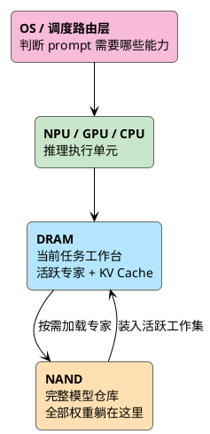

一张越用越贵的 AI 账单，一句几家大厂同时喊出的 "the new era of PC"，一套在 WWDC 上被悄悄重写过的 Siri——这三件事看起来毫不相干，却在说同一句话。

<!-- more -->

**未来不在云上，在你手里那台设备上。**

它们来自三个完全不同的方向：账单是成本的方向，"新 PC"是产业的方向，Siri 是工程的方向。三条线彼此没有交流，却都指向同一个地方——端侧模型。下面把这三条线拆开看。

## 微软说 PC，NVIDIA 说 workstation，苹果说 ecosystem

这三家讲的是同一件事，只是站的位置不一样。

微软要的是 Windows 重新成为 AI 时代的生产力入口，所以它给 Copilot+ PC 定了 40 TOPS NPU 的硬门槛——这不是规格表，是在告诉整个 OEM 阵营，下一代 PC 的底线不再是 CPU 跑分，而是本地推理能力。NVIDIA 嫌这还不够重，它要把开发者、创作者、模型调试、代码生成这些重活拉到本地，做成 AI workstation。

苹果不需要发明"AI PC"这个词，因为它的设备从来就不是孤立的。

iPhone 是随身入口，Mac 是生产力入口，iPad 是创作入口，Watch 贴着身体，Vision Pro 管空间，AirPods 管语音。Apple Intelligence 真正想做的，是把这些入口串成一条线。所以苹果的"AI PC"压根不是一台 PC：

> 它是一组围绕个人上下文运转的 Apple Silicon 设备网络。

微软在卖一台机器，NVIDIA 在卖一个节点，苹果在卖一张网。词不一样，底下是同一件事——**把一部分推理负载从云端搬回本地。**

为什么要搬，我在[上一篇](/2026/05/31/a-new-era-of-pc/)已经说过了：云端 token 太贵，企业 AI 账单越用越重，高频刚需的低中复杂度任务全往最贵的云端模型上打，等于天天给模型厂商交税。这个判断这里不重复。这篇想说的是另一半——苹果在 WWDC 给出的，是这条路目前最完整的 OS 级答案。

## LLM 不再是某个 App 的功能，而是 OS 的能力

外界看 WWDC，最容易盯着"Siri 到底变聪明了吗"。这个问题太小了。

真正的变化是，苹果没有让每个 App 自己塞一个 LLM 进去，而是把模型能力放进 Foundation Models framework，让 App 通过系统 API 去调。这一步把 LLM 从"某个应用的功能"变成了"操作系统的能力"。

App 发请求，系统判断权限、挑选上下文、调用端侧模型，必要时再路由到 Private Cloud Compute，最后把结果还给 App。App 自己不持有模型，也不持有你的上下文，它只是发起方。

这才是 AI PC 时代最关键的能力分水岭：

> 不是设备能不能跑模型，而是操作系统能不能把模型变成默认能力。

Windows 在做这件事，macOS 和 iOS 也在做。区别只在切入点——微软从企业 Copilot 切，苹果从个人上下文切。而个人上下文这个口子，天然偏本地。

## iPhone 跑 LLM，难的不是压缩，是 DRAM

讲端侧 LLM，很多人停在一句话上：模型量化了，所以能跑。

这句话不够。模型上设备，真正的问题不是模型文件有多大，而是**运行时要占多少 DRAM**。

LLM 跑起来主要吃四块内存：模型权重、KV Cache、激活值和 runtime buffer、再加上 embedding / tokenizer / adapter 这些系统框架。其中权重是大头。一个传统 dense 20B 模型，FP16 权重就是 40GB，INT4 也还有 10GB——对一部手机毫无意义。

苹果端侧路线的关键，不是把 20B dense 硬塞进去，而是换了一套内存模型：

```text
20B 是 sparse 总容量，不是一次要装的量
每次推理只激活 1B–4B 参数
完整权重躺在 NAND 里
当前任务需要的专家才加载进 DRAM
活跃权重再用低 bit 量化压一道
```

于是内存账彻底变了。4B 参数 INT4 大约 2GB，INT2 只要 1GB；如果只激活 1B，INT4 是 512MB。几十 GB 级别的问题，一下子掉到几百 MB 到几 GB。

所以苹果解决的从来不是"参数太多"，而是 **DRAM footprint**。这也是整个 AI PC 时代绕不开的同一道题——不管 iPhone、MacBook、Windows AI PC 还是 RTX workstation，最后都卡在权重怎么放、KV Cache 怎么控、上下文怎么选、带宽够不够、功耗压不压得住。

## NAND 是仓库，DRAM 是工作台

这里有个容易误会的点：苹果不是直接从 NAND 上跑模型。

NAND 的带宽和延迟扛不住 token-by-token 的推理。热路径必须在 DRAM 里，由 Neural Engine、GPU、CPU 协同执行。NAND 的角色是完整模型仓库，DRAM 是当前任务的工作台，NPU/GPU/CPU 是执行单元，OS 是调度和路由层。



正因为换专家有成本，苹果走的不是服务器那套 token-level MoE，而是 prompt-level routing：先判断这个 prompt 需要什么能力，挑一组专家加载进 DRAM，整段生成期间尽量复用，必要时再周期性调整。

服务器可以靠 HBM 和大显存硬扛 token 级的频繁换入换出，手机和轻薄本不行。所以端侧 AI 的工程思路只有一条路——减少活跃工作集，提高缓存复用，压住内存抖动和功耗。这不是苹果的特殊技巧，是所有人迟早都要做的事。

## 端侧是第一道过滤器，不是云的替代

别把 AI PC 理解成"以后不需要云端大模型了"。恰恰相反，云端模型会继续存在，而且越来越强。

变的是分工。本地设备接住那些"没必要上云"的任务——短文本摘要、改写、翻译、OCR 后结构化、语音转写、本地搜索、通知排序、屏幕内容理解、轻量补全。云端则留给复杂 reasoning、长上下文、大型代码生成、多步 agent、深度研究。

所以未来不是"云端 AI vs 本地 AI"，而是本地模型做第一层，云端模型做第二层，OS 和 Agent 在中间做任务路由。这也是 Private Cloud Compute 的意义——端侧不是终点，是第一道过滤器：小任务本地解决，重任务上云，隐私数据尽量不出设备，必要时让用户确认。

## 这几家抢的是同一个东西：默认入口

把视角拉高，微软、NVIDIA、苹果表面在讲不同的产品，底下抢的是同一样东西。

微软急着推 Copilot+ PC，是不想让 AI 入口被浏览器和 ChatGPT 全拿走。NVIDIA 进个人市场，是不想只卖数据中心 GPU。苹果把 Foundation Models、Siri、App Intents、PCC 全塞进系统，是不想让个人 AI 入口被第三方聊天机器人截胡。

谁控制了默认入口，谁就决定这个任务本地跑还是云端跑、用哪个模型、调哪个 App、拿哪些上下文、用户最后看到哪个结果。这才是 AI PC 和 WWDC 真正的共同主线——不是 NPU 几个 TOPS，是入口归谁。

而苹果在这件事上的位置很特殊。它不是单个模型最强，但它同时握着 Apple Silicon、统一内存、端侧模型、系统权限、个人上下文、App Intents、跨设备生态和 PCC。这一整套天然适合端侧 AI，尤其是 Mac——如果 iPhone 是个人 AI 的随身入口，Mac 就是本地 AI 的生产力入口。

到那时，内存不再是"开几个 Chrome tab"的事，而是模型权重、KV Cache、本地上下文、多模态 buffer 和 agent 工作区的空间。8GB 在过去还能糊弄普通用户，AI PC 时代会越来越尴尬。统一内存的价值，会被重新定价。

## 所以"PC 新时代"不是 PC 回到过去

AI PC 这个词最容易骗人的地方，是让人以为 PC 行业要回到那个增长的黄金年代。

不是。旧 PC 的核心是浏览器、Office、本地文件、键鼠和 CPU 性能；新 PC 的核心是本地模型、个人上下文、低延迟推理、多模态输入、agent 工作流和云端协同。活过来的不是 PC 这个盒子，而是个人计算设备重新有了不可替代的本地价值。

过去十年，文档、照片、软件、模型全被云端拿走了。AI 给了一股反向的力——数据太私密、延迟不能太高、token 太贵、个人上下文太分散，于是计算被重新拉回设备侧。

这就是 WWDC 真正的看点。苹果没把自己包装成一家 AI PC 公司，却把模型做成了设备和操作系统的默认能力——AI PC 时代最核心的那件事，它做成了不必喊出来的样子。

回到开头那三件事。账单逼你省，产业喊新 PC，Siri 把自己重写了一遍——从钱、从产业、从工程三个方向，说的是同一句话：

> 模型正在从云端搬回设备，这一次没有回头路。

谁先把它做成默认，谁就拿走下一个十年的入口。
