```plantuml
@startuml
!theme plain
top to bottom direction
skinparam backgroundColor white
skinparam defaultFontName Arial
skinparam defaultFontSize 13
skinparam nodesep 35
skinparam ranksep 32
skinparam ArrowColor #333333
skinparam rectangle {
    RoundCorner 8
    BorderColor #666666
    Padding 14
}
skinparam database {
    BorderColor #666666
}

rectangle "Prompt" as prompt #F8BBD9
rectangle "Dense\nrouter" as router #E1BEE7
database "NAND\n20B pool" as nand #FFE0B2
rectangle "DRAM\n1B to 4B" as dram #B3E5FC
rectangle "CPU GPU ANE" as compute #C8E6C9
rectangle "KV cache" as kv #FFF9C4

prompt --> router
router --> nand : choose
nand --> dram : load
dram --> compute : infer
compute --> kv : write
kv --> compute : reuse
@enduml
```

Siri 这个名字，现在多少有点尴尬。2011 年它进 iPhone 时，像是未来提前来了；十几年后，它更像一个偶尔能用的语音快捷方式。你问复杂一点的问题，它听错、答偏、转去网页搜索，用户也懒得再生气。

所以 WWDC26 再把 Siri 推回 Apple Intelligence 的中心时，大家的第一反应大概是：就这？这不是早就有了吗？

可这次的怪异之处也在这里。Siri 看起来不只是换了一个更会聊天的后端，它开始碰屏幕内容、个人上下文、App 里的动作。一个老入口突然像是长出了推理能力，问题就变成了：这层能力从哪来？

<!-- more -->

WWDC26 的信号比一个更会聊天的 Siri 大得多。Apple 把 Siri、Apple Intelligence、Foundation Models、App Intents、Private Cloud Compute、Core AI 放进了同一条链路里。Siri 仍然是入口，但它背后开始变成一套系统级推理和调度机制。

过去的 Siri 更像语音指令分发器。听懂一句话，匹配一个 domain，调用一个能力。新的路线要求它先在设备上理解上下文，再把任务映射到 App 能执行的动作；本地模型吃得下，就在 iPhone 上完成；吃不下，再交给 PCC 或第三方模型。

这件事最难的地方不在语音交互，而在一个更硬的工程问题：**iPhone 这种内存和功耗都很紧的设备，怎么跑得动 LLM。**

## WWDC 给了一个信号

这次 WWDC 的几个发布放在一起看，线索非常清楚。

[Foundation Models framework](https://developer.apple.com/wwdc26/guides/apple-intelligence/) 给 App 一个 Swift API，可以访问 Apple Intelligence 背后的 on-device model，也可以接 Private Cloud Compute、Claude、Gemini 或符合 Language Model protocol 的其他 provider。[App Intents](https://developer.apple.com/videos/play/wwdc2026/240/) 把 App 的内容和动作暴露给 Apple Intelligence，让 Siri 能通过自然语言找到内容、跨 App 执行动作、结合屏幕上下文做判断。[Core AI](https://developer.apple.com/videos/play/wwdc2026/324/) 往下接模型转换、优化、部署、profiling、ahead-of-time compilation、model specialization 和 cache。

再往模型层看，Apple 最新公开的 [AFM 3](https://machinelearning.apple.com/research/introducing-third-generation-of-apple-foundation-models) 里，on-device 家族除了 3B dense 的 AFM 3 Core，还有 20B sparse 的 AFM 3 Core Advanced。后者每次请求只激活 1B 到 4B 参数，完整权重放在 flash memory，也就是 NAND。

这几个点拼在一起，Siri 的意义就变了。它开始从“回答问题”的入口，变成系统把自然语言落成动作的入口。

用户说一句话，系统要完成五件事：

```text
理解用户意图
读取当前上下文
找到相关 App 能力
决定本地执行还是上云
把结果写回系统体验
```

这就是 Apple Intelligence 和老 Siri 的分界线。老 Siri 主要考验语音识别、意图枚举和后端服务。新 Siri 还要考验端侧模型、系统上下文、App schema、runtime 和隐私边界。

## Siri 接上系统推理

Siri 已经存在很多年。入口一直在那里，缺的是入口后面的推理层。

麻烦在入口后面没有足够强的推理层，也没有足够细的 App 动作图谱。用户说“把这张登机牌发给我老婆”，系统需要知道屏幕上哪张图是登机牌、通讯录里谁是老婆、应该用哪个消息 App、消息里要带什么附件、执行前要不要确认。过去这种需求很容易掉进固定 intent 的缝里。

WWDC26 的 App Intents 和 App Schemas 正是在补这张图谱。App 要把自己的 entity、action、schema、semantic index、onscreen context 暴露给系统。LLM 负责理解自然语言和上下文，App Intents 负责把理解结果落到可执行动作上。

这也是 Siri 和普通 chatbot 的差别。chatbot 主要生成文本，Siri 要调用系统能力。生成一句漂亮回答价值有限，替用户把事情做完才值钱。

但动作链路越长，对本地模型的要求越高。每次都把个人上下文、屏幕内容、App 数据发到云端，隐私、延迟、成本都会炸。iPhone 必须先在本地完成足够多的理解和过滤。

所以问题回到硬件和模型：手机怎么跑 LLM？

## iPhone 先过内存关

端侧 LLM 的第一堵墙是 DRAM footprint。

算力当然重要。NPU 多少 TOPS，GPU 多强，CPU 几个核，都会影响 token 速度。可 LLM 不是只要算得动就行。权重、KV Cache、activation、runtime buffer、视觉特征、音频特征、App 本身、前台 UI、后台服务，全都要抢同一块内存。

先看权重这笔账：

```text
20B FP16 ≈ 40GB
20B INT8 ≈ 20GB
20B INT4 ≈ 10GB
20B INT2 ≈ 5GB
```

这还没算 KV Cache。哪怕把 20B 压到 2-bit，5GB 权重常驻 DRAM 对手机也很奢侈。系统不能为了一个模型把相机、键盘、通知、前台 App、后台任务全部挤出去。

所以“iPhone 跑 20B”这句话容易误导。更准确的口径是：iPhone 上有一个 20B 级别的参数池，单次请求只把 1B 到 4B active set 放进热路径。

这笔账立刻变得现实：

```text
4B FP16 ≈ 8GB
4B INT8 ≈ 4GB
4B INT4 ≈ 2GB
4B INT2 ≈ 1GB

1B INT4 ≈ 0.5GB
1B INT2 ≈ 0.25GB
```

实际运行还要加 KV Cache 和各种 buffer，但压力已经从整块 20B 变成当前 1B 到 4B。手机跑 LLM 的门，就是从这里打开的。

## 20B 模型拆成活跃集合

服务器上的 MoE 模型可以每个 token 路由到不同 experts，因为 experts 通常已经在 HBM 或大显存里。iPhone 没这个条件。

NAND 容量大，适合放完整模型。DRAM 带宽高，适合放生成 token 的热路径。NAND 到 DRAM 的带宽和延迟撑不起每个 token 换一批 experts。真这么做，第一 token 还没出来，用户就已经退出了。

AFM 3 Core Advanced 的思路是把路由提前。系统先看 prompt，再选择这段任务需要的 experts。生成过程中尽量复用这个 active set，必要时周期性重选。

```text
轻量 dense block 处理 prompt
router 选择固定数量的 experts
shared experts 留在活跃路径
routed experts 从 NAND 进入 DRAM
decoding 阶段复用 active set
长任务里周期性重选 experts
```

它更像临时拼出一个小 dense model。20B 负责提供能力池，1B 到 4B 负责完成当前请求。

Apple 2025 年的 [Instruction-Following Pruning](https://machinelearning.apple.com/research/pruning-large-language) 可以看作这条路线的技术前身。IFP 训练一个 sparse mask predictor，根据用户 instruction 选择当前任务相关的参数。论文里这个 mask 作用在 FFN 矩阵的 rows 和 columns 上，LLM 和 mask predictor 一起训练，让被选出来的参数保住 instruction-following 能力。

这个结果很有意思：9B 级别模型按输入动态剪到 3B active 后，在数学和代码等领域比 3B dense model 高 5 到 8 个百分点，效果接近 9B dense，TTFT 又接近 3B dense。

手机端需要的正是这种形态。大参数池放在冷端，当前任务只组装一个足够强的小模型。

## NAND DRAM 和 routing

把 NAND、DRAM、router 三者放到一张图里，AFM 3 Core Advanced 的运行方式会更清楚。



NAND 是容量层，DRAM 是热路径。router 的价值，是让 NAND 里的大模型不用整块进入 DRAM。

shared experts 的设计也围绕这件事展开。全靠 routed experts，搬运太频繁；全靠 shared experts，又退回小 dense model。高比例 shared experts 加少量 routed experts，是在延迟、内存和能力之间做折中。

这和 AI PC 的内存层级非常像。SSD 可以放模型仓库，DRAM 放 active set，NPU/GPU/CPU 负责热路径计算。区别只在于 PC 的内存和散热余量更大，系统能容纳更长上下文、更大的 active set、更复杂的多模态输入。

## QAT 和 KV Cache

sparse 把全量权重挡在 DRAM 外，量化负责把 active set 压薄。

AFM 3 的完整技术报告还没发布，Apple 2026 的公开文章只说最新模型使用 Quantization Aware Training 做压缩。能看到细节的最新公开资料，是 2025 年 [Apple Intelligence Foundation Language Models Tech Report](https://machinelearning.apple.com/research/apple-foundation-models-tech-report-2025)。上一代端侧模型已经用 QAT 压到 2 bits-per-weight，embedding table 到 4 bits，KV Cache 到 8 bits，并用 LoRA adapters 修复压缩带来的质量损失。

2-bit LLM 不能靠发布前随手一压。Apple 的 report 里提到几个训练细节：

```text
训练时模拟量化误差
用 straight-through estimator 近似反传
为每个 tensor 学习 scaling factor
用 clipping 初始化减弱 outlier 影响
用 EMA 平滑权重轨迹
用 LoRA 修复压缩损失
```

低 bit 能力从训练阶段开始塑形，发布前打包只是最后一步。放到 AFM 3 Core Advanced 上看，sparse 先把 20B 变成当前 1B 到 4B，QAT 再把这部分压进手机能承受的 DRAM footprint。

权重压下去以后，KV Cache 会冒出来。

Transformer 生成每个 token 时，会把过去 token 的 key 和 value 存起来，后面每一步都要用。上下文越长，KV Cache 越大。它的增长大致跟这几个变量成正比：

```text
layer 数
KV head 数
head dimension
token 数
每个元素的字节数
```

Apple 在 2025 技术报告里已经针对这件事做过结构优化。它把 on-device model 分成两个 block，后 37.5% 的 transformer layers 去掉 key/value projections，直接复用前面 block 生成的 KV Cache。结果是 KV Cache 内存减少 37.5%，prefill 阶段也能绕过这部分计算，TTFT 下降约 37.5%。

用户不会感知 KV Cache，但会感知第一 token 慢、手机发热、电池掉得快。端侧 LLM 要好用，就得把这种小账算到很细。

## App Intents PCC 和系统路由

模型能在 iPhone 上跑，只解决了 Siri 的理解层。Siri 要真的做事，还得接上 App 和云端模型。

App Intents 解决“能做什么”。App 把 entity、action、schema、semantic index 暴露给系统，Apple Intelligence 才知道某个 App 里有哪些内容，哪些动作可以被自然语言触发。WWDC26 的 Siri 相关 session 反复讲 App Schemas、onscreen awareness、content transfer、跨 App action，本质都在补这层结构化接口。

Foundation Models framework 解决“去哪儿算”。同一套抽象下，本地 Apple Foundation Models、Private Cloud Compute、第三方 provider 都可以接进来。开发者甚至可以实现自己的 Language Model provider。

Core AI 解决“怎么跑稳”。它负责模型转换、AOT 编译、specialization、cache、profiling，把模型放到 CPU、GPU、Neural Engine 这些硬件上。端侧推理不能像服务器那样独占机器，它要和相机、键盘、通知、前台 App、后台任务、电池管理、散热策略一起生活。

于是 Siri 的真实链路大概长这样：

```text
Siri 接收自然语言
端侧模型理解上下文
App Intents 找到可执行动作
Core AI 跑本地推理
复杂任务交给 PCC 或 provider
结果回到 App 和系统 UI
```

这也是苹果最擅长的地方。模型只是其中一层，系统把模型、App、runtime、隐私、云端路由一起管起来。

## 从 iPhone 回到 Mac

iPhone 都能跑这套东西，Mac 的空间自然更大。

Mac 有更宽松的 DRAM、散热和功耗预算，也有同一套 Apple Silicon 路线。WWDC26 的 Core AI 不只服务 iPhone。Apple 在 macOS 和 AI & Machine Learning guide 里都把 Core AI 描述成 built directly into the OS、purpose-built for Apple Silicon 的 on-device AI framework。开发者可以在 Mac 上下载、运行、benchmark Qwen、Mistral、SAM3 等模型，再用 Core AI 集成到 App 里。

这就是 AI PC 的交叉印证。AI PC 如果要落地，不能只靠一颗 NPU 或一个 TOPS 数字，至少要把四层东西同时摆齐：

```text
本地模型
内存分层
App action schema
本地和云端的路由
```

iPhone 证明最难的内存约束可以被拆开：20B 放 NAND，1B 到 4B 进 DRAM，QAT 压低 bit，KV Cache 单独优化。Mac 则证明这套机制可以在更大的本地计算环境里放大。

从 iOS 到 macOS，逻辑是连着的。手机把端侧 LLM 的工程下限打穿，PC 把端侧 LLM 的应用上限拉高。

## 苹果开始按系统账做 AI

苹果过去几年在 AI 叙事上确实慢。ChatGPT 出来以后，它没有第一时间拿出一个能让人闭嘴的 assistant。Siri 的旧债也太重，任何新 demo 都会被拿来和十几年的失望对账。

但 WWDC26 这次的东西，至少方向变清楚了。Apple 在把自然语言入口、端侧模型、App 能力图谱、PCC、Core AI runtime、Apple Silicon 放到同一个系统账本里。

这条路不一定快。App Intents 需要开发者配合，PCC 需要证明体验和可用性，AFM 3 Core Advanced 的完整技术报告也还没出来。Siri 要从“能听见”变成“能做完”，中间还有很多坑。

可一旦 iPhone 能把这条链路跑通，AI PC 的判断也就清楚了。未来本地 AI 的竞争，先看谁能在有限 DRAM、有限功耗、有限散热里留住更多 token，再看谁能把这些 token 变成系统动作。

这件事从 Siri 开始，但不会停在 Siri。

## 参考资料

- [Introducing the Third Generation of Apple’s Foundation Models](https://machinelearning.apple.com/research/introducing-third-generation-of-apple-foundation-models)
- [WWDC26 Apple Intelligence guide](https://developer.apple.com/wwdc26/guides/apple-intelligence/)
- [Build intelligent Siri experiences with App Schemas](https://developer.apple.com/videos/play/wwdc2026/240/)
- [Meet Core AI](https://developer.apple.com/videos/play/wwdc2026/324/)
- [Integrate on-device AI models into your app using Core AI](https://developer.apple.com/videos/play/wwdc2026/326/)
- [Build with the new Apple Foundation Model on Private Cloud Compute](https://developer.apple.com/videos/play/wwdc2026/319/)
- [Apple Intelligence Foundation Language Models Tech Report 2025](https://machinelearning.apple.com/research/apple-foundation-models-tech-report-2025)
- [Instruction-Following Pruning for Large Language Models](https://machinelearning.apple.com/research/pruning-large-language)
