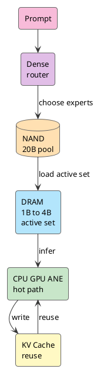

我没看 WWDC26 直播。

Siri 那段消息刷到我面前时，第一反应很直接：就这？这不是早就有了吗？

Siri 2011 年进 iPhone，刚出来时像未来。十几年过去，它更像一个语音快捷方式。简单指令还能用，稍微绕一点，就听错、答偏、转搜索。

后来翻 Apple 的开发者资料，问题开始变硬。

Siri 不再只是听一句话。它要看屏幕，要读个人上下文，要知道哪个 App 有什么能力，还要在执行前处理权限和确认。语音入口没变，后面多了一条执行路径。

问题一下就硬了：iPhone 凭什么先在本地理解屏幕、上下文和 App 动作？

<!-- more -->

每句话都上云，隐私、延迟、成本会炸。全靠本地模型，手机的 DRAM、功耗、散热又扛不住。demo 多顺没用，账算不平就落不了地。

我盯着一件事：

**iPhone 怎么跑得动一个足够有用的 LLM。**

## Siri 开始动手

过去的 Siri 更像语音指令分发器。

用户说一句话，系统匹配一个 domain，调用一个能力。定闹钟、查天气、打电话，fixed intent 能撑住。需求稍微绕一点，它就掉进缝里。

新 Siri 处理的是另一类任务。

比如一句话：

```text
把这张登机牌发给我老婆
```

聊天框可以回一段漂亮废话。系统不行。系统要知道屏幕上哪张图是登机牌，通讯录里谁是老婆，用哪个消息 App，附件怎么带，发出去前要不要确认。

会聊天太浅了。

问题已经变成 OS 级任务执行。

WWDC26 把四层能力接到了 Siri 后面：[Foundation Models framework](https://developer.apple.com/wwdc26/guides/apple-intelligence/)、[App Intents 和 App Schemas](https://developer.apple.com/videos/play/wwdc2026/240/)、Private Cloud Compute、[Core AI](https://developer.apple.com/videos/play/wwdc2026/324/)。

Foundation Models 决定模型从哪里来。本地 Apple Foundation Models、PCC、Claude、Gemini、第三方 provider，都可以放到同一套抽象后面。

App Intents 决定动作怎么落到 App。App 把 entity、action、schema、semantic index、onscreen context 交给系统，Siri 才能把自然语言落到具体执行上。

Core AI 决定模型怎么跑在硬件上。模型转换、AOT 编译、specialization、cache、profiling，一路落到 CPU、GPU、Neural Engine。

Foundation Models、App Intents、PCC、Core AI 接上以后，Siri 开始像一个系统级 router：哪些上下文留在本地，哪个 App 接手，什么时候上 PCC，什么时候换第三方模型。

WWDC26 的看点：Apple 要把任务路由权收回系统层。

## 内存账先挡路

端侧 LLM 第一堵墙叫 DRAM。算力还在后面。

NPU 多少 TOPS，GPU 多强，当然重要。但模型跑起来以后，权重、KV Cache、activation、runtime buffer、视觉特征、音频特征、前台 App、后台服务，全都抢同一块内存。

手机没有服务器那种余量。它不能为了一个模型把相机、键盘、通知、前台 App 全挤出去。

先看 20B 权重：

```text
20B FP16 ≈ 40GB
20B INT8 ≈ 20GB
20B INT4 ≈ 10GB
20B INT2 ≈ 5GB
```

还没算 KV Cache 和各种 buffer。哪怕压到 2-bit，5GB 权重常驻 DRAM，对 iPhone 也很贵。

服务器逻辑会误导“iPhone 跑 20B”这句话。20B 更像一个参数池。一次请求只把 1B 到 4B active set 放进热路径。换成 active set，账就变了：

```text
4B FP16 ≈ 8GB
4B INT8 ≈ 4GB
4B INT4 ≈ 2GB
4B INT2 ≈ 1GB

1B INT4 ≈ 0.5GB
1B INT2 ≈ 0.25GB
```

换成 active set，手机才扛得住。Apple 最新公开的 [AFM 3](https://machinelearning.apple.com/research/introducing-third-generation-of-apple-foundation-models) 里，on-device 家族有两条线：3B dense 的 AFM 3 Core，20B sparse 的 AFM 3 Core Advanced。后者是关键：20B 参数，每次请求只激活 1B 到 4B，完整权重放在 flash memory，也就是 NAND。

关键在后半句。

传统 dense LLM 要把权重放进 active memory。端侧设备最缺的恰恰是 active memory。AFM 3 Core Advanced 的核心动作，是把“完整模型能力”和“当前请求热路径”拆开。

NAND 放完整能力，DRAM 放当前任务。手机本地跑 LLM 的门，从内存分层打开。

## 20B 留在 NAND

服务器上的 MoE 可以每个 token 路由到不同 experts，因为 experts 通常已经在 HBM 或大显存里。iPhone 没有 HBM 余量。

NAND 容量大，但延迟高。DRAM 延迟低，但容量贵。NAND 到 DRAM 的带宽和延迟，撑不起每个 token 换一批 experts。按 token 换 experts，第一 token 还没出来，用户已经把手机锁屏了。

AFM 3 Core Advanced 的思路是把路由提前。

prompt 进来以后，轻量 dense block 先判断当前任务需要哪些 experts。router 选出 routed experts，从 NAND 拉进 DRAM。生成阶段尽量复用 active set，长任务里再周期性重选。

```text
prompt 进来
dense block 读任务
router 挑 experts
NAND 载入 routed experts
DRAM 组成 active set
CPU GPU ANE 跑推理
KV Cache 复用上下文
```

20B 没有整块进 iPhone。

系统从 20B 里临时拼一个当前任务够用的小模型。20B 是菜单，active set 上桌。

Apple 2025 年的 [Instruction-Following Pruning](https://machinelearning.apple.com/research/pruning-large-language) 已经给过技术前奏。IFP 训练一个 sparse mask predictor，根据 instruction 选择当前任务相关参数。论文里的 mask 作用在 FFN 矩阵的 rows 和 columns 上，LLM 和 mask predictor 一起训练，保证被选出来的参数还能保住 instruction-following 能力。

数据也很直白：9B 级模型按输入动态剪到 3B active 后，数学和代码等任务比 3B dense 高 5 到 8 个百分点，效果接近 9B dense，TTFT 接近 3B dense。

端侧设备需要大池子小路径。

大模型留在冷端，当前任务组一个足够强的小模型。能力靠大池子，延迟靠小路径。

## NAND DRAM 和 router

我脑子里的图很简单。

NAND 是仓库，DRAM 是工作台，router 是调度员。



仓库不能整车开上工作台。

router 的价值在于让 NAND 里的完整能力保持可用，又不能让 DRAM 被整块模型压死。

shared experts 也是同一笔账。全靠 routed experts，搬运太频繁；全靠 shared experts，又退回小 dense model。高比例 shared experts 加少量 routed experts，是在延迟、内存和能力之间做折中。

我以前看本地 LLM，核心问题像是模型压缩。现在看 AFM 3 Core Advanced，更准确的说法是内存分层。

端侧 LLM 不只是“模型小一点”。它要把权重、active set、KV Cache、runtime buffer 分别放到合适的位置。

## QAT 继续压热路径

sparse 先把 20B 剪成当前任务。QAT 再把当前任务压薄。

AFM 3 的完整技术报告还没发布，Apple 2026 的公开文章只说最新模型使用 Quantization Aware Training 做压缩。能看到细节的最新资料，是 2025 年 [Apple Intelligence Foundation Language Models Tech Report](https://machinelearning.apple.com/research/apple-foundation-models-tech-report-2025)。

上一代端侧模型已经用 QAT 压到 2 bits-per-weight，embedding table 到 4 bits，KV Cache 到 8 bits，并用 LoRA adapters 修复压缩损失。

2-bit 靠训练塑形，导出时随手一压做不出来。训练时要模拟量化误差，用 straight-through estimator 近似反传，为每个 tensor 学 scaling factor，用 clipping 控 outlier，再用 EMA 平滑权重轨迹，再用 LoRA 把质量拉回来。

放到 AFM 3 Core Advanced 上，链路很清楚：

```text
20B sparse pool
→ 1B 到 4B active set
→ QAT 低 bit
→ DRAM hot path
```

权重压下去以后，KV Cache 会冒出来。

Transformer 每生成一个 token，都会把过去 token 的 key/value 存起来。上下文越长，KV Cache 越大。用户看不见 KV Cache，但会感知第一 token 慢、手机发热、电池掉得快。

Apple 2025 技术报告里已经针对 KV Cache 动过结构。它把 on-device model 分成两个 block，后 37.5% 的 transformer layers 去掉 key/value projections，直接复用前面 block 的 KV Cache。结果是 KV Cache 内存少 37.5%，prefill 阶段 TTFT 也降约 37.5%。

手机跑 LLM，要细到这个粒度。

每一块内存、每一次搬运、每一个 token 的缓存，都要算。

## App Intents 接住动作

模型能在 iPhone 上跑，只解决理解问题。Siri 要做事，还要接 App。

我不相信 Apple 会让每个 App 自己接一个模型。那会把权限、上下文、成本、体验全部打散。更像 Apple 的做法，是让 App 把 schema 交给系统，系统管理解，App Intents 管执行，Foundation Models 管模型来源，Core AI 管落地运行，PCC 管复杂任务和隐私边界。

跑通以后，Siri 会从“问答入口”变成“任务入口”。

用户说一句话，系统先在本地看上下文。本地模型能解决，就直接调 App Intents 执行。需要更强推理，就上 PCC。需要第三方模型，就通过 Foundation Models provider 接出去。

模型进入了 OS 的调度路径。

本地、PCC、App、上下文、系统 UI，全都回到系统层决策。Apple Intelligence 要成为系统能力，必须走系统层。

苹果过去几年 AI 叙事很慢，Siri 的旧债也确实太重。但它擅长的正是系统账：模型、App、runtime、隐私、云端路由，放到一层调度里。

## 从 iPhone 回到 AI PC

iPhone 都能跑这套内存账，Mac 和 PC 就更没理由只盯着 TOPS。Mac 有更大的 DRAM、更宽松的散热和功耗空间，也在同一条 Apple Silicon 路线上。Core AI 同时落在 Mac 上。Apple 在 macOS 和 AI & Machine Learning guide 里已经把 Core AI 放成 built directly into the OS、purpose-built for Apple Silicon 的 on-device AI framework。开发者可以在 Mac 上下载、运行、benchmark Qwen、Mistral、SAM3，再接进 App。

AI PC 也不能只看一颗 NPU，至少要看四层：

```text
本地模型
内存分层
App action schema
本地和云端的路由
```

iPhone 证明最难的内存约束可以拆：20B 放 NAND，1B 到 4B 进 DRAM，QAT 压低 bit，KV Cache 单独优化。Mac 和 PC 把这套机制放大。

我现在看 AI PC，只看一件事：谁能在有限 DRAM、有限功耗、有限散热里留住更多有效 token，谁能把 token 变成系统动作，谁才算真的上桌。

WWDC26 至少把苹果的 AI 账本摊开了：自然语言入口、端侧模型、App 能力图谱、PCC、Core AI runtime、Apple Silicon，终于放到一起。

路不会快。App Intents 要开发者配合，PCC 要证明可用性，AFM 3 Core Advanced 的完整技术报告还没出来，Siri 从“听见”到“做完”中间还有坑。

但方向终于对了。

故事从 Siri 开始，不会停在 Siri。

## 参考资料

- [Introducing the Third Generation of Apple’s Foundation Models](https://machinelearning.apple.com/research/introducing-third-generation-of-apple-foundation-models)
- [WWDC26 Apple Intelligence guide](https://developer.apple.com/wwdc26/guides/apple-intelligence/)
- [Build intelligent Siri experiences with App Schemas](https://developer.apple.com/videos/play/wwdc2026/240/)
- [Meet Core AI](https://developer.apple.com/videos/play/wwdc2026/324/)
- [Integrate on-device AI models into your app using Core AI](https://developer.apple.com/videos/play/wwdc2026/326/)
- [Build with the new Apple Foundation Model on Private Cloud Compute](https://developer.apple.com/videos/play/wwdc2026/319/)
- [Apple Intelligence Foundation Language Models Tech Report 2025](https://machinelearning.apple.com/research/apple-foundation-models-tech-report-2025)
- [Instruction-Following Pruning for Large Language Models](https://machinelearning.apple.com/research/pruning-large-language)
