Siri 现在有点尴尬。2011 年进 iPhone 时，它像未来；十几年后，它更像语音快捷方式。复杂一点就听错、答偏、转搜索。

所以看到 WWDC26 又把 Siri 推回 Apple Intelligence 中心，我的第一反应就是：就这？这不是早就有了吗？

但继续看下去，事情有点不一样。Siri 不只听一句话，它要看屏幕、读个人上下文、调用 App、处理权限确认。它要动手。

那问题就变硬了：iPhone 凭什么在本地先理解？哪些任务留在设备上？哪些送 PCC？如果这笔账算不平，Siri 再聪明也只是 demo。

我只想看一个问题：**iPhone 怎么跑得动一个足够有用的 LLM。**

<!-- more -->

WWDC26 把 Foundation Models、App Intents、Private Cloud Compute、Core AI 接到 Siri 后面。名字都不新鲜，放在一起才有意思：Siri 开始变成系统里的 AI router。

过去的 Siri 像语音指令分发器。听懂一句话，匹配一个 domain，调一个能力。新的 Siri 要先在设备上理解上下文，再决定本地跑、App 执行、PCC 接手，还是第三方模型补位。

语音助手升级太小了。这里开始算系统账。

## Siri 后面接上完整栈

如果只是给 Siri 换个大模型，我不买账。让我停下来的，是这套栈突然完整了。

[Foundation Models framework](https://developer.apple.com/wwdc26/guides/apple-intelligence/) 让 App 调 Apple Intelligence 背后的 on-device model，也能接 PCC、Claude、Gemini 或其他 provider。[App Intents](https://developer.apple.com/videos/play/wwdc2026/240/) 把 App 的 entity、action、schema、semantic index 和 onscreen context 交给系统。[Core AI](https://developer.apple.com/videos/play/wwdc2026/324/) 往下管模型转换、AOT 编译、specialization、cache 和 profiling。

再看模型。Apple 最新公开的 [AFM 3](https://machinelearning.apple.com/research/introducing-third-generation-of-apple-foundation-models) 里，on-device 有两条线：3B dense 的 AFM 3 Core，20B sparse 的 AFM 3 Core Advanced。后者每次只激活 1B 到 4B 参数，完整权重放 NAND。

Siri 的位置就变了。它开始在系统里做选择：上下文从哪里拿，哪个 App 能做，本地模型跑到哪一步，什么时候上 PCC。

我拿最普通的一句话试：

```text
把这张登机牌发给我老婆
```

聊天框可以回一段废话。系统不行。系统要知道屏幕上哪张图是登机牌，通讯录里谁是老婆，用哪个消息 App，附件怎么带，发出去前要不要确认。

App Intents 卡在这里。LLM 负责把自然语言和上下文读懂，App Intents 把理解结果落到动作上。没有这层 schema，Siri 还是听懂了也做不了。

动作链越长，本地模型越重要。每次都把屏幕内容、通讯录、App 数据扔到云端，隐私、延迟、成本都过不去。iPhone 必须先在本地筛掉大部分事。

## 内存账先过关

端侧 LLM 的第一堵墙叫 DRAM。

NPU 再强，权重、KV Cache、activation、runtime buffer、视觉特征、音频特征、前台 App、后台服务，还是抢同一块内存。手机不能为了一个模型把相机、键盘、通知全挤出去。

20B 权重先算：

```text
20B FP16 ≈ 40GB
20B INT8 ≈ 20GB
20B INT4 ≈ 10GB
20B INT2 ≈ 5GB
```

这还没算 KV Cache。哪怕压到 2-bit，5GB 权重常驻 DRAM，对手机也太贵。

所以“iPhone 跑 20B”不能按整块 20B 理解。更准确的说法是：iPhone 上有一个 20B 参数池，单次请求只把 1B 到 4B active set 放进热路径。

换成 active set，账就松了：

```text
4B FP16 ≈ 8GB
4B INT8 ≈ 4GB
4B INT4 ≈ 2GB
4B INT2 ≈ 1GB

1B INT4 ≈ 0.5GB
1B INT2 ≈ 0.25GB
```

这才像手机能承受的范围。端侧 LLM 的门，是从 DRAM 账打开的。

## 20B 变成当前任务

服务器上的 MoE 模型可以每个 token 路由到不同 experts，因为 experts 通常已经在 HBM 或大显存里。iPhone 没这个条件。

NAND 管容量，DRAM 管热路径。NAND 到 DRAM 的带宽和延迟撑不起每个 token 换一批 experts。真这么干，第一 token 出来前用户已经走了。

AFM 3 Core Advanced 把路由提前。prompt 进来后，轻量 dense block 先判断这次任务要哪些 experts，把这批 routed experts 从 NAND 拉进 DRAM；生成阶段尽量复用，长任务再周期性重选。

```text
prompt 进来
router 挑 experts
NAND 载入 routed experts
DRAM 组成 active set
CPU GPU ANE 跑推理
KV cache 复用上下文
```

它把 20B 留在能力池里，临时拼一个当前任务够用的小 dense model。1B 到 4B 干活。

Apple 2025 年的 [Instruction-Following Pruning](https://machinelearning.apple.com/research/pruning-large-language) 已经露过这个方向：根据 instruction 动态选参数，把 9B 级模型剪到 3B active 后，数学和代码等任务比 3B dense 高 5 到 8 个百分点，效果接近 9B dense，TTFT 接近 3B dense。

手机要这种形态：大模型放冷端，小模型按任务组出来。

## NAND DRAM 和 routing

我脑子里的图很简单：NAND 是仓库，DRAM 是工作台，router 是调度员。

```plantuml
@startuml
!theme plain
top to bottom direction
skinparam backgroundColor white
skinparam defaultFontName Arial
skinparam defaultFontSize 13
skinparam nodesep 35
skinparam ranksep 32
skinparam ArrowColor #333333
skinparam rectangle {
    RoundCorner 8
    BorderColor #666666
    Padding 14
}
skinparam database {
    BorderColor #666666
}

rectangle "Prompt" as prompt #F8BBD9
rectangle "Dense\nrouter" as router #E1BEE7
database "NAND\n20B pool" as nand #FFE0B2
rectangle "DRAM\n1B to 4B" as dram #B3E5FC
rectangle "CPU GPU ANE" as compute #C8E6C9
rectangle "KV cache" as kv #FFF9C4

prompt --> router
router --> nand : choose
nand --> dram : load
dram --> compute : infer
compute --> kv : write
kv --> compute : reuse
@enduml
```



模型完整能力在 NAND，当前任务在 DRAM。router 的价值，就是别让仓库里的东西整车开上工作台。

shared experts 也在算这笔账。全靠 routed experts，搬运太多；全靠 shared experts，又退回小 dense model。高比例 shared experts 加少量 routed experts，是延迟、内存和能力之间的折中。

AI PC 也会走到这张账上。SSD 放模型仓库，DRAM 放 active set，NPU/GPU/CPU 负责热路径计算。PC 的内存和散热余量更大，可以容纳更长上下文、更大的 active set、更复杂的多模态输入。

## QAT 和 KV Cache

sparse 解决“别整块进 DRAM”。量化解决“进来的那块再薄一点”。

AFM 3 的完整技术报告还没发布，Apple 2026 的公开文章只说最新模型使用 Quantization Aware Training 做压缩。能看到细节的最新公开资料，是 2025 年 [Apple Intelligence Foundation Language Models Tech Report](https://machinelearning.apple.com/research/apple-foundation-models-tech-report-2025)。上一代端侧模型已经用 QAT 压到 2 bits-per-weight，embedding table 到 4 bits，KV Cache 到 8 bits，并用 LoRA adapters 修复压缩带来的质量损失。

2-bit 靠训练塑形，导出前随手压不出来。训练时要模拟量化误差，用 straight-through estimator 近似反传，为 tensor 学 scaling factor，用 clipping 控 outlier，再用 EMA 和 LoRA 把质量拉回来。

放到 AFM 3 Core Advanced 上，路线很清楚：sparse 先把 20B 剪成 1B 到 4B，QAT 再把 active set 压进手机 DRAM。

权重压下去以后，KV Cache 会冒出来。

Transformer 每生成一个 token，都会把过去 token 的 key/value 存起来。上下文越长，KV Cache 越大。Apple 2025 技术报告里已经把 on-device model 分成两个 block，后 37.5% 的 transformer layers 去掉 key/value projections，直接复用前面 block 的 KV Cache。结果是 KV Cache 内存少 37.5%，prefill 阶段 TTFT 也降约 37.5%。

用户不会感知 KV Cache，但会感知第一 token 慢、手机发热、电池掉得快。端侧 LLM 要好用，就得把这种小账算到很细。

## 路由权回到系统

模型能跑，只解决理解问题。Siri 要做事，还得接 App 和云端。

我不相信 Apple 会让每个 App 自己接模型。权限、上下文、成本、体验都会散。更像 Apple 的做法，是 App 交 schema，系统管理解，App Intents 管执行，Foundation Models 管模型来源，Core AI 管落地运行，PCC 管复杂任务和隐私边界。

我这次最在意的，是 Apple 想拿回任务路由权。

谁在本地跑，谁上 PCC，哪个 App 能执行，哪些上下文能读，哪些结果要回到系统 UI，这些东西不能散在 App 里。散了，Apple Intelligence 就只能是一组功能，成不了系统能力。

苹果擅长这种活。模型只是一层，主场在系统账：模型、App、runtime、隐私、云端路由，都归系统管。

## iPhone 打穿下限

iPhone 都能跑这套东西，Mac 自然更松。

Mac 有更大的 DRAM、更宽的散热和功耗空间，也在同一条 Apple Silicon 路线上。Core AI 同时落在 Mac 上。Apple 在 macOS 和 AI & Machine Learning guide 里已经把 Core AI 放成 built directly into the OS、purpose-built for Apple Silicon 的 on-device AI framework。开发者可以在 Mac 上下载、运行、benchmark Qwen、Mistral、SAM3，再接进 App。

所以 AI PC 不该只看 NPU 或 TOPS。至少四层要齐：

```text
本地模型
内存分层
App action schema
本地和云端的路由
```

iPhone 证明最难的内存约束可以拆：20B 放 NAND，1B 到 4B 进 DRAM，QAT 压 bit，KV Cache 单独优化。Mac 把同一套机制放大。

手机打穿工程下限，PC 拉高应用上限。iOS 到 macOS 是一条线。

## 苹果开始算系统账

苹果过去几年在 AI 上慢，这没什么好洗。ChatGPT 出来以后，它没有拿出一个让人闭嘴的 assistant。Siri 的旧债也太重，任何新 demo 都会被拿来对账。

但 WWDC26 至少把路线摊开了：自然语言入口、端侧模型、App 能力图谱、PCC、Core AI runtime、Apple Silicon，终于在同一个账本里。

这条路不会快。App Intents 要开发者配合，PCC 要证明可用性，AFM 3 Core Advanced 的完整报告还没出来，Siri 从“听见”到“做完”中间还有坑。

但判断 AI PC，可以从这里开始看。谁能在有限 DRAM、有限功耗、有限散热里留住更多 token，谁能把这些 token 变成系统动作，谁才算真的上桌。

这件事从 Siri 开始，不会停在 Siri。

## 参考资料

- [Introducing the Third Generation of Apple’s Foundation Models](https://machinelearning.apple.com/research/introducing-third-generation-of-apple-foundation-models)
- [WWDC26 Apple Intelligence guide](https://developer.apple.com/wwdc26/guides/apple-intelligence/)
- [Build intelligent Siri experiences with App Schemas](https://developer.apple.com/videos/play/wwdc2026/240/)
- [Meet Core AI](https://developer.apple.com/videos/play/wwdc2026/324/)
- [Integrate on-device AI models into your app using Core AI](https://developer.apple.com/videos/play/wwdc2026/326/)
- [Build with the new Apple Foundation Model on Private Cloud Compute](https://developer.apple.com/videos/play/wwdc2026/319/)
- [Apple Intelligence Foundation Language Models Tech Report 2025](https://machinelearning.apple.com/research/apple-foundation-models-tech-report-2025)
- [Instruction-Following Pruning for Large Language Models](https://machinelearning.apple.com/research/pruning-large-language)
