WWDC 看完，我对 Siri 没什么新期待。它欠的账太多，一场发布会还不完。

过去两年，苹果在 AI 上确实难看。ChatGPT 把聊天入口拿走，Claude 把 coding workflow 打穿，Google 把 Gemini 塞满搜索、邮箱和 Android。苹果手里有最贴近人的设备，却一直像个动作很慢的旁观者：发布会讲隐私，系统里补几个小功能，Siri 继续像旧时代留下来的客服机器人。

这次有意思的动作藏在系统层。苹果还是没喊 "AI PC"，也没有说自己的模型天下第一；它把模型、个人上下文、权限、App Intents、Private Cloud Compute 全部往 OS 里收。对苹果来说，这比追一个聊天框重要得多。

<!-- more -->

苹果还没赢，Siri 的旧账也没还完。它只是看懂了下一轮竞争的题目：个人 AI 的入口不会永远停在浏览器和聊天 App 里，它会回到设备、系统和默认工作流。

## 账单把 PC 推回牌桌

AI PC 最近又热了。微软推 Copilot+ PC，NVIDIA 推 RTX AI PC，Intel、AMD、Qualcomm 都在讲 NPU，大家嘴上说的都是 "the new era of PC"。

这句话本身没什么稀奇。科技公司最爱喊新时代。稀奇的是，大家突然一起想起了 PC 这个老东西。

PC 过去十几年不性感，但它一直在桌上。代码在上面写，文档在上面改，会议在上面开，企业系统在上面跑。只是最值钱的计算被云端拿走了，本地机器慢慢变成浏览器容器。

AI 把这件事反过来了。每一次 prompt、每一次上下文扩展、每一次工具调用、每一次 Agent 自己绕路，都是 token。云端 AI 好用，但它的账单太真实。

我在[上一篇](/2026/05/31/a-new-era-of-pc/)里说过，Agentic Coding 最先把这个矛盾打穿。它能读 repo、改代码、跑测试、解释错误、做 migration、清技术债，所以大家会天天用。问题也在这里：有用到进工作流的东西，才会进入日常；一旦进入日常，它就不再是 demo budget，而是基础设施成本。

人类工程师也探索，也走弯路。区别是，人类的探索成本被工资打包了，Agent 的探索成本会逐次出现在 token 账单里。

所以 AI PC 的起点很土：云端账单不好看。

## 苹果终于不追聊天框

苹果这次终于没有沿着 ChatGPT 的路硬追。它追也追不上。单论通用模型能力，苹果现在没有资格装第一梯队。

但苹果手里有另一张牌：设备默认入口。

iPhone 是随身入口，Mac 是生产力入口，iPad 是轻创作入口，Watch 贴着身体，AirPods 管语音，Vision Pro 管空间。过去这些设备只是在硬件和账号上互通，现在苹果想把它们变成围绕个人上下文运转的一组 AI 节点。

这就是 WWDC 值得看的地方。Foundation Models framework 给开发者系统级模型能力，App Intents 让 App 暴露动作，Personal Context 把邮件、日历、文件、屏幕内容这些碎片纳入系统理解，Private Cloud Compute 负责兜住本地跑不动的任务。

App 不需要自己塞一个 LLM。它发起请求，系统看权限、挑上下文、决定本地还是上云，再把结果交回去。模型、上下文、权限和 fallback 都被收回到 OS。

苹果过去的 AI 像功能补丁。这次终于像平台能力。

## TOPS 只能骗第一眼

AI PC 的营销最喜欢讲 TOPS。40+ TOPS NPU，16GB 内存，256GB 存储，听起来像一条清楚的门槛。

门槛当然有用，但它只能骗第一眼。真把 AI 放进工作流，问题马上变细：本地能跑多大的模型，上下文能放多长，KV Cache 怎么处理，内存带宽够不够，功耗和散热压不压得住，开发者 API 好不好用，OS 能不能统一调度，云端 fallback 怎么接。

没有系统级软件栈，NPU 再强也只是一个卖点。AI PC 往下走，拼的是一整条栈：芯片、内存、存储、模型、runtime、OS、开发者框架、应用生态、隐私权限和云端兜底。

这也是苹果现在突然有看头的原因。Apple Silicon、统一内存、Neural Engine、GPU、CPU、Foundation Models、App Intents、PCC，这些东西单看都不惊天动地，合在一起就变成一个很苹果的答案。

短期卖规格，长期卖默认路径。硬件只负责让你上桌，路由权才决定谁收钱。

## iPhone 先卡在 DRAM 账

讲端侧 LLM，最容易被一句话带偏：模型量化了，所以能跑。

这句话只说了半截。模型文件大小是静态账，运行时 DRAM 才是现金流。LLM 跑起来主要吃四块内存：模型权重、KV Cache、激活值和 runtime buffer，再加上 embedding、tokenizer、adapter 这些零碎开销。

传统 dense 20B 模型，FP16 权重就是 40GB，INT4 也还有 10GB。这个账放到手机上，没法看。

苹果的思路更像换账本。先别硬塞 20B dense，改成 sparse 总容量，推理时只激活一部分专家：

```text
20B 是 sparse 总容量
每次推理只激活 1B 到 4B 参数
完整权重躺在 NAND 里
当前任务需要的专家加载进 DRAM
活跃权重再用低 bit 量化压一道
```

内存账一下子变了：

```text
4B FP16 ≈ 8GB
4B INT8 ≈ 4GB
4B INT4 ≈ 2GB
4B INT2 ≈ 1GB

1B INT4 ≈ 0.5GB
1B INT2 ≈ 0.25GB
```

几十 GB 的问题，掉到几百 MB 到几 GB。苹果这次压的重点，从名义参数转向 **DRAM footprint**。

这件事不只属于 iPhone。MacBook、Windows AI PC、RTX workstation 都会卡在同一组问题上：权重放哪，KV Cache 怎么控，上下文怎么选，带宽够不够，功耗压不压得住。

AI PC 继续往深处走，拼的是这张内存账，不拼发布会嗓门。

## NAND 放权重 DRAM 跑现场

这里还有一个常见误解：既然权重在 NAND，模型是不是一边从 NAND 读一边生成 token？

不是。

NAND 的带宽和延迟扛不住 token-by-token 推理。生成 token 的热路径必须在 DRAM 里，由 Neural Engine、GPU、CPU 协同执行。更准确地说，NAND 管完整模型仓库，DRAM 管当前任务工作台，NPU/GPU/CPU 管执行，OS 管调度和路由。

```plantuml
@startuml
!theme plain
left to right direction
skinparam backgroundColor white
skinparam defaultFontName Arial
skinparam defaultFontSize 13
skinparam ArrowColor #333333
skinparam rectangle {
    RoundCorner 10
    BorderColor #666666
    Padding 18
}

rectangle "OS" as os #F8BBD9
rectangle "NPU / GPU / CPU" as exec #C8E6C9
rectangle "DRAM" as dram #B3E5FC
rectangle "NAND" as nand #FFE0B2

os --> exec
exec --> dram
dram --> nand
nand --> dram
@enduml
```



换专家也不是免费的。手机和轻薄本更适合 prompt-level routing：先判断这个 prompt 需要什么能力，把对应 experts 加载进 DRAM，整段生成期间尽量复用。服务器可以靠 HBM 和大显存硬扛 token-level MoE，个人设备不行。

端侧 AI 没多少玄学。减少活跃工作集，提高缓存复用，压住内存抖动和功耗。苹果只是先把这套账摊开了，其他人迟早也要算。

## 本地先拦低价值请求

本地模型不会替代云端模型。Claude、GPT、Gemini 这种 frontier model 还会继续变强，复杂 reasoning、长上下文、大型代码生成、多步 Agent、深度研究、大型多模态生成，短期还是得靠云端。

变化发生在另一边：大量高频、低中复杂度任务不该每次都上云。短文本摘要、改写、翻译、OCR 后结构化、语音转写、本地搜索、通知排序、屏幕内容理解、轻量补全，这些任务如果每次都调用最贵模型，就是拿头等舱送外卖。

未来更像两层系统。本地模型先接一遍，便宜任务直接吃掉，敏感上下文尽量留在设备上；本地判断搞不定，再把任务路由到云端。

Private Cloud Compute 卡在中间。小任务本地解决，重任务上云，隐私数据尽量不出设备，必要时让用户确认。它给云端前面加一道闸门，不负责把云端赶走。

AI 越深入个人场景，设备越重要。个人 AI 要知道我是谁、我刚做过什么、我现在在看什么，还要低延迟、常驻、守住隐私。这些东西天然偏本地。

云端不会退场，但它也不会再独占 AI。

## 默认入口开始派单

把镜头拉远，微软、NVIDIA、苹果嘴上讲的是不同产品，手伸向的是同一个地方。

微软推 Copilot+ PC，是不想让 AI 工作流入口被浏览器和 ChatGPT 拿走。NVIDIA 进个人市场，是不想只卖数据中心 GPU。苹果把 Foundation Models、Siri、App Intents、PCC 塞进系统，是不想让个人 AI 入口被第三方聊天机器人截胡。

谁拿到默认入口，谁就拿到派单权：这个任务本地跑还是云端跑，用哪个模型，调哪个 App，拿哪些上下文，用户最后看到哪个结果。

这比模型排行榜更值钱。

苹果的位置很特殊。它单个模型不强，但同时握着 Apple Silicon、统一内存、端侧模型、系统权限、个人上下文、App Intents、跨设备生态和 PCC。这套组合天然适合端侧 AI，尤其是 Mac。

如果 iPhone 是个人 AI 的随身入口，Mac 就是本地 AI 的生产力入口。到那时，内存不再只是“开几个 Chrome tab”的事，而是模型权重、KV Cache、本地上下文、多模态 buffer 和 Agent 工作区的空间。

8GB 在过去还能糊弄普通用户。AI PC 时代，它会越来越尴尬。统一内存的价值，会被重新定价。

## 投资先看卡点

看投资，不要看到 "AI PC" 三个字就上头。终端品牌当然重要，但卡点更上游：内存容量、内存带宽、NPU/GPU 推理能力、统一内存架构、先进封装、电源管理、散热、本地模型 runtime、OS 级 AI API 和开发者生态。

这条链会同时牵动 Apple、Microsoft、NVIDIA、Qualcomm、AMD、Intel、ARM、存储和内存供应链、PC OEM、软件开发工具链。热闹归热闹，不代表所有 AI PC 概念都会赢。

几个问号还悬着：消费者愿不愿意为本地 AI 付费，本地 AI 功能是否足够刚需，企业是否愿意更新设备，NPU 是否真的成为必须，GPU 本地推理会不会绕过 NPU，开发者是否会大规模适配。

微软一开始强调 Copilot+ PC 的 NPU 门槛，后面 Windows 本地模型能力又开始向 GPU 设备扩展。市场还没把答案写死。AI PC 的核心可能是 NPU，可能是 GPU，可能是统一内存，也可能是 OS 调度层。

我的判断很简单：短期硬件规格会拉动换机，长期利润会流向 OS、runtime 和 developer ecosystem。能把本地、私有、云端模型做成可治理成本路由系统的公司，比单纯卖概念的公司更值得看。

## 苹果重新上桌

AI PC 这个词很容易把人带偏，让人以为 PC 行业要回到过去那个增长黄金年代。回不去了。

旧 PC 靠浏览器、Office、本地文件、键鼠和 CPU 性能支撑价值。新 PC 靠本地模型、个人上下文、低延迟推理、多模态输入、Agent workflow、云端协同和隐私边界。重新被定价的，是个人计算设备那点不可替代的本地能力。

过去十年，文档、照片、软件、模型都被云端拿走了。AI 给了一股反向的力：数据太私密，延迟不能太高，token 太贵，云端成本太重，个人上下文太分散，于是计算被重新拉回设备侧。

这就是 WWDC 值得看的地方。苹果没有把自己包装成 AI PC 公司，却把 AI 从云端应用做成了设备和操作系统的默认能力。

苹果掉队 AI 多年，这句话没错。它还没在模型能力上追回 OpenAI、Anthropic 和 Google，也没把 Siri 的旧账一次还清。但它终于重新站到了自己最擅长的位置：设备、系统、默认入口、个人上下文。

这条路不性感，但很苹果。

AI PC 的尽头，不是每个人桌上都有一台小 AGI。更直白一点：**它的尽头，是少交 token 税。**

谁先把本地推理、个人上下文和模型路由做成默认，谁就拿走下一个十年的入口。
