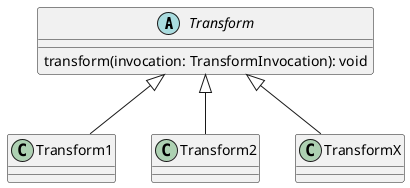
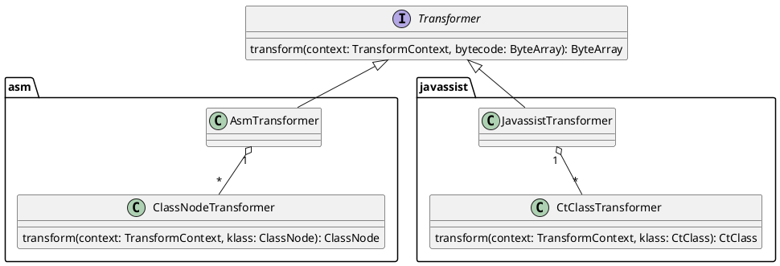

I wasn't planning to write this post -- the project isn't that complex, and there are plenty of articles analyzing Booster online. But most of them only give a surface-level overview of the project structure. Since people keep asking, here's a proper deep dive. If I had to list the architectural highlights of Booster, they'd be roughly:

- SPI-based feature modularization and pluggability
- Custom Transformers for extensibility
- Support for injecting complex libraries

Beyond that, there are some clever tricks -- like class instrumentation to fool the compiler. The early pre-open-source version of Booster (it wasn't even called Booster back then) wasn't designed this way. Issues discovered during usage led to a full rewrite in Kotlin before open-sourcing.

Booster was originally written in Java 8. Other than lambda's unfriendly Exception handling (which led to a separate lambda-support library), Java 8 itself wasn't a problem. The rewrite to Kotlin was purely to learn the language more deeply. After a year of refinement, Booster's architecture settled into its current form:

## Service Provider Interface

To understand Booster, you need to start with [SPI (Service Provider Interface)](https://docs.oracle.com/javase/tutorial/ext/basics/spi.html). SPI is a built-in JDK API that automatically loads interface implementations at runtime, making it perfect for building extensible programs. The JDK itself uses SPI extensively. The principle is straightforward: inside a JAR's *META-INF/services/* directory, there are files named after interface classes, with the file contents being the implementation classes. So when SPI loads implementations, it calls `ClassLoader`'s `getResourcesXxx(String)` methods. Since manually configuring SPI is tedious, Google open-sourced *autoservice*, an APT (Annotation Processing Tool) that automatically generates configuration files into the *META-INF/services/* directory at compile time.

In Booster, two types of SPI provide extensibility:

- [Task SPI](https://github.com/didi/booster/blob/master/booster-task-spi)
- [Transform SPI](https://github.com/didi/booster/blob/master/booster-transform-spi)

## Transformer

The early version didn't have the [Transformer](https://github.com/didi/booster/blob/master/booster-transform-spi/src/main/kotlin/com/didiglobal/booster/transform/Transformer.kt) interface. Instead, it directly used the [Transform API](http://tools.android.com/tech-docs/new-build-system/transform-api)'s [Transform](http://google.github.io/android-gradle-dsl/javadoc/current/com/android/build/api/transform/Transform.html) as each module's entry point:

The problem with this design was that every [Transform](http://google.github.io/android-gradle-dsl/javadoc/current/com/android/build/api/transform/Transform.html) needed to read and write all classes and JARs once each, making I/O operations twice the number of Transforms. This seriously impacted build speed.

To solve the transform performance problem, the approach became: read JARs only once before the Transform, and write JARs only once after -- performing all Transform operations in memory. This led to the following design:

Javassist support came later, mainly because of its large user base.

## Transform Context

Using [TransformInvocation](http://google.github.io/android-gradle-dsl/javadoc/current/com/android/build/api/transform/TransformInvocation.html) directly instead of [Transform Context](https://github.com/didi/booster/blob/master/booster-transform-spi/src/main/kotlin/com/didiglobal/booster/transform/TransformContext.kt) would have been possible. The reason for defining a separate interface was primarily to facilitate unit testing of [Transformer](https://github.com/didi/booster/blob/master/booster-transform-spi/src/main/kotlin/com/didiglobal/booster/transform/Transformer.kt).

Think about it -- without [TransformContext](https://github.com/didi/booster/blob/master/booster-transform-spi/src/main/kotlin/com/didiglobal/booster/transform/Transformer.kt), unit tests would require constructing a [TransformInvocation](http://google.github.io/android-gradle-dsl/javadoc/current/com/android/build/api/transform/TransformInvocation.html) object manually, adding unnecessary complexity to testing.

## Variant Processor

You might wonder why [VariantProcessor](https://github.com/didi/booster/blob/master/booster-task-spi/src/main/kotlin/com/didiglobal/booster/task/spi/VariantProcessor.kt) is needed when [Transformer](https://github.com/didi/booster/blob/master/booster-transform-spi/src/main/kotlin/com/didiglobal/booster/transform/Transformer.kt) already exists.

For simple bytecode processing, Transformer is more than enough. So when would you use [VariantProcessor](https://github.com/didi/booster/blob/master/booster-task-spi/src/main/kotlin/com/didiglobal/booster/task/spi/VariantProcessor.kt)? When bytecode processing depends on AndroidManifest.xml, Resources, Assets, or when you need to inject classes/libraries.

The early version injected libraries by pre-compiling classes to be injected into .class files, then copying them to the transform output path during transform. This works fine for injecting small amounts of code (a single class), but falls short when injecting entire libraries -- especially when the injected library has its own dependencies. (In practice, this is a very common need, such as replacing SharedPreferences with a custom implementation.) To solve complex injection scenarios, [VariantProcessor](https://github.com/didi/booster/blob/master/booster-task-spi/src/main/kotlin/com/didiglobal/booster/task/spi/VariantProcessor.kt) was created. This delegates dependency management to Gradle -- the most reliable approach, avoiding common build-time problems like duplicate classes and missing classes.

## Compatibility

Anyone who has upgraded AGP (Android Gradle Plugin) knows the pain: after upgrading, plugins that worked perfectly before suddenly break. Some plugins use non-public APIs that get removed or changed in newer versions. To address version compatibility, Booster wraps commonly used APIs and isolates version differences, giving Booster's plugins better compatibility.

## Summary

Booster's architecture wasn't designed this way from the start. It evolved over many versions, with me using it to develop plugins and continuously refining the developer experience through each iteration. It's hard to design something perfectly from day one because requirements keep changing. So there's no need to aim for a perfect design upfront. I recommend a classic essay on this topic: [Worse is Better](http://dreamsongs.com/WorseIsBetter.html).
