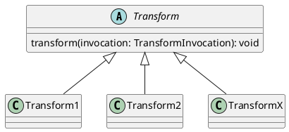
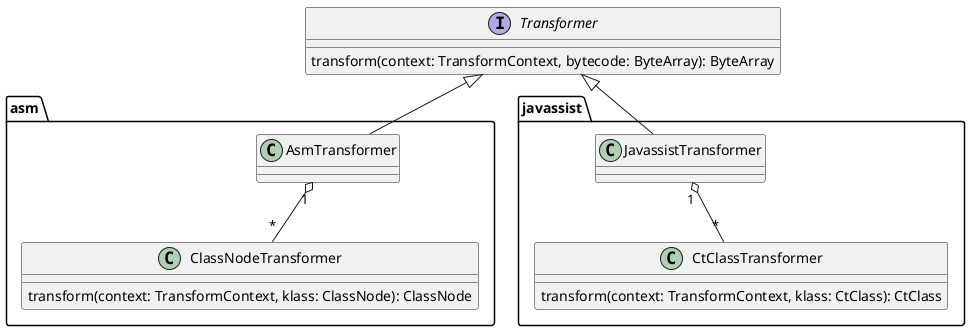

本来没打算写这篇文章，毕竟项目工程规模并不复杂，网上也有很多分析 *Booster* 的文章，但大多都只是对工程的结构介绍一下，加上总有同学问起，索性详细的介绍一下。如果说 Booster 框架在设计上有什么亮点的话，大致罗列一下：

- 利用 SPI 实现 Feature 模块化 & 插件化
- 自定义 Transfomer 实现可扩展性
- 支持注入复杂的类库

除此之外，就是一些奇技淫巧了，例如：对 class 插桩欺骗编译器等等。早期未开源的 Booster 版本（那时候还不叫 Booster）并不是这样设计的，只是后来，在使用的过程中，发现了一些问题，所以，开源之前，用 Kotlin 重写了一遍。

Booster 最开始是用 *Java 8* 写的，*Java 8* 除了 *Lambda* 处理 *Exception* 不是很友好（因此单独撸了一个 *lambda-support* 库用于简化 *Exception* 处理），语言本身并没有什么大问题，用 Kotlin 重写纯粹是为了更深入的学习这门语言，经过了一年多的沉淀，最终 Booster 的架构就成了现在的样子：

## Service Provider Interface

要了解 Booster，还得先从 [SPI (Service Provider Interface)](https://docs.oracle.com/javase/tutorial/ext/basics/spi.html) 说起，[SPI (Service Provider Interface)](https://docs.oracle.com/javase/tutorial/ext/basics/spi.html) 是 JDK 内置的 API，在运行时自动加载接口对应的实现，所以用它来开发可扩展的程序是再合适不过的了，像 JDK 本身也有很多地方用了 SPI，至于 SPI 的原理，说白了，就是从 JAR 包中的 *META-INF/services/* 目录下，有一系列以接口类名命名的文件，文件的内容则是该接口的实现类，所以，在 SPI 加载接口实现时，会调用 `ClassLoader` 中 `getResourcesXxx(String)` 相关的方法，由于手动配置 SPI 比较麻烦，所以 Google 开源了 *autoservice* APT (Annotation Processing Tool) 工具，在编译期间自动生成配置文件到 *META-INF/services/* 目录中。

在 Booster 中，有两类 SPI 对外提供可扩展的能力：

- [Task SPI](https://github.com/didi/booster/blob/master/booster-task-spi)
- [Transform SPI](https://github.com/didi/booster/blob/master/booster-transform-spi)

## Transformer

早期的版本并没有设计 [Transformer](https://github.com/didi/booster/blob/master/booster-transform-spi/src/main/kotlin/com/didiglobal/booster/transform/Transformer.kt) 这个接口，而是直接使用了 [Transform API](http://tools.android.com/tech-docs/new-build-system/transform-api) 的 [Transform](http://google.github.io/android-gradle-dsl/javadoc/current/com/android/build/api/transform/Transform.html) 作为每个模块的入口：

这样设计带来的问题是——每个 [Transform](http://google.github.io/android-gradle-dsl/javadoc/current/com/android/build/api/transform/Transform.html) 都要对所有的 *classes* 和 *JAR* 进行一次读和一次写操作，那 I/O 操作的次数等于 [Transform](http://google.github.io/android-gradle-dsl/javadoc/current/com/android/build/api/transform/Transform.html) 个数的2倍，这样会严重影响构建的速度。

为了解决 *transform* 的性能问题，于是只在 *Transform* 前读 *JAR* ，在 *Transform* 结束后写 *JAR* ，这样，将所有的 *Transform* 操作在内存中完成，于是，便用了下面的设计：

支持 *Javassist* 是后来的事儿了，主要是考虑到 *Javassist* 的使用者众多的缘故。

## Transform Context

其实，直接使用 [TransformInvocation](http://google.github.io/android-gradle-dsl/javadoc/current/com/android/build/api/transform/TransformInvocation.html) 来代替 [Transform Context](https://github.com/didi/booster/blob/master/booster-transform-spi/src/main/kotlin/com/didiglobal/booster/transform/TransformContext.kt) 也是可以的，之所以要单独定义接口主要是为了方便对 [Transformer](https://github.com/didi/booster/blob/master/booster-transform-spi/src/main/kotlin/com/didiglobal/booster/transform/Transformer.kt) 进行单元测试。

试想一下，如果没有 [TransformContext](https://github.com/didi/booster/blob/master/booster-transform-spi/src/main/kotlin/com/didiglobal/booster/transform/Transformer.kt)，就意味着在单元测试的时候，需要自己构造 [TransformInvocation](http://google.github.io/android-gradle-dsl/javadoc/current/com/android/build/api/transform/TransformInvocation.html) 对象，无疑是增加了测试的复杂度。

## Variant Processor

可能有人不太理解，为什么需要 [VariantProcessor](https://github.com/didi/booster/blob/master/booster-task-spi/src/main/kotlin/com/didiglobal/booster/task/spi/VariantProcessor.kt)，有 [Transformer](https://github.com/didi/booster/blob/master/booster-transform-spi/src/main/kotlin/com/didiglobal/booster/transform/Transformer.kt) 不就够了么？

如果只是简单的处理字节码，[Transformer](https://github.com/didi/booster/blob/master/booster-transform-spi/src/main/kotlin/com/didiglobal/booster/transform/Transformer.kt) 绰绰有余，那什么情况下会用到 [VariantProcessor](https://github.com/didi/booster/blob/master/booster-task-spi/src/main/kotlin/com/didiglobal/booster/task/spi/VariantProcessor.kt) 呢？——处理字节码依赖 *AndroidManifest.xml*, *Resources*, *Assets* 或者需要注入类/库

早期的版本注入类库是将待注入的类事先编译成 *class* ，在 *transform* 的时候，拷贝到 *transform* 的输出路径下，这种方式对于注入少量代码（单个类）问题不大，如果要注入整个库，或者被注入的库还依赖其它的库，这样就满足不了需求了（事实证明这种需求是很常见的，如：将 *SharedPreferences* 替换成自定义的实现），为了解决复杂的注入问题，所以才有了 [VariantProcessor](https://github.com/didi/booster/blob/master/booster-task-spi/src/main/kotlin/com/didiglobal/booster/task/spi/VariantProcessor.kt)。这样，把依赖管理的工作交给了 *Gradle* 而且，这也是最靠谱的办法，避免了很多构建时经常遇到的问题，比如：存在重复的类、类缺失等等。

## 兼容性

升级过 AGP (Android Gradle Plugin) 的同学应该深有体会，每升一个版本，原来跑得好好的插件在升完级就不 work 了，可能有些插件用了一些非公开的 API，在高版本中被删除了或者变更了，所以，为了解决 Android Gradle Plugin 的版本兼容性问题，Booster 对常用的一些 API 进行了封装，对版本进行了隔离，这样使得 Booster 的插件有更好的兼容性。

## 总结

总的来说，Booster 的架构并不是一开始就是设计成这样，也是经过了很多的版本，自己用它来开发插件，开发体验就是在每个版本迭代中不停的完善的，很难从一开始就设计得完美，因为需求是在不停的变化的，所以，没必要从一开始就要设计一个完美的方案，有一篇经典的文章 [Worse is Better](http://dreamsongs.com/WorseIsBetter.html) 推荐给大家。
