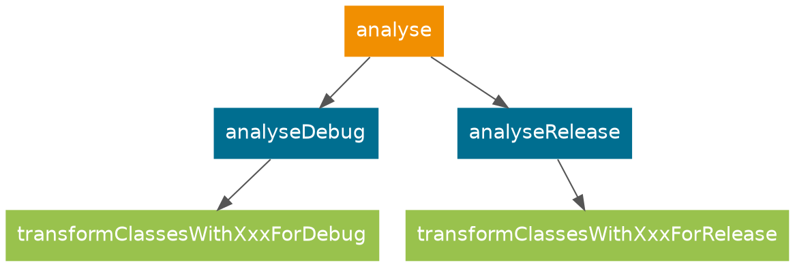
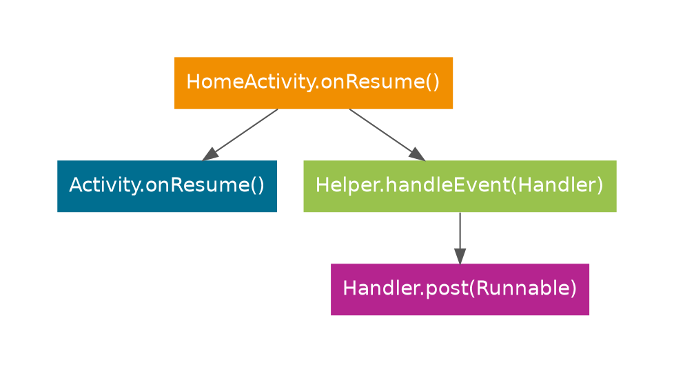
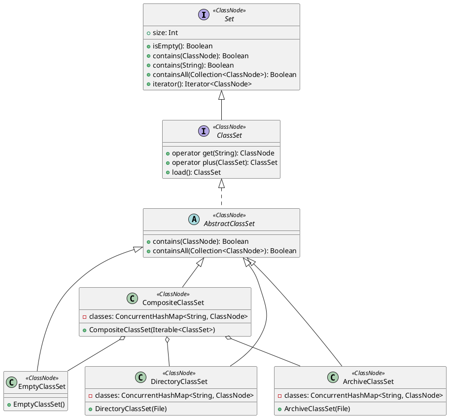
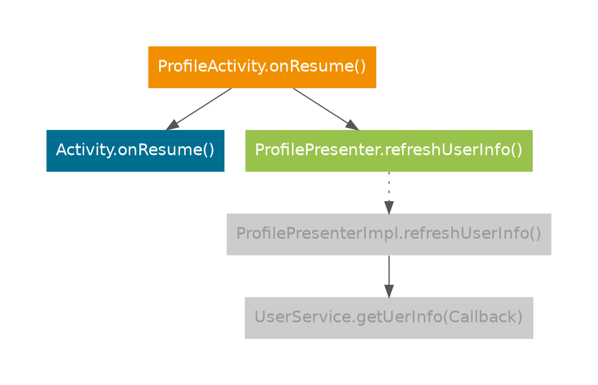

I've been spending a lot of time lately optimizing [booster-task-analyser](https://github.com/didi/booster/tree/master/booster-task-analyser) -- both refining features and improving performance. Previously, static analysis was handled by [booster-transform-lint](https://github.com/didi/booster/tree/v1.4.0/booster-transform-lint). Although that module was open-sourced early on, I was never satisfied with the analysis results. Factoring in other concerns, I decided to rewrite it from scratch -- hence [booster-task-analyser](https://github.com/didi/booster/tree/master/booster-task-analyser), designed to replace [booster-transform-lint](https://github.com/didi/booster/tree/v1.4.0/booster-transform-lint).

The redesign was driven by several considerations:

1. Static analysis isn't run as frequently as builds, so a *Task* is a better fit than a *Transformer*;
1. CHA (Class Hierarchy Analysis) requires all class information upfront, while a *Transformer* processes classes in a pipeline -- not ideal;
1. Static analysis can be slow; as a *Transformer*, it would severely impact build performance, and the build doesn't depend on analysis output anyway;

So [booster-task-analyser](https://github.com/didi/booster/tree/master/booster-task-analyser) is built as a *Task*:



## Classpath

Before performing static analysis, we need all the classes to analyze. These come from two sources:

- *System classes*

  The APIs provided by the *Android SDK* -- specifically, *${ANDROID_HOME}/platforms/android-xx/android.jar*. During the build, these can be obtained via `BaseExtension.getBootClasspath()`.

- *APP classes*

  App classes are trickier. There are two approaches:

  1. Analyze project dependencies to discover them;
  1. Obtain them through *Transform*;

  The current implementation uses option 2 -- relying on *Transform* -- mainly because it's easier to implement. Taking a shortcut here :P

> I expected loading all classes (parsing *class* files into *ASM* `ClassNode` objects) to be time-consuming, but nearly 100,000 classes loaded in about *15 seconds*. Machine specs:
> - Processor: 2.5GHz Intel Core i7
> - Memory: 16GB 2400 MHz DDR4
> - Storage: SSD

## Entry Point

Every static analysis needs entry points. For a regular program, it's typically the `main` method. For Android apps, the entry points are `Application`, the four major components, XML layouts, and so on. The first task is finding them all.

### The Four Major Components

`Application` and the four major components are declared in *AndroidManifest.xml*. The merged manifest can be obtained via [mergedManifests](https://github.com/didi/booster/blob/master/booster-android-gradle-api/src/main/kotlin/com/didiglobal/booster/gradle/VariantScope.kt#L142).

### Custom Views

The most direct way to find custom *Views* is to parse *Layout XML* files. These can be obtained through [mergeRes](https://github.com/didi/booster/blob/master/booster-android-gradle-api/src/main/kotlin/com/didiglobal/booster/gradle/VariantScope.kt#L148), though they come as *AAPT2* artifacts -- *flat* files. This is why the [booster-aapt2](https://github.com/didi/booster/tree/master/booster-aapt2) module exists.

> Through testing, I found that parsing *flat* files is actually slower than parsing raw XML source files. So the final implementation only parses the *flat* file *header* to locate the source file path.

### Thread-Annotated Methods and Classes

Android provides [Thread Annotations](https://developer.android.com/studio/write/annotations#thread-annotations) to help compilers and static analysis tools improve code checking accuracy. Any class or method annotated with [Thread Annotations](https://developer.android.com/studio/write/annotations#thread-annotations) can be treated as a thread entry point.

Since popular application frameworks also have thread annotations, *Analyser* supports *Event Bus* as well -- methods annotated with `@Subscribe(threadMode = MAIN)` are identified as main thread entry methods.

### Reflection

In Android apps, reflection is sometimes used to break reference chains between `Application` and other classes -- for hot-fix support or to keep the *Main Dex* from growing too large. See: [Working as an Architect at DiDi (Part 1)](/2020/01/01/working-as-an-architect-at-didi-1/). How do we connect reflective calls to their actual target methods? Stack frame analysis. That's a topic for another day.

### Main Looper

In Android, the main thread's `Looper` and `Handler` also qualify as *Entry Points*. Determining whether a *Handler* or *Looper* runs on the main thread is genuinely challenging. For example:

```java
public class HomeActivity extends Activit {

    private Handler mHandler = new Handler();

    public void onResume() {
        super.onResume();
        Helper.handleEvent(this.mHandler);
    }

}

public class Helper {

    public static void handleEvent(Handler handler) {
        // ...
        handler.post(() -> {
            // update UI
        })
    }

}
```
The *Call Graph* looks like this:



In this example, `Helper.handleEvent(Handler)` calls a `Handler`, but that `Handler` comes from another method. To trace the `handler` parameter back to its origin, we need to analyze the *Call Graph* in reverse:

1. Find the calling node(s) above the current one;
1. Locate the *INVOKE* instruction corresponding to that node;
1. Walk back from the instruction's stack frame to determine the source of *handler*;
1. *handler* comes from a `GETFIELD` instruction -- it's a member of `HomeActivity`;
1. Search all methods for *SETFIELD* instructions that assign to *handler*, ultimately determining it was initialized in the constructor;

This shows how critical the *Call Graph* is for static analysis. This example is relatively simple; if the `Handler` is passed as a parameter through multiple methods, the algorithmic complexity increases significantly.

## ClassSet

*ClassSet* serves several purposes:

1. Fast lookup of `ClassNode` by class name;
1. Fast lookup of which *classpath* (directory/JAR) a class belongs to;

For performance and reusability, *ClassSet* is designed as follows:



Why does `CompositeClassSet` exist? Because when *Analyser* analyzes an application, it needs access to these *ClassSets*:

1. A *ClassSet* containing only *System classes*

  For quickly finding `Application` and the four major components.

1. A *ClassSet* containing only *App classes*

  For building the application's *Call Graph*.

1. A *ClassSet* containing all *classes* -- the union of *System classes* and *App classes*

  For Class Hierarchy Analysis (CHA).

To ensure lookup efficiency, all *ClassSet* implementations use caching.


## Class Hierarchy Analysis

Class hierarchy analysis is critical for static analysis -- it determines both the accuracy and completeness of results. Previously, *CHA* was implemented using *ClassLoader*, which was relatively straightforward. See: [KlassPool](https://github.com/didi/booster/blob/master/booster-transform-spi/src/main/kotlin/com/didiglobal/booster/transform/KlassPool.kt) & [Klass](https://github.com/didi/booster/blob/master/booster-transform-spi/src/main/kotlin/com/didiglobal/booster/transform/Klass.kt). The main goal was determining whether two types have an inheritance relationship. Why abandon the old approach and redesign *CHA*? Several reasons:

1. When *ClassLoader* loads a *Class*, it verifies the *bytecode* even without initialization, potentially throwing *VerifyError* and failing the entire analysis;
1. Performance -- *ClassLoader*'s class loading performance is far worse than *ASM*;
1. Beyond inheritance, we also need to analyze fields, methods, and annotations -- the information available through *Class* reflection is limited;

There's another crucial requirement during class hierarchy analysis -- polymorphism detection. For example:

```java
public interface ProfileView {
    void updateUserInfo(UserInfo userInfo);
}

public interface ProfilePresenter {
    void refreshUserInfo();
}

public class ProfilePresenterImpl implements ProfilePresenter {

    private ProfileView mView;

    private UserService mService;

    public ProfilePresenterImpl(ProfileView view) {
        this.mView = view;
    }

    public void refreshUserInfo() {
        this.mService.getUserInfo(userInfo -> {
            mView.updateUserInfo(userInfo);
        });
    }

}

public class ProfileActivity extends Activity, ProfileView {

    private ProfilePresenter mPresenter;

    public void onCreate(Bundle bundle) {
        super.onCreate(bundle);
        this.mPresenter = new ProfilePresenterImpl(this);
    }

    public void onResume() {
        super.onResume();
        this.mPresenter.refreshUserInfo();
    }

    public void updateUserInfo(UserInfo userInfo) {
        // ...
    }

}
```

If we represent `ProfileActivity.onResume()` as a *Call Graph*:



Here's the problem: in the *Call Graph* above, `ProfileActivity.onResume()` cannot reach `ProfilePresenterImpl.updateUserInfo()`, because the reference type calling `updateUserInfo()` in `ProfileActivity` is `ProfilePresenter`, not `ProfilePresenterImpl`. Each node in the *Call Graph* needs an attribute indicating whether it's a *virtual method*. If it is, the virtual method must be linked to all override methods in derived classes. This gives rise to several requirements:

1. Fast lookup of derived classes by class name;
1. Fast lookup of subclasses that override a specific method, given a class name and method name;

## Summary

As the examples above illustrate, static analysis involves quite complex data structures and algorithms, including:

1. Link List
1. Map
1. Set
1. Digraph
1. Binary Tree
1. ......

At sufficient scale, performance becomes a major challenge -- a single line of code can make a dramatic difference.

When the first version of *Analyser* was completed, analyzing 100,000 classes took over half an hour. After continuous optimization, it now consistently finishes in about 1 minute with peak memory around 3GB. The optimization techniques involved are yet another topic for another day.
