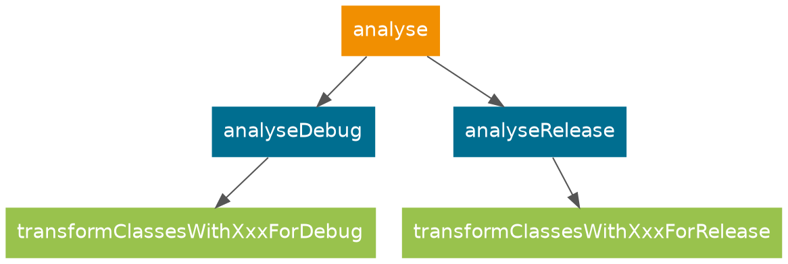
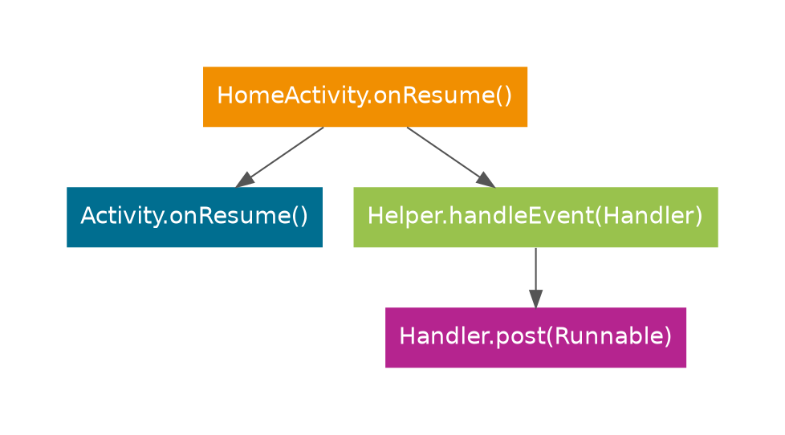
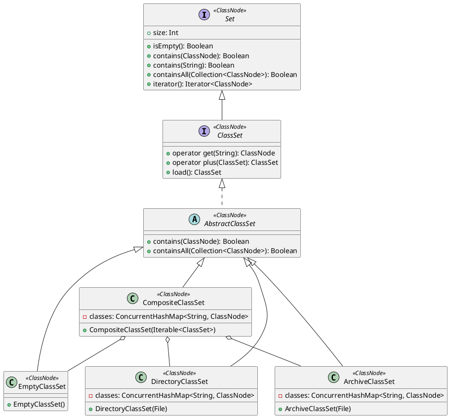
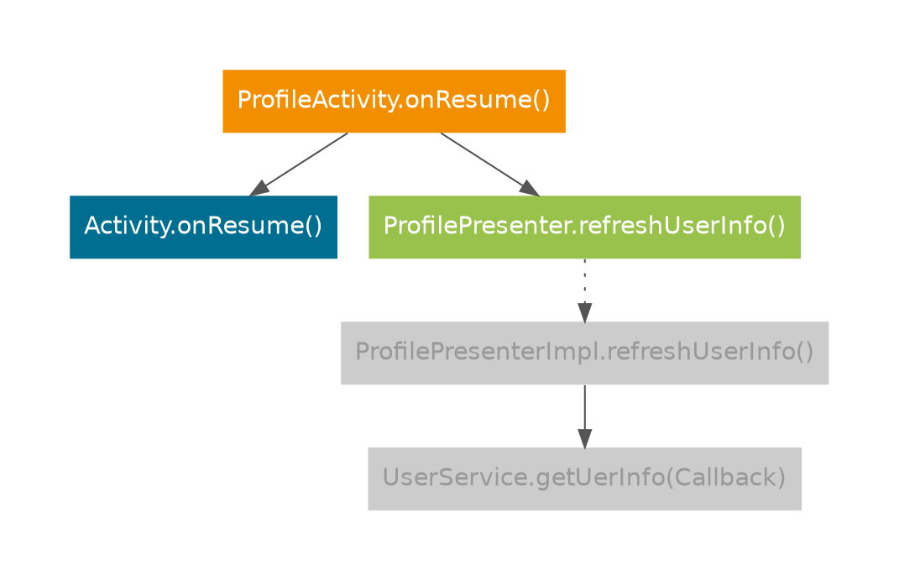

最近一直在优化 [booster-task-analyser](https://github.com/didi/booster/tree/master/booster-task-analyser) ，一方面是功能特性的完善，另一方面是静成分析的性能，在这之前，静态分析的工作是由[booster-transform-lint](https://github.com/didi/booster/tree/v1.4.0/booster-transform-lint)完成的，一直对静态分析的结果不是很满意，还有一些其它方面的考虑，索性重写一个，所以就有了[booster-task-analyser](https://github.com/didi/booster/tree/master/booster-task-analyser)，用来替代[booster-transform-lint](https://github.com/didi/booster/tree/v1.4.0/booster-transform-lint)。

重新设计静态分析模块主要是基于几个方面的考虑：

1. 对应用进行静态分析的频率不像构建那么频繁，所以，*Task* 比 *Transformer* 更合适；
1. CHA (Class Hierarchy Analysis) 需要提前拿到所有类信息，而 *Transformer* 是流水线处理，也不太合适；
1. 静态分析的过程可能会比较慢，作为 *Transformer* 可能会严重影响构建效率，而且应用的构建并不依赖静态分析的产出物；

所以，[booster-task-analyser](https://github.com/didi/booster/tree/master/booster-task-analyser)基于 *Task* 来实现：



## Classpath

在进行静态分析之前，首先需要拿到所有要分析的类，主要由两部分组成：

- *System classes*

  也就是 *Android SDK* 提供的 API，直白一点，就是 *${ANDROID_HOME}/platforms/android-xx/android.jar* ，在构建的时候，通过 `BaseExtension.getBootClasspath()` 就能获取到。

- *APP classes*

  APP 的类稍微麻烦一点，有两种实现方式：

  1. 通过分析工程依赖来获取；
  1. 通过 *Transform* 来获取；

  目前的实现选择了第 2 种——依赖 *Transform* ，主要是实现起来相对比较方便，偷个懒 :P

> 本以为加载所有类（将 *class* 文件解析成 *ASM* `ClassNode`）会很耗时，结果近 10 万个类在 *15s* 左右就完成了，机器配置如下：
> - 处理器：2.5GHz Intel Core i7
> - 内　存：16G 2400 MHz DDR4
> - 存　储：SSD

## Entry Point

任何静态分析都需要入口 (Entry Point)，如果是普通的程序，一般都是 `main` 方法，而对于 Android 应用来说，主要是 `Application` 、四大组件以及 XML 布局等等，所以，首先要找到这些入口。

### 四大组件

像 `Application` 及四大组件都在 *AndroidManifest.xml* 里，通过 [mergedManifests](https://github.com/didi/booster/blob/master/booster-android-gradle-api/src/main/kotlin/com/didiglobal/booster/gradle/VariantScope.kt#L142) 就能获取到合并后的 *AndroidManifest.xml*

### 自定义 View

查找自定义 *View* 最直接的方法就是解析 *Layout XML* ，通过 [mergeRes](https://github.com/didi/booster/blob/master/booster-android-gradle-api/src/main/kotlin/com/didiglobal/booster/gradle/VariantScope.kt#L148) 就能获取到，只不过是 *AAPT2* 的产物 —— *flat* 文件，这也就是 [booster-aapt2](https://github.com/didi/booster/tree/master/booster-aapt2) 模块的由来。

> 通过实测发现：解析 *flat* 文件的速度不如直接解析 XML 源文件，所以，最终的实现只解析了 *flat* 文件的 *header* 部分，然后通过 *header* 定位到源文件的路径。

### 线程注释标注的方法和类

Android 本身提供了 [Thread Annotations](https://developer.android.com/studio/write/annotations#thread-annotations)，帮助编译器和静态分析工具提升代码检查的准确性，所以，只要有类或者方法用 [Thread Annotations](https://developer.android.com/studio/write/annotations#thread-annotations) 标注过，则可以认为该类或者方法就是线程入口类或者方法。

考虑到一些主流的应用框架也有线程注解，因此，*Analyser* 对 *Event Bus* 做了支持，通过 `@Subscribe(threadMode = MAIN)` 标的方法会被识别为主线程入口方法。

### 反射

在 Android 应用中，为了解决热修复和 *Main Dex* 过大的问题，会采用反射来将 `Application` 与其它类的引用关系的打断，详见：[我在滴滴做架构（一）](/2020/01/01/working-as-an-architect-at-didi-1/)，如何将反射调用与实际的方法建立联系呢？—— 分析栈帧，当然，这又是另一个话题了，此处省略 5 千字。

### Main Looper

在 Android 中，主线程的 `Looper` & `Handler` 也算是 *Entry Point* ，如何确定一个 *Handler* 和 *Looper* 是否在主线程中，也是很具有挑战性的，举个例子：

```java
public class HomeActivity extends Activit {

    private Handler mHandler = new Handler();

    public void onResume() {
        super.onResume();
        Helper.handleEvent(this.mHandler);
    }

}

public class Helper {

    public static void handleEvent(Handler handler) {
        // ...
        handler.post(() -> {
            // update UI
        })
    }

}
```
*Call Graph* 如图所示：



在以上例子中，`Helper.handleEvent(Handler)` 方法体中调用了 `Handler`，但是这个 `Handler` 是来自其它方法，所以，要对 `handler` 这个参数追根溯源的话，就得根据 *Call Graph* 逆向分析：

1. 找到调用该方法的上一个节点（可能是多个）；
1. 根据上一个节点，找到该节点对应的 *INVOKE* 指令；
1. 然后从该指令对应的栈帧（Stack Frame）开始回溯，确定 *handler* 的来源；
1. 上面的例子中，可以确定 *handler* 来自 `GETFIELD` 指令，由此可以确定，该 *handler* 是 `HomeAcitivity` 的成员；
1. 再从各方法中搜索对 *handler* 进行赋值的 *SETFIELD* 指令，最终可以确定是在构造方法中

由此可见，*Call Graph* 对于静态分析至关重要。

## ClassSet

*ClassSet* 主要用于实现几个方面的需求：

1. 根据类名快速查询 `ClassNode`；
1. 根据类名快速定位该类所属的 *classpath* —— 文件夹/JAR；

出于性能和复用性角度的考虑，*ClassSet* 的设计成如下形式：



为什么会有 `CompositeClassSet` 呢？因为当 *Anylyser* 对应用进行分析的时候，需要访问这些 *ClassSet* ：

1. 仅包含 *System classes* 的 *ClassSet*

  用于快速查找 `Application` 及四大组件。

1. 仅包括 *App classes* 的 *ClassSet*

  用于构建整个应用的 *Call Graph* 。

1. 包含所有 *classes* 的 *ClassSet* ，即 *System classes* 与 *App classes* 的并集

  用于类继承关系分析（Class Hierarchy Analysis）。

为了保证查找效率，因此，*ClassSet* 的实现类都做了缓存。


## Class Hierarchy Analysis

类继承关系分析对于静态分析至关重要，它决定了分析结果的准确性和全面性，在此之前，*CHA* 是通过 *ClassLoader* 来实现的，相对来说比较很简单，参见：[KlassPool](https://github.com/didi/booster/blob/master/booster-transform-spi/src/main/kotlin/com/didiglobal/booster/transform/KlassPool.kt) & [Klass](https://github.com/didi/booster/blob/master/booster-transform-spi/src/main/kotlin/com/didiglobal/booster/transform/Klass.kt)，主要是解决如何判断两个类型是否有继承关系的问题，为什么抛弃原有的方案重新设计 *CHA* 呢？主要有以下几个方面的原因：

1. *ClassLoader* 加载 *Class* 时，虽然可以不对类进行初始化，但是 *ClassLoader* 会对 *bytecode* 进行 *verify* ，可能会抛出 *VerifyError* 导致整个分析过程失败；
1. 性能开销 —— *ClassLoader* 加载 *Class* 的性能相较 *ASM* 相差甚远；
1. 除了分析类的继承关系外，还需要分析字段和方法以及注解，通过 *Class* 反射得到的信息有限；

在进行类关系分析的时候，还有一个很重要的需求 —— 多态检测，例如：

```java
public interface ProfileView {
    void updateUserInfo(UserInfo userInfo);
}

public interface ProfilePresenter {
    void updateUserInfo();
}

public class ProfilePresenterImpl implements ProfilePresenter {

    private ProfileView mView;

    private UserService mService;

    public ProfilePresenterImpl(ProfileView view) {
        this.mView = view;
    }

    public void refreshUserInfo() {
        this.mService.getUserInfo(userInfo -> {
            mView.updateUserInfo(userInfo);
        });
    }

}

public class ProfileActivity extends Activity, ProfileView {

    private ProfilePresenter mPresenter;

    public void onCreate(Bundle bundle) {
        super.onCreate(bundle);
        this.mPresenter = new ProfilePresenterImpl(this);
    }

    public void onResume() {
        super.onResume();
        this.mPresenter.refreshUserInfo();
    }

    public void updateUserInfo(UserInfo userInfo) {
        // ...
    }

}
```

如果将 `ProfileActivity.onResume()` 的代码用 *Call Graph* 来表示：



这里就有一个问题，在上面的 *Call Graph* 中，从 `ProfileActivity.onResume()` 是无法到达 `ProfilePresenterImpl.updateUserInfo()` 的，因为在 `ProfileActivity` 中调用 `updateUserInfo()` 方法的引用类型是 `ProfilePresenter` 而不是 `ProfilePresenterImpl`，所以，*Call Graph* 中的每个节点都需有一个属性 —— 是否是 *虚方法* ，如果是 *虚方法* ，就得将这个 *虚方法* 与其所属类的所有派生类的 *override* 方法关联上，这就衍生出了一系列需求：

1. 根据类名快速查询其派生类；
1. 根据类名和方法名快速查询 *override* 了该方法的子类；

## 总结

从上面的各种例子可以看出，静态分析涉及到的数据结构和算法是相当的复杂，大概有：

1. Link List
1. Map
1. Set
1. Digraph
1. Binary Tree
1. ......

当分析的规模足够大的时候，这对 *Analyser* 的性能又是一项挑战，可能因为一行代码就会导致性能大相庭径。

当 *Analyser* 的第一个版本完成的时候，分析 10 万个类耗时在半小时以上，经过不断的优化，目前已经稳定在 1min 左右，内存峰值在 3G 左右，其中涉及到的优化手段又是另一个话题了，此处省略 1 万字……
