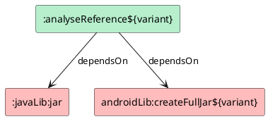

As app architecture evolves, sinking foundational modules is a phase every app goes through -- or will go through. During this process, existing modules often need to be split by functionality. Large-scale refactoring like this inevitably involves untangling dependency relationships between modules, especially class-level reference relationships. Faced with massive legacy codebases, how do you efficiently analyze these tangled dependencies?

## Module-Level Dependencies

Most build tools and package managers provide module-level dependency analysis tools and APIs. Take Gradle as an example -- you can output the project's dependency tree with a single command:

```bash
./gradlew dependencies
```

Gradle provides not only CLI tools but also Configuration APIs. By writing a custom Gradle Plugin, you can easily retrieve each project's dependency tree:

```kotlin
project.configurations
    .getByName(JavaPlugin.RUNTIME_CLASSPATH_CONFIGURATION_NAME)
    .resolvedConfiguration
    .resolvedArtifacts
```

For Android apps, each application may have multiple build variants, making dependency tree retrieval slightly more involved than for Java apps:

```kotlin
when (val android = project.getAndroid<BaseExtension>()) {
    is LibraryExtension -> android.libraryVariants
    is AppExtension -> android.applicationVariants
    else -> emptyList<BaseVariant>()
}.asSequence().forEach { variant ->
    val dependencies = listOf(AndroidArtifacts.ArtifactType.AAR, AndroidArtifacts.ArtifactType.JAR)
        .asSequence()
        .map { artifactType ->
            variant.getArtifactCollection(
                AndroidArtifacts.ConsumedConfigType.RUNTIME_CLASSPATH,
                AndroidArtifacts.ArtifactScope.ALL,
                artifactType
            )
        }
        .map { it.artifacts }
        .flatten()
        .distinctBy { it.id.componentIdentifier }
        .toList()
}
```

Gradle's dependency analysis APIs only go as deep as the module level. If you want to drill down to the class or member level, you need a custom solution.

## Inter-Module Class Dependencies

To analyze class dependencies across modules, there are generally two approaches:

1. Analyze source code
1. Analyze bytecode

Obviously, source-code-based analysis is a big question mark in real-world scenarios. In practice, bytecode analysis is far more feasible.

Since we're working at the bytecode level, the first problem to solve is: how to obtain the bytecode of dependent modules.

### Build Artifacts

We discussed earlier how to use Gradle APIs to retrieve dependencies for Java and Android projects. In practice, dependencies come in several forms:

1. Maven dependencies
1. Project dependencies
1. ...

Maven dependencies are pre-compiled packages -- JAR or AAR. Either way, the class files are inside the archive. No surprises there. But for project dependencies, things get interesting -- they could be Java/Kotlin projects or Android projects. How do you get their class files?

We know that Java and Kotlin projects have different compilation tasks, but as long as they're library projects, they share a common task -- `jar`, which packages classes into a JAR. What about Android projects?

As mentioned earlier, we can get the Android project dependency list. If you've looked into it, you'll notice that the dependency list returns `ResolvedArtifactResult` types. Through `ResolvedArtifactResult.getFile()`, you can get file paths for all dependencies. But if you've tried it, you'll find that some dependencies reference a file named *full.jar* that simply doesn't exist. What gives?

Don't panic. Let's look at the Android Gradle Plugin source code to understand what this `full.jar` actually is. Digging through the source, you'll find this in `LibraryTaskManager`:

```java
// Create a jar with both classes and java resources.  This artifact is not
// used by the Android application plugin and the task usually don't need to
// be executed.  The artifact is useful for other Gradle users who needs the
// 'jar' artifact as API dependency.
File mainFullJar = new File(jarOutputFolder, FN_INTERMEDIATE_FULL_JAR);
AndroidTask<ZipMergingTask> zipMerger =
        androidTasks.create(
                tasks,
                new ZipMergingTask.ConfigAction(variantScope, mainFullJar));
```

The comment tells the whole story. The *full.jar* exists, but the task isn't executed by default. So why not just run it ourselves?

```bash
./gradlew :mylibrary:createFullJarDebug
```

Sure enough, after running the command above, the missing *full.jar* appears. So the solution is straightforward: run these tasks before performing class analysis.



With that, all classes are at our disposal. Next up: finding the reference relationships.

### Class References

Static analysis typically uses a DAG (Directed Acyclic Graph). Booster provides [booster-graph](https://github.com/johnsonlee/booster/tree/master/booster-graph) for convenient DAG construction and visualization.

Additionally, static analysis often employs CHA (Class Hierarchy Analysis). Booster provides [booster-cha](https://github.com/johnsonlee/booster/tree/master/booster-cha) for class hierarchy analysis. However, class reference analysis doesn't require hierarchy analysis -- we just need to know which classes from each dependency are referenced by our target project. Essentially, this is analyzing each class's `import` list.

At the bytecode level, there's no actual `import` construct. What source-level `import` statements correspond to in bytecode is an index into the constant pool. So why not just analyze the constant pool directly?

That's one valid approach. But here I want to show how to do it with ASM. Unfortunately, ASM doesn't provide a direct API for accessing the constant pool. So what do we do?

Although ASM lacks constant pool APIs, we can achieve the same result by analyzing these parts of a `ClassNode`:

* Class annotations
* Superclass
* Interfaces
* Class signature
* Field annotations
* Field types
* Method annotations
* Method parameters
* Method return types
* Method signatures
* Instructions in method bodies
  * `INVOKE***`
  * `{GET/PUT}FIELD`
  * `{GET/PUT}STATIC`,
  * `NEW`
  * `ANEWARRAY`
  * `CHECKCAST`
  * `INSTANCEOF`
  * `MULTIANEWARRAY`
  * `LDC`
  * `ATHROW`
  * ...
* Try-catch blocks in method bodies
* Local variable tables
* ...

In Booster, the ASM Tree API is widely used for bytecode manipulation. But for class reference analysis, the ASM Visitor API is more suitable -- you just need to implement the relevant `visit` methods:

```kotlin
fun analyse(): Graph<ReferenceNode> {
    val executor = Executors.newFixedThreadPool(NCPU)
    val graphs = ConcurrentHashMap<Reference, Graph.Builder<ReferenceNode>>()

    try {
        project.classSets.map { (variant, classSet) ->
            classSet.map {
                it to variant
            }
        }.flatten().map { (klass, variant) ->
            val edge = { to: ReferenceNode ->
                graphs.getOrPut(Reference(klass.name, variant)) {
                    Graph.Builder()
                }.addEdge(ReferenceNode(this.project.name, variant, klass.name), to)
            }
            val av = AnnotationAnalyser(edge)
            val sv = SignatureAnalyser(edge)
            val fv = FieldAnalyser(av, edge)
            val mv = MethodAnalyser(av, sv, edge)
            executor.submit {
                klass.accept(ClassAnalyser(klass, av, fv, mv, sv, edge))
            }
        }.forEach {
            it.get()
        }
    } finally {
        executor.shutdown()
        executor.awaitTermination(1, TimeUnit.MINUTES)
    }

    return graphs.entries.filter {
        it.key.variant == variant
    }.fold(Graph.Builder<ReferenceNode>()) { acc, (_, builder) ->
        builder.build().forEach { edge ->
            acc.addEdge(edge)
        }
        acc
    }.build()
}
```

With that, we have the class reference DAG. For visualization, you can use the `DotGraph` from [booster-graph](https://github.com/johnsonlee/booster/tree/master/booster-graph), or generate other formats such as HTML.
