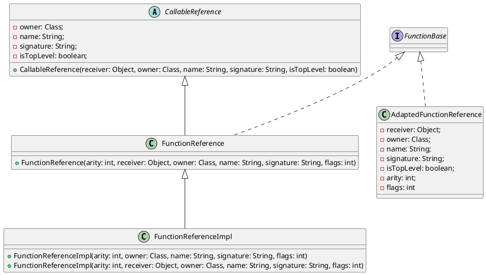

Before Booster 4.15.0, we had been using Kotlin 1.3. The reason for sticking with such an old version was mainly Kotlin version compatibility. But supporting AGP 7.3 forced an upgrade, since AGP 7.3 itself depends on Kotlin 1.5. Consequently, Booster 4.15.0 took a long time to resolve compatibility issues.

## Kotlin's First-Class Citizen -- Function

First-class functions (`Function`) are an essential feature of functional programming languages, and Kotlin is no exception. Because `Function` is so widely used in Kotlin, it is also a hotspot for compatibility issues. Have you ever wondered how Kotlin's `Function` is implemented at the bytecode level? Take the following code as an example:

```kotlin
(Int) -> Int
```

To implement this in Java, you would need to define a [Functional Interface](https://docs.oracle.com/javase/8/docs/api/java/lang/FunctionalInterface.html):

```java
@FunctionalInterface
interface Int2Int {
    int invoke(int value);
}
```

Or use the JDK's built-in [Function<T, R>](https://docs.oracle.com/javase/8/docs/api/java/util/function/Function.html):

```java
Function<Int, Int> i2i = /* ... */;
```

Java 8's standard API only provides [Function<T, R>](https://docs.oracle.com/javase/8/docs/api/java/util/function/Function.html) and [BiFunction<T, U, R>](https://docs.oracle.com/javase/8/docs/api/java/util/function/BiFunction.html) for `Function`. To support more parameters, you either define a custom [Functional Interface](https://docs.oracle.com/javase/8/docs/api/java/lang/FunctionalInterface.html) or use lambda expressions.

Kotlin has excellent built-in support for lambda expressions and defines [Function0<R>](https://github.com/JetBrains/kotlin/blob/master/libraries/stdlib/jvm/runtime/kotlin/jvm/functions/Functions.kt#L11), [Function1<P1, R>](https://github.com/JetBrains/kotlin/blob/master/libraries/stdlib/jvm/runtime/kotlin/jvm/functions/Functions.kt#L16), ... [Function22<P1, ..., P22, R>](https://github.com/JetBrains/kotlin/blob/master/libraries/stdlib/jvm/runtime/kotlin/jvm/functions/Functions.kt#L121) -- a total of 23 `Function` interfaces in its standard library. Seeing this, you might wonder: what happens if a `Function` has more than 22 parameters? (I'll leave that as a cliffhanger.)

## Lambda vs Function Reference

*Function Reference* is a Kotlin concept; the equivalent in Java is *Method Reference*. They refer to the same thing -- a reference to a method. For example:

```java
Arrays.asList(args).forEach(System.out::println);
```

Here, `System.out::println` is a reference to the `println` method on the `System.out` instance. So what exactly is the difference from a lambda? That requires understanding how lambdas are represented at the bytecode level.

Lambda implementations generally fall into a few categories:

1. Inner classes
1. Method handles ([MethodHandle](https://docs.oracle.com/javase/8/docs/api/java/lang/invoke/MethodHandle.html))
1. Dynamic proxies
1. Other approaches

Each has its pros and cons. The compiler considers two main factors when choosing an implementation:

1. Maximizing flexibility for future optimization without depending on a specific implementation
1. Stability of the bytecode-level representation

Since lambda implementations generate anonymous methods, both Java and Kotlin support converting between lambdas and method references to avoid unnecessary anonymous methods. In other words, you can replace a lambda with a method reference:

* Lambda form

    ```kotlin
    listOf("a", "b").forEach {
        println(it)
    }
    ```

* Method reference form

    ```kotlin
    listOf("a", "b").forEach(::println)
    ```

## Function Reference in Kotlin

In Kotlin, [FunctionReference](https://github.com/JetBrains/kotlin/blob/master/libraries/stdlib/jvm/runtime/kotlin/jvm/internal/FunctionReference.java) is primarily implemented via [FunctionReferenceImpl](https://github.com/JetBrains/kotlin/blob/master/libraries/stdlib/jvm/runtime/kotlin/jvm/internal/FunctionReferenceImpl.java) at the bytecode level. Starting from Kotlin 1.7+, [FunInterfaceConstructorReference](https://github.com/JetBrains/kotlin/blob/master/libraries/stdlib/jvm/runtime/kotlin/jvm/internal/FunInterfaceConstructorReference.java) was added. For example:

```kotlin
fun interface IFoo {
    fun foo()
}

val iFooCtor = ::IFoo
```

So whenever Kotlin code uses a method reference, `FunctionReferenceImpl` will appear in the compiled class file. Now, what does this have to do with compatibility?

## The Downside of Kotlin 1.3 Function References

In Kotlin, we frequently write code like this:

```kotlin
fun func() {
    // ...
}

fun call(func: () -> Unit) {
    func()
}

call(::func)
```

> Is there anything wrong with this?

On the surface it looks perfectly fine. But at the bytecode level, there are quite a few issues. The code above decompiles to roughly this Java equivalent:

```java
final class refs/LambdaKt$main$1 extends kotlin/jvm/internal/FunctionReference  implements kotlin/jvm/functions/Function0  {
    public synthetic bridge invoke()Ljava/lang/Object;

    public final invoke()V

    // overrides CallableReference#getOwner
    public final getOwner()Lkotlin/reflect/KDeclarationContainer;

    // overrides CallableReference#getName
    public final getName()Ljava/lang/String;

    // overrides CallableReference#getSignature
    public final getSignature()Ljava/lang/String;

    <init>()V

    public final static Lrefs/LambdaKt$main$1; INSTANCE

    static <clinit>()V
}
```

Can you spot the problem?

## Kotlin 1.4 Callable Reference Optimization

From the decompiled code above, we can see that the Kotlin compiler generates many extra methods, most of which are rarely used. Why generate methods that are almost never called? Can we avoid generating them?

The answer is yes -- and that is exactly the optimization Kotlin 1.4 introduced for `FunctionReference`, as shown below:



Kotlin 1.4 added [AdaptedFunctionReference](https://github.com/JetBrains/kotlin/blob/master/libraries/stdlib/jvm/runtime/kotlin/jvm/internal/AdaptedFunctionReference.java) and introduced 2 new constructors in [FunctionReferenceImpl](https://github.com/JetBrains/kotlin/blob/master/libraries/stdlib/jvm/runtime/kotlin/jvm/internal/FunctionReferenceImpl.java):

```java
@SinceKotlin(version = "1.4")
public FunctionReferenceImpl(
    int arity,
    Class owner,
    String name,
    String signature,
    int flags
) {
    super(/* ... */);
}

@SinceKotlin(version = "1.4")
public FunctionReferenceImpl(
    int arity,
    Object receiver,
    Class owner,
    String name,
    String signature,
    int flags
) {
    super(/* ... */);
}
```

These parameters are then passed to the base class [CallableReference](https://github.com/JetBrains/kotlin/blob/master/libraries/stdlib/jvm/runtime/kotlin/jvm/internal/CallableReference.java) through a new constructor in [FunctionReference](https://github.com/JetBrains/kotlin/blob/master/libraries/stdlib/jvm/runtime/kotlin/jvm/internal/FunctionReference.java):

```java
@SinceKotlin(version = "1.4")
public FunctionReference(
    int arity,
    Object receiver,
    Class owner,
    String name,
    String signature,
    int flags
) {
    super(receiver, owner, name, signature, (flags & 1) == 1);
    this.arity = arity;
    this.flags = flags >> 1;
}
```

And the corresponding fields, constructor, and *getter* methods were added to [CallableReference](https://github.com/JetBrains/kotlin/blob/master/libraries/stdlib/jvm/runtime/kotlin/jvm/internal/CallableReference.java):

```java
@SinceKotlin(version = "1.4")
private final Class owner;

@SinceKotlin(version = "1.4")
private final String name;

@SinceKotlin(version = "1.4")
private final String signature;

@SinceKotlin(version = "1.4")
private final boolean isTopLevel;

@SinceKotlin(version = "1.4")
protected CallableReference(Object receiver, Class owner, String name, String signature, boolean isTopLevel) {
    this.receiver = receiver;
    this.owner = owner;
    this.name = name;
    this.signature = signature;
    this.isTopLevel = isTopLevel;
}
```

So the methods that previously returned constants in anonymous inner classes are now passed to the base class via constructors, reducing the overall bytecode size of the application.

However, this optimization is enabled by default. This means the same Kotlin source code produces incompatible bytecode across versions -- Kotlin 1.4+ compiled bytecode references `FunctionReferenceImpl` constructors that only exist in Kotlin 1.4+. This is the error you often encounter when upgrading Kotlin:

```
NoSuchMethodError: 'void kotlin.jvm.internal.FunctionReferenceImpl.<init>(int, java.lang.Class, java.lang.String, java.lang.String, int)'
```

This is particularly troublesome for Kotlin libraries. Take Booster for example: many projects still use older AGP versions, but Booster also needs to support the latest AGP, which requires Kotlin 1.5 as a minimum. This means Booster compiled with Kotlin 1.5 cannot run in projects using older AGP versions, unless they explicitly set the Kotlin version to 1.5 or above.

## The Callable Reference Workaround

Engineers have likely encountered the problem above. By digging into the Kotlin source code, I found that this optimization can be disabled via a compiler option:

```groovy
compileKotlin {
    kotlinOptions{
        freeCompilerArgs = ["-Xno-optimized-callable-references"]
    }
}
```

Or:

```kotlin
tasks.withType<KotlinCompile> {
    kotlinOptions {
        freeCompilerArgs = listOf("-Xno-optimized-callable-references")
    }
}
```

Does Kotlin have a systematic solution for this? Stay tuned for the next installment.

## References

- https://kotlinlang.org/docs/whatsnew15.html
- https://kotlinlang.org/docs/whatsnew14.html
- https://youtrack.jetbrains.com/issue/KT-27362
- https://blog.jetbrains.com/kotlin/2015/04/upcoming-change-function-types-reform/
- https://docs.oracle.com/javase/tutorial/java/javaOO/methodreferences.html
- https://github.com/JetBrains/kotlin/blob/master/spec-docs/function-types.md
- https://cr.openjdk.java.net/~briangoetz/lambda/lambda-translation.html
