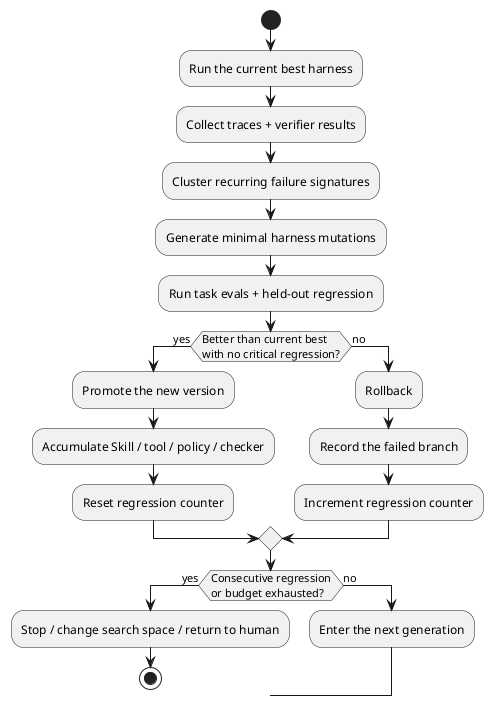

Silicon Valley is coining new terms faster than Agents can write code. [Harness Engineering](https://openai.com/index/harness-engineering/) had barely warmed up when Addy Osmani published ["Loop Engineering"](https://addyosmani.com/blog/loop-engineering/).

Loop Engineering assembles automations, worktrees, Skills, connectors, sub-agents, and external state into a closed loop: the system finds work, assigns it, executes, checks, records progress, then starts another round. The pieces are useful. The system sounds complete.

The original post does not ignore the risks. Addy explicitly says verification remains on us, and a bad loop can keep digging itself deeper. The name is still dangerous because it dresses a scheduling structure up as a capability leap. Put an Agent inside `while (true)`, and continuous execution starts sounding like continuous improvement.

It does not. **A loop can increase the number of attempts. It cannot increase the density of correct answers.**

The hard part of Agentic Coding has never been keeping an Agent running. The bottleneck is proving, at the end of each round, that the result moved closer to correct.

<!-- more -->

## A Loop Just Welds Down the Enter Key

Automatic triggers, queues, state machines, retries, and scheduled jobs have been part of software engineering for decades. The change Agents bring is that the next action inside the loop is now chosen by a probabilistic model.

That makes failure harder to see.

A deterministic program usually fails the same way repeatedly. An Agent can fail in a different-looking way every time: rewrite the implementation, add tests, invent a new explanation, then ask another Agent for review. The activity keeps increasing while the direction may not move at all.

Imagine the task: "Refactor the payments module without changing behavior." The Agent completes one round, the tests turn green, and the review Agent approves. The loop moves on and cleans up more code. Yet the tests cover only the happy path, and both Agents share the same wrong interpretation. The loop did not discover the blind spot. It copied the blind spot into more files.

One confident Agent is a hallucination. A roomful of Agents nodding at one another is consensus hallucination.

Separating maker and checker is valuable because it reduces some self-confirmation bias. Two probabilistic models still cannot manufacture ground truth. **Putting a probabilistic judge behind a probabilistic output still gives you probability, only with more ceremony.**

A loop clearly solves one problem: who presses Enter next. It has no answer for whether Enter should be pressed, or whether the result got better afterward.

## Evals Set Direction; Verification Decides Whether to Continue

In ["From Prompt to Harness"](https://johnsonlee.io/2026/05/15/from-prompt-to-harness.en/), I divided a harness into five layers: input constraints, execution, output verification, feedback, and reproducibility. A loop sits in execution and orchestration. Its job is to keep the system moving.

The last three layers are what turn it into engineering.

Compilation, type checking, linters, schema validation, and unit tests are deterministic gates. They block obvious failures after every round. They are cheap, fast, and repeatable, which makes them ideal for a fast loop.

But a gate can check the wrong thing. Green tests do not prove that business logic is correct. Higher coverage does not prove that edge cases are covered. A stable benchmark does not prove that the architecture is healthy. That is why the system also needs slow-loop evals: golden datasets, held-out regression suites, production replay, real user feedback, and human judgment where necessary. Those mechanisms recalibrate the system against ground truth.

Without a fast gate, failures leak into the next round. Without a slow eval, the entire system accelerates along the wrong metric.

There is another practical problem: Agents optimize for the completion condition.

Tell one to "make every test pass" and it may fix the code. It may also weaken the tests, widen the mocks, swallow exceptions, or skip failing cases. Ask another Agent whether the task is done and it can be persuaded by a plausible-looking diff. A beautifully written `done` condition is still a wish without a verifier.

Loops work well on verifiable tasks. Formatting, dependency upgrades, well-scoped bugs, and fixed benchmarks all provide clear feedback. Move to ambiguous requirements, architectural refactoring, performance tradeoffs, or user experience, and that feedback weakens quickly. At that point, another round has only one reliably growing metric: cost.

**Without verification, the only guaranteed improvement in a loop is token usage.**

## A Save Point Is Not an Upgrade

Loop Engineering puts strong emphasis on state outside the conversation: Markdown, issues, a Linear board, anything persistent. That is the right design. Models forget; repositories do not. Without external state, a long-running task starts guessing from scratch in round two.

State persistence answers, "Where should the next run resume?" Learning accumulation answers, "Why should the next run be better?"

Think of a save point and an upgrade in a game. A save point returns you to the same place after death. An upgrade changes what the character can do. An ordinary loop may have save points without having an upgrade system.

Dumping a summary into memory does not automatically create learning either. In ["Long-Term Memory Is Making Agents Dumber"](https://johnsonlee.io/2026/05/20/faulty-agent-memory.en/), I argued that memory updates without evals harden lucky successes into rules and bad diagnoses into persistent bias. Experience accumulates, context gets dirtier, and every new run begins by rereading old mistakes.

Real accumulation requires selection.

A failure leaves an execution trace and verifier result. Repeated failures form a failure signature. The system uses that evidence to modify a Skill, tool, prompt, checker, or orchestration policy. The new version then runs against the same evals and a held-out regression suite. Improvements survive. Regressions roll back.

**Keeping experience gives you memory. Keeping validated improvements gives you evolution.**

## An Evolution Loop Changes the Starting Point

A basic Retry Loop changes almost nothing: the same model, the same harness, and the same objective sample another output. It may succeed by chance, but it does not know why. The next similar task begins beside the same hole.

An Evolution Loop changes the system that produces the answer.

This direction is already producing concrete research.

The [Darwin Gödel Machine](https://arxiv.org/abs/2505.22954) repeatedly modifies its own coding Agent, validates each variant on benchmarks, and keeps an archive for further exploration. It relies on empirical selection rather than trying to prove every change beneficial in advance. Performance rose from 20.0% to 50.0% on SWE-bench and from 14.2% to 30.7% on Polyglot.

[Self-Harness](https://arxiv.org/abs/2606.09498) brings the same idea closer to Harness Engineering. It mines recurring weaknesses from execution traces, generates bounded harness patches, then uses held-in evals and held-out regression to decide what gets promoted. A candidate advances only when it improves at least one split without degrading the other. Across three fixed models on Terminal-Bench-2.0, held-out pass rates rose from 40.5% to 61.9%, 23.8% to 38.1%, and 42.9% to 57.1%.

These systems also run in loops, but their value does not come from looping. **The loop supplies iteration. The selector supplies direction.**

Every round must leave behind a reusable change: a better Skill, a more suitable tool, a harder checker, less wasted exploration, or a more accurate stopping policy. The next round must inherit those changes before its starting point has genuinely improved.

## Stop When the System Keeps Regressing

Evolution is not perpetual motion.

Two or three consecutive regressions suggest that the current search direction is exhausted, the eval signal is broken, the context is polluted, or the model has reached its capability ceiling. Another retry merely spends tokens keeping a bad direction alive.

A proper Evolution Loop preserves the current best. Every candidate mutates on an isolated branch. A candidate that does not beat the best never reaches the main line. Repeated lack of improvement triggers a stop. Budget exhaustion triggers a stop. The same failure signature appearing again and again triggers a new search space or a handoff to a human.

Stopping also produces information. It says that the current strategy has no remaining marginal value, so the next move may be to fix the verifier, change the model, split the task, or build better ground truth. Treat stopping as an exception and the loop hides failure. Treat it as feedback and the system can change direction.

Natural selection never promised that every mutation would survive. Agents deserve no such promise either.

**A loop that cannot stop has crossed from autonomy into loss of control.**

## Do Not Confuse Motion with Progress

Loop Engineering works as an operational layer. Automations provide a heartbeat, worktrees provide isolation, sub-agents provide parallelism, and external state lets work continue across runs. All of that is worth building.

Calling it the next core paradigm of Agentic Coding goes too far.

A harness places a probabilistic model inside a system that can be constrained, verified, and reproduced. A loop keeps that system running unattended. Evolution carries validated failures and improvements into the next harness version. The order matters.

A system that reaches round 100 with the same harness, evals, and strategy has merely repeated the ignorance of round one ninety-nine more times.

Do not ask how long the loop can run. Ask what this round leaves behind, who decides what survives, and whether the system can stop when performance keeps degrading.

Silicon Valley will keep inventing new terms. **Spinning is easy. Engineering begins when each lap makes the next one smarter.**
