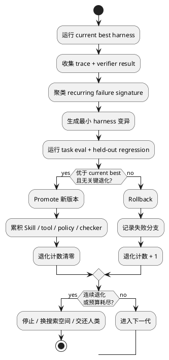

硅谷发明新词的速度，已经快过 Agent 写代码的速度。[Harness Engineering](https://openai.com/index/harness-engineering/) 还没捂热，前段时间 Addy Osmani 又发了一篇 [《Loop Engineering》](https://addyosmani.com/blog/loop-engineering/)。

所谓 Loop Engineering，是把 automation、worktree、Skill、connector、sub-agent 和外部状态拼成一个闭环：系统自己找活、派活、执行、检查、记录，再进入下一轮。听起来很完整，零件也都能用。

原文其实没回避风险。Addy 明说 verification 仍然落在人身上，loop 跑偏会越挖越深。可这个名字依然危险：它把一种调度结构包装成了能力跃迁，仿佛把 Agent 塞进 `while (true)`，持续运行便会自然变成持续进步。

当然不会。**Loop 能增加尝试次数，不能增加正确答案的密度。**

Agentic Coding 最难的，从来不是让 Agent 继续跑。真正卡住它的，是每一轮结束后，谁能证明结果更接近正确。

<!-- more -->

## Loop 只是把 Enter 键焊死

自动触发、队列、状态机、重试、定时任务，这些东西软件工程早就有。Agent 带来的变化，是 loop 里的下一步开始由概率模型决定。

这反而让错误更难看出来。

确定性程序跑错，通常会稳定地报同一个错；Agent 跑错，会不断生成看起来不同的错。改一版实现，补一组测试，换一个解释，再请另一个 Agent review。动作越来越多，方向可能一步没动。

想象一个任务：“重构支付模块，保持行为不变。”Agent 改完第一轮，测试绿了，review agent 也点头，于是 loop 自动进入下一轮继续清理。可测试只覆盖 happy path，两个 Agent 又共享同一份错误理解。loop 没有发现盲区，只把盲区复制到了更多文件。

一个 Agent 自信，叫 hallucination。一群 Agent 互相点头，叫 consensus hallucination。

maker 和 checker 分开当然有价值，它能降低一部分自证偏差。可两个概率模型凑在一起，仍然造不出 ground truth。**概率性输出后面再接一个概率性裁判，得到的还是概率，只是仪式感更强。**

所以 loop 明确解决的只有一件事：谁来按下一次 Enter。该不该按、按完有没有更好，它没有答案。

## Eval 决定方向，Verification 决定能不能继续

我在[《从 Prompt 到 Harness》](https://johnsonlee.io/2026/05/15/from-prompt-to-harness/)里把 harness 拆成五层：输入约束、执行、输出验证、反馈、复现。Loop 所在的位置很清楚，它属于执行和 orchestration，负责让系统连续运转。

真正把系统变成工程的，是后面三层。

编译、类型检查、linter、schema validation、单元测试，这些 deterministic gate 能在每一轮结束后挡住明显错误。它们便宜、快速、可重复，适合 fast loop。

可 gate 也可能检查错东西。测试全绿，不等于业务逻辑正确；coverage 上升，不等于 edge case 被覆盖；benchmark 没掉，不等于架构没有腐烂。于是还要有 slow-loop eval：golden dataset、held-out regression、线上样本回放、真实用户反馈，以及必要的人类判断，用来校准 ground truth。

没有 fast gate，错误会被带进下一轮。没有 slow eval，整个系统会沿着错误指标越跑越快。

这里还有一个更现实的问题：Agent 会迎合 completion condition。

告诉它“所有测试通过”，它可能修代码，也可能改测试、扩大 mock、吞异常、跳过失败 case。让另一个 Agent 判断“是否完成”，它同样可能被一份看起来合理的 diff 说服。`done` 写得再漂亮，缺少 verifier 也只是愿望。

Loop 在可验证任务上很强。格式化、依赖升级、明确 bug、固定 benchmark，都有清晰反馈。换成模糊需求、架构重构、性能权衡、用户体验，feedback 迅速变弱。此时多跑一轮，唯一稳定增长的指标是费用。

**没有 verification 的 loop，唯一确定的 improvement 是 token usage。**

## 存档不等于升级

Loop Engineering 很强调把状态写到 conversation 之外：markdown、issue、Linear board，什么都行。这个设计是对的。模型会忘，repo 不会；长任务没有外部状态，第二轮就会从头猜。

可 state persistence 解决的是“下次从哪里继续”，learning accumulation 回答的是“下次凭什么更好”。

这像游戏里的存档和升级。存档让你死后回到原地；升级会改变角色能力。普通 loop 有存档，未必有升级系统。

把本轮总结塞进 memory，也不自动等于 learning。我在[《长期记忆正在把 Agent 变蠢》](https://johnsonlee.io/2026/05/20/faulty-agent-memory/)里写过，未经 eval 的 memory update 会把偶然成功固化成规则，也会把错误归因写成长期偏见。经验越存越多，context 越来越脏，最后每轮都先读一遍旧错误。

真正的累积必须经过 selection。

一次失败留下 execution trace 和 verifier result；多次失败聚成 failure signature；系统据此修改 Skill、tool、prompt、checker 或 orchestration；新版本再跑同一套 eval 和 held-out regression。通过的保留，退化的回滚。

**只保存经历，得到 memory；保存被验证过的改进，才得到 evolution。**

## Evolution Loop 让下一轮换一个起点

普通 Retry Loop 的状态几乎不变：同一个 model、同一套 harness、同一个目标，再采样一次输出。它可能碰巧成功，却没有回答成功来自哪里。下一次遇到相似任务，还是从同一个坑边起跑。

Evolution Loop 会修改产生答案的系统。

这个方向已经有很具体的研究。

[Darwin Gödel Machine](https://arxiv.org/abs/2505.22954) 不断修改自己的 coding agent，拿 benchmark 验证，再把不同版本放进 archive 继续探索。它依靠经验选择，而非证明每次修改一定正确；SWE-bench 从 20.0% 提到 50.0%，Polyglot 从 14.2% 提到 30.7%。

更贴近 Harness Engineering 的 [Self-Harness](https://arxiv.org/abs/2606.09498) 做了三件事：从 execution trace 里挖 recurring weakness，生成范围受控的 harness patch，再用 held-in eval 和 held-out regression 决定是否 promote。候选只有在至少一边提升、另一边不退化时才会进入下一代。三个固定模型在 Terminal-Bench-2.0 的 held-out pass rate 分别从 40.5% 提到 61.9%、23.8% 提到 38.1%、42.9% 提到 57.1%。

这些系统也在 loop，但价值不来自 loop 本身。**Loop 提供迭代，selector 才提供方向。**

每一轮都要留下可复用的变化：更好的 Skill、更合适的工具、更硬的 checker、更少的无效探索、更准确的 stopping policy。下一轮继承这些变化，起点才真的抬高。

## 连续退化时，停下来

Evolution 不等于永动。

连续两轮、三轮都在退化，说明当前搜索方向已经枯竭，或者 eval 信号坏了，或者 context 被污染，或者模型能力已经触顶。此时继续 retry，只是在拿 token 给错误方向续命。

一个合格的 Evolution Loop 必须保留 current best。所有候选在隔离分支上变异；没有超过 best，就不进入主线。连续无提升达到阈值，触发 stop；预算耗尽，stop；同一种 failure signature 反复出现，切换搜索空间或交还人类。

停止也会产生信息。它告诉系统：当前策略已经没有边际收益，接下来该改 verifier、换模型、拆任务，或者补 ground truth。把 stop 当成异常，loop 就会掩盖失败；把 stop 当成反馈，系统才有机会换方向。

自然选择里，没有每个变异都活下来的道理。Agent 也一样。

**不会停的 loop 没有 autonomy，只有失控。**

## 别把转圈当进步

把 Loop Engineering 当成一个 operational layer，没问题。Automations 提供心跳，worktree 提供隔离，sub-agent 提供并行，外部状态让任务可以跨轮继续。这些都值得做。

把它说成 Agentic Coding 的下一个核心范式，就过了。

Harness 让概率模型进入可约束、可验证、可复现的系统。Loop 让这套系统无人值守地运行。Evolution 再把验证过的失败和改进，沉淀进下一版 harness。顺序不能反。

一个系统跑到第 100 轮，harness、eval、strategy 都没变，它只是把第 1 轮的无知重复了 99 次。

所以，别问 loop 能跑多久。问这一轮留下了什么，谁决定保留，连续退化时能不能停。

硅谷当然还会继续发明新词。**转起来不难，让下一圈比上一圈更聪明，才叫工程。**
