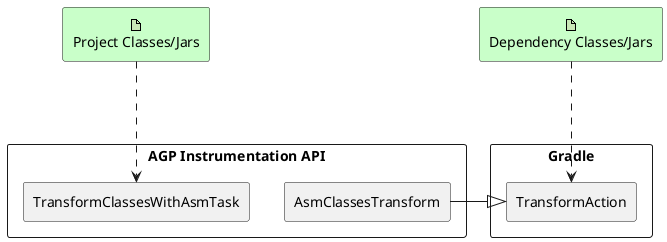
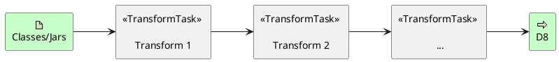
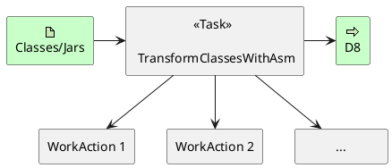
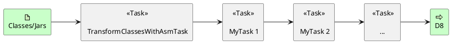
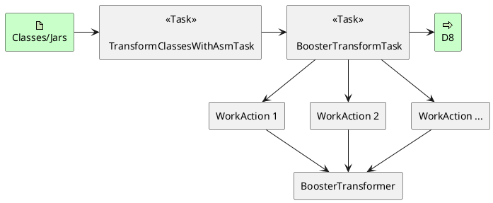
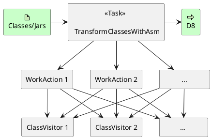
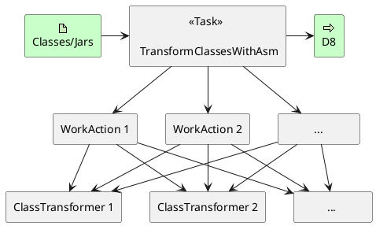

It has been over a month since AGP 8.0 was officially released, and Booster's adaptation to AGP 8.0 is still underway. The main challenge is that AGP 8.0 removed many APIs that were previously only deprecated, including parts of the [Transform API](https://developer.android.com/reference/tools/gradle-api/7.2/com/android/build/api/transform/Transform). The [Legacy Variant API](https://android.googlesource.com/platform/tools/base/+/a714ecedfa729cec69b2198bc3446149db44eaab/build-system/gradle-core/src/main/java/com/android/build/gradle/api/BaseVariant.java) is also on its way out, replaced by the [Instrumentation API](https://developer.android.com/reference/tools/gradle-api/8.0/com/android/build/api/instrumentation/package-summary), [Artifacts API](https://developer.android.com/reference/tools/gradle-api/8.0/com/android/build/api/artifact/Artifacts), and [New Variant API](https://developer.android.com/reference/tools/gradle-api/8.0/com/android/build/api/variant/package-summary). Although these new APIs have existed since AGP 7.0, they kept changing through AGP 7.4 and were never fully stable. They are also completely incompatible with the old APIs. We were not sure what the final stable form would look like. Given that Booster already supports 12 versions from AGP 3.3 to AGP 7.4, making drastic API changes would be a significant migration challenge for Booster users. Now that AGP 8.0 has finally removed the deprecated APIs, we believe its API surface has stabilized. Time to go big.

## Why Did AGP Deprecate the Legacy API?

The short answer: for a smoother build experience. But why could the old APIs not deliver that, while the new ones can?

### Redundant Transforms

This brings us to Gradle. AGP's entire build system is based on Gradle. Back in 2015 when AGP 1.5 officially introduced the Transform API, Gradle was still at version 2.x -- far weaker than today's Gradle 8.x. It did not even have a proper Transform API; [ArtifactTransform](https://docs.gradle.org/3.4/javadoc/org/gradle/api/artifacts/transform/ArtifactTransform.html) only arrived in 3.4. So AGP had to implement its own Transform API to handle bytecode processing during Android app builds. As AGP continued optimizing build performance, [Gradle 5.3](https://docs.gradle.org/5.3/release-notes.html) finally introduced [TransformAction](https://docs.gradle.org/5.3/javadoc/org/gradle/api/artifacts/transform/TransformAction.html) in 2019, primarily to solve dependency transform issues and lay groundwork for [Configuration Cache](https://blog.gradle.org/introducing-configuration-caching).

In AGP's Transform Pipeline, project dependencies and the project's own classes were not strictly separated -- they were processed together. This created redundancy with Gradle's own dependency transform mechanism. To maximize Android build optimization, the AGP team made deliberate tradeoffs, reusing Gradle's transforms wherever possible to avoid redundant I/O. This is also why Booster consolidates the entire transform process, solving all class transformations in a single I/O pass.



### Parallel Execution

Another issue is AGP's own transform implementation. Both the legacy `TransformTask` and `TransformClassesWithAsmTask` process primarily in serial and cannot achieve full parallelism -- leaving significant room for optimization.

Take `TransformTask` as an example. Each `Transform` creates a task, and AGP itself chains many `Transform` instances into a pipeline. Each one processes data, writes results to disk at some location, then passes the path to the next `TransformTask`, which writes to yet another location, and so on until all `Transform` tasks are complete. The more `Transform` instances there are, the more `TransformTask` instances are created, and I/O operations grow linearly.



Although AGP later introduced `TransformClassesWithAsmTask`, the implementation was just a *for* loop:

```kotlin
private fun processJars(
  instrumentationManager: AsmInstrumentationManager,
  inputChanges: InputChanges,
  isIncremental: Boolean
) {
  if (inputJarsDir.isPresent) {
    if (isIncremental) {
        ...
    } else {
      FileUtils.deleteDirectoryContents(jarsOutputDir.get().asFile)
      extractProfilerDependencyJars()
      inputJarsDir.get().asFile.listFiles()?.forEach { inputJar ->
        val instrumentedJar = File(jarsOutputDir.get().asFile, inputJar.name)
        instrumentationManager.instrumentClassesFromJarToJar(inputJar, instrumentedJar)
      }
    }
  } else {
    ...
  }
}
```

It was not until AGP 7.1 that JAR processing became parallel, using Gradle's [WorkerExecutor](https://docs.gradle.org/current/javadoc/org/gradle/workers/WorkerExecutor.html). This not only maximizes CPU utilization but also makes the most of Gradle's caching mechanisms.

While AGP's implementation was far from elegant, the improvement over the Legacy Transform API was substantial: consolidating many `TransformTask` instances into a single `TransformClassesWithAsmTask` drastically reduced I/O overhead.



## Booster's Approach

### Artifacts API

The [Artifacts API](https://developer.android.com/reference/tools/gradle-api/4.1/com/android/build/api/artifact/Artifacts) was introduced in AGP 4.1. At the time, AGP's intent behind this API was not entirely clear to us, since it was not built from scratch but redesigned from the original [VariantScope.getArtifacts()](https://android.googlesource.com/platform/tools/base/+/35bf92626adc6a61e647c907661029e7243f0eaf/build-system/gradle-core/src/main/java/com/android/build/gradle/internal/scope/VariantScope.java#68). The original `Artifacts` were scattered across internal APIs used only within AGP. Although the [Artifacts API](https://developer.android.com/reference/tools/gradle-api/4.1/com/android/build/api/artifact/Artifacts) has existed since AGP 4.1, it kept changing and did not truly stabilize until AGP 7.2.

Similar to the old [Transform API](https://developer.android.com/reference/tools/gradle-api/7.2/com/android/build/api/transform/Transform), the [Artifacts API](https://developer.android.com/reference/tools/gradle-api/4.1/com/android/build/api/artifact/Artifacts) implementation also requires a `Task` to back it -- see `TransformClassesWithAsmTask` for reference. Compared to the [Transform API](https://developer.android.com/reference/tools/gradle-api/7.2/com/android/build/api/transform/Transform), it significantly reduces unnecessary I/O. However, if developers still implement custom transforms on top of this API, while writing the code is easier than directly manipulating tasks, the runtime behavior is fundamentally the same as the old [Transform API](https://developer.android.com/reference/tools/gradle-api/7.2/com/android/build/api/transform/Transform) -- one task finishes and hands its results to the next, still unable to parallelize.



For Booster, if we can unify these custom transform tasks, we can drastically reduce unnecessary I/O operations:



### Instrumentation API

Back in [What Does the Deprecation of AGP Transform API Mean?](/2021/08/02/the-deprecation-of-agp-transform-api/), I mentioned Gradle's native [TransformAction](https://docs.gradle.org/5.3/javadoc/org/gradle/api/artifacts/transform/TransformAction.html) API. The [Instrumentation API](https://developer.android.com/reference/tools/gradle-api/7.2/com/android/build/api/variant/Instrumentation) that AGP introduced starting from 4.2 is essentially built on Gradle's native [TransformAction](https://docs.gradle.org/5.3/javadoc/org/gradle/api/artifacts/transform/TransformAction.html). As shown in the earlier diagram, [TransformAction](https://docs.gradle.org/5.3/javadoc/org/gradle/api/artifacts/transform/TransformAction.html) is primarily used for transforming dependency JARs/classes.

Unlike the [TransformAction](https://docs.gradle.org/5.3/javadoc/org/gradle/api/artifacts/transform/TransformAction.html) API, the [Instrumentation API](https://developer.android.com/reference/tools/gradle-api/7.2/com/android/build/api/variant/Instrumentation) adds an abstraction layer similar to Booster's [Transformer](https://github.com/didi/booster/blob/master/booster-transform-spi/src/main/kotlin/com/didiglobal/booster/transform/Transformer.kt), namely [AsmClassVisitorFactory](https://developer.android.com/reference/tools/gradle-api/7.0/com/android/build/api/instrumentation/AsmClassVisitorFactory), which creates ASM `ClassVisitor` instances.



In theory, Booster could also solve the transform problem through the [Instrumentation API](https://developer.android.com/reference/tools/gradle-api/7.2/com/android/build/api/variant/Instrumentation). It would simply require having the [Transformer](https://github.com/didi/booster/blob/master/booster-transform-spi/src/main/kotlin/com/didiglobal/booster/transform/Transformer.kt) implement the [AsmClassVisitorFactory](https://developer.android.com/reference/tools/gradle-api/7.0/com/android/build/api/instrumentation/AsmClassVisitorFactory) interface:



## Trade-off

From a technical standpoint, both the [Instrumentation API](https://developer.android.com/reference/tools/gradle-api/7.2/com/android/build/api/variant/Instrumentation) and the [Artifacts API](https://developer.android.com/reference/tools/gradle-api/4.1/com/android/build/api/artifact/Artifacts) can solve the transform problem. But Booster's considerations go beyond just implementation. Here is a comparison:

| Solution | Instrumentation API | Artifacts API |
|----------|---------------------|---------------|
| Pros     | <ul><li>Eliminates one round of JAR/class read-write I/O</li><li>Can leverage Configuration Cache (actual effect pending testing)</li></ul> | <ul><li>Not limited to one bytecode framework; can support both ASM and Javassist</li><li>Transforms can be fully decoupled from the Gradle API</li><li>Lower migration cost for developers</li></ul> |
| Cons     | <ul><li>Only supports ASM, not Javassist</li><li>CHA can only use AGP's API, which is very limited</li><li>Heavily depends on the Gradle API; cannot run independently of Gradle, contradicting Booster's original design philosophy</li><li>Higher migration cost for developers</li></ul> | <ul><li>One extra Task, one extra I/O round</li><li>Cannot leverage Configuration Cache</li></ul> |

Based on this analysis, we lean toward the [Artifacts API](https://developer.android.com/reference/tools/gradle-api/4.1/com/android/build/api/artifact/Artifacts) approach. While the [Instrumentation API](https://developer.android.com/reference/tools/gradle-api/7.2/com/android/build/api/variant/Instrumentation) may offer better Gradle cache support, many features are constrained by AGP's current implementation. From our understanding of Booster's user base, the [Instrumentation API](https://developer.android.com/reference/tools/gradle-api/7.2/com/android/build/api/variant/Instrumentation)'s current capabilities are far from meeting developer needs -- especially for use cases that depend on intermediate build artifacts, where the [Instrumentation API](https://developer.android.com/reference/tools/gradle-api/7.2/com/android/build/api/variant/Instrumentation) is extremely cumbersome. So Booster takes the developer's perspective: minimize feature compromises while keeping migration costs low.

## References

- https://android-developers.googleblog.com/2022/10/prepare-your-android-project-for-agp8-changes.html
- http://tools.android.com/tech-docs/new-build-system
- https://docs.gradle.org/5.3/release-notes.html
