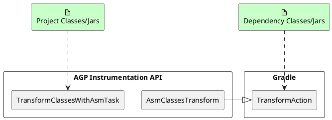
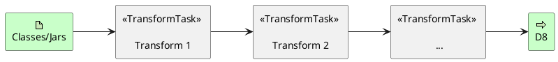
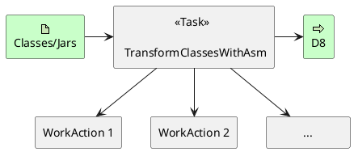
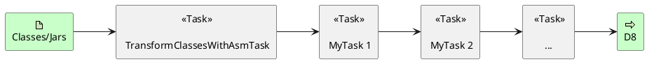
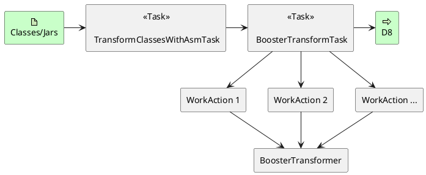
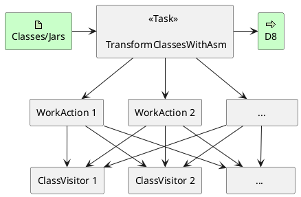
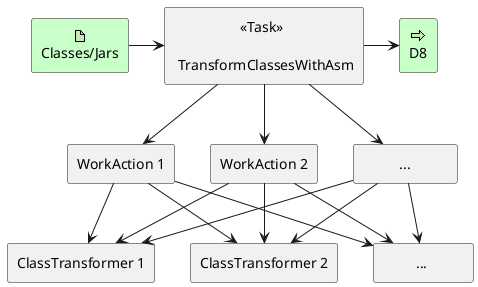

自 AGP 8.0 正式版本已经一个多月了，Booster 适配 AGP 8.0 还在持续进行中，主要是 AGP 8.0 删除了很多之前只是 deprecated 的 API，包括部分 [Transform API](https://developer.android.com/reference/tools/gradle-api/7.2/com/android/build/api/transform/Transform)，而且 [Legacy Variant API](https://android.googlesource.com/platform/tools/base/+/a714ecedfa729cec69b2198bc3446149db44eaab/build-system/gradle-core/src/main/java/com/android/build/gradle/api/BaseVariant.java) 也即将删除，取而代之的是 [Instrumentation API](https://developer.android.com/reference/tools/gradle-api/8.0/com/android/build/api/instrumentation/package-summary)、[Artifacts API](https://developer.android.com/reference/tools/gradle-api/8.0/com/android/build/api/artifact/Artifacts) 和 [New Variant API](https://developer.android.com/reference/tools/gradle-api/8.0/com/android/build/api/variant/package-summary)，虽然新的 API 从 AGP 7.0 开始就已经出现，但是这些新的 API 从 AGP 7.0 到 AGP 7.4 都一直在改，并没有完全稳定下来，加上跟以前的 API 完全不兼容，我们也不确定最终稳定下来会是什么样子，加上 Booster 已经支持了从 AGP 3.3 到 AGP 7.4 的 12 个版本，贸然变动 API，对于 Booster 的使用者来说，迁移也是一项非常有挑战性的事情，看到 AGP 8.0 终于删除了之前标记为废弃的 API，我们认为它的 API 也稳定下来了，是时候干一票大的了。

## AGP 为什么要废弃 Legacy API

先说结论，为了更丝滑的构建体验。那为什么老的 API 就不配拥有更丝滑的构建体验，而新的 API 就可以呢？

### 冗余的 Transform

这里就不得不提一下 Gradle，AGP 的整个构建都是基于 Gradle 的，早在 2015 年 AGP 1.5 正式发布 Transform API 的时候，Gradle 的版本还是 2.x，相比现在的 Gradle 8.x 简直是弱爆了，连一个像样的 Transform API 也没有，就连 [ArtifactTransform](https://docs.gradle.org/3.4/javadoc/org/gradle/api/artifacts/transform/ArtifactTransform.html) 也是 3.4 才有的，所以那个时候，AGP 不得不自己实现一套 Transform API 来解决 Android 应用构建过程中处理字节码的问题。然而，随着 AGP 不断的优化其构建性能，终于在 2019 年 [Gradle 5.3](https://docs.gradle.org/5.3/release-notes.html) 发布了 [TransformAction](https://docs.gradle.org/5.3/javadoc/org/gradle/api/artifacts/transform/TransformAction.html)，主要是为了解决工程中的依赖包的 transform 问题，同时，为后续的 [Configuration Cache](https://blog.gradle.org/introducing-configuration-caching) 提供支持。

在 AGP 的 Transform Pipeline 中，并没有把工程的依赖和工程自身的 classes 严格的分开，而是在一起整体处理的，这样，就会与 Gradle 自身的 dependency transform 冗余了，为了最大限度的优化 Android 应用的构建，我相信 AGP 团队也是做了相应的取舍，尽可能复用 Gradle 的 transform 而避免重复的 I/O，这也是为什么 Booster 统一收敛了 transform 的过程，用一次 I/O 解决所有 classes 的 transform 问题。



### 并行执行

另一个问题是 AGP 自身的 transform 的实现本身，无论是 legacy 的 `TransformTask` 还是 `TransformClassesWithAsmTask` 都还是以串行处理为主，并不能实现完全并行处理，还有相当大的优化空间。

以 `TransformTask` 为例，其实现是每个 `Transform` 创建一个任务，而且，AGP 自身就搞了很多 `Transform` 组成一个 Transform 链，上一个处理完了，把结果写到磁盘某个位置，把路径传给下一个 `TransformTask` 来处理，再在另一个位置写磁盘，如此循环下去直至所有 `Transform` 对应的任务执行完成，所以，`Transform` 越多，对应的 `TransformTask` 的实例也就越多，同时，I/O 次数也会呈线性增长。



尽管 AGP 后来又搞出来一个 `TransformClassesWithAsmTask`，但其实现都是用一个 *for* 循环来实现的：

```kotlin
private fun processJars(
  instrumentationManager: AsmInstrumentationManager,
  inputChanges: InputChanges,
  isIncremental: Boolean
) {
  if (inputJarsDir.isPresent) {
    if (isIncremental) {
        ...
    } else {
      FileUtils.deleteDirectoryContents(jarsOutputDir.get().asFile)
      extractProfilerDependencyJars()
      inputJarsDir.get().asFile.listFiles()?.forEach { inputJar ->
        val instrumentedJar = File(jarsOutputDir.get().asFile, inputJar.name)
        instrumentationManager.instrumentClassesFromJarToJar(inputJar, instrumentedJar)
      }
    }
  } else {
    ...
  }
}
```

直到 AGP 7.1 才实现 JAR 的并行处理，使用的是 Gradle 的 [WorkerExecutor](https://docs.gradle.org/current/javadoc/org/gradle/workers/WorkerExecutor.html)，不仅可以最大化的使用 CPU 资源，还可以最大限度的复用 Gradle 的缓存机制。

虽然 AGP 的实现比较挫，但跟 Legacy 的 Transform API 相比进步也是巨大的，主要体现在由原来的多个 `TransformTask` 变成了单一的 `TransformClassesWithAsmTask`，极大的降低了 I/O 的损耗。



## Booster 的思路

### Artifacts API

[Artifacts API](https://developer.android.com/reference/tools/gradle-api/4.1/com/android/build/api/artifact/Artifacts) 是 AGP 4.1 新增的 API，那时候 AGP 搞这么一套 API 在我们看来意图也并不明显，因为这并不是无中生有的一套 API，而是基于原来的 [VariantScope.getArtifacts()](https://android.googlesource.com/platform/tools/base/+/35bf92626adc6a61e647c907661029e7243f0eaf/build-system/gradle-core/src/main/java/com/android/build/gradle/internal/scope/VariantScope.java#68) 来重新设计的，原来的 `Artifacts` 比较分散，都是些 internal 的 API，主要是在 AGP 内部使用。虽然 [Artifacts API](https://developer.android.com/reference/tools/gradle-api/4.1/com/android/build/api/artifact/Artifacts) 从 AGP 4.1 就有了，但一直在变动，直到 AGP 7.2 才真正稳定下来。

和原来的 [Transform API](https://developer.android.com/reference/tools/gradle-api/7.2/com/android/build/api/transform/Transform) 类似， [Artifacts API](https://developer.android.com/reference/tools/gradle-api/4.1/com/android/build/api/artifact/Artifacts) 的实现也是需要 `Task` 来支持的，具体实现可以参考 `TransformClassesWithAsmTask`，虽然跟 [Transform API](https://developer.android.com/reference/tools/gradle-api/7.2/com/android/build/api/transform/Transform) 相比，大大减少了不必要的 I/O，但如果开发者还基于这套 API 来实现自定义的 transform 的话，只是代码的编写上比原来直接操作 task 要方便了很多，但执行起来跟原来的 [Transform API](https://developer.android.com/reference/tools/gradle-api/7.2/com/android/build/api/transform/Transform) 在本质上并没有多大区别，还是前一个 task 处理完将结果交给下一个 task 处理的模式，还是没法并行处理。



对于 Booster 而言，如果能统一这些自定义 transform 的 task，就可以大大减少不必要的 I/O 操作



### Instrumentation API

最早在 [《AGP Transform API 被废弃意味着什么？》](/2021/08/02/the-deprecation-of-agp-transform-api/) 一文中就提到了 Gradle 原生的 [TransformAction](https://docs.gradle.org/5.3/javadoc/org/gradle/api/artifacts/transform/TransformAction.html) API，而 AGP 从 4.2 开始提供的 [Instrumentation API](https://developer.android.com/reference/tools/gradle-api/7.2/com/android/build/api/variant/Instrumentation) 本质上还是基于 Gradle 原生的 [TransformAction](https://docs.gradle.org/5.3/javadoc/org/gradle/api/artifacts/transform/TransformAction.html)，正如前面的图所示，[TransformAction](https://docs.gradle.org/5.3/javadoc/org/gradle/api/artifacts/transform/TransformAction.html) 主要是用于 dependency Jar/Classes 的 transform。

与 [TransformAction](https://docs.gradle.org/5.3/javadoc/org/gradle/api/artifacts/transform/TransformAction.html) API 不同的是，[Instrumentation API](https://developer.android.com/reference/tools/gradle-api/7.2/com/android/build/api/variant/Instrumentation) 做了一层类似于 Booster 的 [Transformer](https://github.com/didi/booster/blob/master/booster-transform-spi/src/main/kotlin/com/didiglobal/booster/transform/Transformer.kt) 的抽象，也就是 [AsmClassVisitorFactory](https://developer.android.com/reference/tools/gradle-api/7.0/com/android/build/api/instrumentation/AsmClassVisitorFactory)，通过它来创建 ASM 的 `ClassVisitor`。




理论上，Booster 通过 [Instrumentation API](https://developer.android.com/reference/tools/gradle-api/7.2/com/android/build/api/variant/Instrumentation) 也是可以解决 transform 的问题，只需要将 [Transformer](https://github.com/didi/booster/blob/master/booster-transform-spi/src/main/kotlin/com/didiglobal/booster/transform/Transformer.kt) 实现一下 [AsmClassVisitorFactory](https://developer.android.com/reference/tools/gradle-api/7.0/com/android/build/api/instrumentation/AsmClassVisitorFactory) 接口就行了：



## Trade-off

从技术的角度来看，无论是 [Instrumentation API](https://developer.android.com/reference/tools/gradle-api/7.2/com/android/build/api/variant/Instrumentation) 还是 [Artifacts API](https://developer.android.com/reference/tools/gradle-api/4.1/com/android/build/api/artifact/Artifacts)，都可以解决 transform 的问题，但 Booster 所以考虑的不仅仅是如何实现的问题，我们可以通过下面的表格来对比一下二者之间的优缺点：

| Solution | Instrumentation API | Artifacts API |
|----------|---------------------|---------------|
| Pros     | <ul><li>可减少一次读写 jars/classes 的 I/O</li><li>可作用于 Configuration Cache (实际效果待测试) </li></ul> | <ul><li>不受字节码框架限制，可以同时支持 ASM 和 Javassist</li><li>Transform 可以完全摆脱对 Gradle API 的依赖</li><li>开发者迁移成本较低</li></ul> |
| Cons     | <ul><li>只能支持 ASM，不支持 Javassist</li><li>CHA 只能使用 AGP 的 API，而且功能很弱</li><li>严重依赖 Gradle API，不能脱离 Gradle 单独使用，跟 Booster 最初的设计理念不符</li><li>开发者迁移成本较高</li></ul> | <ul><li>多一个 Task，多一次 I/O</li><li>不能作用于 Configuration Cache </li></ul> |

综上分析，我们更倾向于采用 [Artifacts API](https://developer.android.com/reference/tools/gradle-api/4.1/com/android/build/api/artifact/Artifacts) 的方案来实现，尽管跟 [Instrumentation API](https://developer.android.com/reference/tools/gradle-api/7.2/com/android/build/api/variant/Instrumentation) 相比，对 Gradle 的 cache 支持得更好，但很多功能受限于 AGP 目前的实现，以我们对 Booster 的使用者的了解，[Instrumentation API](https://developer.android.com/reference/tools/gradle-api/7.2/com/android/build/api/variant/Instrumentation) 目前的能力远不能满足开发者的需求，尤其是对 AGP 构建的中间产物有依赖的案例，[Instrumentation API](https://developer.android.com/reference/tools/gradle-api/7.2/com/android/build/api/variant/Instrumentation) 实现起来相当麻烦。所以，Booster 更多的站在开发者的角度来考虑问题——在功能尽可能不打折扣的情况下，用更低的迁移成本。

## References

- https://android-developers.googleblog.com/2022/10/prepare-your-android-project-for-agp8-changes.html
- http://tools.android.com/tech-docs/new-build-system
- https://docs.gradle.org/5.3/release-notes.html
