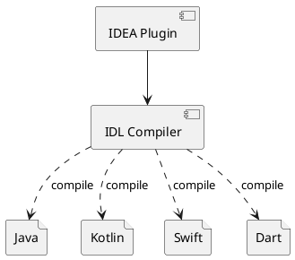

Since the 2019 GDD, *Flutter* has become a rising star in mobile development. Thanks to its unique design, it far outpaces *React Native*, *Weex*, and other cross-platform frameworks in both performance and developer experience. However, migrating from an existing native tech stack to *Flutter* has a nontrivial cost, so teams typically won't rewrite their entire native architecture -- instead, they'll pilot *Flutter* with non-core features first.

When *Flutter* is used alongside native tech stacks in hybrid development, cross-language communication becomes a major challenge. *Flutter* uses *Dart* (a language I evaluated in 2013 while doing technology selection for a *Cloud IDE* at *SAMSUNG*). Originally designed for the web as a replacement for *JavaScript*, *Dart* has since absorbed features from *Java*, *JavaScript*, and other popular languages. But interoperability between languages has always been a sore point.

To address cross-language invocation, *Dart* provides [FFI (Foreign Function Interface)](https://api.dart.dev/dev/dart-ffi/dart-ffi-library.html) support, allowing *Dart* to call C/C++ APIs directly.

On the two major mobile platforms, *iOS*'s *Objective-C* is a superset of *C*, so cross-language communication comes naturally. But *Android*'s development languages are *Java/Kotlin*, and achieving communication between *Dart* and *Java/Kotlin* requires some detours.

## Language Specification

Since *Flutter* hybrid development involves cross-language calls between *Dart* and *Java/Kotlin* as well as *Objective-C/Swift*, we need a more abstract language to express the communication protocol. [IDL (Interface Description Language)](https://en.wikipedia.org/wiki/Interface_description_language) was designed precisely for this purpose. Here's a simple *IDL* example:

```
interface Greeting {

    void hello(msg: string);

}
```

## Specification Implementation

With *IDL* defining the interfaces, we still need implementations in each target language. *Dart* supports two communication mechanisms:

1. [FFI](https://api.dart.dev/dev/dart-ffi/dart-ffi-library.html)

    Since [FFI](https://api.dart.dev/dev/dart-ffi/dart-ffi-library.html) only provides communication between *Dart* and *C/C++*, calling *Java APIs* requires *JNI* as a bridge:

    ```plantuml
    @startuml
    agent Dart as dart
    agent "Java / Kotlin" as jvm

    rectangle <<Shared Library>> {
      agent "Foreign Function Interface" as ffi
      agent "Jave Native Interface"      as jni
    }

    dart ---> ffi
    ffi  -l-> jni
    jni  -u--> jvm

    jvm -d--> jni
    jni -r-> ffi
    ffi -u--> dart
    @enduml
    ```

1. [Platform Channels](https://flutter.dev/docs/development/platform-integration/platform-channels)

    The [Platform Channels](https://flutter.dev/docs/development/platform-integration/platform-channels) based implementation is similar to [FFI](https://api.dart.dev/dev/dart-ffi/dart-ffi-library.html):

    ```plantuml
    @startuml
    agent Dart as dart
    agent "Java / Kotlin" as jvm

    rectangle <<Method Channel>> {
      agent "MethodChannel" <<Dart>> as dmc
      agent "MethodChannel" <<Java>> as jmc
    }

    dart ---> dmc
    dmc  .l.> jmc
    jmc  -u--> jvm

    jvm -d--> jmc
    jmc .r.> dmc
    dmc -u--> dart
    @enduml
    ```

## Compiler

[IDL (Interface Description Language)](https://en.wikipedia.org/wiki/Interface_description_language) is merely a specification description without implementation. To actually invoke the `Greeting` interface above, you need implementations in the target languages. For example, to call `Greeting` from *Java*, you need a *Java* interface definition like this:

```java
interface Greeting {

    void hello(String msg);

}
```

To call the `Greeting` interface from *Dart*, you need a *Dart* interface definition like this:

```dart
abstract class Greeting {

    void hello(String msg);

}
```

Therefore, a compiler is needed to generate target-language APIs from the *IDL*. For a more convenient *Flutter* hybrid development experience in an IDE, you'd also need IDE plugin support. For *IntelliJ IDEA* and *Android Studio*, that means developing an *IDEA* plugin to compile *IDL* files.



If we base the cross-language communication on *Platform Channels*, how should the compiler generate the implementations? Using the *IDL* example above, the generated implementations would look roughly like this:

*Greeting.java*

```java
interface Greeting {

    void hello(String msg);

    class Stub extends Interop implements Greeting {

        public Stub() {
            super("Greeting");
        }

        public void hello(String msg) {
            final Invocation invocation = new InvocationBuilder()
                    .setMethodName("hello")
                    .setReturnType(void.class)
                    .putString("msg", msg)
                    .build()
            this.invoke(invocation);
        }

    }

}
```

*Greeting.dart*

```dart
abstract class Greeting {

    void hello(String msg);

}
```

*GreetingStub.dart*

```dart
abstract class GreetingStub implements Greeting {

    GreetingStub(MethodChannel channel) {
        channel.setMessageHandler(_handleGreeting);
    }

    Future<dynamic> _handleGreeting(MethodCall call) async {
        final List<dynamic> args = call.arguments;
        final Invocation invocation = args[0];

        switch (invocation.signature) {
            case 'hello(String)V': {
                this.hello(invocation.args[0]);
            }
            default:
                throw NoSuchMethodException("hello
        }
    }

}
```

On the *Java* side, you can call *Dart* methods like this:

*GreetingService.java*

```java
class GreetingService {

    public void hello() {
        final Greeting.Stub stub = new Greeting.Stub();
        stub.hello("Happy New Year!");
    }

}
```

On the *Dart* side, you can respond to calls from the *Java* side like this:

```dart
GreetingStub stub = new GreetingStub(channel) {
    void hello(String msg) {
        // TODO responds to Java side
    }
};
```
