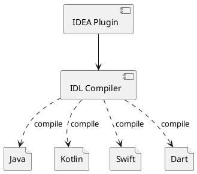

自 2019 年的 GDD 之后，*Flutter* 成为了移动端的一颗耀眼的新星，由于其独特的设计，在性能和开发体验上远超 *React Native* 、*Weex* 等一些跨端开发框架，然而，从现有的原生技术栈切到 *Flutter* 是有一定的成本的，所以，不太可能推翻原有的原生架构，都会先拿非核心业务来试试水。

当 *Flutter* 与原生技术栈一起混合开发时，跨语言通信是一个大问题，由于 *Flutter* 采用的是 *Dart* 语言（2013 年我在 *SAMSUNG* 做 *Cloud IDE* 技术方案选型时调研过），这门语言最开始是为 Web 而设计的，最初的目标是为了替代 *JavaScript* ，后来，经过几年的发展，集成了 *Java*  、*JavaScript* 等一些比较流行的语言的特点，但是，在语言间的互操作性上一直是硬伤。

为了解决跨语言调用的问题，*Dart* 提供了 [FFI (Foreign Function Interface)](https://api.dart.dev/dev/dart-ffi/dart-ffi-library.html) 支持，允许 *Dart* 直接调用 C/C++ API。

移动端两大平台中，*iOS* 的开发语言 *Objective-C* 本身就是 *C* 的超集，自然可以很好的实现语言间的通信问题，但是 *Android* 的开发语言是 *Java/Kotlin* ，要实现 *Dart* 与 *Java/Kotlin* 之间的通信，得走一些弯路。

## 语言规范

由于 *Flutter* 跨语言混合开发涉到及 *Dart* 与 *Java/Kotlin* 、*Objective-C/Swift* 之间的互相调用，所以，需要一种更抽象的语言来表达语言间的通信协议，而 [IDL (Interface Description Language)](https://en.wikipedia.org/wiki/Interface_description_language) 正是为了解决这一问题而生的，以下是一个简单的 *IDL* 例子：

```
interface Greeting {

    void hello(msg: string);

}
```

## 规范实现

有了 *IDL* 来定义接口，还需要对应语言的实现，*Dart* 支持两种通信方式：

1. [FFI](https://api.dart.dev/dev/dart-ffi/dart-ffi-library.html)

    由于 [FFI](https://api.dart.dev/dev/dart-ffi/dart-ffi-library.html) 只是 *Dart* 与 *C/C++* 之间的通信机制，如果要调用 *Java API* ，需要 *JNI* 来搭桥：
    
    ```plantuml
    @startuml
    agent Dart as dart
    agent "Java / Kotlin" as jvm

    rectangle <<Shared Library>> {
      agent "Foreign Function Interface" as ffi
      agent "Jave Native Interface"      as jni
    }

    dart ---> ffi
    ffi  -l-> jni
    jni  -u--> jvm

    jvm -d--> jni
    jni -r-> ffi
    ffi -u--> dart
    @enduml
    ```

1. [Platform Channels](https://flutter.dev/docs/development/platform-integration/platform-channels)

    基于 [Platform Channels](https://flutter.dev/docs/development/platform-integration/platform-channels) 的实现同 [FFI](https://api.dart.dev/dev/dart-ffi/dart-ffi-library.html) 类似：

    ```plantuml
    @startuml
    agent Dart as dart
    agent "Java / Kotlin" as jvm

    rectangle <<Method Channel>> {
      agent "MethodChannel" <<Dart>> as dmc
      agent "MethodChannel" <<Java>> as jmc
    }

    dart ---> dmc
    dmc  .l.> jmc
    jmc  -u--> jvm

    jvm -d--> jmc
    jmc .r.> dmc
    dmc -u--> dart
    @enduml
    ```

## 编译器

[IDL (Interface Description Language)](https://en.wikipedia.org/wiki/Interface_description_language) 只是一种规划的描述，并没有实现，如果想要调用上面的 `Greeting` 接口，需要有对应的语言的实现，比如，想要在 *Java* 中调用 `Greeting` 就需要有像这样的 *Java* 接口定义：

```java
interface Greeting {

    void hello(String msg);

}
```

如果要在 *Dart* 中调用 `Greeting` 接口，就需要有像这样的 *Dart* 接口定义：

```dart
abstract class Greeting {

    void hello(String msg);

}
```

因此，需要一个编译器来根据 *IDL* 生成指定的语言的 *API*，如果想要在 *IDE* 中更方便的进行 *Flutter* 混合开发，还需要有 IDE 插件的支持，像常用的 *IntelliJ IDEA* 、*Android Studio* 需要开发相应的 *IDEA* 插件来编译 *IDL* 文件。



如果基于 *Platform Channels* 来实现跨语言的通信，编译器应该如何生成相应的实现呢？还是以上面的 *IDL* 为例，生成的的实现大致如下：

*Greeting.java*

```java
interface Greeting {

    void hello(String msg);
    
    class Stub extends Interop implements Greeting {
    
        public Stub() {
            super("Greeting");
        }
        
        public void hello(String msg) {
            final Invocation invocation = new InvocationBuilder()
                    .setMethodName("hello")
                    .setReturnType(void.class)
                    .putString("msg", msg)
                    .build()
            this.invoke(invocation);
        }
    
    }

}
```

*Greeting.dart*

```dart
abstract class Greeting {

    void hello(String msg);

}
```

*GreetingStub.dart*

```dart
abstract class GreetingStub implements Greeting {

    GreetingStub(MethodChannel channel) {
        channel.setMessageHandler(_handleGreeting);
    }

    Future<dynamic> _handleGreeting(MethodCall call) async {
        final List<dynamic> args = call.arguments;
        final Invocation invocation = args[0];

        switch (invocation.signature) {
            case 'hello(String)V': {
                this.hello(invocation.args[0]);
            }
            default:
                throw NoSuchMethodException("hello
        }
    }

}
```

在 *Java* 侧，我们就可以这样去调用 *Dart* 的方法了：

*GreetingService.java*

```java
class GreetingService {

    public void hello() {
        final Greeting.Stub stub = new Greeting.Stub();
        stub.hello("Happy New Year!");
    }

}
```

在 *Dart* 侧，我们可以这样响应来自 *Java* 侧的调用：

```dart
GreetingStub stub = new GreetingStub(channel) {
    void hello(String msg) {
        // TODO responds to Java side
    }
};
```
