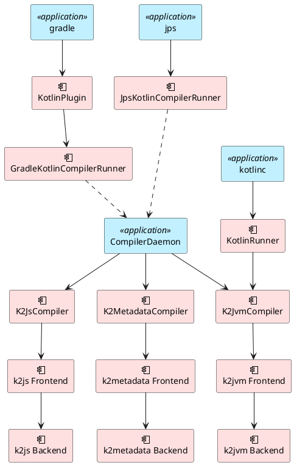
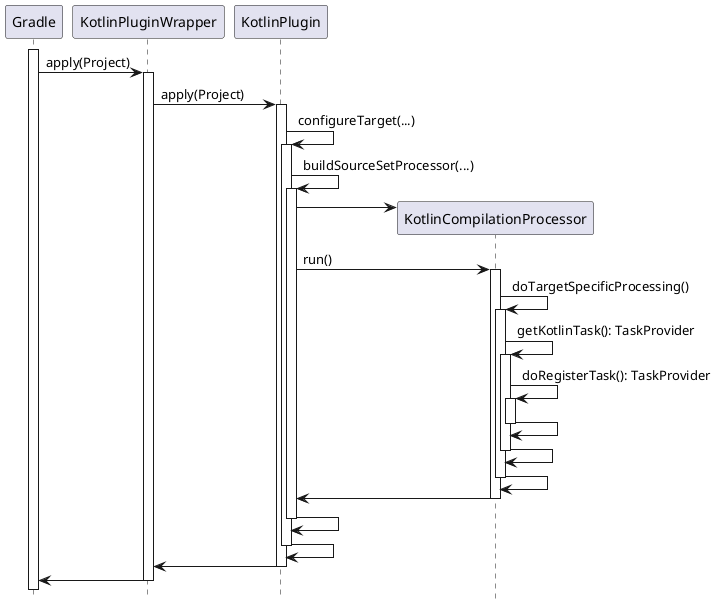

One weekend I was browsing *GitHub* at home when a WeChat message popped up: "Hey, how do Kotlin compiler plugins like *ksp* and *allopen* actually get loaded? I've been staring at the code for hours and I'm totally lost." I thought to myself, "It's probably SPI-based plugin loading, nine times out of ten." So I quickly pulled up the [JetBrains/Kotlin](https://github.com/JetBrains/kotlin) repo, found [KotlinGradleSubplugin.kt](https://github.com/JetBrains/kotlin/blob/master/libraries/tools/kotlin-gradle-plugin-api/src/main/kotlin/org/jetbrains/kotlin/gradle/plugin/KotlinGradleSubplugin.kt), and sent him a screenshot of the code, pretending I knew it all along.

"I've already seen that. What I want to know is *when* exactly the [all-open](https://kotlinlang.org/docs/reference/compiler-plugins.html#all-open-compiler-plugin) plugin modifies class modifiers."

Well... I couldn't bluff my way through that one. So I cloned the [JetBrains/Kotlin](https://github.com/JetBrains/kotlin) repo and started digging in earnest.

## PluginCliParser

After some educated guessing, I found this code in [PluginCliParsers.kt](https://github.com/JetBrains/kotlin/blob/master/compiler/cli/src/org/jetbrains/kotlin/cli/jvm/plugins/PluginCliParser.kt):

```kotlin
object PluginCliParser {

    @JvmStatic
    fun loadPlugins(pluginClasspaths: Iterable<String>?, pluginOptions: Iterable<String>?, configuration: CompilerConfiguration) {
        val classLoader = URLClassLoader(
            pluginClasspaths
                ?.map { File(it).toURI().toURL() }
                ?.toTypedArray()
                ?: emptyArray(),
            this::class.java.classLoader
        )

        val componentRegistrars = ServiceLoaderLite.loadImplementations(ComponentRegistrar::class.java, classLoader)
        configuration.addAll(ComponentRegistrar.PLUGIN_COMPONENT_REGISTRARS, componentRegistrars)

        processPluginOptions(pluginOptions, configuration, classLoader)
    }

}
```

Just as I expected -- plugins are loaded via *SPI*. The only difference is that instead of using *ServiceLoader* directly, they use [ServiceLoaderLite.kt](https://github.com/JetBrains/kotlin/blob/master/compiler/cli/src/org/jetbrains/kotlin/cli/jvm/plugins/ServiceLoaderLite.kt). Let's see how it differs from the JDK's *ServiceLoader*.

## ServiceLoaderLite

The code comment tells the whole story -- it's because of a *JDK 8* bug: [*ServiceLoader* file handle leak](https://bugs.openjdk.java.net/browse/JDK-8156014).

```kotlin
/**
 * ServiceLoader has a file handle leak in JDK8: https://bugs.openjdk.java.net/browse/JDK-8156014.
 * This class, hopefully, doesn't. :)
 */
object ServiceLoaderLite {
    private const val SERVICE_DIRECTORY_LOCATION = "META-INF/services/"

    ...

    fun <Service> loadImplementations(service: Class<out Service>, classLoader: URLClassLoader): List<Service> {
        val files = classLoader.urLs.map { url ->
            try {
                Paths.get(url.toURI()).toFile()
            } catch (e: FileSystemNotFoundException) {
                throw IllegalArgumentException("Only local URLs are supported, got ${url.protocol}")
            } catch (e: UnsupportedOperationException) {
                throw IllegalArgumentException("Only local URLs are supported, got ${url.protocol}")
            }
        }

        return loadImplementations(service, files, classLoader)
    }

    ...

    private fun findImplementationsInJar(classId: String, file: File): Set<String> {
        ZipFile(file).use { zipFile ->
            val entry = zipFile.getEntry(SERVICE_DIRECTORY_LOCATION + classId) ?: return emptySet()
            zipFile.getInputStream(entry).use { inputStream ->
                return inputStream.bufferedReader().useLines { parseLines(file, it) }
            }
        }
    }

    ....

}
```

Looking at the implementation, [ServiceLoaderLite.kt](https://github.com/JetBrains/kotlin/blob/master/compiler/cli/src/org/jetbrains/kotlin/cli/jvm/plugins/ServiceLoaderLite.kt) iterates through all JAR files on the *URLClassLoader*'s classpath to find SPI configuration files directly.

## Kotlin Compiler Architecture

The entire *Kotlin* compiler is split into a *front-end* and a *back-end*. The back-end is mainly responsible for generating platform-specific code, while all platform-independent work is handled by the front-end. The overall structure looks like this:



There are three ways to launch the *Kotlin* compiler:

1. Kotlin Gradle Plugin
1. [JPS (JetBrains Project System)](https://github.com/JetBrains/intellij-community/tree/master/jps) -- a build framework developed by *JetBrains* based on [Gant](https://github.com/Gant/Gant), primarily used in the *JetBrains* IDEA product family
1. The *kotlinc* command

### Kotlin Gradle Plugin

In everyday development, most of us use *Kotlin* within a *Gradle* environment. The startup flow of the *Kotlin* Gradle plugin looks like this:



### Kotlin Compiler Plugin

The *Kotlin* compiler provides a set of extension interfaces that allow developers to build plugins on top of it. Official plugins include:

1. [all-open](https://kotlinlang.org/docs/reference/compiler-plugins.html#all-open-compiler-plugin)
1. [no-arg](https://kotlinlang.org/docs/reference/compiler-plugins.html#no-arg-compiler-plugin)
1. [SAM-with-receiver](https://kotlinlang.org/docs/reference/compiler-plugins.html#sam-with-receiver-compiler-plugin)
1. [Parcelable implementations generator](https://kotlinlang.org/docs/reference/compiler-plugins.html#parcelable-implementations-generator)

Beyond these, there is also Google's [KSP (Kotlin Symbol Processing API)](https://github.com/google/ksp). The extension interfaces provided by the *Kotlin* compiler include:

1. [KotlinGradleSubplugin](https://github.com/JetBrains/kotlin/blob/master/libraries/tools/kotlin-gradle-plugin-api/src/main/kotlin/org/jetbrains/kotlin/gradle/plugin/KotlinGradleSubplugin.kt)

    This is mainly used by the *Kotlin Gradle* plugin. Since compiler plugins don't depend on *Gradle*, the Gradle plugin needs to load them. `KotlinGradleSubplugin` is responsible for configuring the compiler plugin's dependencies and any compilation options the compiler needs.

1. [ComponentRegistrar](https://github.com/JetBrains/kotlin/blob/master/compiler/plugin-api/src/org/jetbrains/kotlin/compiler/plugin/ComponentRegistrar.kt)

    This registers *Compiler Extensions* with the compiler (not the kind of *Extension* in *Android Gradle Plugin*). Compiler Extensions come in both *front-end* and *back-end* varieties.

    *Front-End* Extensions include:

    1. [AnnotationBasedExtension](https://github.com/JetBrains/kotlin/blob/master/compiler/frontend/src/org/jetbrains/kotlin/extensions/AnnotationBasedExtension.kt)
    1. [CollectAdditionalSourcesExtension](https://github.com/JetBrains/kotlin/blob/master/compiler/frontend/src/org/jetbrains/kotlin/extensions/CollectAdditionalSourcesExtension.kt)
    1. [CompilerConfigurationExtension](https://github.com/JetBrains/kotlin/blob/master/compiler/frontend/src/org/jetbrains/kotlin/extensions/CompilerConfigurationExtension.kt)
    1. [DeclarationAttributeAltererExtension](https://github.com/JetBrains/kotlin/blob/master/compiler/frontend/src/org/jetbrains/kotlin/extensions/DeclarationAttributeAltererExtension.kt)
    1. [PreprocessedVirtualFileFactoryExtension](https://github.com/JetBrains/kotlin/blob/master/compiler/frontend/src/org/jetbrains/kotlin/extensions/PreprocessedVirtualFileFactoryExtension.kt)
    1. ...

    *Back-End* Extensions include:

    1. [ClassBuilderInterceptorExtension](https://github.com/JetBrains/kotlin/blob/master/compiler/backend/src/org/jetbrains/kotlin/codegen/extensions/ClassBuilderInterceptorExtension.kt)
    1. [ExpressionCodegenExtension](https://github.com/JetBrains/kotlin/blob/master/compiler/backend/src/org/jetbrains/kotlin/codegen/extensions/ExpressionCodegenExtension.kt)
    1. ...

1. [CommandLineProcessor](https://github.com/JetBrains/kotlin/blob/master/compiler/plugin-api/src/org/jetbrains/kotlin/compiler/plugin/CommandLineProcessor.kt)

    This handles arguments passed to the plugin via the command line, in the format: `-P plugin:<plugin-id>:<key>=<value>`.

## kotlinc

The rough startup process of *kotlinc* is shown in the diagram below. Since the full process is quite complex, some details have been omitted to help you understand how *kotlinc* works more quickly:


## Closing Thoughts

With an understanding of the overall *Kotlin* compiler architecture, we can build our own plugins on top of it. *Kotlin* was designed with language interoperability baked into its syntax, and the compiler's extensibility opens up virtually limitless possibilities.
