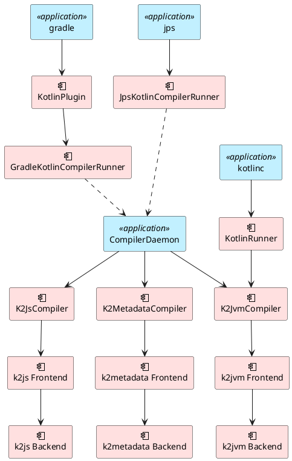
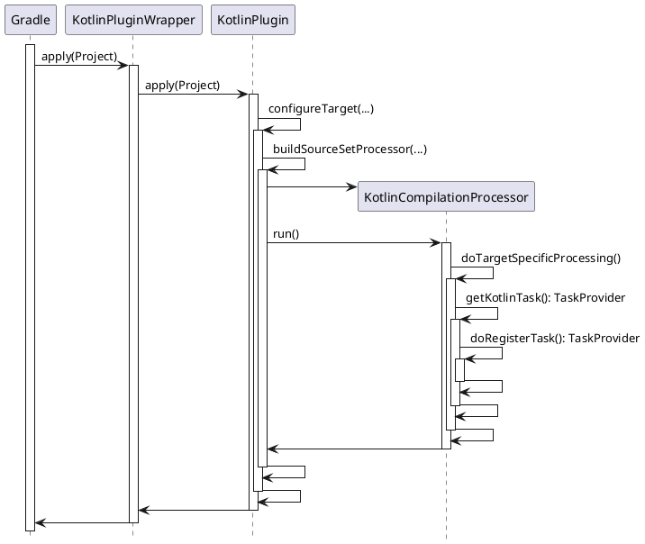

周末在家正刷着 *GitHub* 呢，朋友发来消息：“森哥，像 *ksp* , *allopen* 这些 *Kotlin* 的编译器插件，它们是怎么 *run* 起来的，看了半天一头雾水”，我心想，不应该呀，十有八九是通过 *SPI* 来实现插件的加载的“，于是，我赶紧瞅了一眼 [JetBrains/Kotlin](https://github.com/JetBrains/kotlin) 的代码，找到了 [KotlinGradleSubplugin.kt](https://github.com/JetBrains/kotlin/blob/master/libraries/tools/kotlin-gradle-plugin-api/src/main/kotlin/org/jetbrains/kotlin/gradle/plugin/KotlinGradleSubplugin.kt)，于是，假装很懂的样子，发了一个 [KotlinGradleSubplugin.kt](https://github.com/JetBrains/kotlin/blob/master/libraries/tools/kotlin-gradle-plugin-api/src/main/kotlin/org/jetbrains/kotlin/gradle/plugin/KotlinGradleSubplugin.kt) 的代码截图给他。

“这个我看过了，我想知道 [all-open](https://kotlinlang.org/docs/reference/compiler-plugins.html#all-open-compiler-plugin) 这个插件究竟是在什么时候修改类的修饰符的”

呃。。。，看来，是编不下去了，只好 *clone* 了 [JetBrains/Kotlin](https://github.com/JetBrains/kotlin) 的代码下来开始仔细研究。

## PluginCliParser

经过一番连蒙带猜，在 [PluginCliParsers.kt](https://github.com/JetBrains/kotlin/blob/master/compiler/cli/src/org/jetbrains/kotlin/cli/jvm/plugins/PluginCliParser.kt) 中发现了这段代码：

```kotlin
object PluginCliParser {

    @JvmStatic
    fun loadPlugins(pluginClasspaths: Iterable<String>?, pluginOptions: Iterable<String>?, configuration: CompilerConfiguration) {
        val classLoader = URLClassLoader(
            pluginClasspaths
                ?.map { File(it).toURI().toURL() }
                ?.toTypedArray()
                ?: emptyArray(),
            this::class.java.classLoader
        )

        val componentRegistrars = ServiceLoaderLite.loadImplementations(ComponentRegistrar::class.java, classLoader)
        configuration.addAll(ComponentRegistrar.PLUGIN_COMPONENT_REGISTRARS, componentRegistrars)

        processPluginOptions(pluginOptions, configuration, classLoader)
    }

}
```

果然不出所料，是通过 *SPI* 来加载插件的，只不过没有直接用 *ServiceLoader* ，而是用的 [ServiceLoaderLite.kt](https://github.com/JetBrains/kotlin/blob/master/compiler/cli/src/org/jetbrains/kotlin/cli/jvm/plugins/ServiceLoaderLite.kt)，来看看它跟 *JDK* 提供的 *ServiceLoader* 有什么不一样。

## ServiceLoaderLite

代码注释写得很清楚，原来是因为 *JDK 8* 的 bug --- [*ServiceLoader* 文件句柄泄露](https://bugs.openjdk.java.net/browse/JDK-8156014) 🤣

```kotlin
/**
 * ServiceLoader has a file handle leak in JDK8: https://bugs.openjdk.java.net/browse/JDK-8156014.
 * This class, hopefully, doesn't. :)
 */
object ServiceLoaderLite {
    private const val SERVICE_DIRECTORY_LOCATION = "META-INF/services/"

    ...

    fun <Service> loadImplementations(service: Class<out Service>, classLoader: URLClassLoader): List<Service> {
        val files = classLoader.urLs.map { url ->
            try {
                Paths.get(url.toURI()).toFile()
            } catch (e: FileSystemNotFoundException) {
                throw IllegalArgumentException("Only local URLs are supported, got ${url.protocol}")
            } catch (e: UnsupportedOperationException) {
                throw IllegalArgumentException("Only local URLs are supported, got ${url.protocol}")
            }
        }

        return loadImplementations(service, files, classLoader)
    }

    ...

    private fun findImplementationsInJar(classId: String, file: File): Set<String> {
        ZipFile(file).use { zipFile ->
            val entry = zipFile.getEntry(SERVICE_DIRECTORY_LOCATION + classId) ?: return emptySet()
            zipFile.getInputStream(entry).use { inputStream ->
                return inputStream.bufferedReader().useLines { parseLines(file, it) }
            }
        }
    }

    ....

}
```

从实现来看，[ServiceLoaderLite.kt](https://github.com/JetBrains/kotlin/blob/master/compiler/cli/src/org/jetbrains/kotlin/cli/jvm/plugins/ServiceLoaderLite.kt) 是直接从 *URLClassLoader* 的 *classpath* 来遍历所有的 *JAR* 文件中的 *SPI* 配置文件。

## Kotlin Compiler 架构

整个 *Kotlin* 编译器分为 *front-end* 和 *back-end* ，*back-end* 主要工作是生成平台相关的代码，平台无关的工作基本上都是由 *front-end* 来完成，其结构如下图所示：



*Kotlin* 的编译器有三种启动方式：

1. Kotlin Gradle Plugin
1. [JPS (Jetbrains Project System)](https://github.com/JetBrains/intellij-community/tree/master/jps) --- *JetBrains* 基于 [Gant](https://github.com/Gant/Gant) 开发的一款构建框架，主要用在 *JetBrains* 的 *IDEA* 全家桶中
1. *kotlinc* 命令

### Kotlin Gradle Plugin

平常我们使用 *Kotlin* 基本上都是在 *Gradle* 环境中使用，而 *Kotlin* 的 *Gradle* 插件启动流程如下图所示：



### Kotlin Compiler Plugin

*Kotlin* 编译器本身提供了一些扩展接口，允许开发者基于 *Kotlin* 编译器开发一些插件，像官方提供的插件有：

1. [all-open](https://kotlinlang.org/docs/reference/compiler-plugins.html#all-open-compiler-plugin)
1. [no-arg](https://kotlinlang.org/docs/reference/compiler-plugins.html#no-arg-compiler-plugin)
1. [SAM-with-receiver](https://kotlinlang.org/docs/reference/compiler-plugins.html#sam-with-receiver-compiler-plugin)
1. [Parcelable implementations generator](https://kotlinlang.org/docs/reference/compiler-plugins.html#parcelable-implementations-generator)

除此之外，还有 *Google* 推出的 [KSP (Kotlin Symbol Processing API)](https://github.com/google/ksp)，*Kotlin* 编译器提供的扩展接口有：

1. [KotlinGradleSubplugin](https://github.com/JetBrains/kotlin/blob/master/libraries/tools/kotlin-gradle-plugin-api/src/main/kotlin/org/jetbrains/kotlin/gradle/plugin/KotlinGradleSubplugin.kt)

    主要是给 *Kotlin Gradle* 插件用，因为 *Compiler* 插件是不依赖于 *Gradle* 的，所以，需要由 *Gradle* 插件将 *Compiler* 插件加载进来，`KotlinGradleSubplugin` 就是用来配置 *Compiler* 对应的依赖，以及一些 *Compiler* 要用到的编译选项。

1. [ComponentRegistrar](https://github.com/JetBrains/kotlin/blob/master/compiler/plugin-api/src/org/jetbrains/kotlin/compiler/plugin/ComponentRegistrar.kt)

    主要是向 *Compiler* 注册一些 *Compiler Extension* (不是 *Android Gradle Plugin* 的那种 *Extension*)，*Compiler Extension* 既有 *front-end* 的，也有 *back-end* 的。

    *Front-End* 的 *Extension* 有：

    1. [AnnotationBasedExtension](https://github.com/JetBrains/kotlin/blob/master/compiler/frontend/src/org/jetbrains/kotlin/extensions/AnnotationBasedExtension.kt)
    1. [CollectAdditionalSourcesExtension](https://github.com/JetBrains/kotlin/blob/master/compiler/frontend/src/org/jetbrains/kotlin/extensions/CollectAdditionalSourcesExtension.kt)
    1. [CompilerConfigurationExtension](https://github.com/JetBrains/kotlin/blob/master/compiler/frontend/src/org/jetbrains/kotlin/extensions/CompilerConfigurationExtension.kt)
    1. [DeclarationAttributeAltererExtension](https://github.com/JetBrains/kotlin/blob/master/compiler/frontend/src/org/jetbrains/kotlin/extensions/DeclarationAttributeAltererExtension.kt)
    1. [PreprocessedVirtualFileFactoryExtension](https://github.com/JetBrains/kotlin/blob/master/compiler/frontend/src/org/jetbrains/kotlin/extensions/PreprocessedVirtualFileFactoryExtension.kt)
    1. ...

    *Back-End* 的 *Extension* 有：

    1. [ClassBuilderInterceptorExtension](https://github.com/JetBrains/kotlin/blob/master/compiler/backend/src/org/jetbrains/kotlin/codegen/extensions/ClassBuilderInterceptorExtension.kt)
    1. [ExpressionCodegenExtension](https://github.com/JetBrains/kotlin/blob/master/compiler/backend/src/org/jetbrains/kotlin/codegen/extensions/ExpressionCodegenExtension.kt)
    1. ...

1. [CommandLineProcessor](https://github.com/JetBrains/kotlin/blob/master/compiler/plugin-api/src/org/jetbrains/kotlin/compiler/plugin/CommandLineProcessor.kt)

    主要是用来处理通过命令行传递给插件的参数，格式为：`-P plugin:<plugin-id>:<key>=<value>`。

## kotlinc

*kotlinc* 的大致的启动过程如下图所示，由于过程太过复杂，省略了一些细节，以便于帮忙大家更快的理解 *kotlinc* 是如何工作的：


## 结语

了解了 *Kotlin* 编译器的整体架构，我们就可以基于 *Kotlin* 编译器来开发自己的插件了，而且，*Kotlin* 从语法上就具备了语言间的互操作性，加上 *Kotlin* 编译器的可扩展能力，这给了我们无限的想像空间。
