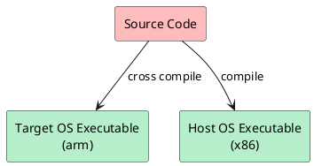
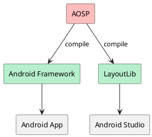
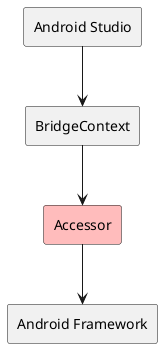
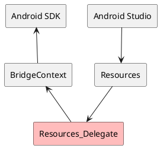

Yes, you read that right -- running Android code on JVM, without an emulator or any virtualization technology. Curious how it works? Let's go step by step.

## Inspired by Android Studio

As Android engineers, we use Android Studio's visual editor to write UI every day. Have you ever wondered how the visual designer implements its preview functionality? Android Studio not only provides a preview, but also lets you drag and drop UI widgets and syncs the changes back to code. The underlying principle was mentioned in my earlier post [How Engineers Grow](/2020/08/09/engineer-growth/) -- what you see rendered in the IDE is really just an image.

So here's the question: how does that rendered preview image in the IDE look exactly the same as the image rendered on a real device?

The industry's standard approach is to share the same codebase -- the code running on the device and the code rendering in the IDE are one and the same:



> Does Android Studio follow this approach too?

> Absolutely. Here's how it works for Android:



## Layout Lib

From the diagram above, we can see that Android Studio depends on [LayoutLib](https://android.googlesource.com/platform/frameworks/layoutlib/+/refs/heads/main) rather than the Android Framework directly. So what is the relationship between [LayoutLib](https://android.googlesource.com/platform/frameworks/layoutlib/+/refs/heads/main) and the Android Framework?

Simply put, LayoutLib **==** Android Framework. They are build artifacts from AOSP targeting different platforms. To run Android code on JVM, besides the [LayoutLib](https://android.googlesource.com/platform/frameworks/layoutlib/+/refs/heads/main) JAR, you also need Android system resources. On a device, system resources are built in, but how do you solve the resource problem on JVM? And what about `native` method calls in the Android Framework?

### Bridge

Although different platforms share the same codebase, there are inevitably some differences in the underlying implementations. To address this, [LayoutLib](https://android.googlesource.com/platform/frameworks/layoutlib/+/refs/heads/main) provides platform-specific adaptations for the differences between Android devices and JVM. But how do these JVM-specific adaptations connect back to the Android Framework?

This is where [bridge](https://android.googlesource.com/platform/frameworks/layoutlib/+/refs/heads/main/bridge/) comes in. The bridging work consists of two main parts: **Accessor** and **Delegate**.

#### Accessor

Since the JVM-specific implementation needs to access some non-`public` methods in the Android Framework, an **Accessor** method is implemented for each method that needs to be accessed. The [bridge](https://android.googlesource.com/platform/frameworks/layoutlib/+/refs/heads/main/bridge/) implementation then uses **Accessors** to invoke non-`public` APIs in the **Android Framework**.



#### Delegate

Since the JVM-specific implementation needs to override certain method implementations in the **Android Framework**, the concept of `Delegate` was introduced. Some methods that originally called the **Android Framework** are replaced with their corresponding `Delegate` implementations -- similar to the concept of [Shadows](https://robolectric.org/extending/) in *Robolectric*. This replacement is performed by the [create](https://android.googlesource.com/platform/frameworks/layoutlib/+/refs/heads/main/create/README.txt) tool, which uses bytecode manipulation to replace method calls with their corresponding `Delegate` methods based on preconfigured rules. [Resources_Delegate](https://android.googlesource.com/platform/frameworks/layoutlib/+/refs/heads/main/bridge/src/android/content/res/Resources_Delegate.java) is a typical example.



## AAR Dependencies

[LayoutLib](https://android.googlesource.com/platform/frameworks/layoutlib/+/refs/heads/main) solves the problem of calling the **Android Framework** on JVM. However, to run an app's code on JVM, you also need to handle AAR dependencies -- at the very least, you need to resolve calls to *JetPack* libraries. So how does a *Java/Kotlin* project depend on *AAR*?

In *Gradle*, a *Java/Kotlin* project's `api` or `implementation` configurations can only depend on *JAR* files -- *AAR* cannot be used directly. So what can we do?

The most straightforward approach is to manually extract *classes.jar* from the *AAR* and add it as a local dependency of the *Java/Kotlin* project. But the dependency graph of *JetPack* is incredibly complex. Manual management is doable, but as soon as you need to upgrade a dependency version, you have to redo everything from scratch. Is there a more convenient way?

### TransformAction

Of course there is. Using *Gradle*'s `TransformAction`, you can transform *AAR* into *JAR*. Here's the code:

```kotlin
@DisableCachingByDefault
abstract class AarTransform : TransformAction<TransformParameters.None> {

    @get:InputArtifact
    @get:PathSensitive(PathSensitivity.NAME_ONLY)
    abstract val aar: Provider<FileSystemLocation>

    override fun transform(outputs: TransformOutputs) {
        val input = aar.get().asFile
        val outJar = outputs.file("${input.nameWithoutExtension}.jar")
        if (outJar.exists()) {
            outJar.delete()
        }

        println("Transforming $input => $outJar")

        ZipFile(input).use { aar ->
            val classesJar = aar.getEntry("classes.jar")
            val others = setOf(
                "AndroidManifest.xml",
                "R.txt",
                "public.txt",
            ).mapNotNull(aar::getEntry) + aar.entries().asSequence().filterNot {
                it.isDirectory || !it.name.startsWith("res/")
            }

            outJar.outputStream().use { out ->
                JarOutputStream(out).use { jarOut ->
                    // copy classes.jar
                    JarInputStream(aar.getInputStream(classesJar)).use { jarIn ->
                        var entry = jarIn.nextJarEntry
                        while (null != entry) {
                            jarOut.putNextEntry(entry)
                            jarIn.copyTo(jarOut)
                            entry = jarIn.nextJarEntry
                        }
                    }

                    // copy others
                    others.forEach { entry ->
                        val newEntry = JarEntry("AAR-INF/${entry.name}").apply {
                            compressedSize = entry.compressedSize
                            crc = entry.crc
                            method = entry.method
                            size = entry.size
                            time = entry.time
                        }
                        jarOut.putNextEntry(newEntry)
                        aar.getInputStream(entry).copyTo(jarOut)
                    }
                }
            }
        }
    }
}

dependencies {
  registerTransform(AarTransform::class) {
    from.attribute(ARTIFACT_TYPE_ATTRIBUTE, "aar")
    to.attribute(ARTIFACT_TYPE_ATTRIBUTE, "jar")
  }
}
```

### ShadowJar

Then use [Gradle Shadow](https://github.com/johnrengelman/shadow) to merge these *JAR* files into a single *FAT JAR*, while also extracting *AndroidManifest.xml*, *R.txt*, *res/\*\** and other files from the *AAR* into a separate directory for the [bridge](https://android.googlesource.com/platform/frameworks/layoutlib/+/refs/heads/main/bridge/) to access:

```kotlin
val use by configurations.creating {
    attributes.attribute(ARTIFACT_TYPE_ATTRIBUTE, "jar")
}

dependencies {
    use(libs.androidx.appcompat)
    use(libs.androidx.lifecycle.common.java8)
    use(libs.androidx...)
}

val shadowJar by tasks.getting(ShadowJar::class) {
    archiveBaseName.set("libs")
    archiveClassifier.set("all")
    archiveVersion.set(project.version.toString())

    configurations = listOf(use)
    dependencies {
        exclude(dependency(KotlinClosure1<ResolvedDependency, Boolean>({
            moduleGroup == "org.jetbrains.kotlin" && moduleName.startsWith("kotlin-stdlib")
        })))
    }
    exclude("android/support/**")
    exclude("META-INF/**/*.kotlin_module")
    exclude("META-INF/**/*.version")
    exclude("META-INF/**/pom.xml")
    exclude("META-INF/**/pom.properties")
    exclude("AAR-INF/**")

    doLast {
        use.files.forEach { artifact ->
            val dir = "${artifact.nameWithoutExtension}.aar"
            val dest = rootProject.layout.buildDirectory.dir("aars").get().dir(dir).asFile

            println("Extracting ${artifact.name} => $dest")

            copy {
                from(zipTree(artifact)) {
                    include("AAR-INF/**")
                    eachFile {
                        relativePath = RelativePath(true, *relativePath.segments.drop(1).toTypedArray())
                    }
                    includeEmptyDirs = false
                }
                into(dest)
            }
        }
    }
}

artifacts {
    archives(shadowJar)
}
```

Then in the main *Kotlin/Java* project, depend on the *libs* submodule:

```kotlin
dependencies {
    implementation(project(":libs", configuration = "shadow"))
}
```

## GitHub Repo

Enough talk -- want to see what it actually looks like? Here's the link:

> https://github.com/johnsonlee/playground

Follow the project to get notified of updates.
