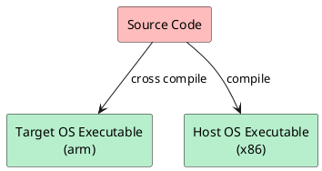
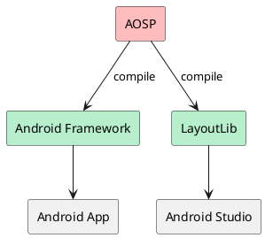
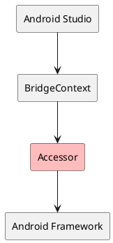
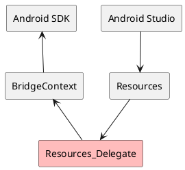

没看错，就是在 JVM 上运行 Android 代码，而且，还不需要模拟器或者虚拟化技术，各位是不是很好奇，究竟如何做到把 Android 的代码跑在 JVM 上？别着急，咱们 step by step。

## Inspired by Android Studio

作为 Android 工程师，每天都在用 Android Studio 的可视化编辑器写 UI，是否有曾想过，Android Studio 的可视化设计器是如何实现预览功能的？Android Studio 不光提供预览功能，还能通过拖拽操作来调整 UI 控件，并同时同步到代码上，其底层原理在我之前的[工程师如何成长](/2020/08/09/engineer-growth/)一文中就有提到，其实，你在 IDE 中看到的渲染效果只是一张图片而已。

那问题来了，那个贴到 IDE 中的渲染效果图是如何做到跟在设备上渲染出来的图像是一模一样的？

业内的做法一般是 —— 共享同一套代码，即在设备上渲染运行的代码跟在 IDE 中渲染所运行的代码是同一套代码：



> Android Studio 也是这个思路吗？

> 没错，Android 也不例外，具体如下图所示：



## Layout Lib

从上图我们不难发现，Android Studio 依赖的 AOSP 的产物是 [LayoutLib](https://android.googlesource.com/platform/frameworks/layoutlib/+/refs/heads/main) 而不是直接依赖 Android Framework，那 [LayoutLib](https://android.googlesource.com/platform/frameworks/layoutlib/+/refs/heads/main) 跟 Android Framework 是什么关系呢？

可以简单的认为 LayoutLib **==** Android Framework，它们是 AOSP 针对不同目标平台的编译产物，想要将 Android 代码在 JVM 上运行起来，除了 [LayoutLib](https://android.googlesource.com/platform/frameworks/layoutlib/+/refs/heads/main) JAR 之外，还需要 Android 的系统资源，在设备上，系统资源已经内置了，那如果在 JVM 上，系统资源的问题怎么解决呢？另外，Android Framework 中的 `native` 方法调用怎么办？

### Bridge

尽管不同的平台共享同一份代码，但在不同的平台上，其底层实现终究还是有些差异的，为了解决这一问题，[LayoutLib](https://android.googlesource.com/platform/frameworks/layoutlib/+/refs/heads/main) 针对 Android 设备与 JVM 的差异，单独进行了适配，但是问题来了，这些单独为 JVM 实现的适配代码如何与 Android Framework 关联上呢？

这时候该 [bridge](https://android.googlesource.com/platform/frameworks/layoutlib/+/refs/heads/main/bridge/) 闪亮登场了，桥接的工作主要由两部分组成：**Accessor** 和 **Delegate**。

#### Accessor

由于针对 JVM 的实现需要访问 Android Framework 中的一些非 `public` 方法，为了解决访问权限的问题，针对需要访问的方法单独实现了一个 **Accessor** 方法，然后，[bridge](https://android.googlesource.com/platform/frameworks/layoutlib/+/refs/heads/main/bridge/) 实现中通过 **Accessor** 来访问 **Android Framework** 中非 `public` API。



#### Delegate

由于针对 JVM 的实现需要改写 **Android Framework** 中的某些方法实现，为了解决这些问题，于是便引入了 `Delegate` 的概念，即将一些原本调用 **Android Framework** 的方法给替换为对应的 `Delegate` 实现，类似于 *Robolectric* 中的 [Shadows](https://robolectric.org/extending/) 的概念，这个过程则是由 [create](https://android.googlesource.com/platform/frameworks/layoutlib/+/refs/heads/main/create/README.txt) 工具来完成，而这些 `Delegate` 类是预先就已经实现好了，[create](https://android.googlesource.com/platform/frameworks/layoutlib/+/refs/heads/main/create/README.txt) 通过字节码操作的方式，根据预先配置好的规则，将对应的方法调用替换为调用相应的 `Delegate` 方法，[Resources_Delegate](https://android.googlesource.com/platform/frameworks/layoutlib/+/refs/heads/main/bridge/src/android/content/res/Resources_Delegate.java) 就是一个典型的例子。



## AAR 依赖

[LayoutLib](https://android.googlesource.com/platform/frameworks/layoutlib/+/refs/heads/main) 解决了在 JVM 上调用 **Android Framework** 的问题，但是，想要将 一个 app 的代码在 JVM 上跑起来，还要解决 AAR 的依赖问题，至少，要解决调用 *JetPack* 库的问题，那 *Java/Kotlin* 工程如何依赖 *AAR* 呢？

在 *Gradle* 中，*Java/Kotlin* 工程的 `api` 或 `implementation` 只能依赖 *JAR* 包，对于 *AAR* 是不能直接使用的，那怎么办？

最最直接的办法，就是手动将 *AAR* 中的 *classes.jar* 提取出来，作为 *Java/Kotlin* 工程的本地依赖，但 *JetPack* 的依赖关系之复杂，手动管理不是不行，但是一旦要升级依赖版本，全部都得从头再来一次，有没有更简便的方式呢？

### TransformAction

既然森哥都这么问了，那肯定是有啦 😉 ，通过 *Gradle* 的 `TransformAction`，便可以将 *AAR* 转换为 *JAR*，废话少说，直接上代码：

```kotlin
@DisableCachingByDefault
abstract class AarTransform : TransformAction<TransformParameters.None> {

    @get:InputArtifact
    @get:PathSensitive(PathSensitivity.NAME_ONLY)
    abstract val aar: Provider<FileSystemLocation>

    override fun transform(outputs: TransformOutputs) {
        val input = aar.get().asFile
        val outJar = outputs.file("${input.nameWithoutExtension}.jar")
        if (outJar.exists()) {
            outJar.delete()
        }

        println("Transforming $input => $outJar")

        ZipFile(input).use { aar ->
            val classesJar = aar.getEntry("classes.jar")
            val others = setOf(
                "AndroidManifest.xml",
                "R.txt",
                "public.txt",
            ).mapNotNull(aar::getEntry) + aar.entries().asSequence().filterNot {
                it.isDirectory || !it.name.startsWith("res/")
            }

            outJar.outputStream().use { out ->
                JarOutputStream(out).use { jarOut ->
                    // copy classes.jar
                    JarInputStream(aar.getInputStream(classesJar)).use { jarIn ->
                        var entry = jarIn.nextJarEntry
                        while (null != entry) {
                            jarOut.putNextEntry(entry)
                            jarIn.copyTo(jarOut)
                            entry = jarIn.nextJarEntry
                        }
                    }

                    // copy others
                    others.forEach { entry ->
                        val newEntry = JarEntry("AAR-INF/${entry.name}").apply {
                            compressedSize = entry.compressedSize
                            crc = entry.crc
                            method = entry.method
                            size = entry.size
                            time = entry.time
                        }
                        jarOut.putNextEntry(newEntry)
                        aar.getInputStream(entry).copyTo(jarOut)
                    }
                }
            }
        }
    }
}

dependencies {
  registerTransform(AarTransform::class) {
    from.attribute(ARTIFACT_TYPE_ATTRIBUTE, "aar")
    to.attribute(ARTIFACT_TYPE_ATTRIBUTE, "jar")
  }
}
```

### ShadowJar

然后通过 [Gradle Shadow](https://github.com/johnrengelman/shadow) 将这些 *JAR* 合并成一个 *FAT JAR* 同时也将 *AAR* 中的 *AndroidManifest.xml*, *R.txt*, *res/\*\** 等文件提取到单独的目录，方便后续让 [bridge](https://android.googlesource.com/platform/frameworks/layoutlib/+/refs/heads/main/bridge/) 访问：

```kotlin
val use by configurations.creating {
    attributes.attribute(ARTIFACT_TYPE_ATTRIBUTE, "jar")
}

dependencies {
    use(libs.androidx.appcompat)
    use(libs.androidx.lifecycle.common.java8)
    use(libs.androidx...)
}

val shadowJar by tasks.getting(ShadowJar::class) {
    archiveBaseName.set("libs")
    archiveClassifier.set("all")
    archiveVersion.set(project.version.toString())

    configurations = listOf(use)
    dependencies {
        exclude(dependency(KotlinClosure1<ResolvedDependency, Boolean>({
            moduleGroup == "org.jetbrains.kotlin" && moduleName.startsWith("kotlin-stdlib")
        })))
    }
    exclude("android/support/**")
    exclude("META-INF/**/*.kotlin_module")
    exclude("META-INF/**/*.version")
    exclude("META-INF/**/pom.xml")
    exclude("META-INF/**/pom.properties")
    exclude("AAR-INF/**")

    doLast {
        use.files.forEach { artifact ->
            val dir = "${artifact.nameWithoutExtension}.aar"
            val dest = rootProject.layout.buildDirectory.dir("aars").get().dir(dir).asFile

            println("Extracting ${artifact.name} => $dest")

            copy {
                from(zipTree(artifact)) {
                    include("AAR-INF/**")
                    eachFile {
                        relativePath = RelativePath(true, *relativePath.segments.drop(1).toTypedArray())
                    }
                    includeEmptyDirs = false
                }
                into(dest)
            }
        }
    }
}

artifacts {
    archives(shadowJar)
}
```

然后在主 *Kotlin/Java* 工程中依赖 *libs* 子模块

```kotlin
dependencies {
    implementation(project(":libs", configuration = "shadow"))
}
```

## GitHub Repo

说了半天，也没看着具体长什么样子，是不是有种隔靴搔痒的感觉？直接上链接: 

> https://github.com/johnsonlee/playground

想要第一时间获取更新通知，请关注本项目。
