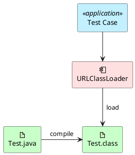
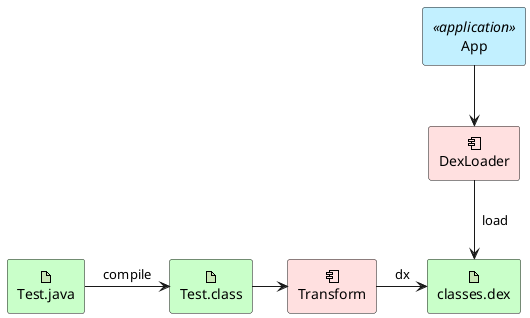
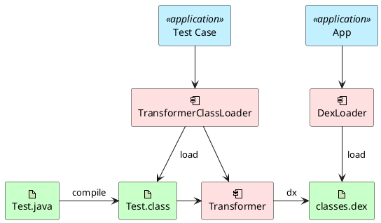

Since bytecode manipulation became widespread on mobile platforms, many app architectures have adopted it. The most typical example is IoC frameworks built with the *Service Locator* pattern. These frameworks all share a similar approach: the less elegant ones use reflection to instantiate objects, while the better ones use *apt* to generate *Factory* code. But they all face the same problem -- they need a static mapping (registry) to resolve implementations from interfaces, and this registry is typically generated at compile time through bytecode manipulation.

## Not Testable

If you've never written unit tests on top of such frameworks, you might not see the problem. To make it concrete, let's first look at how an *App* is built and run versus how *Local UT* (local unit tests) are built and run.

### Local UT Build and Run



### App Build and Run



See the problem?

> *Transform* logic does not execute in the *Local UT* environment!!!

If the IoC framework's static mapping (registry) is generated during *Transform*, then we're in trouble.

That's right -- *Transform* plays no part when running *Local UT*. So how do we solve this?

## Making It Testable

Since *Local UT* doesn't execute *Transform*, we have to take matters into our own hands: make *Local UT* execute *Transform* logic at runtime. But here's the catch -- *AGP*'s native *Transform API* depends on *AGP* itself. How do you run *AGP* in a *Local UT* environment?

> The answer: give up on that path and switch to *Booster Transformer*!

> Why does *Booster Transformer* work?

> Because *Booster*'s *Transformer* was designed to be decoupled from *AGP* from the start! Now you can see the brilliance of *Booster*'s design.

> OK, but how does *Booster Transformer* actually implement *Runtime Transform*?

> Hold on -- let's first revisit the `ClassLoader` from *Java* fundamentals. Looking at its source code:

```java
protected final Class<?> defineClass(String name, byte[] b, int off, int len)
    throws ClassFormatError
{
    return defineClass(name, b, off, len, null);
}
```

Give a `ClassLoader` a `byte[]`, and it gives you back a `Class`. So as long as we can get the raw byte data of a `Class`, we can redefine it. Of course, what we want is to manipulate its bytecode before redefining it. How do we get the raw byte data of a `Class`? -- `ClassLoader` again:

```java
public InputStream getResourceAsStream(String name) {
  ...
}
```

So here's what we need to do:

1. Create a custom `ClassLoader` to load classes
1. During class loading, use *Booster*'s API to invoke existing `Transformer`s
1. Use the custom `ClassLoader` to run *Local UT*

For convenience, we extend `URLClassLoader` directly:

```kotlin
class TransformClassLoader(urls: Array<URL>) : URLClassLoader(urls) {
  private val classpath = urls.map { File(it.path) }

  override fun findClass(name: String): Class<*> {
    val bytecode = readClassData(name)
    return transform(name, bytecode)
  }

  private fun transform(name: String, original: ByteArray): Class<*> {
    val context = object : AbstractTransformContext(
      "test",
      "test",
      emptyList(),
      classpath,
      classpath
    )
    val transformer = AsmTransformer(this)
    transformer.onPreTransform(context)
    val modified = transformer.transform(context, original)
    transformer.onPostTransform(context)
    return defineClass(name, modified, 0, modified.size)
  }
}
```

This uses `AsmTransformer` and `AbstractTransformContext` from *Booster*. Just add a dependency on `booster-transform-asm`:

```groovy
dependencies {
  implementation("com.didiglobal.booster:booster-transform-asm:$booster_version")
}
```

The overall architecture looks like this:



As you can see, `ClassLoader` plays a crucial role in running *Local UT*. With `TransformerClassLoader`, we can invoke *Transformer*s through *Booster* at runtime to swap in the classes we need. But two questions remain:

1. When do we invoke this `TransformerClassLoader`?
1. How do we use this `TransformerClassLoader`?

> To be continued...
