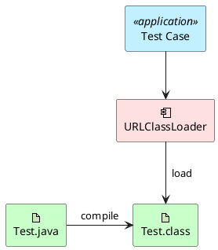
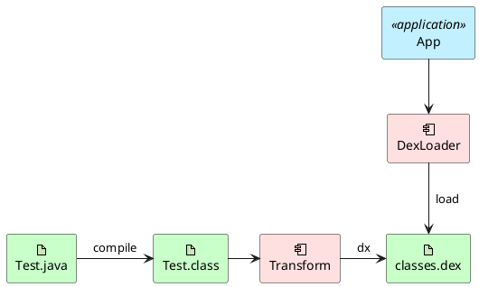
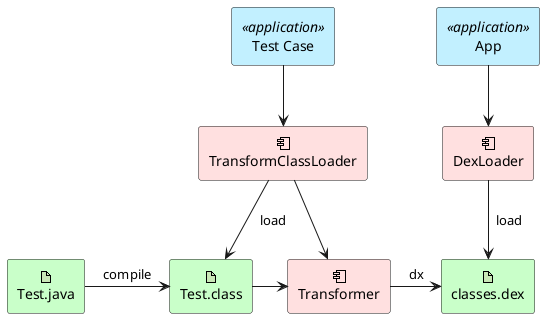

自从字节码操作技术在移动端普及之后，各种 __app__ 的架构中都采用了这一技术，最典型的例子便是采用 __Service Locator__ 模式实现的 __IoC__ 框架，这类框架都有着相同的实现思路，挫一点的则是通过反射来实例化对象，好一点的会用 __apt__ 来生成 __Factory__ 代码来解决实例化的问题，但都会存在一个问题，就是需要一个静态的映射（注册表）来解决根据接口查找实现的问题，而这个静态的映射（注册表）一般都是通过字节码操作技术在编译期间自动生成。

## 不可测试

如果你从来没有基于这类框架写过单元测试，可能无法理解问题的所在，为了方便理解问题，我们先来看看 __App__ 的构建和运行流程以及 __Local UT__ 的构建和运行流程

### Local UT 构建和运行



### App 构建和运行



看到上面的图，发现问题所在了吗？

> __Transform__ 中的逻辑并不会在 __Local UT__ 环境中执行！！！

如果 __IoC__ 框架的静态的映射（注册表）是在 __Transform__ 中生成的，那岂不是要完犊子了？！

没错！运行 __Local UT__ 就没有 __Transform__ 什么事儿，那应该如何解决呢？

## 可测试

既然 __Local UT__ 阶段不执行 __Transform__，那我们只好硬干了，让 __Local UT__ 在运行时执行 __Transform__ 的逻辑，但问题来了，__AGP__ 原生的 __Transform API__ 依赖于 __AGP__ 本身，如何让在 __Local UT__ 环境中运行 __AGP__ 呢？

> 答案是 —— 放弃这条路吧，换 __Booster Transformer__！

> 为什么 __Booster Transformer__ 就可以呢？

> 因为 __Booster__ 的 __Transformer__ 在设计的时候就是与 __AGP__ 解耦的呀！是不是感受到了 __Booster__ 的设计的牛逼之处了？

> 先别光顾着吹牛逼了，__Booster Transformer__ 到底怎么实现 __Runtime Transform__？

> 别着急，先回顾一下 __Java__ 基础中的 `ClassLoader`，通过其源代码，我们可以看到：

```java
protected final Class<?> defineClass(String name, byte[] b, int off, int len)
    throws ClassFormatError
{
    return defineClass(name, b, off, len, null);
}
```

给 `ClassLoader` 一个 `byte[]`，它能还你一个 `Class`，所以，只要我们能拿到 `Class` 的原始字节数据，就可以重新定义一个 `Class` 了，当然，我们要做的是重新定义它之前，先要对其字节码进行一番操作，那如何才能拿到 `Class` 的原始字节数据呢？—— 还是 `ClassLoader`

```java
public InputStream getResourceAsStream(String name) {
  ...  
}
```

那我们要做的就是：

1. 自定义 `ClassLoader` 来加载 `Class`
1. 在加载 `Class` 的时候，通过 __Booster__ 的 __API__ 来调用已经存在的 `Transformer`
1. 通过自定义 `ClassLoader` 来执行 __Local UT__

为了方便起见，我们直接继承自 `URLClassLoader`：

```kotlin
class TransformClassLoader(urls: Array<URL>) : URLClassLoader(urls) {
  private val classpath = urls.map { File(it.path) }

  override fun findClass(name: String): Class<*> {
    val bytecode = readClassData(name)
    return transform(name, bytecode)
  }

  private fun transform(name: String, original: ByteArray): Class<*> {
    val context = object : AbstractTransformContext(
      "test",
      "test", 
      emptyList(),
      classpath,
      classpath
    )
    val transformer = AsmTransformer(this)
    transformer.onPreTransform(context)
    val modified = transformer.transform(context, original)
    transformer.onPostTransform(context)
    return defineClass(name, modified, 0, modified.size)
  }
}
```

这里用到了 __Booster__ 中的 `AsmTransformer` 和 `AbstractTransformContext`，直接引用 `booster-transform-asm` 即可：

```groovy
dependencies {
  implementation("com.didiglobal.booster:booster-transform-asm:$booster_version")
}
```

整个架构图则如下图所示：



从图中可以看出，`ClassLoader` 对于运行 __Local UT__ 起着至关重要的作用，有了 `TransformClassLoader`，我们便可以在运行时通过 __Booster__ 调用 __Transformer__ 对 `Class` 进行偷梁换柱，得到我们想要的 `Class`，但问题是：

1. 什么时候调用这个 `TransformClassLoader`
1. 怎么用这个 `TransformClassLoader` 

> 欲知详情，请见下回分解 🙃
