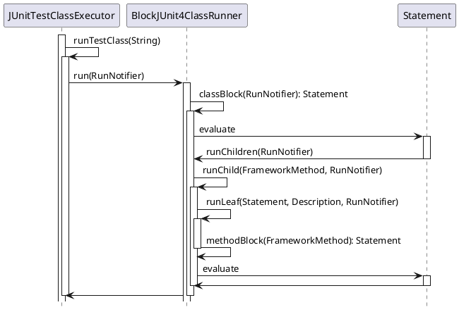

In [Designing Testable App Architecture (Part 1)](/2021/11/23/testable-app-architecture-design-1/), we covered how *Booster* solves the problem of reusing `Transformer` across both local unit test and build environments. In this part, let's explore how to use *Booster*'s `TransformerClassLoader` to make app architectures testable.

## Unit Testing Frameworks

In the Java world, the two most popular unit testing frameworks are *JUnit* and *TestNG*. Most developers have heard of *JUnit* but may not be familiar with *TestNG*. In my view, there isn't much difference between them. Many developers are familiar with *JUnit* in theory but have rarely written real unit tests. Let's start with a basic *JUnit* example:

```java
public class Calculator {
  public int evaluate(String expression) {
    int sum = 0;
    for (String summand: expression.split("\\+"))
      sum += Integer.valueOf(summand);
    return sum;
  }
}
```

```java
import static org.junit.Assert.assertEquals;
import org.junit.Test;

public class CalculatorTest {
  @Test
  public void evaluatesExpression() {
    Calculator calculator = new Calculator();
    int sum = calculator.evaluate("1+2+3");
    assertEquals(6, sum);
  }
}
```

Running `evaluatesExpression` in the IDE launches *JUnit* by default. If you need to mock classes, you'll use a mocking framework like [Mockito](http://mockito.org/) or [PowerMock](http://www.powermock.org/). When writing unit tests with these frameworks, you'll inevitably encounter a *JUnit* component called [Test Runner](https://junit.org/junit4/javadoc/4.13/src-html/org/junit/runner/Runner.html), typically specified via `@RunWith` on the test class:

### MockitoJUnitRunner

```java
@RunWith(MockitoJUnitRunner.class)
public class YourTestCase {
  ...
}
```

### PowerMockRunner

```java
@RunWith(PowerMockRunner.class)
public class YourTestCase {
  ...
}
```

For writing local unit tests for *Java Library* projects targeting the *Android* platform, [Robolectric](http://robolectric.org/) is commonly used. Like [Mockito](http://mockito.org/) and [PowerMock](http://www.powermock.org/), it provides its own *Test Runner* -- `RobolectricTestRunner`:

```java
@RunWith(RobolectricTestRunner.class)
public class WelcomeActivityTest {

  @Test
  public void clickingLogin_shouldStartLoginActivity() {
    WelcomeActivity activity = Robolectric.setupActivity(WelcomeActivity.class);
    activity.findViewById(R.id.login).performClick();

    Intent expectedIntent = new Intent(activity, LoginActivity.class);
    Intent actual = shadowOf(RuntimeEnvironment.application).getNextStartedActivity();
    assertEquals(expectedIntent.getComponent(), actual.getComponent());
  }

}
```

## The Essence of Mocking

All mocking-capable frameworks inevitably rely on a *Test Runner*. Why?

To mock properties or methods in another class, you need to swap out the real ones. When does the swap happen, and how? There are generally two approaches -- compile-time or runtime.

### Compile-Time Injection

For regular Java projects, compile-time injection typically uses the [Instrumentation](https://docs.oracle.com/javase/6/docs/technotes/guides/instrumentation/index.html) mechanism available since *Java 6*. A [Java Agent](https://docs.oracle.com/javase/9/docs/api/java/lang/instrument/package-summary.html) containing a `ClassFileTransformer` is provided to the *JVM* as a plugin via command-line arguments:

```
java -javaagent:my-agent.jar -jar my-app.jar
```

While this works, it requires developers to configure command-line arguments in the IDE's run configuration, which isn't a great developer experience.

### Runtime Injection

Runtime injection typically uses a custom `ClassLoader` -- like the `TransformerClassLoader` discussed earlier -- to modify classes in memory during loading via a bytecode manipulation framework. Investigation shows that the mocking frameworks mentioned above all use runtime injection.

## The Significance of Test Runner

*JUnit* provides the `@RunWith` annotation so developers can specify which `Runner` to use. *JUnit* also provides several built-in runners:

* `BlockJUnit4ClassRunner`
* `BlockJUnit4ClassRunnerWithParameters`
* `Suite`
* ...

To implement runtime injection, we need a custom `Runner`. For convenience, we extend `BlockJUnit4ClassRunner`:

```kotlin
class BoosterTestRunner(clazz: Class<*>) : BlockJUnit4ClassRunner(clazz) {

  private val contextClassLoader = Thread.currentThread().contextClassLoader as URLClassLoader

  private val transformerClassLoader = TransformerClassLoader(contextClassLoader) {
    AsmTransformer(it)
  }

}
```

How do we make `BoosterTestRunner` execute when a `@Test`-annotated method runs? Let's look at how `BlockJUnit4ClassRunner` actually works:



Now we understand `JUnitTestClassExecutor`'s runtime sequence. Since we want to do something before each `@Test`-annotated method executes, we need to override `BlockJUnit4ClassRunner`'s `methodBlock(FrameworkMethod)` method, replacing the `Method` referenced by `FrameworkMethod` with a modified one.

> Where does the modified `Method` come from?

> From the modified `Class`, of course:

```kotlin
override fun methodBlock(method: FrameworkMethod): Statement {
  return object : Statement() {
    override fun evaluate() {
      val testClass = transformerClassLoader.loadClass(testClass.javaClass.name)
      val testRunner = MethodRunner(testClass)
      val testMethod = testClass.getMethod(method.method.name)

      try {
        testRunner.methodBlock(FrameworkMethod(testMethod)).evaluate()
      } finally {
        Thread.currentThread().contextClassLoader = delegate
      }
    }
  }
}

private class MethodRunner(clazz: Class<*>): BlockJUnit4ClassRunner(clazz) {
  public override fun methodBlock(method: FrameworkMethod): Statement {
    return super.methodBlock(method)
  }
}
```

With `BoosterTestRunner`, the full sequence for running a unit test looks like this:


