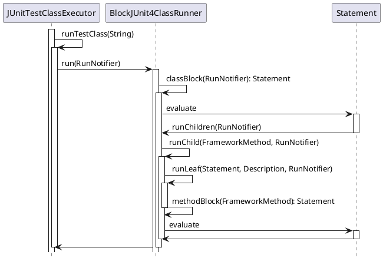
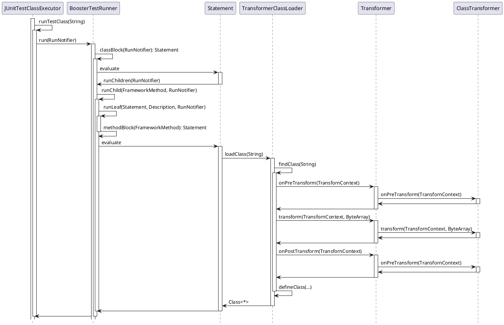

在[可测试应用架构设计（一）](/2021/11/23/testable-app-architecture-design-1/)中有介绍过 *Booster* 是如何解决 `Transformer` 在本地单元测试环境和编译环境中的复用问题，在本节中，我们来一起探索如何利用 *Booster* 提供的 `TransformerClassLoader` 来解决应用架构的可测试性问题。

## 单元测试框架

在 *Java* 的世界里，最流行的单元测试框架非 *JUnit* 和 *TestNG* 莫属了，但对于国内的大多数开发者来说，可能只听说过 *JUnit*，对 *TestNG* 并不熟悉，在我看来，二者之间并没有太大的区别。很多人对于用 *JUnit* 写单元测试是那么的熟悉而又陌生，说起来都知道，但正儿八经写过单元测试的人是凤毛麟角，我们先来看看用 *JUnit* 如何写单元测试：

```java
public class Calculator {
  public int evaluate(String expression) {
    int sum = 0;
    for (String summand: expression.split("\\+"))
      sum += Integer.valueOf(summand);
    return sum;
  }
}
```

```java
import static org.junit.Assert.assertEquals;
import org.junit.Test;

public class CalculatorTest {
  @Test
  public void evaluatesExpression() {
    Calculator calculator = new Calculator();
    int sum = calculator.evaluate("1+2+3");
    assertEquals(6, sum);
  }
}
```

在 *IDE* 中运行 `evaluatesExpression` 默认就会启动 *JUnit*，而如果要对测试的类进行 *Mock* 的话，就需要用到 *Mocking* 框架，例如：[Mockito](http://mockito.org/) 或者 [PowerMock](http://www.powermock.org/)。在用这些 *Mocking* 框架写 *UT* 时，或多或少的用到 *JUnit* 里的一个组件 —— [Test Runner](https://junit.org/junit4/javadoc/4.13/src-html/org/junit/runner/Runner.html)，通常是通过 `@RunWith` 来标注测试用例类，例如：

### MockitoJUnitRunner

```java
@RunWith(MockitoJUnitRunner.class)
public class YourTestCase {
  ...
}
```

### PowerMockRunner

```java
@RunWith(PowerMockRunner.class)
public class YourTestCase {
  ...
}
```

而为运行在 *Android* 平台上的 *Java Library* 工程写 *Local Unit Test*，通常会用到 [Robolectric](http://robolectric.org/)，和 [Mockito](http://mockito.org/) / [PowerMock](http://www.powermock.org/) 一样，它也提供了 *Test Runner* —— `RobolectricTestRunner`，如下所示：

```java
@RunWith(RobolectricTestRunner.class)
public class WelcomeActivityTest {

  @Test
  public void clickingLogin_shouldStartLoginActivity() {
    WelcomeActivity activity = Robolectric.setupActivity(WelcomeActivity.class);
    activity.findViewById(R.id.login).performClick();

    Intent expectedIntent = new Intent(activity, LoginActivity.class);
    Intent actual = shadowOf(RuntimeEnvironment.application).getNextStartedActivity();
    assertEquals(expectedIntent.getComponent(), actual.getComponent());
  }

}
```

## Mocking 的本质

对于这些具有 *Mocking* 能力的框架，都不可避免的需要用到 *Test Runner*，为什么呢？

要 *Mock* 别的类中的属性或者方法，就需要对真实的属性或者方法进行偷梁换柱，什么时机偷换？怎么偷换？一般会有两种时机 —— 编译时或者运行时

### 编译时注入

对于普通的 *Java* 工程，编译时注入一般需要用到从 *Java 6* 开始提供的 [Instrumentation](https://docs.oracle.com/javase/6/docs/technotes/guides/instrumentation/index.html) 机制，通过 [Java Agent](https://docs.oracle.com/javase/9/docs/api/java/lang/instrument/package-summary.html) 将包含有 `ClassFileTransformer` 的 *JAR* 包以插件的形式通过命令行参数提供给 *JVM* 的：

```
java -javaagent:my-agent.jar -jar my-app.jar
```

虽然这样也能实现，对于开发者来说，需要在 *IDE* 运行环境里配置命令行参数，开发体验不是很友好。

### 运行时注入

运行时注入一般需要用到自定义 `ClassLoader`，例如：前面提到的 `TransformerClassLoader`，通过字节码操作框架在加载 *class* 的时候在内存中对 *class* 进行修改替换，通过调研发现，前面的几个 *Mocking* 框架都是在运行时注入的。

## Test Runner 的意义

*JUnit* 提供了 `@RunWith` 注解，让开发者可以使用指定的 `Runner` 来运行单元测试用例，而且，*JUnit* 还提供了很多内置的 `Runner`:

* `BlockJUnit4ClassRunner`
* `BlockJUnit4ClassRunnerWithParameters`
* `Suite`
* ...

要实现运行时注入，就需要自定义一个 `Runner`，为了实现方便，我们可以继承自 `BlockJUnit4ClassRunner`：

```kotlin
class BoosterTestRunner(clazz: Class<*>) : BlockJUnit4ClassRunner(clazz) {

  private val contextClassLoader = Thread.currentThread().contextClassLoader as URLClassLoader

  private val transformerClassLoader = TransformerClassLoader(contextClassLoader) {
    AsmTransformer(it)
  }

}
```

那如何才能在运行标注有 `@Test` 方法时执行 `BoosterTestRunner` 呢？我们来看一下 `BlockJUnit4ClassRunner` 到底是如何运行的：



至此，我们已经搞清楚了 `JUnitTestClassExecutor` 的运行时序，既然要在每个被 `@Test` 标注的方法执行前做点啥，那我们要做的便是重写 `BlockJUnit4ClassRunner` 的  `methodBlock(FrameworkMethod)` 方法，将 `FrameworkMethod` 引用的 `Method` 替换成修改后的 `Method`。

> 修改后的 `Method` 从哪里来呢？

> 当然是从修改后的 `Class` 中获得，如下所示：

```kotlin
override fun methodBlock(method: FrameworkMethod): Statement {
  return object : Statement() {
    override fun evaluate() {
      val testClass = transformerClassLoader.loadClass(testClass.javaClass.name)
      val testRunner = MethodRunner(testClass)
      val testMethod = testClass.getMethod(method.method.name)

      try {
        testRunner.methodBlock(FrameworkMethod(testMethod)).evaluate()
      } finally {
        Thread.currentThread().contextClassLoader = delegate
      }
    }
  }
}

private class MethodRunner(clazz: Class<*>): BlockJUnit4ClassRunner(clazz) {
  public override fun methodBlock(method: FrameworkMethod): Statement {
    return super.methodBlock(method)
  }
}
```

采用 `BoosterTestRunner` 后，整个单元测试用例的调用时序则如下所示：


