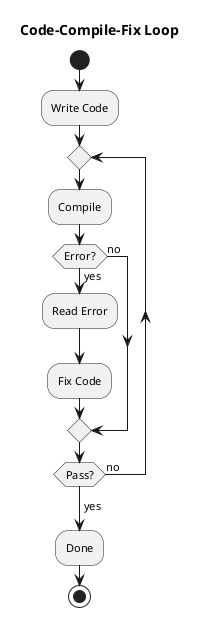
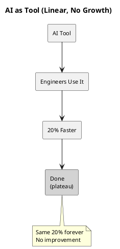
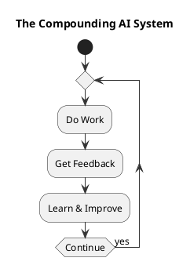
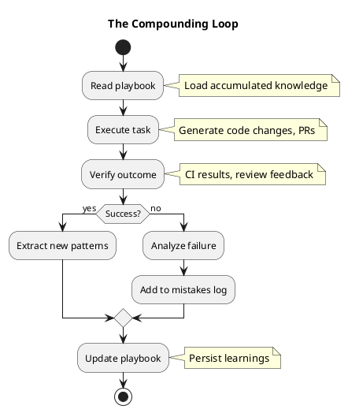

When I was working on [Booster](https://github.com/johnsonlee/booster), I wanted to build a dataflow analysis framework, but never had the bandwidth. After Claude Opus 4.5 launched and blew everyone away, I subscribed to Claude Pro on a whim one weekend and created [Graphite](https://github.com/johnsonlee/graphite) -- a static analysis tool built on JVM bytecode. I'd built similar tools before and had a rough sense of the complexity: designing data structures, implementing dataflow analysis, handling edge cases, writing a CLI, writing tests... Conservative estimate: two days for a usable version, one day coding and one day debugging. Claude Code finished a working version in **one hour**.

It didn't assist me. It wrote the whole thing. From project scaffolding to core algorithms, from unit tests to the command-line tool -- all I had to do was describe requirements, review code, and occasionally steer. The end result was no worse than what I'd have produced in two days myself.

In that moment, something clicked: **AI's engineering capability has reached Staff Engineer level.**

## The Initial Shock

### Graphite: Two Days vs. One Hour

Let me explain what [Graphite](https://github.com/johnsonlee/graphite) does.

In large codebases, cleaning up AB experiments is a notorious headache. Experiments finish, but the code stays. Flags get toggled, but the logic lingers. Over time, the codebase fills up with dead experiment branches. The traditional approach is grep plus manual review -- slow and error-prone.

What I wanted was a graph-based static analysis framework: load bytecode into a call graph, then use dataflow analysis to trace how constants flow into specific API calls. For example, `AbClient.getOption(1001)` -- I want to know every place in the codebase where `1001` is passed to `getOption`.

The technical scope is substantial:

- Bytecode parsing (SootUp)
- Control Flow Graph and Call Graph construction
- Backward slicing analysis
- Constant propagation and enum value resolution
- Query DSL design
- CLI toolchain

If I were doing this myself, the process would look something like:

1. Spend half a day researching SootUp's API and hitting pitfalls
2. Another half day designing core data structures
3. A full day implementing dataflow analysis and edge cases
4. A final half day on CLI and tests

Conservative estimate: two days.

Here's how Claude Code approached it:

```
> Create a static analysis framework that finds all constant arguments passed to a specific method in JVM bytecode
```

Then it got to work.

It asked a few clarifying questions: target JVM version? Supported input formats? Special cases to handle? Then it laid out an overall architecture, waited for my confirmation, and started implementing module by module.

What impressed me most was its edge-case handling. Take Java's auto-boxing:

```kotlin
val id: Int = 1001
abClient.getOption(id)  // actually calls Integer.valueOf(1001)
```

I assumed I'd need to point this out. It caught it on its own and added transparent handling in the code.

Or tracking enum constants:

```kotlin
abClient.getOption(ExperimentId.CHECKOUT)  // needs to resolve the enum's actual value
```

It not only implemented this but wrote thorough test cases.

The final output was a complete multi-module Gradle project with a core library, SootUp backend, and CLI tool. Clean structure, solid documentation, and even an elegant Query DSL:

```kotlin
val results = Graphite.from(graph).query {
    findArgumentConstants {
        method {
            declaringClass = "com.example.AbClient"
            name = "getOption"
        }
        argumentIndex = 0
    }
}
```

One hour.

### A Ten-Year-Old's Game

If Graphite was a domain-specific engineering project, what my son did with Claude Code was even more mind-blowing.

I'd taught him some programming basics. During winter break, he got the idea to build a game. I asked what he had in mind. He said he wanted a multiplayer archery combat game.

I thought: that's a hefty requirement. 2D physics engine, character system, network sync... even for me, it would take significant time.

He spent one hour with Claude Code and built a game called [Bow & Arrow](https://fanyuli729.github.io):

- Three character classes: Crossbowman, Cannoneer, Poison Archer
- Single-player mode and P2P multiplayer
- Physics-based projectile system
- Gold coin scoring system

The code uses pure HTML5 Canvas + ES6 modules, with PeerJS for multiplayer -- no server needed. The project structure is clean and well-organized.

A ten-year-old, with AI's help, built a complete web game in one hour.

It reminded me of what I'd written about [education in the age of AI](/2025/12/06/education-in-the-age-of-ai/). Back then I was pondering how AI would change learning. I didn't expect the change to arrive this fast.

## How Claude Code Differs from Cursor and Windsurf

Having used so many AI coding tools, I want to highlight what makes Claude Code different.

**Cursor and Windsurf** are fundamentally **Editor + AI**. They integrate AI into the IDE -- you write code in the editor, AI helps you complete and refine. The workflow is still human-driven; AI is the copilot.

**ChatGPT** and other chat-based tools are **Chat + Code**. You discuss requirements, it generates code snippets, then you copy-paste into your project. Productivity improves, but there's a gap in between.

**Claude Code** is different. It's **AI operating directly on the project**.

Claude Code can `cd` into your project directory, read files, modify files, run tests, execute commands. It doesn't show you code for copying -- it writes directly into your codebase. When something breaks, it reads the error and fixes it on its own.

This distinction seems small but represents a qualitative shift.

When AI can operate directly on a project, it forms a **complete feedback loop**:



It can run this loop entirely on its own, without a human passing messages in between.

And Claude Code has one critical design feature: **CLAUDE.md**.

You can place a `CLAUDE.md` file in your project root describing the project's background, architecture, conventions, and pitfalls. Claude Code reads this file at the start of every session, treating it as the project's "memory."

What does this mean?

It means it doesn't start from scratch every time. It knows your coding style, your module structure, which pitfalls to avoid. The longer you maintain this file, the better its work quality becomes.

This leads to a deeper topic.

## The Compounding AI Thesis

### Why Most AI Usage Plateaus

Our team has been using Windsurf for nearly a year. Honestly, the first month brought about a 20% productivity boost -- writing code faster, no more hand-writing boilerplate.

But after a year? Still that same 20%.

It's not that the tool is bad. It's that **this kind of tool has no growth trajectory**. Every time you open it, it doesn't remember what happened last time. The mistake you corrected last week? It'll make it again this week. The project conventions you explained? You'll have to repeat them next time.

Most teams' mental model of AI looks like this:



The problem with this model: **there's no growth curve**.

You get 20% on day one, and a year later it's still 20%. The tool is there, but it doesn't improve.

**This is the fundamental limitation of AI-as-tool: without memory, there's no compounding.**

### The Compounding AI Model

There's another way to think about it:



In this model, AI isn't a tool you use -- it's a **system you train**. Like any learning system, its value compounds over time.

Simple math:

- Tool: a permanent 20% boost
- Compounding system improving 5% per week: after one year, that's **12x**

The question isn't "how to use AI to boost efficiency" but rather **"how to build a system that gets smarter every week."**

### Three Conditions for Compounding

For AI to achieve compounding growth, three conditions must be met:

**1. Definable task boundaries**

AI must know when it's "done." This requires:

- Clear inputs (not vague requests)
- Clear success criteria (not subjective judgment)
- Clear scope (not open-ended exploration)

Bad: "Improve our codebase"
Good: "Clean up AB experiment X, keep the winner branch, ensure tests pass"

Without boundaries, there's no completion. Without completion, there's no feedback. Without feedback, there's no learning.

**2. Observable outcomes**

Every AI action must produce measurable results:

- Did tests pass or fail?
- Was the PR approved or rejected?
- Did the change cause a production incident?

Outcomes must be **unambiguous**. "Looks good" isn't observable. "PR merged, canary 24 hours with zero errors" is observable.

Observable outcomes create **training signals**. The richer the signal, the faster the learning.

**3. Persisted knowledge**

This is the part most teams overlook: **AI has no memory**.

Claude, GPT, Windsurf -- they all start from zero each session. That insight from yesterday's debugging? Gone. The pattern you corrected three times? Forgotten.

For compounding, knowledge must be **externalized**:

- What patterns exist in the codebase?
- What mistakes have we made before?
- What do reviewers typically ask for?
- What edge cases have we discovered?

This externalized knowledge becomes AI's "memory" -- loaded at the start of each session, updated at the end.

**Without persistence, every day is day one. With persistence, every day builds on all the days before it.**

### The Formula

Putting it together:

```
Compounding AI = Definable Tasks + Observable Outcomes + Persisted Knowledge
```

Or more concisely:

```
Structured Feedback + Persistence = Compounding Knowledge
```

Remove any element and the system collapses:

- No task boundaries -> no completion -> no feedback
- No observable outcomes -> feedback is noise -> no learning
- No persistence -> learning is lost -> no compounding

### What This Looks Like in Practice

#### The Learning Loop



Each loop makes the next one better:

- Patterns documented -> fewer mistakes
- Edge cases recorded -> faster handling
- Preferences captured -> less review friction

This is the value of `CLAUDE.md`.

#### Playbook: AI's External Memory

A playbook is **structured knowledge persisted across sessions**:

```markdown
# [Domain] Playbook

## Patterns
Knowledge about how things work here.

## Rules
Things that must or must never be done.

## Edge Cases
Exceptions discovered the hard way.

## Mistakes Log
What went wrong and how we prevent it now.
```

When AI reads this file at the start of a session, it doesn't start from zero -- it starts from the accumulated wisdom of all previous sessions.

When AI writes to this file at the end of a session, it hasn't just completed a task -- it has made the next task easier.

**The playbook is the compounding mechanism.**

## Looking Ahead

### Within One Year: Programmers Will Be Out of a Job

This isn't alarmist.

"Programmer" -- the role whose primary job is translating requirements into code -- will be fully replaced by AI.

Think about it:

- Writing CRUD endpoints? Claude Code handles it in minutes
- Writing unit tests? AI is more thorough than most humans
- Implementing design mockups? AI can look at the image and write code
- Debugging common errors? AI reads stack traces faster than any junior

These tasks share a common trait: **clear boundaries, verifiable outcomes**. Exactly the conditions for compounding AI.

And AI doesn't need rest, doesn't get bored with repetitive work, doesn't lose focus on Friday afternoon.

One Staff Engineer paired with AI can produce the output of what used to take a small team. This means market demand for "people who can write code" will drop sharply.

But note: I said "Programmer," not "Engineer."

### Within Two Years: Software Engineer Will Become History

What are the core skills of a "Software Engineer"?

- Understanding requirements, designing solutions
- Weighing trade-offs, making technical decisions
- Writing code, maintaining systems
- Debugging issues, optimizing performance

Two years from now, how much of this will AI still be unable to do?

Designing solutions? AI already proposes multiple architecture options with pros/cons analysis.
Technical decisions? With codebase context, AI's judgment keeps improving.
Writing code? Already covered.
Debugging? AI reads logs, metrics, and performs root cause analysis -- possibly better than most humans.

The only thing AI can't yet do well is **cross-system judgment** -- decisions that require understanding the business, the organization, the people.

But those skills aren't traditionally called "Software Engineering." They're called "Product Thinking" or "Tech Leadership."

My prediction: within two years, existing systems will begin to be rewritten by AI at massive scale. Not because AI writes better code, but because AI can rewrite while learning, creating compound growth. Legacy systems -- those without playbooks, without structured knowledge, without feedback loops -- will become increasingly unmaintainable.

**A new system with AI augmentation and continuously compounding knowledge, vs. a legacy system weighed down by tech debt where all context lives in people's heads. Who wins?**

### The Way Forward for Programmers

In the AI era, what's valuable isn't "knowing how to code" but:

1. **The ability to define problems**: No matter how powerful AI gets, someone needs to tell it what problem to solve. Turning vague business requirements into clear task definitions -- that's something AI can't do.

2. **The ability to build feedback loops**: Knowing how to design observable outcomes, how to structure knowledge, how to enable compounding growth in AI systems. This is a new kind of engineering skill.

3. **The ability to think across systems**: Understanding how a change ripples through an entire ecosystem, understanding the business reasoning behind technical decisions. This requires experience and judgment that AI can't yet replicate.

4. **The ability to collaborate with AI**: Knowing when to let AI do the work and when to do it yourself; knowing how to give AI good prompts and how to review its output; knowing how to accumulate knowledge so AI keeps getting better.

Programmers won't vanish, but they'll transform. From "people who write code" to "people who direct AI to write code."

Just as photographers weren't replaced by digital cameras but adapted to them; just as accountants weren't replaced by Excel but used it for more sophisticated analysis.

**The tools change, but the people who solve problems remain.**

---

I put a `CLAUDE.md` in the [Graphite](https://github.com/johnsonlee/graphite) project, documenting architecture decisions and gotchas. Every time Claude Code helps me modify code, I update this file.

A month from now, its understanding of this project may be deeper than a colleague I'd pull in temporarily.

That's the power of compounding.
