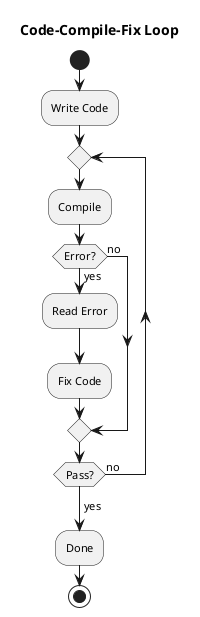
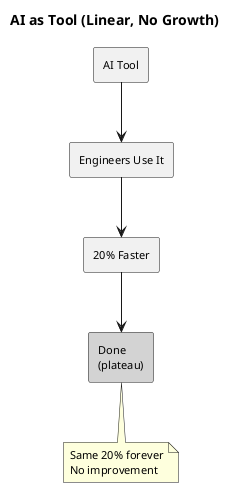
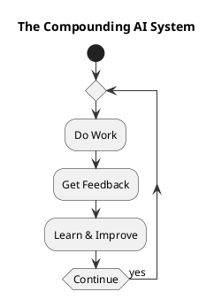
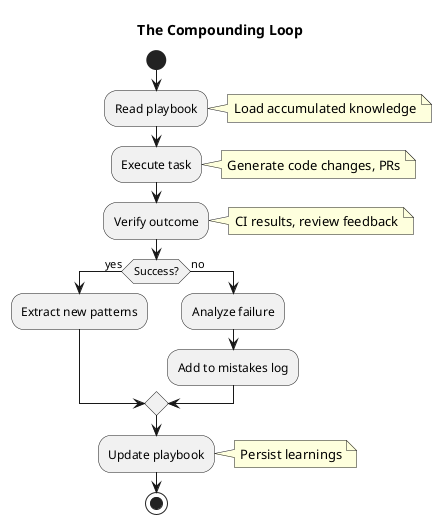

之前在做 [Booster](https://github.com/johnsonlee/booster) 的时候，就想实现一个能做数据流分析的框架，但个人精力有限，只能束之高阁。自从 Claude Opus 4.5 发布后，业界一度为之轰动，我抱着试一试的心态，趁着周末在家休息，于是订阅了 Claude Pro，创建了 [Graphite](https://github.com/johnsonlee/graphite) 这个项目，应用场景主要是基于 JVM 字节码做静态分析。这类工具之前也做过，技术复杂度心里大概是有数的：设计数据结构、实现 dataflow analysis、处理各种 edge case、写 CLI、写测试……保守估计，之前纯手写一个能用的版本大概花了2天，1天开发，1天调试和处理 edge case。结果，Claude Code 用了 **1 小时** 就完成了一个可运行的版本。

不是辅助我写，是它自己写完的。从项目骨架到核心算法，从单元测试到命令行工具，全程我只需要描述需求、review 代码、偶尔纠正方向。最后跑起来的东西，质量不输我自己花两天写出来的版本。

那一刻，我突然意识到一件事：**AI 的工程能力，已经达到了 Staff Engineer 的水平。**

## 震撼的初体验

### Graphite：两天 vs 一小时

先说说 [Graphite](https://github.com/johnsonlee/graphite) 是个什么东西。

在大型代码库里，AB 实验的清理是个老大难问题。实验做完了，代码还留着；Flag 开关了，逻辑还在。时间一长，代码库里堆满了死掉的实验分支。传统的做法是 grep + 人工审查，效率低、容易漏。

我想做的是一个 graph-based 的静态分析框架：把字节码加载成 call graph，然后用 dataflow analysis 追踪常量是怎么流到特定 API 调用的。比如 `AbClient.getOption(1001)`，我想知道代码库里所有传给 `getOption` 的那个 `1001` 都在哪。

这类工具涉及的技术点不少：

- 字节码解析（SootUp）
- Control Flow Graph 和 Call Graph 的构建
- 后向切片（backward slicing）分析
- 常量传播和 enum 值解析
- Query DSL 设计
- CLI 工具链

如果是我自己写，流程大概是这样的：

1. 先花半天研究 SootUp 的 API，踩一堆坑
2. 再花半天设计核心数据结构
3. 然后花一天实现 dataflow analysis 和各种 edge case
4. 最后花半天写 CLI 和测试

保守估计，两天。

而 Claude Code 的做法是这样的：

```
> 创建一个静态分析框架，能从 JVM 字节码中找到传给特定方法的所有常量参数
```

然后它就开始干活了。

它先问了几个澄清问题：目标 JVM 版本？支持哪些输入格式？需要处理哪些特殊情况？然后给出了一个整体架构设计，等我确认后，就开始一个模块一个模块地实现。

让我印象最深的是它处理 edge case 的能力。比如 Java 的 auto-boxing：

```kotlin
val id: Int = 1001
abClient.getOption(id)  // 实际上会调用 Integer.valueOf(1001)
```

我原本以为这种情况需要我提醒，结果它自己就考虑到了，并且在代码里加了透明处理。

再比如 enum 常量的追踪：

```kotlin
abClient.getOption(ExperimentId.CHECKOUT)  // 需要解析 enum 的实际值
```

它不仅实现了，还写了完善的测试用例。

最后的产出是一个完整的 multi-module Gradle 项目，包含核心库、SootUp 后端、CLI 工具，代码结构清晰，文档齐全，甚至还有一个漂亮的 Query DSL：

```kotlin
val results = Graphite.from(graph).query {
    findArgumentConstants {
        method {
            declaringClass = "com.example.AbClient"
            name = "getOption"
        }
        argumentIndex = 0
    }
}
```

一小时。

### 十岁孩子的游戏

如果说 Graphite 还是专业领域的工程项目，那我儿子用 Claude Code 做的事情，更让我感到不可思议。

之前我教他学了一些编程基础。寒假的时候，他突发奇想要做一个游戏。我问他想做什么，他说想做一个弓箭射击的多人对战游戏。

我心想，这个需求有点复杂：2D 物理引擎、角色系统、网络同步……就算是我自己做，也得花不少时间。

结果他自己用 Claude Code 捣鼓了 1 个小时，做出来一个叫 [Bow & Arrow](https://fanyuli729.github.io) 的游戏：

- 三种角色：弩兵、炮手、毒箭手
- 单人模式和 P2P 多人模式
- 基于物理的弹道系统
- 金币计分机制

代码用的是纯 HTML5 Canvas + ES6 modules，多人联机用的是 PeerJS，不需要服务器。整个项目结构清晰，模块划分合理。

一个10岁的孩子，在 AI 的帮助下，用 1 小时做出了一个完整的网页游戏。

这让我想起了之前写过的 [AI 时代的教育](/2025/12/06/education-in-the-age-of-ai/)。当时我还在思考 AI 会如何改变学习方式，没想到变化来得这么快。

## Claude Code 和 Cursor、Windsurf 有什么不一样？

用过这么多 AI 编程工具，我想说说 Claude Code 的不同之处。

**Cursor 和 Windsurf** 本质上还是 **Editor + AI**。它们把 AI 集成到 IDE 里，你在编辑器里写代码，AI 帮你补全、帮你改。工作流程还是以人为主，AI 是副驾驶。

**ChatGPT** 和其他 chat-based 的工具，是 **Chat + Code**。你跟它聊需求，它给你生成代码片段，然后你复制粘贴到项目里。效率有提升，但中间有断层。

**Claude Code** 不一样。它是 **AI 直接操作项目**。

Claude Code 可以直接 `cd` 到你的项目目录，读文件、改文件、运行测试、执行命令。它不是给你看代码让你复制，而是直接帮你写进去。遇到问题，它会自己看报错、自己修。

这个区别看起来很小，实际上是质变。

当 AI 能直接操作项目时，它就可以形成 **完整的 feedback loop**：



这个循环它自己就能跑完，不需要人在中间传话。

而且 Claude Code 有一个关键设计：**CLAUDE.md**。

你可以在项目根目录放一个 `CLAUDE.md` 文件，写清楚项目的背景、架构、约定、注意事项。Claude Code 每次启动都会读这个文件，把它当成项目的「记忆」。

这意味着什么？

意味着它不是每次都从零开始。它知道你的代码风格，知道你的 module 结构，知道哪些坑不要踩。时间越长，这份「记忆」越完善，它的工作质量就越高。

这就引出了一个更深层的话题。

## The Compounding AI Thesis

### 为什么大多数 AI 使用在原地踏步？

我们团队用 Windsurf 将近一年了。说实话，第一个月的生产力提升大概有 20%，代码写得更快了，boilerplate 不用自己写了。

但一年后呢？还是那 20%。

不是工具不好用，而是 **这种工具没有成长轨迹**。每次打开它，它都不记得上次发生了什么。你上周纠正过的错误，这周它还会犯。你告诉过它的项目约定，下次又要重新说一遍。

大多数团队对 AI 的认知模型是这样的：



这个模型的问题是：**没有增长曲线**。

你第一天得到 20% 的提升，一年后还是 20%。工具在那里，但它不进步。

**这是 AI-as-tool 的根本局限：没有记忆，就无法复利。**

### 复利增长的 AI 模型

有另一种思考方式：



在这个模型里，AI 不是你使用的工具，而是你 **训练的系统**。就像任何学习系统一样，它的价值随时间复利增长。

做个简单的数学：

- 工具：永远 20% 的提升
- 复利系统，每周 5% 的改进：一年后是 **12 倍**

问题不是「怎么用 AI 提升效率」，而是 **「怎么构建一个每周都在变聪明的系统」**。

### 复利增长的三个条件

AI 要实现复利增长，需要三个条件：

**1. 可定义的任务边界**

AI 必须知道什么时候「完成」了。这需要：

- 清晰的输入（不是模糊的请求）
- 清晰的成功标准（不是主观判断）
- 清晰的范围（不是开放式探索）

❌ 「改进我们的代码库」
✅ 「清理 AB 实验 X，保留 winner 分支，确保测试通过」

没有边界，就没有完成。没有完成，就没有反馈。没有反馈，就没有学习。

**2. 可观测的结果**

每个 AI 动作都必须产生可测量的结果：

- 测试通过还是失败？
- PR 被批准还是拒绝？
- 变更是否导致了生产事故？

结果必须是 **无歧义的**。「看起来不错」不可观测。「PR 合并，canary 24 小时零错误」才可观测。

可观测的结果创造 **训练信号**。信号越丰富，学习越快。

**3. 持久化的知识**

这是大多数团队忽视的部分：**AI 没有记忆**。

Claude、GPT、Windsurf ——它们每次会话都从零开始。昨天调试时发现的洞见？没了。你纠正过三次的模式？忘了。

要实现复利，知识必须 **外化**：

- 代码库里有哪些模式？
- 我们之前犯过什么错？
- Review 的时候通常会要求什么？
- 发现过哪些 edge case？

这些外化的知识成为 AI 的「记忆」——每次会话开始时读取，结束时更新。

**没有持久化，每一天都是第一天。有了持久化，每一天都建立在之前所有天的基础上。**

### 公式

把它放在一起：

```
复利 AI = 可定义的任务 + 可观测的结果 + 持久化的知识
```

或者更简洁地说：

```
结构化反馈 + 持久化 = 复利知识
```

缺少任何一个元素，系统就会崩溃：

- 没有任务边界 → 没有完成 → 没有反馈
- 没有可观测结果 → 反馈是噪音 → 无法学习
- 没有持久化 → 学习被丢失 → 无法复利

### 这在实践中是什么样的？

#### 学习循环



每经过一个循环，下一个循环就会更好：

- 模式被记录 → 更少的错误
- Edge case 被记录 → 更快的处理
- 偏好被记录 → 更少的 review 摩擦

这就是 `CLAUDE.md` 的价值。

#### Playbook：AI 的外部记忆

Playbook 就是 **跨会话持久化的结构化知识**：

```markdown
# [领域] Playbook

## 模式
关于这里如何运作的知识。

## 规则
必须做或绝对不能做的事情。

## Edge Cases
我们踩过坑发现的例外。

## 错误日志
出过什么错，以及现在如何预防。
```

当 AI 在会话开始时读取这个文件，它就不是从零开始——它是从所有之前会话积累的智慧开始。

当 AI 在会话结束时写入这个文件，它就不只是完成了一个任务——它让下一个任务变得更容易。

**Playbook 就是复利机制。**

## 展望

### 一年内：Programmer 将失业

这不是危言耸听。

「Programmer」——那种主要工作是把需求翻译成代码的角色——将会被 AI 完全取代。

想想看：

- 写 CRUD 接口？Claude Code 几分钟搞定
- 写单元测试？AI 比大多数人写得更全
- 实现设计稿？AI 可以直接看图写代码
- Debug 常见错误？AI 看报错比新手快多了

这些工作的共同特点是：**任务边界清晰，结果可验证**。恰好满足复利 AI 的条件。

而且 AI 不需要休息，不会厌倦重复工作，不会因为周五下午而分心。

一个 Staff Engineer 配合 AI，可以产出过去一个小团队的工作量。这意味着市场对「会写代码」的需求会急剧下降。

但注意，我说的是「Programmer」，不是「Engineer」。

### 两年内：Software Engineer 将成为历史

「Software Engineer」这个角色，核心技能是什么？

- 理解需求，设计方案
- 权衡 trade-off，做技术决策
- 写代码，维护系统
- 排查问题，优化性能

两年后，这里面有多少是 AI 做不了的？

设计方案？AI 已经可以给出多种架构选项并分析 pros/cons。
技术决策？基于代码库的上下文，AI 的判断会越来越准。
写代码？前面说了。
排查问题？AI 看日志、看 metrics、做 root cause analysis，可能比大多数人强。

唯一 AI 暂时做不好的，是 **跨越系统边界的判断**——那些需要理解业务、理解组织、理解人的决策。

但这些，传统意义上不叫「Software Engineering」，叫「Product Thinking」或者「Tech Leadership」。

我的判断是：两年内，现有系统会开始被 AI 大规模重写。不是因为 AI 写得更好，而是因为 AI 可以一边重写一边学习，形成复利。而旧系统，那些没有 playbook、没有结构化知识、没有反馈循环的系统，会变得越来越难维护。

**一个有 AI 加持、知识持续沉淀的新系统，vs 一个历史包袱重、上下文全靠人脑记忆的旧系统。你觉得谁会赢？**

### 程序员的出路

在 AI 时代，有价值的不是「会写代码」，而是：

1. **定义问题的能力**：AI 再强，也需要人告诉它要解决什么问题。把模糊的业务需求转化成清晰的任务定义，这是 AI 做不了的。

2. **构建 feedback loop 的能力**：知道怎么设计可观测的结果，怎么结构化知识，怎么让 AI 系统实现复利增长。这是一种新的工程能力。

3. **跨系统思考的能力**：理解一个变更会如何影响整个生态系统，理解技术决策背后的业务考量。这需要经验和判断力，AI 暂时学不会。

4. **与 AI 协作的能力**：知道什么时候该让 AI 干活，什么时候该自己来；知道怎么给 AI 好的 prompt，怎么 review AI 的产出；知道怎么沉淀知识让 AI 越来越好用。

程序员不会消失，但会变形。从「写代码的人」变成「让 AI 写代码的人」。

就像摄影师不是被数码相机淘汰，而是适应了数码相机；会计师不是被 Excel 淘汰，而是用 Excel 做更复杂的分析。

**工具变了，但解决问题的人还在。**

---

我在 [Graphite](https://github.com/johnsonlee/graphite) 项目里放了一个 `CLAUDE.md`，记录了项目的架构决策和注意事项。每次 Claude Code 帮我改代码，我都会更新这个文件。

一个月后，它对这个项目的理解，可能比我临时找来的同事还深。

这就是复利的力量。