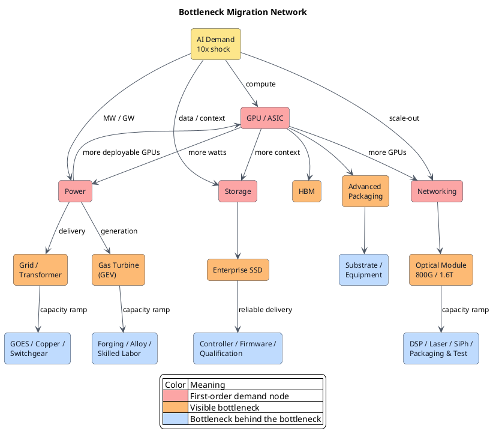

GE Vernova entered the second quarter with 116GW of gas-turbine equipment backlog and slot reservations, against only 20GW of output planned for 2026. Raising annual output to 30GW will take until 2030. [GE Vernova Q2 2026](https://www.gevernova.com/news/articles/ge-vernova-releases-second-quarter-2026-financial-results) Gas turbines are mature technology, and orders are not the problem. The constraint is an industrial system that can expand only so fast. **Demand can jump tenfold overnight. Supply cannot.**

<!-- more -->

## The demo works. Now what?

Technology is easy to talk about. GPUs have FLOPS, optical modules have Gbps, SSDs have IOPS, and gas turbines have MW. Put the numbers on a table and the winner looks obvious.

Customers do not buy benchmarks. They buy products that arrive. Building one GPU and shipping one hundred thousand every month are two different businesses. So are building one gas turbine and delivering on time when the whole world orders at once.

The market likes to file the second half under "execution." It is a convenient word, and a good way to miss where the money goes. A factory, a piece of equipment, yield, raw material, qualification, or skilled labor can keep an order from becoming revenue.

I would rather compare two clocks: how soon demand arrives and how long supply takes to expand. The mismatch is the Scale Gap:

> **Scale Gap = Supply expansion time − Demand arrival time**

If demand arrives in eighteen months while supply needs forty-eight months to catch up, those thirty months are the scarcity window. Mature technology makes the gap easier to miss. Everyone knows the product works, so few keep asking how fast it can be replicated.

When I study an industry, I start with three questions. How large is incremental demand relative to current supply? How long would it take to add 50% more supply? Which other congested chain must that expansion pass through?

## After orders spike, replication speed takes over

Replication means copying the ability to deliver. One successful unit must become ten without losing quality, blowing out cost, or missing delivery dates.

A manufacturer that has built one prototype must still replicate equipment, tooling, yield, and skilled labor. A drug that has proved effective still needs compliant production lines, consistent batches, filling, quality control, and cold-chain delivery. The science may be settled, but patients cannot take the dose sitting in a laboratory.

Services look far removed from factories, yet the same rule applies. When one store becomes a hit, the next location needs another site, another team, more training, and the same food and service. Software can copy code at almost no cost. If usage rises tenfold, its databases, compute, customer support, security review, and organization still have to expand.

**Industries replicate different things, but failure produces the same result: demand arrives and revenue cannot be delivered.** The current AI buildout is simply an unusually concentrated stress test.

## The GPU bottleneck extends beyond the GPU

GPUs are the most visible first-order bottleneck. Bigger models and heavier inference make everyone scramble for accelerators. Yet the ability to mass-produce one GPU does not mean an AI cluster can be replicated at the same speed.

Every GPU depends on HBM, advanced packaging, substrates, server racks, switches, optical links, power, and cooling. If any one of them falls behind, a finished GPU becomes expensive inventory. Vera Rubin production spans more than 350 facilities across 30 countries and hundreds of supply-chain partners. This is not the ramp of one chip. It is an industrial system ramping together, as [NVIDIA's own disclosure](https://investor.nvidia.com/news/press-release-details/2026/NVIDIA-Vera-Rubin-Ramps-Into-Full-Production-to-Power-Agentic-AI-Factories-Worldwide/default.aspx) makes clear.

Once GPU supply eases, the bottleneck migrates into HBM and packaging, then networking, power, and cooling. NVIDIA's Data Center networking revenue grew 199% year over year in the first quarter of fiscal 2027. That revenue curve shows pressure spreading from compute into interconnect. [NVIDIA FY2027 Q1](https://investor.nvidia.com/news/press-release-details/2026/NVIDIA-Announces-Financial-Results-for-First-Quarter-Fiscal-2027/default.aspx)

**A GPU counts as delivered only after the rest of the infrastructure is connected.**

## GEV sells a delivery window

Gas turbines make the argument even more counterintuitive. The technology is neither new nor an AI invention. But when data centers jump from megawatts to gigawatts, customers need a firm delivery slot, not another paper explaining how a turbine works.

Return to the 116GW from the opening. GEV has the orders and knows how to build gas turbines. What it lacks is the speed to expand the entire delivery system at once.

Orders grow in multiples while supply climbs over years. Large forgings and castings, specialty alloys, coatings, compressor parts, assembly workers, test stands, and the supplier quality system all have to expand together. Miss one link and the machine does not ship.

GEV's repricing comes from delivery capacity. **When the whole world orders at once, only a few companies can ship on time.** Mature technology did not eliminate scarcity. It moved scarcity from invention into capacity.

As GEV expands, where does the next bottleneck appear? Probably in the smaller, slower-moving markets it depends on: forgings, alloys, coatings, and skilled labor.

## Storage scaling needs more than NAND bits

Storage is easy to reduce to a capacity story: AI creates more data, so the industry needs more NAND. An enterprise SSD takes much more than NAND connected to PCIe.

Its controller must handle FTL, ECC, wear leveling, garbage collection, queue management, and power-loss protection. Firmware must remain stable under real workloads. The finished drive must pass lengthy qualification at server OEMs and hyperscalers. Capacity can be stacked; reliability and delivery capability cannot be copied and pasted.

Micron expects data-center DRAM and NAND bit shipments in 2026 to double from two years earlier. It also says Agentic AI is expanding infrastructure beyond accelerator racks into storage racks that hold context. [Micron 2026 Q3 materials](https://investors.micron.com/static-files/2354ecda-77a0-4ddd-8462-a631eb491356) The pressure therefore travels beyond NAND wafers into enterprise SSDs, controllers, PCIe/NVMe, storage fabrics, and software architecture.

When capacity and throughput both rise tenfold, flash may not fail first. Supply of controllers, qualification time, power, or the storage architecture itself may become the constraint. **"How many terabytes?" is a technical specification. "How many terabytes can go online reliably and on time?" is an industrial question.**

## Bandwidth has a replication speed too

More GPUs exchange more data. Per-GPU compute rises with each generation, while traffic inside a cluster may grow even faster. Networking moves from a supporting role to the throughput ceiling.

800G works, and [1.6T optical DSPs and transceivers have entered mass production](https://www.marvell.com/company/newsroom/marvell-1-6t-optical-dsp-ai-data-center-connectivity.html). Optical interconnect still cannot expand tenfold overnight. Behind one optical module sit DSPs, lasers, photodiodes, silicon photonics, packaging, connectors, fiber, and testing. They use different processes, yields, and suppliers, yet all must pass inside the same small box.

Faster GPU expansion puts more pressure on optical modules. Faster optical modules then increase pressure on switch chips, lasers, and power. **Solving one bottleneck often creates the next one.**

## AI is one slice of the Bottleneck Migration Network

Putting GPU → GEV → storage → optical modules on a timeline still gives the wrong picture. Reality is not one production line. Several tracks come under pressure at once and feed back into one another. The diagram below maps AI infrastructure, but its structure does not belong to AI.

Deploying GPUs raises demand for networking, storage, power, and cooling. More available power allows more GPUs to come online. Those GPUs push HBM, optical modules, and SSDs back toward the red line. A bottleneck does not move from A to B and disappear. It keeps lighting up across the network.

Replace the GPU with a new drug, a car, or a suddenly popular retail chain and the network behaves the same way. Demand hits the finished product first. Expansion then passes pressure into equipment, materials, qualification, logistics, and labor. Once one node expands, pressure migrates to a narrower supplier. New supply can then stimulate another round of demand.

This diagram cannot tell us exactly what will be scarce in 2027. It forces us to keep asking the same questions at every node:

- How soon will demand arrive?
- How long will it take to add 50% more capacity?
- Are utilization, lead time, and backlog rising together?
- Which smaller upstream market absorbs the pressure when this node expands?
- Does the market see green, yellow, or a field already glowing red?

The most useful research target is rarely a node that is already bright red. It is the yellow supplier that the red node is turning scarce. When GPUs go red, look at HBM, packaging, and optics. When turbines go red, look at forgings and alloys. When enterprise SSDs go red, look at controllers and qualification capacity.

## Find the replication chain before the bottleneck

The easiest question to ask about an industry is, "What is the next breakthrough?" Breakthroughs matter. Once a technology moves from one successful unit to mass demand, however, orders and profits often flow toward the companies that can replicate one into ten, one hundred, and one thousand.

Those companies may have no glamorous product name and no place in the headlines. They may control a machine with a long lead time, a material that expands slowly, a permit that takes years to secure, or a workforce that cannot be trained overnight. Each industry has a different replication chain, but scarcity forms in the same way.

Bottleneck research cannot stop at whether the technology works. It must calculate whether the delivery chain can replicate tenfold when demand suddenly rises tenfold. That time gap determines where orders pile up, who gains pricing power, and where the bottleneck migrates next.

**While everyone searches for the next technology, I want to know who controls the machine that cannot be replicated.**
