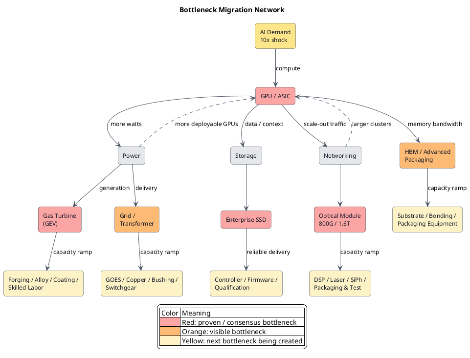

Lately I have been looking for the next batch of high-alpha stocks capable of breaking the market's old valuation model. The starting point was embarrassingly ordinary: who comes after GEV? Who comes after Micron? The candidate list was long. I reached the end and noticed one name was missing: SpaceX.

SpaceX did not necessarily belong on the list. But if a method cannot explain why it was excluded, a longer list only gives me more unexplained answers. I did not rush to add SpaceX back. I asked one question: why was it missing?

SpaceX has a way of making people forget that they are investing. The moment it comes up, the conversation drifts toward Mars, the stars, and a multi-planetary civilization. Sentiment is worthless to capital. Strip away the mission and SpaceX leaves behind a hard cost curve: launch cadence, reuse, and dollars per kilogram. The economics depend on whether something once done only once can be repeated a hundred times, reliably, cheaply, and quickly.

<!-- more -->

## A stock list cannot give you alpha

I started by looking for stocks. Only later did I realize that the starting point itself was wrong.

“Who is the next GEV?” and “Who is the next Micron?” will always produce a list. A list can only summarize what has already happened. By the time everyone knows that GPUs, gas turbines, and memory are bottlenecks, the fattest part of the re-rating is usually over. The fundamentals may remain excellent while the alpha moves elsewhere.

The useful thing is not the answer. It is the method that keeps producing answers.

[Serenity, the Bottleneck Hunter](https://johnsonlee.io/2026/06/06/serenity-methodology-cannot-be-skill/) already covered how the white-haired investor finds bottlenecks. I will not retell that story here. That essay answered one question: how do you locate the narrowest node in an industry chain?

This essay asks a more basic one: **what actually qualifies as a bottleneck?**

We tend to treat “core technology” as the answer. Whoever owns the chip, the drug molecule, the reactor, or the new material owns the bottleneck. That is only half right. Core technology determines whether something can go from zero to one. Once an industry takes off, the winner is determined by whether one can become ten.

> **The real bottleneck is often not whether a technology works, but whether supply can replicate tenfold, fast enough, when demand suddenly grows tenfold.**

The first Falcon 9 landing mattered. What changed launch economics was the prospect of high-frequency reuse—whether the second, fifth, and hundredth flight could move down the learning curve.

A technical breakthrough is the admission ticket. Replication determines how far an industry can go.

## The bottleneck lives between two clocks

To understand replication, I compare two clocks.

One measures how soon demand arrives. The other measures how long supply takes to replicate:

> **Replication Gap = Time to replicate supply − Time for demand to arrive**

If demand arrives in eighteen months and supply needs forty-eight months to catch up, the thirty months in between are the scarcity window. Orders, backlog, price increases, and excess returns tend to pile into that gap.

This definition is more useful than “technical moat” because it puts seemingly unrelated industries into the same framework.

A drug that works in a clinical trial is zero to one. Scaling GMP lines, fill-finish, quality control, cold chain, and qualified staff together is one to ten. Patients cannot take the dose sitting in a lab.

One SMR connected to the grid is zero to one. Building ten reactors in a row, each faster and cheaper than the last, is one to ten. Without repeatability, it remains an expensive and beautiful technology.

EGS is no different. One productive well does not prove that the fiftieth can arrive on schedule and on budget. Even software cannot escape the rule. Code can be copied at nearly zero cost; databases, compute, security review, customer support, and organizational response cannot.

I therefore separate an industrial bottleneck from investable alpha:

> **Bottleneck Strength ∝ Demand Shock × Supply Inelasticity × Replication Gap**

> **Alpha = Bottleneck Strength × Mispricing**

A scarce node does not automatically offer alpha. GEV, VRT, and mainstream memory can remain excellent bottlenecks after the market has priced them as such. The odds have changed. The better hunting ground is the next bottleneck their expansion is creating but the market has not yet noticed.

## GPUs proved that solving a bottleneck creates another

AI is the cleanest stress test of this framework.

At first, everyone lacked GPUs. Yet a GPU is not delivered when it leaves the fab. It still needs HBM, advanced packaging, substrates, server racks, switches, optical interconnect, power, and cooling. If one item falls behind, the finished GPU becomes expensive inventory.

Vera Rubin production requires coordination across more than 350 facilities in 30 countries and hundreds of supply-chain partners. A GPU ramp is really an entire industrial system ramping together. [NVIDIA's own disclosure](https://investor.nvidia.com/news/press-release-details/2026/NVIDIA-Vera-Rubin-Ramps-Into-Full-Production-to-Power-Agentic-AI-Factories-Worldwide/default.aspx) makes that point plainly.

Then something interesting happened.

More GPU supply allowed more clusters to come online, and the bottleneck spread along the dependency graph. It hit HBM and packaging first, then networking, power, cooling, and storage. NVIDIA's Data Center networking revenue rose 199% year over year in the first quarter of fiscal 2027. That is what pressure migrating from compute into interconnect looks like in a financial statement. [NVIDIA FY2027 Q1](https://investor.nvidia.com/news/press-release-details/2026/NVIDIA-Announces-Financial-Results-for-First-Quarter-Fiscal-2027/default.aspx)

The GPU bottleneck did not disappear. The throughput released by GPU expansion created the next set of bottlenecks.

## GEV proved that mature technology can still replicate slowly

Gas turbines make the point even better because the technology is not new.

GE Vernova entered the second quarter with 116GW of gas-turbine equipment backlog and slot reservations, against only 20GW of output planned for 2026. Raising annual output to 30GW will take until 2030. [GE Vernova Q2 2026](https://www.gevernova.com/news/articles/ge-vernova-releases-second-quarter-2026-financial-results)

GEV does not lack theory, orders, or the knowledge required to build a turbine. It lacks the time needed to replicate large forgings and castings, specialty alloys, coatings, compressor parts, assembly workers, test stands, and supplier quality systems together.

As AI data centers move from megawatts to gigawatts, customers are not buying turbine technology. They are buying a dependable delivery slot. Demand can double within one budget cycle. Industrial capacity takes years to climb. Mature technology makes this mismatch easier to overlook.

GEV, however, is already a red light. The next question is not simply whether to chase GEV. It is: **if GEV had to expand tenfold, what would it run out of first?**

Forgings, alloys, coatings, compressor components, and skilled labor are small, unglamorous markets. They may also be the yellow nodes a red node is creating.

## Storage proved that capacity is not delivery

Storage looks easy to replicate. Make more NAND bits. What is so difficult about that?

A hyperscaler does not buy a pile of NAND. It buys an enterprise SSD that remains stable under a real workload. That requires a controller handling FTL, ECC, wear leveling, garbage collection, and power-loss protection. It requires firmware, PCIe/NVMe, and lengthy qualification by server OEMs and hyperscalers.

Micron expects data-center DRAM and NAND bit shipments in 2026 to double from two years earlier. Agentic AI is also extending infrastructure beyond accelerator racks into storage racks that hold context. [Micron Q3 2026 materials](https://investors.micron.com/static-files/2354ecda-77a0-4ddd-8462-a631eb491356)

The bottleneck keeps moving. Tight NAND supply gives memory manufacturers pricing power. Once wafer supply rises, pressure can migrate into enterprise SSDs, controllers, firmware, power, and qualification capacity.

Terabytes are a specification. Going online reliably and on time is supply.

## Optical modules proved that bandwidth has a replication gap

More GPUs exchange more data. Compute per GPU rises with each generation, while traffic inside the cluster may rise even faster. Once compute expands, networking moves from supporting actor to system limit.

800G works, and [1.6T optical DSPs and transceivers have entered mass production](https://www.marvell.com/company/newsroom/marvell-1-6t-optical-dsp-ai-data-center-connectivity.html). That does not mean optical interconnect can replicate tenfold overnight.

Behind one optical module sit DSPs, lasers, photodiodes, silicon photonics, packaging, connectors, fiber, and testing. They come from different processes and suppliers, yet all must pass inside the same small box. Module volume pushes pressure into lasers, DSPs, SiPh, packaging, and test. Faster networks then allow clusters to add more GPUs.

At this point, a linear supply chain no longer explains what is happening.

GPUs, GEV, storage, and optical modules are not four isolated examples. They are lights coming on across the same network.

## The Bottleneck Migration Network

In the real world, a bottleneck does not move from A to B and then B to C. Congestion propagates through a network.

GPU expansion raises demand for HBM, packaging, networking, storage, and power at the same time. More turbine and grid capacity lets additional GPUs come online. Those GPUs push optics and storage back toward the red line. Every solved node releases flow that collides with an adjacent node.

The point of this diagram is not to tell us which stock to buy today. It upgrades the research unit from a point to a system.

In the Bottleneck Hunter framework, we follow demand until we find the narrowest node. With a Bottleneck Migration Network, the question changes: once that node turns red, which adjacent node does it push from green to yellow? Which supplier has the largest Replication Gap when the red node expands? Which node is being pulled at once by AI, the grid, defense, nuclear power, or autos?

The network does not belong to AI. Replace the GPU with a new drug and the nodes become active ingredients, bioreactors, fill-finish, cold chain, and approval. Replace it with an SMR and the nodes become nuclear-grade forgings, fuel, licensing, welders, and site construction. The names change. The propagation does not.

## The next alpha is in the yellow lights created by red ones

GPUs, GEV, and memory have already demonstrated Bottleneck Migration. Once the market sees the red lights, another list of “bottleneck stocks” is just alpha viewed through a rear-view mirror.

I care about three questions:

- Where has the arrival rate of demand suddenly overtaken the replication rate of supply?
- If that red node expands tenfold, which smaller supplier gets pushed to its limit?
- Is the market still valuing that supplier as an old business, or has the bottleneck already been priced in?

The practical move is simple:

> **Red → Find the Yellow nodes it is creating.**

When GEV turns red, break down its forging, alloy, coating, and compressor supply chains. When enterprise SSDs turn red, inspect controllers, firmware, and qualification. When optical modules turn red, move into lasers, DSPs, SiPh, and test equipment. None of those names is guaranteed to rise. The network tells us where pressure is most likely to travel next.

That is the upgrade from finding a bottleneck to modeling bottleneck migration. The first explains scarcity that has already appeared. The second tries to locate the next narrowing node before a financial statement confirms it.

SpaceX's vision can be the stars. Capital speaks a colder language: the value of the first success depends on whether the second, fifth, and hundredth can be replicated faster.

**Technology turns zero into one. Replication determines how many zeros come after the one.**
