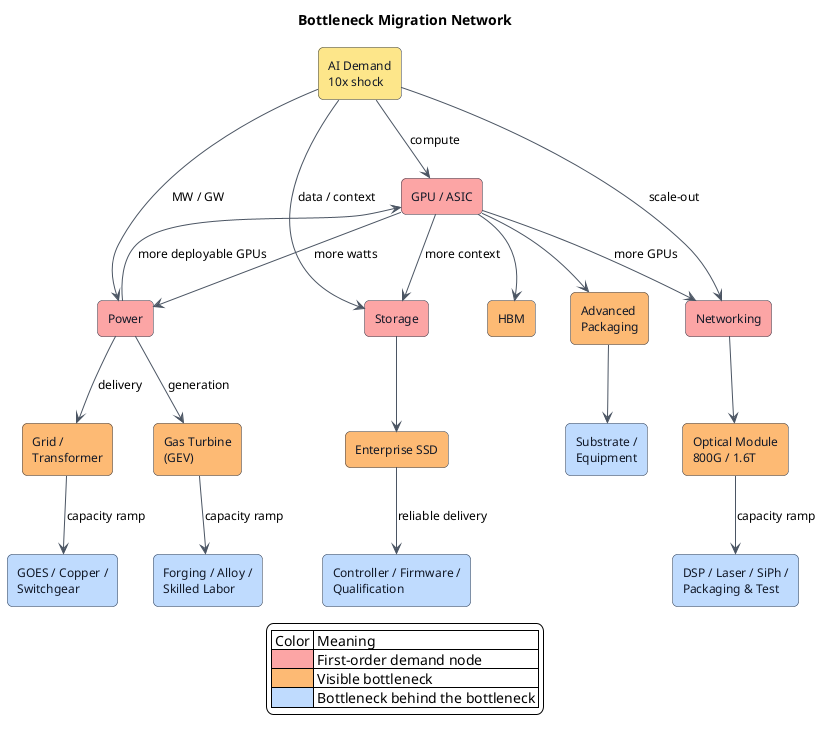

想象一下：明早醒来，客户把订单从一万件改成十万件。样品早已通过测试，核心技术也握在手里，可设备还在排产，供应商没有余量，新人还没学会怎么把良率跑稳。技术解决了“能不能做”，订单追问的是“多久能做出十倍”。**复制速度才是真正的瓶颈。**

<!-- more -->

## 技术越成熟，越容易误判

一项技术还在实验室时，所有人都会追问它能不能工作。一旦样品通过测试，问题就像已经解决了。行业开始算 TAM，投资人开始找下一个技术突破，“扩产”被随手丢进执行细节。

偏偏是这些执行细节决定了订单能不能变成收入。工厂最终会建好，设备最终会到位，第二供应商也可能通过认证。可客户今天就要货。需求已经到场，供给还在爬坡，中间的时间差会制造稀缺、积压订单和议价权。

这段时间差可以写成一个简单的式子：

> **Scale Gap = Supply expansion time − Demand arrival time**

假设需求十八个月后到，供给四十八个月才能补上，中间三十个月就是稀缺。技术越成熟，这个 gap 越容易被忽略。所有人都知道它能工作，很少有人继续问它能复制多快。

看一个产业，我会先问：新增需求相当于现有供给的多少倍？增加 50% 供给需要多久？扩张时，还要经过哪条同样拥堵的链？

## 爆单之后，拼的都是复制速度

replication 复制的是交付能力：一个成功样本放大十倍以后，质量不掉，成本不失控，交付也不延误。

制造业做出样机以后，还要复制设备、模具、良率和熟练工。一款药证明有效以后，还要复制合规产线、稳定批次、灌装、质检和冷链。原理已经成立，病人却不能拿实验室里的那一支药。

服务业看起来离工厂很远，照样逃不过这条规律。一家店爆红，下一家店要重新找位置、招人、培训，还要保证味道和服务没有走样。软件复制代码几乎没有成本，可用户量增加十倍，数据库、算力、客服、安全审查和组织响应都得跟着扩。

**每个产业复制的东西不同，复制不了的后果相同：需求到了，收入却交付不出来。** 眼下的 AI 浪潮，只是一次格外集中的压力测试。

## GPU 的瓶颈，从来不只在 GPU

GPU 是最直观的一阶瓶颈。模型变大、推理量上升，大家先抢卡。可一块 GPU 能量产，不等于一个 AI cluster 能按同样速度复制。

GPU 旁边还站着 HBM、advanced packaging、substrate、server rack、switch、光互连、电源和冷却。任何一项慢半拍，已经出厂的 GPU 也只是昂贵库存。NVIDIA 的 Vera Rubin 量产需要 30 个国家、350 多座工厂和数百家供应链伙伴协同，这不是一颗芯片的 ramp，而是一整个工业系统同时 ramp。[NVIDIA 的官方披露](https://investor.nvidia.com/news/press-release-details/2026/NVIDIA-Vera-Rubin-Ramps-Into-Full-Production-to-Power-Agentic-AI-Factories-Worldwide/default.aspx)恰好说明了规模化的真实复杂度。

所以，GPU 供给一旦缓解，瓶颈不会消失，只会迁移：先去 HBM 和封装，再去 networking、power 和 cooling。NVIDIA 2027 财年第一季度的 Data Center networking 收入同比增长 199%，就是压力从 compute 向 interconnect 扩散后，收入曲线留下的痕迹。[NVIDIA FY2027 Q1](https://investor.nvidia.com/news/press-release-details/2026/NVIDIA-Announces-Financial-Results-for-First-Quarter-Fiscal-2027/default.aspx)

**一块 GPU 只有接上整套基础设施，才算真正交付。**

## GEV 卖的不是燃机技术，而是交付窗口

燃气轮机的反直觉更强。它不是新技术，更不是 AI 发明的技术。可当数据中心突然从 megawatt 走向 gigawatt，客户需要的不是一篇燃机原理论文，而是一个确定的交付 slot。

GE Vernova 的数据很有代表性。2026 年第二季度，Gas Power 的设备 backlog 与 slot reservation 已经达到 116GW；公司计划把年产出从 2026 年的 20GW 提高到 2028 年的 24GW、2030 年的 30GW。[GE Vernova Q2 2026](https://www.gevernova.com/news/articles/ge-vernova-releases-second-quarter-2026-financial-results)

订单按倍数增长，供给却只能用几年爬坡。大型锻铸件、specialty alloy、涂层、压缩机部件、装配工人、测试台和供应商质量体系必须一起扩。少一环，整机都出不来。

GEV 的重估来自交付能力：**全世界同时下单时，只有少数公司能按时交付。** 技术成熟没有消灭稀缺，只是把稀缺从 invention 推向 capacity。

那么，当 GEV 自己开始扩产，下一个瓶颈在哪里？答案很可能不在 GEV，而在它必须依赖、市场规模更小、扩产更慢的锻件、合金、涂层和 skilled labor。

## 存储扩容，缺的不只是 NAND bit

存储也很容易被简化成容量问题：AI 产生更多数据，所以买更多 NAND。可 enterprise SSD 不是把 NAND 接到 PCIe 上就结束。

它还需要 controller 处理 FTL、ECC、wear leveling、garbage collection、queue management 和掉电保护；需要 firmware 在真实 workload 下稳定；需要通过服务器 OEM 与 hyperscaler 漫长的 qualification。容量可以堆，可靠性和交付能力不能复制粘贴。

Micron 预计，2026 年 data center DRAM 与 NAND bit shipment 会比两年前翻倍，并且 Agentic AI 正把基础设施从 accelerator rack 扩展到存放 context 的 storage rack。[Micron 2026 Q3 materials](https://investors.micron.com/static-files/2354ecda-77a0-4ddd-8462-a631eb491356) 这意味着压力不只落在 NAND wafer，还会沿着 enterprise SSD、controller、PCIe/NVMe、storage fabric 和软件架构继续传播。

当容量与吞吐同时放大 10 倍，最先卡住的可能不是 flash，而是 controller 的供给、验证周期、功耗，甚至整个 storage architecture。**“有多少 TB”是技术参数，“多少 TB 能按时、稳定地上线”才是产业问题。**

## 光模块证明了，带宽也有复制速度

GPU 越多，彼此交换的数据越多。单卡算力按代际上升，cluster 内的流量却可能更快膨胀，于是网络从配角变成吞吐上限。

800G 能工作，[1.6T optical DSP 与 transceiver 也已经进入 mass production](https://www.marvell.com/company/newsroom/marvell-1-6t-optical-dsp-ai-data-center-connectivity.html)，并不等于光互连可以一夜扩 10 倍。一个光模块背后还有 DSP、laser、photodiode、silicon photonics、封装、连接器、fiber 和测试。它们的制程、良率和供应商完全不同，最后却必须在同一个小盒子里同时达标。

所以，GPU 扩产越成功，光模块的压力越大；光模块越快，交换芯片、laser 和电力的压力又会继续上升。**解决一个 bottleneck，往往就是制造下一个 bottleneck。**

## AI 是 Bottleneck Migration Network 的一张切片

把这些案例排成 GPU → GEV → 存储 → 光模块的时间线，仍然会误导判断。现实不是一条生产线，而是多个 track 同时受压、相互反馈。下面这张图画的是 AI 基础设施，但它的结构并不属于 AI。

GPU 上线会增加 networking、storage、power 和 cooling 需求；电力供给释放后，又允许更多 GPU 上线；更多 GPU 随即把 HBM、光模块与 SSD 重新推向红线。瓶颈不会从 A 搬家到 B 后永久消失，它会在整个 network 里不断亮灯。

把 GPU 换成一种新药、一款汽车或一家爆红的连锁店，网络仍以相同方式运行：需求先撞上成品，成品扩张再把压力传给设备、原料、认证、物流和人。某个节点扩出来以后，压力继续向更窄的上游迁移；新供给释放出来，又会反过来刺激下一轮需求。

这张图无法告诉我们 2027 年一定缺什么，它能逼着我们对每个 node 继续问：

- 需求到达需要多久？
- 增加 50% 产能需要多久？
- 当前利用率、lead time 和 backlog 是否同时上升？
- 它扩产时，会把压力传给哪个更小的上游市场？
- 资本市场看到的是绿色、黄色，还是已经一片红色？

最值得研究的位置，通常不是已经红透的 node，而是红色 node 正在制造的黄色 supplier。GPU 红了，找 HBM、封装与 optics；燃机红了，找锻件与 alloy；enterprise SSD 红了，找 controller 与 qualification capacity。

## 找瓶颈，要先找到复制链

研究一个产业时，最容易先问：“下一项突破是什么？”突破当然重要，但一项技术从 0 到 1 以后，订单和利润经常流向那些负责把 1 复制成 10、100、1000 的公司。

它们可能没有性感的产品名，也不处在新闻中心。它们控制的也许是一台交期很长的设备、一种难以扩产的材料、一张迟迟批不下来的许可证，或者一群无法速成的工程师。行业不同，复制链不同，稀缺产生的方式却一样。

所以，判断瓶颈不能停在“技术能不能工作”。还要计算需求突然放大 10 倍时，整条交付链能不能在短时间内复制 10 倍。这段时间差，决定了订单排在哪里、议价权落到谁手里，也决定了瓶颈下一步往哪里迁移。

**当所有人都在寻找下一项技术时，我更想知道：谁掌握了那台复制不出来的机器？**
