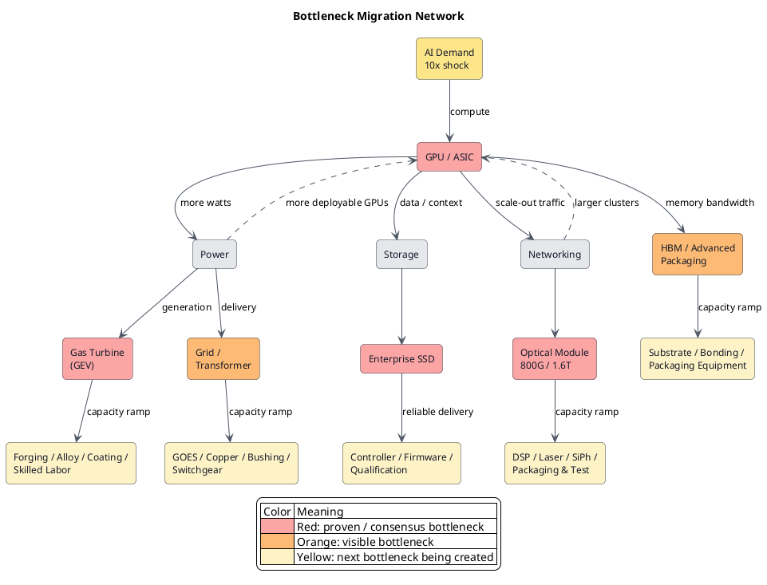

最近我一直在找下一批能把估值体系打穿的 high alpha。起点很俗：GEV 之后还有谁？SK hynix 之后还有谁？候选清单列了一长串，我扫到最后，发现里面没有 SpaceX。

SpaceX 未必应该进这张清单。可一套方法如果说不清它为什么被排除，给再多 ticker 也只是在排列答案。我没有急着把 SpaceX 塞回去，只追问了一句：它为什么不在？

SpaceX 这家公司有个毛病：太容易让人忘记自己是在做投资。一聊它，火星、星辰大海、人类多行星文明全来了。可在资本面前，情怀一文不值。把 mission 拿掉，SpaceX 留下的是一条很硬的成本曲线：launch cadence、reuse 和 $/kg。原来只能做一次的东西，能不能稳定、便宜、快速地做一百次，这才决定故事值多少钱。

<!-- more -->

## 股票清单给不了 alpha

我一开始找的是股票，后来才逐渐意识到，这个出发点从一开始就错了。

“下一只 GEV 是谁？”“下一只 SK hynix 是谁？”这种问题最后一定会得到一张 list。问题是，list 只能总结已经发生的事情。等所有人都知道 GPU、燃机和 memory 是瓶颈，最肥的一段 re-rating 往往已经结束。基本面可以继续很好，alpha 却开始往别处跑。

真正有用的不是答案，而是制造答案的方法。

《[Serenity——传说中的白毛股神](./serenity-methodology-cannot-be-skill.md)》已经讲过这位“瓶颈猎人”是怎么发现 bottleneck 的，这里不再复读。那篇文章回答的是：在一条产业链里，怎么找到最窄的 node。

这次我想追问的是另一个更底层的问题：**到底什么才算 bottleneck？**

我们习惯把“核心技术”当成答案。谁掌握芯片、药物分子、反应堆或新材料，谁就掌握瓶颈。这个判断只对了一半。核心技术决定一件事能不能从 0 变成 1；产业真正开始爆发以后，决定胜负的是能不能把 1 复制成 10。

> **真正的瓶颈往往不是“技术能不能工作”，而是“当需求突然放大 10 倍时，能不能在短时间内复制 10 倍”。**

Falcon 9 第一次落地当然重要。但真正改写发射经济学的，是 reusable rocket 能不能高频复用，第二次、第五次、第一百次的成本能不能沿着 learning curve 往下掉。

技术突破只是拿到入场券。replication 才决定一个产业能走多远。

## 真正的瓶颈，藏在时间差里

看 replication，我只比较两个时间。

一个是需求多久到，另一个是把交付能力复制出来要多久：

> **Replication Gap = Time to replicate supply − Time for demand to arrive**

需求 18 个月后到，供给要 48 个月才能补上，中间 30 个月就是 scarcity window。订单、backlog、涨价和超额利润，通常都挤在这段时间里。

这个定义比“技术壁垒”更有用，因为它把很多看起来毫无关系的产业放进了同一个框架。

一款新药在 clinical trial 里有效，是 0→1；GMP 产线、fill-finish、质检、冷链和合格人员能不能一起放大，是 1→10。病人用不了实验室里的那一针。

一座 SMR 并网，是 0→1；连续十座反应堆能不能越造越快、越造越便宜，是 1→10。没有 repeatability，它就还是一项昂贵而漂亮的技术。

EGS 也是一样。第一口井出热，不代表第五十口井还能按预算、按工期交付。连软件都逃不过：代码可以零成本复制，数据库、算力、安全审查、客服和组织响应却不行。

所以我会把产业瓶颈和投资 alpha 分开看：

> **Bottleneck Strength ∝ Demand Shock × Supply Inelasticity × Replication Gap**

> **Alpha = Bottleneck Strength × Mispricing**

一个节点很缺，不代表它还有 alpha。GEV、VRT、主流 memory 可以继续是优秀的 bottleneck，市场一旦把这件事 price in，赔率就变了。真正值得找的，是它们扩产时正在制造、市场却还没看见的下一个 bottleneck。

## GPU 证明了：解决瓶颈，也会制造瓶颈

AI 是这套框架最好的一次压力测试。

最初大家缺 GPU。可 GPU 不是从晶圆厂出来就算交付，它旁边还站着 HBM、advanced packaging、substrate、server rack、switch、光互连、电源和冷却。任何一项慢半拍，已经出厂的 GPU 也只是昂贵库存。

NVIDIA 的 Vera Rubin 要靠 30 个国家、350 多座工厂和数百家供应链伙伴协同量产。所谓 GPU ramp，本质上是一整个工业系统同时 ramp。[NVIDIA 的官方披露](https://investor.nvidia.com/news/press-release-details/2026/NVIDIA-Vera-Rubin-Ramps-Into-Full-Production-to-Power-Agentic-AI-Factories-Worldwide/default.aspx)把这件事讲得很直白。

然后有意思的事情发生了。

GPU 供给增加，更多 cluster 可以上线，于是 bottleneck 沿着依赖关系往外扩：先撞上 HBM 和封装，再撞上 networking、power、cooling 和 storage。NVIDIA 2027 财年第一季度 Data Center networking 收入同比增长 199%，就是压力从 compute 迁向 interconnect 后留下的财务痕迹。[NVIDIA FY2027 Q1](https://investor.nvidia.com/news/press-release-details/2026/NVIDIA-Announces-Financial-Results-for-First-Quarter-Fiscal-2027/default.aspx)

这不是 GPU 瓶颈“消失”了。GPU 扩产释放的吞吐量，制造了下一批瓶颈。

## GEV 证明了：成熟技术也复制不快

燃机更能说明问题，因为它根本不是什么新技术。

GE Vernova 今年二季度拿着 116GW 的燃机设备 backlog 和 slot reservation，2026 年产出却只有 20GW。公司想把年产出拉到 30GW，要等到 2030 年。[GE Vernova Q2 2026](https://www.gevernova.com/news/articles/ge-vernova-releases-second-quarter-2026-financial-results)

GEV 不缺原理，不缺订单，也不是不知道怎么造燃机。它缺的是把大型锻铸件、specialty alloy、涂层、压缩机部件、装配工人、测试台和供应商质量体系一起复制的时间。

当 AI data center 从 MW 走向 GW，客户买的不是燃机技术，而是确定的 delivery slot。需求可以在一个 budget cycle 里翻倍，工业产能只能用几年往上爬。技术越成熟，这个 mismatch 反而越容易被忽略。

但 GEV 已经是红灯。下一步不该机械地问要不要追 GEV，而应该问：**GEV 要把产能放大 10 倍，它自己会先缺什么？**

锻件、合金、涂层、压缩机零部件和熟练工，这些不起眼的小市场，才可能是红色 node 正在制造的黄色 node。

## 存储证明了：容量不等于交付

存储看起来最容易复制。多做一些 NAND bit，不就行了？

问题是，hyperscaler 买的不是一堆 NAND，而是能在真实 workload 下稳定运行的 enterprise SSD。它还需要 controller 处理 FTL、ECC、wear leveling、garbage collection 和掉电保护，需要 firmware，需要 PCIe/NVMe，需要通过服务器 OEM 和 hyperscaler 漫长的 qualification。

Micron 预计，2026 年 data center DRAM 与 NAND bit shipment 会比两年前翻倍。Agentic AI 还在把基础设施从 accelerator rack 推向存放 context 的 storage rack。[Micron 2026 Q3 materials](https://investors.micron.com/static-files/2354ecda-77a0-4ddd-8462-a631eb491356)

于是瓶颈继续迁移：NAND 紧张，先给 memory 厂商带来定价权；晶圆供给上来以后，压力又会落到 enterprise SSD、controller、firmware、功耗和 qualification capacity。

TB 是参数，按时上线才是供给。

## 光模块证明了：带宽也有 replication gap

GPU 越多，彼此交换的数据越多。单卡算力按代际上升，cluster 内的流量却可能涨得更快。compute 扩出来以后，networking 就从配角变成上限。

800G 能工作，[1.6T optical DSP 与 transceiver 也已经进入 mass production](https://www.marvell.com/company/newsroom/marvell-1-6t-optical-dsp-ai-data-center-connectivity.html)，不等于光互连可以一夜复制 10 倍。

一个光模块后面还有 DSP、laser、photodiode、silicon photonics、封装、连接器、fiber 和测试。它们来自不同的制程和供应商，最后却要在同一个小盒子里同时达标。模块放量会继续把压力推给激光器、DSP、SiPh、封装与测试；网络变快，又允许 cluster 塞进更多 GPU。

到这里，线性产业链已经解释不了问题了。

GPU、GEV、存储和光模块不是四个孤立的案例。它们是同一张 network 上先后亮起的灯。

## Bottleneck Migration Network

现实里的 bottleneck 不是从 A 搬到 B，再从 B 搬到 C。它更像拥堵在网络里传播。

GPU 扩产，会同时推高 HBM、封装、网络、存储和电力需求；燃机与电网扩出来，又允许更多 GPU 上线；更多 GPU 会把 optics 和 storage 再次推向红线。每解决一个 node，释放出来的流量都会撞向相邻 node。

这张图真正有用的地方，不是告诉我们今天买哪只股票，而是把研究从点升级成面。

在《瓶颈猎人》的框架里，我们沿着需求找到最窄的 node。有了 Bottleneck Migration Network，问题变成：这个 node 变红以后，会把哪个相邻 node 从绿色推成黄色？它扩产时，哪一个 supplier 的 Replication Gap 最大？哪一个节点同时被 AI、电网、国防、核能或汽车抢产能？

这套网络也不属于 AI。把 GPU 换成一款新药，节点会变成原料药、bioreactor、fill-finish、冷链和审批；把它换成 SMR，节点会变成核级锻件、燃料、许可、焊工和现场施工。名字变了，压力传播的方式没变。

## 下一批 alpha，在红灯制造的黄灯里

GPU、GEV、memory 已经证明了 Bottleneck Migration。市场看到红灯以后，再列一张“bottleneck 股票清单”，只是从后视镜里找 alpha。

我更关心三件事：

- 哪个 node 的需求到达速度，突然超过了供给复制速度？
- 这个红色 node 要扩产 10 倍，会把哪个更小的 supplier 推到极限？
- 市场是在按旧业务给它估值，还是已经把 bottleneck 写进 price？

所以真正可执行的动作很简单：

> **Red → Find the Yellow nodes it is creating.**

GEV 红了，就去拆它的锻件、合金、涂层和压缩机供应链；enterprise SSD 红了，就看 controller、firmware 和 qualification；光模块红了，就继续往 laser、DSP、SiPh 和测试设备走。不是因为这些名字一定会涨，而是网络告诉我们，压力下一步最可能往哪里传。

这才是从“发现 bottleneck”到“推演 bottleneck migration”的升级。前者解释已经发生的稀缺，后者试图在财报确认以前，找到下一处正在变窄的 node。

SpaceX 的 vision 可以是星辰大海。资本的语言要冷得多：第一次成功值多少钱，取决于第二个、第五个、第一百个能不能更快复制出来。

**技术负责把 0 变成 1，replication 决定 1 后面的那些 0。**
