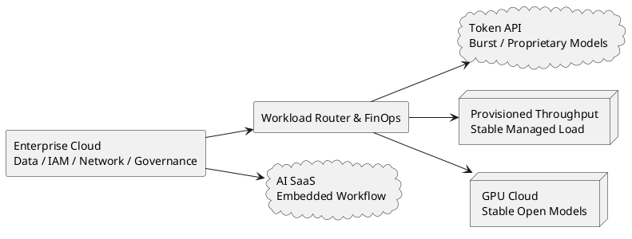

Picture this: an engineer cuts an Agent task from 100,000 tokens to 40,000, and the dashboard turns 60% greener. The month-end invoice arrives. Cloud cost has not moved by a cent. The company rents eight GPUs on a monthly contract. The model says 60,000 fewer tokens, but the machines keep running and the contract keeps billing.

Engineering has created a large patch of idle capacity. Finance cannot find a dollar of savings. The problem with Token Efficiency is suddenly obvious: **it has never been an isolated technical metric. Change the billing model, and its financial meaning changes with it.**

<!-- more -->

In [The Era of Burning Tokens Wildly Is Coming to an End](./saas-value-return-token-burning.md), I called tokens the new COGS of the AI era. That claim carries an assumption: the enterprise buys the model by the token.

Push the question one step further. Does an enterprise have to buy tokens?

Of course not. It can buy an API by usage, rent GPUs by time, purchase provisioned throughput, or bury AI inside SaaS seats, credits, and bundles. The same model may run underneath all four, while finance sees four completely different businesses.

## One Model, Four Completely Different Bills

| Business model | Billing unit | The metric that actually matters | Best-fit workload |
| --- | --- | --- | --- |
| Token API | Input / Output Token | Useful tasks completed per dollar | New products, low volume, high variance |
| Raw GPU / Dedicated Endpoint | GPU-second, GPU-hour | Useful throughput per GPU-hour | Stable, high concurrency, controllable models |
| Managed Inference Capacity | Model Unit, Provisioned Throughput | Committed-capacity utilization and SLO | Stable production traffic, strong governance needs |
| AI SaaS | Seat, Credit, Conversation, Action | Plan utilization and unit gross margin | Workflows already embedded in business systems |

A lot of Token Efficiency debates go nowhere because everyone is holding a different invoice while trying to use the same metric.

A customer paying by the token cares how much less the model says. A team renting GPUs cares whether the machines stay busy. A buyer of managed capacity cares whether it can step down to a smaller commitment. A SaaS customer may not see tokens at all. It only sees the credit balance running out.

**Technology can share a benchmark. Economics cannot.**

## Buying Tokens: Every Token Saved Can Reach the Invoice

A token API is the serverless model of the AI era.

There are no machines to buy, no inference framework to operate, and no need to predict capacity six months ahead. Call it 100 times today and pay for 100 calls. Jump to a million tomorrow and the model provider absorbs the peak. For proofs of concept, low-frequency tasks, long-tail workflows, and products with wildly unstable traffic, this is usually the right place to start.

On this bill, Token Efficiency is straightforward.

Shorten context. Use prompt caching. Route simple tasks to smaller models. Stop useless reasoning early. Replace LLM calls with deterministic code where possible. As long as success rates hold, those optimizations appear on next month's invoice.

The risk is equally straightforward. The provider charges by usage, so the enterprise pays for every round of overthinking, every retry, and every swollen context window. Model rankings can look beautiful. The customer still pays for the tokens.

**With usage-based token pricing, Token Efficiency is a cash metric.**

## Renting GPUs: Tokens Disappear, Idle Time Arrives

An enterprise can also bypass token pricing and rent GPUs directly from an AI cloud.

This is already a mature market. [Together AI Dedicated Endpoints](https://docs.together.ai/docs/dedicated-endpoints/overview) bill for hardware runtime whether requests arrive or not. [Fireworks On-demand Deployments](https://docs.fireworks.ai/guides/ondemand-deployments) bill by the GPU-second. [Lambda](https://lambda.ai/pricing) offers hourly GPU instances and reserved capacity.

The bill moves from a language unit back to a time unit.

At that point, whether a task consumes 40,000 or 100,000 tokens no longer determines cost directly. The real equation becomes:


$$\text{Cost per Task} = \frac{\text{GPU Hour Price}}{\text{Successful Tasks per GPU Hour}}$$


If fewer tokens let the same eight GPUs process twice as many requests, that improvement is valuable. If traffic does not grow and the GPU count does not fall, the optimization has only created more empty machine time.

Turning that headroom into money requires at least one concrete change: rent one fewer GPU, move to a lower capacity tier, shorten runtime, or postpone the next expansion.

The most valuable engineering work changes too. Continuous batching, KV cache, quantization, concurrency scheduling, model size, memory footprint, and autoscaling can matter more than deleting a few lines from a prompt.

There is another constraint people often miss: renting GPUs does not give you GPT or Claude. Customers do not have proprietary model weights. Raw GPU capacity mainly hosts open models, in-house models, and deployable fine-tuned models.

**When you buy GPUs, Token Efficiency matters only when it reaches GPU count and utilization.**

GPU rental also hands another pile of work back to the enterprise: deployment, upgrades, disaster recovery, latency, capacity planning, inference frameworks, and the alert that fires at 3 a.m. Removing the model vendor's margin does not make those capabilities free.

## Managed Capacity: Cloud Vendors Turn GPUs Into Throughput Plans

Most enterprises do not want to operate a row of raw GPUs. They are more likely to buy the middle layer: managed inference capacity.

With [Amazon Bedrock Provisioned Throughput](https://docs.aws.amazon.com/bedrock/latest/userguide/prov-throughput.html), an enterprise purchases model units and a commitment term, with billing continuing by the hour. [Microsoft Foundry](https://learn.microsoft.com/en-us/azure/foundry/openai/concepts/provisioned-throughput-billing) offers provisioned capacity billed through PTUs, and idle capacity still costs money.

The buyer does not need to know exactly how many cards run underneath. It buys stable throughput, latency SLOs, identity controls, and cloud governance. This fits enterprise procurement well: technical details stay with the vendor, while capacity risk moves into the contract.

The trap is in the contract too.

Suppose an enterprise has already purchased six months of provisioned throughput. Engineering cuts token usage by 40%. As long as the commitment stays unchanged, the month's bill does not move. The optimization creates headroom. Savings arrive only when the company reduces model units, lowers the renewal commitment, or uses the freed capacity to absorb more business.

**Until capacity is released, the optimization has not become cash.**

That does not make the optimization worthless. More headroom, shorter queues, and steadier latency all matter. The financial language simply needs to stay honest: a capacity gain is a capacity gain; a cash saving is a cash saving.

## SaaS: Tokens Hide Inside Seats, Credits, and Actions

At the SaaS layer, the bill becomes even more complicated.

Enterprise AI products rarely have one price anymore. [Salesforce Agentforce](https://www.salesforce.com/agentforce/pricing/) offers Flex Credits, per-conversation and per-user options, pre-purchase, pre-commit, and PayGo models. The same product family includes fixed seats, action-based credits, and unmetered usage.

That pricing looks messy because three forces are pulling against one another. Customers want predictable budgets. Usage remains highly uncertain. The inference cost underneath changes with the model and the workflow.

For the customer, tokens become a purchasable SKU. For the SaaS vendor, tokens remain COGS. It needs model routing, caching, quotas, fair-use rules, plan segmentation, and overage controls so one heavy user does not consume the gross margin of an entire tier.

Fixed seats fit low-frequency, controllable-cost features. Credits fit volatile Agents. Commitments fit large, stable customers. PayGo catches unknown demand. No single model covers everything.

**SaaS sells a procurement-friendly package. Tokens are the cost hidden underneath.**

## Enterprise Cloud Reality: AI Never Lands on a Blank Page

The easiest thing to forget in the "tokens or GPUs" debate is that enterprises have already spent a decade living in the cloud.

Data sits in Snowflake, BigQuery, S3, and SaaS applications. Identity lives in IAM or Entra ID. Logs flow into an observability platform. Security, compliance, networking, and procurement have already been built around AWS, Azure, and Google Cloud. A different AI cloud may offer a cheaper GPU and create data movement, private links, duplicate monitoring, extra audits, and a new layer of vendor risk at the same time.

The [Flexera 2026 State of the Cloud Report](https://info.flexera.com/CM-REPORT-State-of-the-Cloud) shows the shape of that estate. Seventy-three percent of organizations use hybrid cloud. The share of enterprise workloads in public cloud rose from 52% to 54%, and 51% of enterprise data is already there. The data plane and control plane were in place before the AI workload arrived.

AI clouds are adapting to this reality too. [CoreWeave Direct Connect](https://docs.coreweave.com/products/networking/direct-connect/about-direct-connect) links CoreWeave VPCs directly to customer on-premises or hyperscaler networks. Enterprises are unlikely to move their entire estate for AI. They are more likely to attach another compute pipe to the cloud they already have.

Commitments make the picture even more practical. [AWS Savings Plans](https://docs.aws.amazon.com/savingsplans/latest/userguide/what-is-savings-plans.html) exchange lower rates for a one- or three-year hourly usage commitment. A team's bill does not fall automatically because it ran less this month. When the commitment remains underused, the "saving" is just lower utilization.

The [State of FinOps 2026](https://data.finops.org/) data is revealing: 98% of respondents manage AI spend; 90% manage or plan to manage SaaS, 57% manage private cloud, 48% manage data centers, and 28% are beginning or planning to include labor cost. The FinOps Foundation even changed its mission from the value of "cloud" to the value of "technology."

That is the actual backdrop for enterprise AI. The model invoice is one piece of technology spend, standing beside cloud commitments, SaaS licenses, data platforms, security, networking, operations, and labor.

The cheapest price per million tokens may therefore be more expensive for the enterprise P&L. A model with a higher unit price can still win if it consumes an existing commitment, reuses the security stack, and runs close to the data.

**The enterprise is optimizing an entire technology balance sheet. One model call is only a line item.**

## The Practical Architecture Is Baseload Plus Peaks

Enterprises are unlikely to make a single choice between token APIs and GPUs.

They will split workloads the way they have managed cloud infrastructure for the past decade. Stable, predictable baseload goes to reserved GPUs or provisioned throughput. New products, low-frequency tasks, rare models, and bursts stay on token APIs. Workflows already embedded in CRM, ERP, or ITSM are purchased as SaaS bundles.

The analogy is the power grid. Baseload plants handle steady demand; peaker plants handle sudden spikes. Making expensive serverless capacity carry the annual baseline is wasteful. Keeping monthly GPUs idle for a two-hour daily peak is wasteful too.

The valuable capability has expanded beyond shortening a single call. It is the ability to recognize the shape of a workload: how stable it is, how wide the peak-to-trough gap is, what latency it needs, where the data lives, how often the model changes, and whether a capacity commitment can stay full.

**The future of Token Efficiency is workload placement.**

## Ask Which Line Disappeared From the Bill

Token Efficiency still matters, but it needs a more honest denominator:


$$\text{Economic Efficiency} = \frac{\text{Useful Work}}{\text{Paid Resource}}$$


With an API, the paid resource is token dollars. With rented GPUs, it is GPU-hours. With managed capacity, it is committed model units. With SaaS, it is seats, credits, and plans.

Tokens per task can measure engineering progress. It becomes financial savings only after it removes a billable unit. Otherwise, it has created throughput, latency improvement, or capacity headroom. Those are valuable too. Just do not put them in the wrong column.

Tokens will keep getting cheaper. Models will keep finding new ways to burn them back. The way out is to align the shape of the workload with the pricing model.

The next time someone announces a 60% improvement in Token Efficiency, do not applaud yet. Open next month's invoice and ask: **which line actually disappeared?**
