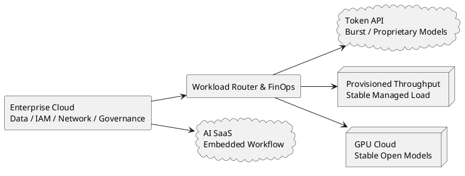

想象一下这个场景：工程师把一次 Agent 任务从 10 万 Token 压到 4 万，仪表盘绿了六成。月底账单到了，云成本一分钱没少。公司租了 8 张 GPU，包月。模型少说了 6 万 Token，机器照样开着，合同照样付钱。

工程师优化出一大片空闲算力，财务却找不到一美元 Savings。Token Efficiency 的问题就这样暴露了：**它从来不是一个孤立的技术指标，计费方式一变，财务含义就跟着变。**

<!-- more -->

上一篇[《疯狂烧 Token 的日子要结束了》](./saas-value-return-token-burning.md)里，我把 Token 称为 AI 时代新的 COGS。这个判断隐含了一个前提：企业按 Token 买模型。

继续追问一步：企业一定要买 Token 吗？

当然不一定。它可以按调用量买 API，按时间租 GPU，按吞吐购买 Provisioned Throughput，也可以把 AI 藏进 SaaS 的 Seat、Credit 和套餐里。底层跑的可能是同一个模型，财务看到的却是四门完全不同的生意。

## 同一个模型，四张完全不同的账

| 商业模式 | 付费单位 | 真正该优化的指标 | 适合的 Workload |
| --- | --- | --- | --- |
| Token API | Input / Output Token | 每美元完成的有效任务 | 新业务、低频、波动大 |
| 裸 GPU / Dedicated Endpoint | GPU-second、GPU-hour | 每 GPU-hour 的有效吞吐 | 稳定、高并发、模型可控 |
| 托管推理容量 | Model Unit、Provisioned Throughput | 承诺容量利用率与 SLO | 稳定生产流量、强治理需求 |
| AI SaaS | Seat、Credit、Conversation、Action | 套餐利用率与单位毛利 | 已嵌入业务系统的 Workflow |

很多 Token Efficiency 的争论之所以鸡同鸭讲，是因为大家拿着不同的账单，却试图使用同一个指标。

按 Token 付费的人，关心模型少说了多少。租 GPU 的人，关心机器有没有吃满。买托管容量的人，关心承诺档位能不能降。买 SaaS 的人，甚至看不到 Token，只会看到 Credit 快用完了。

**技术可以用同一套 Benchmark，经济账不行。**

## 买 Token：省下来的每一个 Token 都能进账单

Token API 是 AI 时代的 Serverless。

不用买机器，不用管推理框架，不用预测半年后的容量。今天调用 100 次就付 100 次，明天突然涨到 100 万次，模型厂商替你扛峰值。对 PoC、低频任务、长尾 Workflow 和流量极不稳定的新产品，这通常是最合理的起点。

在这张账上，Token Efficiency 很直接。

缩短 Context、做 Prompt Caching、把简单任务路由给小模型、提前结束无效 Reasoning、用确定性代码替代 LLM 调用，这些优化只要不伤成功率，就会体现在下个月账单里。

风险也很直接：模型厂商按使用量收钱，企业承担每一次过度思考、重试和上下文膨胀。模型能力榜排得再漂亮，最后还是客户替 Token 买单。

**按量买 Token，Token Efficiency 才是现金指标。**

## 租 GPU：Token 消失了，空转出现了

企业也可以绕过 Token 单价，直接向 AI Cloud 租 GPU。

这条路已经很成熟。[Together AI 的 Dedicated Endpoint](https://docs.together.ai/docs/dedicated-endpoints/overview)按硬件运行时间计费，不管有没有请求；[Fireworks 的 On-demand Deployment](https://docs.fireworks.ai/guides/ondemand-deployments)按 GPU-second 计费；[Lambda](https://lambda.ai/pricing)则提供按小时的 GPU Instance 和预留容量。

账单从语言单位切回了时间单位。

此时，一次任务用了 4 万还是 10 万 Token，已经不再直接决定成本。真正的公式变成：


$$\text{Cost per Task} = \frac{\text{GPU Hour Price}}{\text{Successful Tasks per GPU Hour}}$$


如果 Token 降低让同样的 8 张 GPU 多处理一倍请求，当然有价值。如果流量没有增长，GPU 数也没减少，那只是空出了更多机器时间。

想把这部分 Headroom 变成钱，至少要发生一件事：少租一张 GPU、降低一个容量档位、缩短运行时间，或者推迟下一轮扩容。

这时最重要的优化也会变化。Continuous Batching、KV Cache、Quantization、并发调度、模型大小、显存占用和 Autoscaling，往往比删掉几句 Prompt 更值钱。

还有一个常被忽略的限制：租 GPU 不等于租到 GPT 或 Claude。闭源模型权重不在客户手里，裸 GPU 主要承载开源模型、自有模型和可部署的 Fine-tuned Model。

**按 GPU 买，Token Efficiency 只有穿透到 GPU 数量和利用率时才成立。**

GPU 租赁也把另一堆麻烦交回企业：模型部署、升级、容灾、延迟、容量预测、推理框架和夜里三点的告警。省掉模型厂商的 Margin，不代表这部分能力凭空免费。

## 托管容量：云厂商把 GPU 换成吞吐套餐

大多数企业不会直接管理一排裸 GPU。它们更可能购买中间态：托管推理容量。

比如 [Amazon Bedrock Provisioned Throughput](https://docs.aws.amazon.com/bedrock/latest/userguide/prov-throughput.html)，企业购买 Model Unit 和承诺期限，账单按小时产生；[Microsoft Foundry](https://learn.microsoft.com/en-us/azure/foundry/openai/concepts/provisioned-throughput-billing)也提供按 PTU 计费的 Provisioned Capacity，闲置时照样收费。

企业不需要知道底下到底跑了几张卡，只需要拿到稳定吞吐、延迟 SLO、权限体系和云上治理。这很符合企业采购习惯：技术细节交给厂商，容量风险留在合同里。

麻烦也在合同里。

假设企业已经买了 6 个月 Provisioned Throughput。工程团队把 Token 降低 40%，只要承诺容量没变，当月账单就不会动。优化带来的是更高余量，真正的 Savings 要等到缩减 Model Unit、降低续约承诺，或者用这部分容量接住更多业务。

**容量没有被退掉，优化就还没变成现金。**

这不代表优化没价值。更大的 Headroom、更低的排队时间、更稳的延迟都很重要。财务语言必须诚实：Capacity Gain 是 Capacity Gain，Cash Saving 是 Cash Saving。

## SaaS：Token 被藏进 Seat、Credit 和 Action

到了 SaaS 层，账更复杂。

今天的企业 AI 产品很少只有一种价格。[Salesforce Agentforce](https://www.salesforce.com/agentforce/pricing/)同时提供 Flex Credits、按 Conversation、按 User、Pre-Purchase、Pre-Commit 和 PayGo；同一个产品里，既有固定 Seat，也有按 Action 消耗的 Credit，还有 Unmetered Usage。

这些定价看起来很乱，背后是三股力量在拉扯：客户需要预算可预测，使用量又高度不确定，底层推理成本还会随模型和 Workflow 改变。

对客户来说，Token 被包装成了可采购的 SKU。对 SaaS 厂商来说，Token 仍然是 COGS。它需要做 Model Routing、Cache、配额、Fair Use、套餐分层和 Overage，防止某个重度客户把整档产品的 Gross Margin 吃光。

固定 Seat 适合使用频率低、成本可控的功能；Credit 适合波动大的 Agent；预承诺适合稳定的大客户；PayGo 用来接住未知需求。没有一种模式能通吃。

**SaaS 卖的是可采购性，Token 只是藏在背后的成本。**

## 企业云上的现实：AI 从来不会落在一张白纸上

讨论“买 Token 还是租 GPU”时，最容易忽略企业已经在云上生活了十年。

数据在 Snowflake、BigQuery、S3 和各种 SaaS 里，身份在 IAM 或 Entra ID，日志进了 Observability 平台，安全、合规、网络和采购流程也已经围绕 AWS、Azure、Google Cloud 建好。换一家 AI Cloud 可能让 GPU 单价更低，也可能同时制造数据搬运、专线、审计、双套监控和新的 Vendor Risk。

[Flexera 2026 State of the Cloud Report](https://info.flexera.com/CM-REPORT-State-of-the-Cloud) 显示，73% 的组织采用 Hybrid Cloud；企业运行在 Public Cloud 上的 Workload 已从 52% 升到 54%，51% 的企业数据也已经在 Public Cloud。AI Workload 到来之前，Data Plane 和 Control Plane 早就落位了。

AI Cloud 自己也在适应这个现实。[CoreWeave Direct Connect](https://docs.coreweave.com/products/networking/direct-connect/about-direct-connect) 的用途，就是把 CoreWeave VPC 直接连到企业 On-premises 或 Hyperscaler Network。企业不会为了 AI 整体搬家，更可能给现有云再接一根算力管道。

更现实的是，企业早就签了各种 Commitment。[AWS Savings Plans](https://docs.aws.amazon.com/savingsplans/latest/userguide/what-is-savings-plans.html)按每小时用量承诺一到三年。账单不会因为某个团队这个月少跑一点就自动下降；承诺没吃满，省下来的只是 Utilization。

[State of FinOps 2026](https://data.finops.org/) 的数据很有意思：98% 的受访者管理 AI Spend；90% 已经或计划管理 SaaS，57% 管理 Private Cloud，48% 管理 Data Center，28% 开始或计划把 Labor Cost 纳入同一套体系。FinOps Foundation 也把使命里的 "Cloud" 改成了 "Technology"。

这就是企业 AI 的真实背景：模型账单只是技术支出的一部分，旁边还站着云承诺、SaaS License、数据平台、安全、网络、运维和人。

所以，“每百万 Token 最便宜”的方案，未必是企业 P&L 最便宜的方案。一个单价更高、却能吃掉现有 Commitment、复用安全体系、靠近数据的模型，可能反而更便宜。

**企业优化的是整张技术资产负债表，一次调用只是其中一行。**

## 最现实的架构，是基线加波峰

企业最终很可能不会在 Token API 和 GPU 之间二选一。

它会像过去十年管理云资源一样，把 Workload 拆开：稳定、可预测的基线流量放进 Reserved GPU 或 Provisioned Throughput；新业务、低频任务、稀有模型和突发流量继续走 Token API；已经深嵌 CRM、ERP、ITSM 的流程直接买 SaaS 套餐。

这和电网很像。基荷电厂负责稳定需求，调峰机组处理突然上来的波峰。让昂贵的 Serverless 扛全年基线很浪费，让包月 GPU 等每天两小时的峰值同样浪费。

真正有价值的能力，已经从压短一次调用，扩展到识别 Workload 的形状：它有多稳定，峰谷差多大，延迟要求多高，数据在哪里，模型多久换一次，容量承诺能不能吃满。

**未来的 Token Efficiency，本质上是 Workload Placement。**

## 先问账单少了哪一行

Token Efficiency 仍然重要，但它需要一个更诚实的分母：


$$\text{Economic Efficiency} = \frac{\text{Useful Work}}{\text{Paid Resource}}$$


按 API 买，Paid Resource 是 Token Dollar；按 GPU 租，是 GPU-hour；买托管容量，是承诺的 Model Unit；买 SaaS，是 Seat、Credit 和套餐。

Tokens per Task 可以衡量工程进步。只有当它最终减掉一个可计费单位，才会变成财务 Savings。否则，它带来的是吞吐、延迟或容量余量——同样有价值，只是别算错账。

Token 会继续变便宜，模型也会继续找到新的方式把 Token 烧回去。真正的出路，是让 Workload 的形状和 Pricing Model 对齐。

下次有人宣布 Token Efficiency 提升 60%，先别鼓掌。翻开下个月账单：**到底少了哪一行？**
