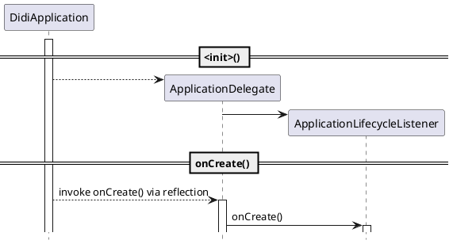

> This story is entirely fictional. Any resemblance to real events is purely coincidental.

After more than a month of intense work, *The One* project was nearing the finish line. About two weeks remained before the gray release at month's end. Everyone was anxiously preparing for this major version, hoping nothing would go wrong. I had just returned from lunch when someone shouted in the project chat: "Jenkins can't build the package!" I didn't think much of it at first -- build failures were an everyday occurrence, nothing to fuss about. But within minutes, more people started chiming in. Someone posted a screenshot, and upon closer inspection, it turned out to be:

```
com.android.dex.DexException: Too many classes in --main-dex-list, main dex capacity exceeded
  at com.android.dx.command.dexer.Main.processAllFiles(Main.java:494)
  at com.android.dx.command.dexer.Main.runMultiDex(Main.java:332)
  at com.android.dx.command.dexer.Main.run(Main.java:243)
  at com.android.dx.command.dexer.Main.main(Main.java:214)
  at com.android.dx.command.Main.main(Main.java:106)
```

I immediately pulled the latest code and tried it -- sure enough, there was a problem. From the error message, there were too many classes in *\-\-main-dex-list*, causing *classes.dex* generation to fail. Why? Simple -- too much code. Most business lines had been copy-pasted from existing ones and then modified. At that point we had roughly 6-7 business lines, so the massive amount of duplicated code directly caused the *main dex capacity exceeded* error. The project already had *multidex* enabled, but if the main dex couldn't even be built, what could we do?

There's a term for this -- Murphy's Law. The timing couldn't have been worse: we were about to freeze the version, and this issue popped up. So I pulled together a few reliable engineers and formed an emergency squad to tackle this thorny problem. We spent an entire afternoon studying the source code to understand how *\-\-main-dex-list* was generated. It turned out that reference analysis started from the four major components registered in *AndroidManifest.xml*. Someone suggested modifying the build script to customize the *\-\-main-dex-list*.

## Customizing \-\-main-dex-list

At the time, the project was using AGP (Android Gradle Plugin) version *1.3.x*, which still allowed specifying *\-\-main-dex-list* through build scripts. However, this approach had two problems:

1. Manually customizing *\-\-main-dex-list* was extremely tedious -- every code change required re-checking, and if anything had changed, manual updates were needed.
1. Newer versions of *AGP* no longer supported directly modifying *\-\-main-dex-list*.

So this solution could only address the immediate problem temporarily. Was there a way to fix it once and for all?

## Breaking the Direct References

While I was racking my brain, Guan Er-ge suddenly came over and said, "Sen-ge, I've got an idea -- not sure if it'll work." He grabbed a marker and started drawing on the whiteboard. Before he even finished, I could see where he was going, and I said admiringly, "That's solid! We'd just need to slightly restructure the current architecture." "Yeah, and it's not much work." "OK, let's do it!"

The idea was to add a layer between `Application` and the business logic (nothing that can't be solved by adding another layer) -- an `ApplicationDelegate`. The logic originally in `Application` would be moved to `ApplicationDelegate`, and `Application` would invoke `ApplicationDelegate` via reflection. This way, the direct references would be broken:



After an all-night push, it was done! The tension finally eased. I thought we could ship smoothly after that. Looking back now, we were so naive...
