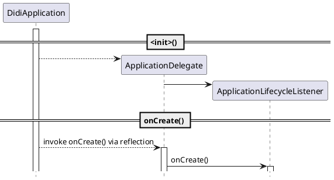

> 本故事纯属虚构，如有雷同，纯属巧合

经过一个多月的奋战，*The One* 项目已接近尾声，离月底灰度大概还有半个月的时间，大家都在紧张的准备着这个大版本，希望不要出什么幺蛾子，中午刚吃完午饭回来，项目群里有人叫起来：“Jenkins 打不出包来了”，当时没太在意，平常构建失败的情况如家常便饭，何足道哉。没一会儿，群里接二连三的叫起来，有同学截了个屏，仔细一看原来是：

```
com.android.dex.DexException: Too many classes in --main-dex-list, main dex capacity exceeded
  at com.android.dx.command.dexer.Main.processAllFiles(Main.java:494)
  at com.android.dx.command.dexer.Main.runMultiDex(Main.java:332)
  at com.android.dx.command.dexer.Main.run(Main.java:243)
  at com.android.dx.command.dexer.Main.main(Main.java:214)
  at com.android.dx.command.Main.main(Main.java:106)
```

于是，赶紧拉了一下最新的代码下来试了一下，果然有问题，从错误信息来看，是 *\-\-main-dex-list* 中的类太多了，导致 *classes.dex* 生成失败，为什么会这样呢？原因很简单，代码太多了，毕竟很多业务线都是直接从原有的业务线拷贝了一份代码然后进行改造，当时差不多有 6-7 个业务线，所以，大量重复冗余的代码直接导致了 *main dex capacity exceeded* 。况且工程已启用了 *multidex* ，主 dex 打不出来，如何解决呢？

有个专业术语叫什么来着——墨菲定律，就是这么的不凑巧，马上就要封版了，整出这么个幺蛾子，于是拉了几个靠谱的同学，成立了一个应急小分队处理这个棘手的问题，我们几个人花了一个下午的时间来研究源码，看看 *\-\-main-dex-list* 生成的逻辑，原来是从 *AndroidManifest.xml* 中注册的四大组件为起点进行引用分析，于是，有人提出修改构建脚本，自定义一个 *\-\-main-dex-list* 。

## 自定义 \-\-main-dex-list

当时，工程用的 AGP (Android Gradle Plugin) 版本是 *1.3.x* ，还是可以通过修改构建脚本来指定 *\-\-main-dex-list* 的，只不过，这个方案有两个问题：

1. 手动定制 *\-\-main-dex-list* 过于繁琐，每次代码变更，都要重新检查一遍，如果有变化，还行手动修改
1. 最新的 *AGP* 版本已经不支持直接修改 *\-\-main-dex-list* 了

所以，这个方案只能一时解决眼前的问题，有什么办法能一劳永逸呢？

## 打断直接引用

正在我冥思苦想的时候，关二哥突然跑过来说道：“森哥，我想到了一个方法，不知道靠不靠谱”，于是，顺手拿起记号笔在白板上画起来，没等他画完，我便看出了他的思路，赞叹道：“靠谱啊！只是要稍微改造一下目前的工程架构”，“嗯，而且工作量不大”，“OK，那就这么干！”

具体的思路就是在 `Application` 和业务之间加一层（没有什么是不能通过加一层解决的） `ApplicationDelegate` ，原来在 `Application` 的逻辑移到 `ApplicationDelegate` 中，然后在 `Application` 中通过反射调用 `ApplicationDelegate` ，这样，直接引用就被打断了：



经过一晚的奋战，大功告成！紧崩的神经终于可以放松一下了，以为这样就可以顺利发布了，现在回想起来，当时还是太年轻了。。。

