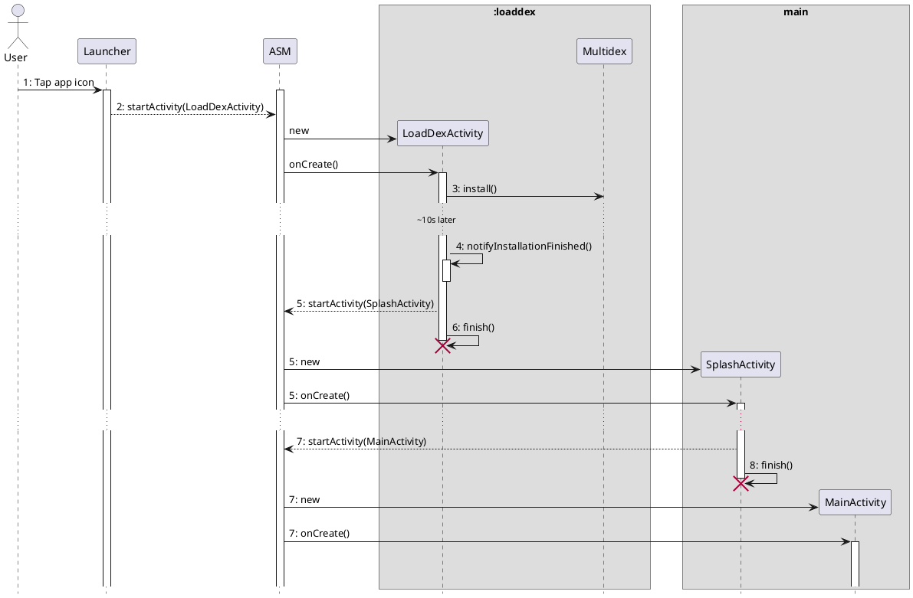

> This story is entirely fictional. Any resemblance to real events is purely coincidental.

The previous version had just been frozen when a wave of new requirements came in (no wonder PMs get pushed back on so often). There was a technical review that evening, and I hadn't finished writing the proposal (to be precise, I had barely started -- life was tough). I was in the middle of drawing a diagram when someone called out, "Sen-ge, are you busy? I have a question." I turned around -- it was Tao-ge.

## App Store Rejection

"What's up?"

"We've hit a tricky problem. The passenger app got rejected by the app store -- they said the startup black screen hurts user experience."

"Really? Can we reproduce it on our end?"

"QA never reported this issue. We've already built the channel packages and were about to submit them. The Xiaomi app store's cloud testing keeps failing." (QA always gets the blame.)

"Did the app store give us device model and OS version info?"

"Let me check," he said, and started digging through emails. "Looks like it's below 5.0."

"The biggest difference between 4.x and 5.0 is the runtime -- 5.0 defaults to ART. Could it be related to that? How about we find a 4.x device first, see if we can reproduce it, and check logcat for useful clues?"

"This is urgent. The boss says it has to ship next week."

"I've got something on my plate right now. How about I take a look tonight?"

"Sure, I'll go find a 4.x phone first."

I went back to my diagram. After a busy half-day and the review wrapping up, I figured I'd check in on Tao-ge's progress. He was staring at his screen, brow furrowed, deep in thought.

"How's it going?" I asked.

"There's something I can't figure out. How come our app takes so long to launch? What's it doing?"

"How long?"

"Over 40 seconds."

"What?! How can it take that long? What kind of phone is that?"

"Nexus 4."

"That shouldn't be right. My Note 5 only takes a few seconds."

"I've tried several times. There's no way to reach the home screen in under 30 seconds."

"Let me see." I took the phone, killed the app, and restarted it, counting silently: 1, 2, 3... 30, 31, 32, 33 -- finally, the home screen appeared.

"See? I wasn't kidding. It really takes that long. First launch after install is even slower -- about 40-something seconds."

"That's insane. Let's add some logging." I turned the laptop toward me and started adding a couple of log lines. Tao-ge stood up and said, "Sen-ge, here, take my seat."

I added a few lines to print the startup timing:

```java
public class DidiApplication extends Application {

  static long t0 = System.System.currentMills();

  @Override
  public void onCreate() {
    super.onCreate();
    ......
    System.out.println("Startup time: " + (System.currentMills() - t0));
  }

  ......

}
```

Then I connected the Nexus 4 and hit Run. We stared silently at Android Studio's progress bar. Five minutes went by and it was still compiling...

"I just did a clean build, so a full recompile takes a while. Want to grab a smoke?" Tao-ge said.

"Let's go."

By the time we got back from our cigarette break, the logcat output was already on screen: "Startup time: 21374". Wait -- how come that's so different from what we counted?

We ran it a few more times. Apart from the first launch taking about 30 seconds, a kill-and-restart averaged around 20 seconds. That's when it hit me: "Oh, I see -- the log is measuring time from when the `DidiApplication` class is loaded. Anything before that isn't counted."

"Oh right, that makes sense. So how do we get the real startup time?"

"Let me think... We should be able to find it from process info. Let's look in the proc filesystem." I opened a terminal:

```bash
adb shell ps | grep "com.sdu.didi.psnger" | awk '{print $2}'

......

adb shell cat /proc/17214/stat
```

"Sen-ge, slow down, let me jot this down. How do you remember all these commands?"

"Heh, you just pick them up with use," I laughed. "See, this column should be the app process time relative to system boot. We need to use `SystemClock` to calculate the startup duration." So I modified the code again:

```java
public class DidiApplication extends Application {

  static long t0 = SystemClock.elapsedTime();

  static {
    System.out.println(FileUtils.readFileToString(new File("/proc/self/stat")));
    System.out.println("t0 = " + t0);
  }

  @Override
  protected void attachBaseContext(Context base) {
    super.attachBaseContext(base);
    long t1 = SystemClock.elapsedTime();
    MultiDex.install(this);
    System.out.println("DEX install time: " + (SystemClock.elapsedTime() - t1));
  }

  @Override
  public void onCreate() {
    super.onCreate();
    long t2 = SystemClock.elapsedTime();
    ......
    System.out.println("Startup time: " + (SystemClock.elapsedTime() - t2));
  }

  ......

}
```

After another run, the logs showed roughly:

1. From launch to app loading: 5 seconds
1. Multidex installation: 20 seconds (6 dex files total)
1. App initialization: 15 seconds

"Looks like we've pinpointed the problem. The main culprits are multidex installation and app initialization."

"Yeah. I'm thinking about async-installing multi-dex, but I only have 2 weeks. Guess it's overtime then."

"Want to make it a dedicated startup optimization initiative? Pull in a couple more people?"

"I just took over this mess. There's nobody to pull in." Tao-ge looked helpless.

"I've got a new feature on my plate that's also urgent. This one's on you."

Every evening when I walked past Tao-ge's desk on my way out, he was still there, fighting the battle alone. This went on for over a week. Thursday evening, after dinner, I had just sat down when Tao-ge came running over, grinning. "Sen-ge, smoke break?" Seeing the look on his face, I guessed he'd made a breakthrough. "Oh? Got it figured out?" Tao-ge laughed and said, "I discovered you dug me a big pit."

"What pit?"

"SPI has serious performance overhead."

"Oh? What's wrong with it?" I was surprised to hear this. When I had implemented the dynamic module loading, I initially configured strings in *AndroidManifest.xml*, but the developer experience was terrible and error-prone, so I switched to Java's native SPI. I'd never done a performance test on it though -- could there really be a problem?

"`ServiceLoader` reads files under `META-INF/services/` by calling `ClassLoader.getResourceAsStream(String)`. This method is extremely slow on Android. I looked at the source code -- it traverses the entire APK and checks signatures. So the first call is painfully slow. Subsequent calls are faster thanks to caching."

"Whoa... How did you find this out?" I asked in amazement.

"I was optimizing the initialization logic. No more than 10 lines of code -- didn't look like anything was wrong, but it was super slow. At first I didn't suspect that method. I just kept commenting out lines one by one. When I got to that line and commented it out -- boom, instant."

"OK, my bad. So what about the black screen issue?"

"I tried async-installing multi-dex, but it didn't really help. The home screen still took forever to appear."

"What if we put a fake home screen on top of the real one?"

Tao-ge thought for a moment, then suddenly slapped his thigh -- startling me. "Oh, I've got it!" He tossed his cigarette butt. "Come on, let's go draw it out." After an intense discussion, we arrived at this solution:

*AndroidManifest.xml*

```xml
<activity
  android:name=".LoadDexActiivity"
  android:process=":loaddex"
  android:screenOrientation="portrait"
  android:theme="@style/SplashActivityTheme">
  <intent-filter>
    <action android:name="android.intent.action.MAIN" />
    <category android:name="android.intent.category.LAUNCHER" />
  </intent-filter>
</activity>
<activity
  android:name=".SplashActivity"
  android:screenOrientation="portrait"
  android:theme="@style/SplashActivityTheme" />
```

*DidiApplication.java*

```java
protected void attachBaseContext(Context base) {
  super.attachBaseContext(base);
  if (isDexLoaderProcess()) {
    return;
  }

  if (Build.VERSION.SDK_INT < Build.VERSION_CODES.LOLLIPOP) {
    Multidex.install(this);
  }
}
```

*LoadDexActivity.java*

```java
private final Thread mInstallThread = new Thread(new Runnable() {
  @Override
  public void run() {
    Multidex.install(LoadDexActivity.this);
    notifyInstallationFinished(getApplication());
    startSplashActivity(DELAY_TIME);
  }
});
```



## The Dragon-Slaying Technique

The black screen issue was finally resolved, but the slow startup on 4.x devices continued to plague everyone. "If only we could measure the time spent in every method," I thought. "What if we used AOP to inject a line before and after every method to calculate each method's duration?" So I started writing a plugin. AGP 1.5 had just begun supporting the *Transform API*, so I went with that. Two days later I had [trace](https://github.com/johnsonlee/trace). I was about to show Tao-ge my new creation when I saw him still adding log statements one by one. "Tao-ge, I just built a new tool that can solve your problem. Want to try it?" He scrolled through it briefly. "That's brilliant! Finally, no more adding logs line by line!" he exclaimed.

The next day, Tao-ge went on a rant: "Logback is such a trap! It calls `ClassLoader.getResource(...)` in a static initializer block. Without *trace*, I never would have found it. And `AssetManager.list()` is another huge pitfall..."

Later, we summarized the findings:

1. [ClassLoader#getResource(java.lang.String)](https://developer.android.com/reference/java/lang/ClassLoader#getResource(java.lang.String)) | [ClassLoader#getResourceAsStream(java.lang.String)](https://developer.android.com/reference/java/lang/ClassLoader#getResourceAsStream(java.lang.String)) | [ClassLoader#getResources(java.lang.String)](https://developer.android.com/reference/java/lang/ClassLoader#getResources(java.lang.String))

   - To avoid calling this method, we moved some Java Resources into *assets*.
   - SPI uses this method, so to fix SPI's performance problem on Android, we wrote a dedicated plugin to generate code at compile time, avoiding runtime traversal of the APK.
   - As for logback, we naturally rewrote the logging library from scratch.

1. [AssetManager#list(java.lang.String)](https://developer.android.com/reference/android/content/res/AssetManager#list(java.lang.String))

   - It was surprising that the Android SDK provided an API with such severe performance overhead. To solve this, we wrote another plugin to scan assets at compile time and generate an index.

Regarding startup optimization techniques, Tao-ge always proudly referred to them as his "dragon-slaying technique." Something always felt off to me, but I couldn't put my finger on it -- until one day I stumbled upon the origin of the phrase:

> "Dragon-slaying technique" -- a metaphor meaning that although the skill is impressive, it has no practical use. From *Zhuangzi*.

Ha! I bet to this day Tao-ge still doesn't know the true meaning of "dragon-slaying technique"...

(To be continued)
