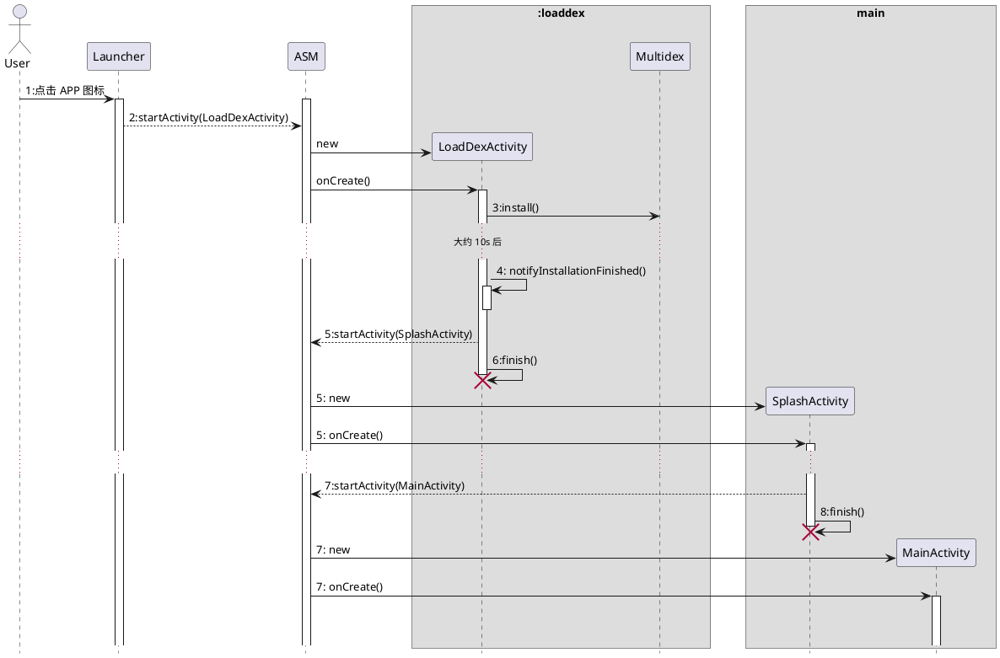

> 本故事纯属虚构，如有雷同，纯属巧合

上一个版本刚封版，一波新的需求就来了（PM 经常被怼是有原因的）。晚上有个技术评审，方案还没写完（准确地说，才刚刚开始写，我好难啊)，正画着图呢，“森哥，在忙吗？有个问题想请教一下”，一转头，原来是涛哥。

## 应用商店审核失败

“啥事儿？”

“这边碰到个棘手的问题，乘客端提交应用商店被拒了，说是启动黑屏影响用户体验”

“啊？咱们这边能复现吗？”

“QA 那边没报过这个问题，都已经出渠道包了，正准备投放呢，小米应用商店的云测死活过不了”（背锅的总是 QA）

“应用商店那边有反馈机型和系统版本信息么？”

“我看看哈”，说完，开始翻邮件，“好像是 5.0 以下”

“4.x 和 5.0 比较大的区别就是 Runtime 不一样了，5.0 默认启用了 ART，莫非跟这个有关系？要不这样吧，先找个 4.x 的手机试试看能否复现，再看下 logcat ，看能不能找到有价值的信息”。

“这个问题比较紧急，老大发话了，下周必须上线”

“我手头上还有点事儿，要不晚上帮你看看？”

“那行，我先去找个 4.x 的手机试试”

我又继续画我的图，忙活了大半天，评审结束后，想着去看看涛哥那边有啥进展，只见涛哥眉头紧锁，若有所思的盯着屏幕。

“咋样啦？”我问道

“有个问题想不明白，咱们的 App 怎么启动要那么久？都干了些啥？”

“多久？”

“40多秒”

“什么？！怎么可能要那么久？啥破手机？”

“Nexus 4 啊”

“不应该啊，我用的 Note 5 也就几秒的样子”

“我已经试了好几次，没有 30 秒根本进不了首页”

“我看看”，我接过手机，杀掉 APP 重新启了一下，开始默数着：1，2，3，。。。30，31，32，33，嘿，终于进首页了。

“没骗你吧，就是要这么久，安装后首次启动更慢，差不多 40 多秒”

“这不科学啊，打个 log 看看”，说完，便把电脑转过来，准备加上两行 log ，涛哥起身说道：“森哥，来，你坐”。

加了几行代码打印一下启动耗时：

```java
public class DidiApplication extends Application {

  static long t0 = System.System.currentMills();

  @Override
  public void onCreate() {
    super.onCreate();
    ......
    System.out.println("启动耗时：" + (System.currentMills() - t0));
  }

  ......

}
```

然后连上 Nexus 4 ，走你！我俩默默地盯着 Android Studio 的进度条，5 分钟过去了，还在编译。。。

“刚 clean 了，重新编译要很久，要不下去来一根？” 涛哥说。

“走起”

一根烟的功夫，等我们回到工位的时候，发现终端 logcat 的日志已经打出来了：「启动耗时：21374」，唉？怎么跟咱们数的时间差这么多？

又重新 Run 了几下，除了第一次启动时间比较长，大概在 30 秒左右，杀进程重启平均下来，耗时大概在 20 秒左右，这时，我才意识到这个时间计算有问题，“哦，我知道了，log 计算的时间是从 `DidiApplication` 这个类加载的时候开始算的，在被载之前的耗时并没有算进来”

“哦，还真是啊，怎么能拿到 APP 启动的真实时间呢？”

“我想想，应该能通过进程的信息找到，去 proc 文件系统里看看”，于是，开了个终端：

```bash
adb shell ps | grep "com.sdu.didi.psnger" | awk '{print $2}'

......

adb shell cat /proc/17214/stat
```

“森哥，慢点儿，我拿个小本本记一下，你这些命令都是咋记住的？”

“呵，用多了就记住了”我笑着说道，“你看，这列应该就是 APP 进程相对系统启动的时间，我们得用 `SystemClock` 来计算启动耗时”，于是，又改了一下代码：

```java
public class DidiApplication extends Application {

  static long t0 = SystemClock.elapsedTime();

  static {
    System.out.println(FileUtils.readFileToString(new File("/proc/self/stat")));
    System.out.println("t0 = " + t0);
  }

  @Override
  protected void attachBaseContext(Context base) {
    super.attachBaseContext(base);
    long t1 = SystemClock.elapsedTime();
    MultiDex.install(this);
    System.out.println("安装DEX耗时：" + (SystemClock.elapsedTime() - t1));
  }

  @Override
  public void onCreate() {
    super.onCreate();
    long t2 = SystemClock.elapsedTime();
    ......
    System.out.println("启动耗时：" + (SystemClock.elapsedTime() - t2));
  }

  ......

}
```

又重新 Run 了一下，从日志来看，整个启动过程的耗时大概是：

1. 从启动到 APP 加载：5 秒
1. 安装 multidex 耗时：20 秒（共 6 个 dex)
1. APP 初始化：15 秒

“看来问题已经定位到了，主要是 multidex 安装和应用初始化耗时比较严重”

“嗯，我想想该怎么解，时间很紧，就 2 周的时间啊，唉，加班搞吧。”

“要不立个启动专项，你再薅一两个人过来一起搞？”

“我刚接手这一摊子事儿，没人啊” 涛哥一脸无奈。

“我手上有个新需求，也比较着急，这事儿只能靠你了”

每天晚上下班经过涛哥工位，还在孤身一人奋战。就这样持续了一周多的时间，周四晚上吃过晚饭刚回到工位，涛哥兴冲冲的跑过来：“森哥，走一根？” 看着他面露喜色，我猜大概是有了突破性的进展了，问道：“哟呵，搞定了？”，涛哥笑呵呵的说道：“我发现你给我挖了一个大坑”

“啥坑？”

“SPI 存在严重的性能损耗”

“哦？这儿有啥问题？”，听到这个结论有点诧异，当时实现模块动态加载的时候，刚开始是在 *AndroidManifest.xml* 里面配置的字符串，开发体验很不好，容易出错，所以后来用了 Java 原生的 SPI，不过确实没做过性能测试，莫非真的有问题？

“`ServiceLoader` 读 `META-INF/services/` 目录下的文件内容会调用 `ClassLoader.getResourceAsStream(String)` 方法，这个方法在 Android 上很耗时，我看了那块儿的源码，这个方法会把整个 APK 遍历一遍，还要检查签名，所以，第一次非常慢，后面再调用的话，因为有缓存，会快很多”

“呃。。。你是怎么发现的？” 我惊讶地问道。

“我在优化初始化的逻辑，总共不超过 10 行代码，看起来不像有什么问题，但就是很耗时，刚开始没想到会是这个方法有问题，就一行一行的注掉代码，最后注到这儿的时候，神奇了，秒过”

“好吧，我的锅，那黑屏的问题怎么样了？”

“我想着是异步 install multi-dex，但好像并没有什么卵用，首页还是半天才出来”

“如果用一个假的首页盖在真的首页上面呢？”

涛哥想了想，突然一拍大腿，吓了我一跳，“噢，我想到了”，涛哥扔掉手上的烟头，“走，咱们上去画一画”，经过一番激列的讨论，最终得出了如下的方案：

*AndroidManifest.xml*

```xml
<activity
  android:name=".LoadDexActiivity"
  android:process=":loaddex"
  android:screenOrientation="portrait"
  android:theme="@style/SplashActivityTheme">
  <intent-filter>
    <action android:name="android.intent.action.MAIN" />
    <category android:name="android.intent.category.LAUNCHER" />
  </intent-filter>
</activity>
<activity
  android:name=".SplashActivity"
  android:screenOrientation="portrait"
  android:theme="@style/SplashActivityTheme" />
```

*DidiApplication.java*

```java
protected void attachBaseContext(Context base) {
  super.attachBaseContext(base);
  if (isDexLoaderProcess()) {
    return;
  }

  if (Build.VERSION.SDK_INT < Build.VERSION_CODES.LOLLIPOP) {
    Multidex.install(this);
  }
}
```

*LoadDexActivity.java*

```java
private final Thread mInstallThread = new Thread(new Runnable() {
  @Override
  public void run() {
    Multidex.install(LoadDexActivity.this);
    notifyInstallationFinished(getApplication());
    startSplashActivity(DELAY_TIME);
  }
});
```



## 屠龙之技

黑屏的问题总算解决了，但是在 4.x 的手机上启动慢的问题一直困扰着大家，“要是能统计每个方法的耗时就好了”，我心想，“要是通过 AOP 的手段在每个方法前和每个方法后注入一行代码，计算每个方法的耗时不就行了？”，于是，开始动手尝试写个插件，正好 AGP 1.5 开始支持 *Transform API* 了，索性就基于 AGP 1.5 吧，两天撸出了 [trace](https://github.com/johnsonlee/trace)，正准备给涛哥推荐一下我的新作时，只见他还在一行行的加 log，“涛哥，我新撸了个轮子，可以解决你的问题，要不要试试”，他大致翻了几下，“牛逼啊！终于不用一行行打 log 了” 涛哥赞叹道。

第二天，涛哥一顿吐槽：“logback 真是个坑货啊，居然在静态块里调 `ClassLoader.getResource(...)`，要不是用了 *trace*，我是怎么也想不到啊，还有 `AssetManager.list()` 也是个巨坑”

后来，总结了一下：

1. [ClassLoader#getResource(java.lang.String)](https://developer.android.com/reference/java/lang/ClassLoader#getResource(java.lang.String)) | [ClassLoader#getResourceAsStream(java.lang.String)](https://developer.android.com/reference/java/lang/ClassLoader#getResourceAsStream(java.lang.String)) | [ClassLoader#getResources(java.lang.String)](https://developer.android.com/reference/java/lang/ClassLoader#getResources(java.lang.String))

  - 为了避免调这个方法，把一些 Java Resources 放到了 *asset* 中；
  - SPI 会用到，所以，为了解决 SPI 在 Android 平台上的性能问题，单独写了一个插件来生成代码，避免在运行时从 APK 中遍历；
  - 至于 logback，自然是重写了一套 log 库。

1. [AssetManager#list(java.lang.String)](https://developer.android.com/reference/android/content/res/AssetManager#list(java.lang.String))

  - Android SDK 提供这么一个性能开销如些严重的 API，实属意外，为了解决这个问题，又写了一个插件在编译期扫描 assets 生成索引

关于启动优化的手段与方法，涛哥一直以“屠龙之技” 自诩，我总觉得哪里不对劲，又说不上来，直到有一天，我无意间看到了“屠龙之技”的出处：

> 屠龙之技，意思是比喻技术虽高，但无实用。出自《庄子》。

哈哈哈，估计到现在涛哥还不知道「屠龙之技」的真正涵义。。。

（未完待续）

